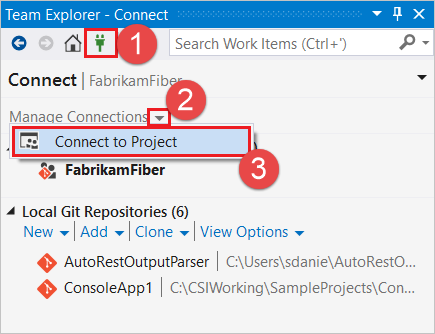
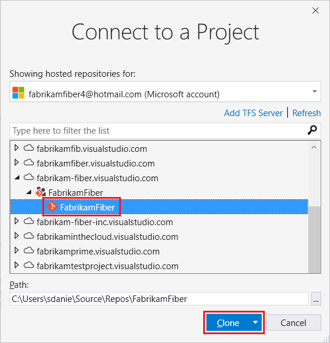
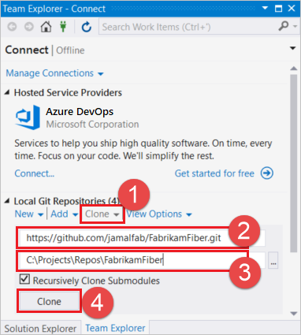
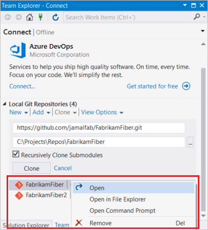
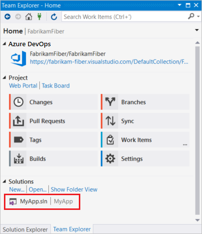

# Clone an existing Git repo

#### Azure Repos | TFS 2018 | TFS 2017 | TFS 2015 | VS 2017 | VS 2015

Create a complete local copy of an existing Git repo by cloning it. 
Cloning a repo downloads all [commits](commits.md) and [branches](branches.md) in the repo and sets up a named relationship with the existing repo you cloned.
Use this relationship to interact with the existing repo, [pushing](pushing.md) and [pulling](pulling.md) changes to share code with your team.

>[!NOTE]
> By default, Git will assign the `origin` to the remote repo you clone from. Most users don't need more than one remote, so the tutorial uses `origin` in its steps. 
> [Learn more](creatingrepo.md#remotes) about setting up remotes to your Git repo.

In this tutorial you learn how to:

> [!div class="checklist"]
> * Get the clone URL to your repo
> * Clone a repo

## Video tutorial

<iframe src="https://channel9.msdn.com/series/Team-Services-Git-Tutorial/Git-Tutorial-Create-a-Git-repo-in-Visual-Studio-2015/player" width="560" height="315" allowFullScreen frameBorder="0"></iframe>

>[!TIP]
> Working from the command line? You can view our video overview using command line steps on [Channel9](https://channel9.msdn.com/series/Team-Services-Git-Tutorial/Git-Tutorial-Create-a-repo-from-the-command-line).

<a name="clone_url"></a>
## Get the clone URL to your repo

Before you can clone an existing repo, you'll need a URL that points to the existing repo. This URL represents the source of the repo you're going to copy during the clone.

If you're using Azure DevOps Services or Team Foundation Server 2017, you can find this clone URL in the web portal. 

1. From your web browser, open the team project for your Azure DevOps organization and choose **Repos**, **Files**.

  

1. Select **Clone** in the upper right.

  

If you need to clone a GitHub repo, you'll need to get the clone URL from the **Clone or download** button while viewing the repo on the web in GitHub. 

Other Git providers have similar buttons in their user interface to get the clone URL. 

Copy this URL into the clipboard or store it in a place where you can find it easily. You can't clone a repo without a clone URL.

## Clone a repo 

# [Visual Studio](#tab/visual-studio)

* [Clone from Azure DevOps Services / Team Foundation Server](#clone-from-azure-devops-services--team-foundation-server)
* [Clone from another Git provider](#clone-from-another-git-provider)
* [Open a solution in Visual Studio from a cloned repo](#open-a-solution-in-visual-studio-from-a-cloned-repo)

### Clone from Azure DevOps Services / Team Foundation Server

1. In Team Explorer, open up the **Connect** page by selecting the **Connect** icon, and then choose **Manage Connections**, **Connect to Project**.

   
  
1. On the **Connect to a Project** dialog, select the repo you want to clone from the list and select **Clone**. If you don't see your repo listed, you can filter the list 
to find it or add a Team Foundation Server where the repo is hosted by selecting the **Add TFS Server** link.
   
      

  [!INCLUDE [project-urls](../../_shared/project-urls.md)]


1. Verify the location of the cloned repo on your PC and select **Clone**.

### Clone from another Git provider

If you are not using Azure Repos, you can still clone your repo in Team Explorer and work with your code in Visual Studio.

1. In Team Explorer, open the **Connect** view.
1. Select **Clone** under **Local Git Repositories** and enter the URL for your Git repo&mdash;this will be provided by your team or Git hosting provider.
1. Select a folder where you want your cloned repo to be kept.
1. Select **Clone** to clone the repo.

  

### Open a solution in Visual Studio from a cloned repo

1. Open a solution in a cloned repo in Visual Studio by right-clicking on the repository in the Team Explorer **Connect** view and selecting **Open**.

  

1. You'll be taken to the **Home** view in Team Explorer. Double-click your project solution file in the **Solutions** area to open the solution in Solution Explorer.

  

# [Command Line](#tab/command-line)

### Prerequisites

* Ensure you have installed the [Git command line package](http://git-scm.com/download) for your platform as well as the 
right [Git Credential Manager](set-up-credential-managers.md) or have [configured SSH authentication](use-ssh-keys-to-authenticate.md) before continuing.

You'll need a clone URL to tell Git what repository you want to clone to your computer. Use the URL you copied earlier during the [previous step](#clone_url) in this article.

Pass this clone URL to `git clone` to make a local copy of the repo:

```
git clone https://dev.azure.com/fabrikam/DefaultCollection/_git/Fabrikam
```

`git clone` clones the repository from the URL in a folder under the current one. You can pass in a folder name after the URL to create the repo in a specific location, for example:

```
git clone https://dev.azure.com/fabrikam/DefaultCollection/_git/Fabrikam C:\Repos\FabrikamFiber
```

---

## Next steps

> [!div class="nextstepaction"]
> [Save work with commits](commits.md)
