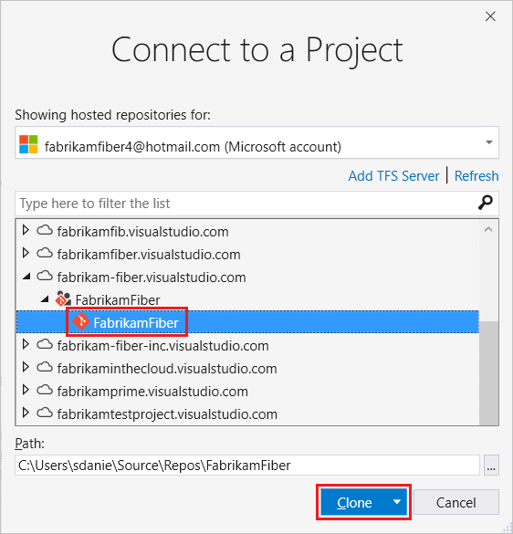

# Clone an existing Git repo

[!INCLUDE [version-lt-eq-azure-devops](../../includes/version-lt-eq-azure-devops.md)]
[!INCLUDE [version-vs-gt-2015](../../includes/version-vs-gt-2015.md)]

You can create a local copy of a remote Git repo by cloning it into a local folder on your computer. Cloning a remote repo downloads all [commits](commits.md) on all [branches](./create-branch.md) of the repo, unless you use the `--single-branch` clone option. Cloning links each branch in your new local repo with the corresponding branch in the remote repo. That way, when you [push](pushing.md) to share your local branch changes with your team, the corresponding remote branch is updated. Similarly, when you [pull](pulling.md) to update your local branch with changes made by your team, updates from the corresponding remote branch are retrieved. The remote repo can be an **Azure Repos** Git repo, a **GitHub** repo, or other hosted Git repo.

This article provides procedures for the following tasks:

> [!div class="checklist"]
> * Get the clone URL for an **Azure Repos** Git repo
> * Get the clone URL for a **GitHub** repo
> * Clone an **Azure Repos** Git repo
> * Clone a **GitHub** repo
> * Clone any Git repo
> * Open a Visual Studio solution from a cloned repo

For an overview of the Git workflow, see [Azure Repos Git tutorial](gitworkflow.md).


## Prerequisites for access to Azure Repos

[!INCLUDE [azure-repos-prerequisites](includes/azure-repos-prerequisites.md)]


<a name="clone_url"></a>

## Get the clone URL of an **Azure Repos** Git repo

Typically, you need to know the clone URL of the remote repo that you want to clone. The clone URL uniquely identifies the remote repo.

> [!NOTE]
> When signed into an Azure DevOps project, Visual Studio supports searching for and cloning project repos without needing to know the clone URL.

1. From your web browser, open the team project for your Azure DevOps organization, and then choose **Repos** > **Files** to open the **Files** view.

   :::image type="content" source="media/clone/visual-studio-2019/common/repos-files.png" border="true" alt-text="Screenshot of the Azure DevOps project page." lightbox="media/clone/visual-studio-2019/common/repos-files-lrg.png":::

1. In the **Files** view, choose **Clone** to launch the **Clone Repository** popup.

   :::image type="content" source="media/clone/visual-studio-2019/common/azure-repo.png" border="true" alt-text="Screenshot of the Clone button on the Azure DevOps repo page." lightbox="media/clone/visual-studio-2019/common/azure-repo-lrg.png":::

1. Copy the clone URL from the **Clone Repository** popup.

   :::image type="content" source="media/clone/visual-studio-2019/common/azure-clone-repo.png" border="true" alt-text="Screenshot of the 'Clone Repository' popup on the Azure DevOps project site." lightbox="media/clone/visual-studio-2019/common/azure-clone-repo-lrg.png":::

[!INCLUDE [project-urls](../../includes/project-urls.md)]


## Get the clone URL of a **GitHub** repo

Typically, you need to know the clone URL of the remote repo that you want to clone. The clone URL uniquely identifies the remote repo. 

> [!NOTE]
> When signed into **GitHub**, Visual Studio supports searching for and cloning GitHub repos without needing to know the clone URL.

1. Open a browser and navigate to your **GitHub** account, select the **Repositories** tab, and choose the repository to clone.

   :::image type="content" source="media/clone/visual-studio-2019/common/github-repo.png" border="true" alt-text="Screenshot of the repository page on the GitHub site." lightbox="media/clone/visual-studio-2019/common/github-repo-lrg.png":::

1. On the GitHub repository page, choose **Code** to launch the **Clone** popup. Copy the clone URL from the **Clone** popup.

   :::image type="content" source="media/clone/visual-studio-2019/common/github-clone-repo.png" border="true" alt-text="Screenshot of the Clone popup on the  page on the GitHub site." lightbox="media/clone/visual-studio-2019/common/github-clone-repo-lrg.png":::


## Clone an **Azure Repos** Git repo

By signing in as a member of an Azure DevOps project, you can clone private repos that are accessible to you, and public repos. Visual Studio supports search, clone, and sync operations on repos that are accessible through authentication.

> [!NOTE]
> You can clone a public **Azure Repos** Git repo without signing in as a member of its parent Azure DevOps project. To clone a public Git repo without signing in, see [Clone any Git repo](#clone-any-git-repo) and [Connect to a project in Azure DevOps](/azure/devops/organizations/public/clone-git-repo-public).


#### [Visual Studio 2019](#tab/visual-studio-2019/)

Visual Studio 2019 version 16.8 and later versions provides a Git version control experience while maintaining the **Team Explorer** Git user interface. To use **Team Explorer**, uncheck **Tools** > **Options** > **Preview Features** > **New Git user experience** from the menu bar. You can use Git features from either interface interchangeably. Below, we provide a side-by-side comparison for cloning an **Azure Repos** Git repo.

:::row:::
  :::column span="":::

    **Visual Studio Git** <br><br>

    1. From the **Git** menu on the menu bar, choose **Clone Repository** to open the **Clone a repository** window.

       :::image type="content" source="media/clone/visual-studio-2019/git-experience/clone-repo.png" border="true" alt-text="Screenshot of the 'Clone Repository' option in the Git menu in Visual Studio 2019." lightbox="media/clone/visual-studio-2019/git-experience/clone-repo-lrg.png":::

    2. In the **Clone a repository** window, select **Azure DevOps** under **Browse a repository** to open the **Connect to a Project** window.

       :::image type="content" source="media/clone/visual-studio-2019/git-experience/clone-azure-devops-repo.png" border="true" alt-text="Screenshot of the 'Clone Repository' window in Visual Studio 2019." lightbox="media/clone/visual-studio-2019/git-experience/clone-azure-devops-repo-lrg.png":::

    3. In the **Connect to a Project** window, sign in to Azure DevOps and choose the remote repo you want to clone. You can use the search box to filter the list of remote repos. If you don't see the remote repo, select **Add Azure DevOps Server** to add the server that hosts the repo. Verify the local folder path where you want the local clone to be created, and then select **Clone**.

       :::image type="content" source="media/clone/visual-studio-2019/team-explorer/connect-add-server.png" border="true" alt-text="Screenshot of the 'Connect to a Project' window in Visual Studio 2019." lightbox="media/clone/visual-studio-2019/team-explorer/connect-add-server-lrg.png":::

  :::column-end:::
  :::column span="":::

    **Visual Studio Team Explorer** <br><br>

    1. In **Team Explorer**, select **Connect** to open the **Connect** page, and then choose **Manage Connections** > **Connect to Project**.

       :::image type="content" source="media/clone/visual-studio-2019/team-explorer/manage-connections.png" border="true" alt-text="Screenshot of the 'Connect to a Project' link in Team Explorer in Visual Studio 2019." lightbox="media/clone/visual-studio-2019/team-explorer/manage-connections-lrg.png":::

    2. In the **Connect to a Project** window, sign in to Azure DevOps and choose the remote repo you want to clone. You can use the search box to filter the list of remote repos. If you don't see the remote repo, select **Add Azure DevOps Server** to add the server that hosts the repo. Verify the local folder path where you want the local clone to be created, and then select **Clone**.

       :::image type="content" source="media/clone/visual-studio-2019/team-explorer/connect-add-server.png" border="true" alt-text="Screenshot of the 'Connect to a Project' window in Visual Studio 2019." lightbox="media/clone/visual-studio-2019/team-explorer/connect-add-server-lrg.png":::

   :::column-end:::
:::row-end:::

After you've cloned a remote Git repo, Visual Studio detects the local clone and adds it to the list of **Local Repositories** in the **Git** menu.

:::image type="content" source="media/clone/visual-studio-2019/common/local-repositories.png" border="true" alt-text="Screenshot of the 'Local Repositories' option in the Git menu in Visual Studio 2019." lightbox="media/clone/visual-studio-2019/common/local-repositories-lrg.png":::


#### [Visual Studio 2017 & earlier](#tab/visual-studio-2017-earlier)

1. In Team Explorer, open the **Connect** page by selecting the **Connect** button. Choose **Manage Connections** then **Connect to Project**.

   

1. In **Connect to a Project**, select the repo you want to clone from the list and select **Clone**.

   

   If you don't see your repo listed, filter the list to find it.
   You may need to add an Azure DevOps Server where the repo is hosted.
   Select the **Add Azure DevOps Server** link.

1. Verify the location of the cloned repo on your PC and select **Clone**.


#### [Git Command Line](#tab/git-command-line/)

To clone an **Azure Repos** Git repo from the command line, see [Clone any Git repo](#clone-any-git-repo).


* * *


## Clone a **GitHub** repo

By signing into **GitHub** or using SSH authentication, you can clone private repos that are accessible to you, and public repos. Visual Studio supports search, clone, and sync operations on repos that are accessible through authentication.

>[!NOTE]
> You can clone a public **GitHub** repo without signing in to GitHub or otherwise authenticating. To clone a public Git repo without signing in, see [Clone any Git repo](#clone-any-git-repo).


#### [Visual Studio 2019](#tab/visual-studio-2019/)

Visual Studio 2019 version 16.8 and later versions provide a Git version control experience that supports search, clone, and sync operations on **GitHub** repos that are accessible through authentication. To clone a **GitHub** repo using **Team Explorer**, see [Clone any Git repo](#clone-any-git-repo). The following steps apply to the Git version control experience.

1. From the **Git** menu on the menu bar, choose **Clone Repository** to open the **Clone a repository** window.

    :::image type="content" source="media/clone/visual-studio-2019/git-experience/clone-repo.png" border="true" alt-text="Screenshot of the 'Clone Repository' option in the Git menu in Visual Studio 2019." lightbox="media/clone/visual-studio-2019/git-experience/clone-repo-lrg.png":::

1. In the **Clone a repository** window, select **GitHub** under **Browse a repository** to open the **Open from GitHub** window.

    :::image type="content" source="media/clone/visual-studio-2019/git-experience/clone-github-repo.png" border="true" alt-text="Screenshot of the GitHub option in the 'Clone Repository' window in Visual Studio 2019." lightbox="media/clone/visual-studio-2019/git-experience/clone-github-repo-lrg.png":::

1. In the **Open from GitHub** window, sign in to **GitHub** and choose the remote repo you want to clone. You can use the search box to filter the list of remote repos. Verify the local folder path where you want the local clone to be created, and then choose **Clone**.

    :::image type="content" source="media/clone/visual-studio-2019/git-experience/open-from-github.png" border="true" alt-text="Screenshot of the 'Open from GitHub' window in Visual Studio 2019." lightbox="media/clone/visual-studio-2019/git-experience/open-from-github-lrg.png":::

After you've cloned a remote Git repo, Visual Studio detects the local clone and adds it to the list of **Local Repositories** in the **Git** menu.

:::image type="content" source="media/clone/visual-studio-2019/common/local-repositories.png" border="true" alt-text="Screenshot of the 'Local Repositories' option in the Git menu of Visual Studio 2019." lightbox="media/clone/visual-studio-2019/common/local-repositories-lrg.png":::


#### [Visual Studio 2017 & earlier](#tab/visual-studio-2017-earlier)

To clone a **GitHub** repo using **Team Explorer**, see [Clone any Git repo](#clone-any-git-repo).


#### [Git Command Line](#tab/git-command-line/)

To clone a **GitHub** repo from the command line, see [Clone any Git repo](#clone-any-git-repo).


* * *


## Clone any Git repo

You can clone any Git repo that's accessible to you by using the clone URL of the repo.

#### [Visual Studio 2019](#tab/visual-studio-2019/)

Visual Studio 2019 version 16.8 and later versions provides a Git version control experience while maintaining the **Team Explorer** Git user interface. To use **Team Explorer**, uncheck **Tools** > **Options** > **Preview Features** > **New Git user experience** from the menu bar. You can use Git features from either interface interchangeably. Below, we provide a side-by-side comparison for cloning any Git repo.

:::row:::
  :::column span="":::

    **Visual Studio Git** <br><br>

    1. From the **Git** menu on the menu bar, choose **Clone Repository** to open the **Clone a repository** window.

       :::image type="content" source="media/clone/visual-studio-2019/git-experience/clone-repo.png" border="true" alt-text="Screenshot of the 'Clone Repository' option in the Git menu in Visual Studio 2019." lightbox="media/clone/visual-studio-2019/git-experience/clone-repo-lrg.png":::

    2. In the **Clone a repository** window, enter the clone URL of the remote Git repo that you want to clone, verify the local folder path where you want to create the local clone, and then choose **Clone**.

       :::image type="content" source="media/clone/visual-studio-2019/git-experience/specify-repo.png" border="true" alt-text="Screenshot of the 'Clone a repository' window in Visual Studio 2019." lightbox="media/clone/visual-studio-2019/git-experience/specify-repo-lrg.png":::

  :::column-end:::
  :::column span="":::

    **Visual Studio Team Explorer** <br><br>

    1. In **Team Explorer**, select **Connect** to open the **Connect** page, and then choose **Clone** under **Local Git Repositories**.

       :::image type="content" source="media/clone/visual-studio-2019/team-explorer/connect-clone.png" border="true" alt-text="Screenshot of the Clone link in the  Connect view of Team Explorer in Visual Studio 2019." lightbox="media/clone/visual-studio-2019/team-explorer/connect-clone-lrg.png":::

    2. Enter the clone URL of the remote Git repo that you want to clone, verify the local folder path where you want to create the local clone, and then choose **Clone**. To clone the remote Git repo _and_ any Git repos that are nested within it, leave **Recursively Clone Submodules** checked.

       :::image type="content" source="media/clone/visual-studio-2019/team-explorer/clone-remote-repo.png" border="true" alt-text="Screenshot of the Clone options in the 'Local Git Repositories' section of the 'Team Explorer' Connect view in Visual Studio 2019." lightbox="media/clone/visual-studio-2019/team-explorer/clone-remote-repo-lrg.png":::

   :::column-end:::
:::row-end:::

After you've cloned a remote Git repo, Visual Studio detects the local clone and adds it to the list of **Local Repositories** in the **Git** menu.

:::image type="content" source="media/clone/visual-studio-2019/common/local-repositories.png" border="true" alt-text="Screenshot of the 'Local Repositories' option from the Git menu in Visual Studio 2019." lightbox="media/clone/visual-studio-2019/common/local-repositories-lrg.png":::


#### [Visual Studio 2017 & earlier](#tab/visual-studio-2017-earlier)

1. In Team Explorer, open the **Connect** page by selecting the **Connect** button. Choose **Manage Connections** then **Connect to Project**.

   

1. Select **Clone** under **Local Git Repositories** and enter the URL for your Git repo. Your team or Git hosting provider gives you this URL.

1. Select a folder where you want your cloned repo, and then choose **Clone**.

   


#### [Git Command Line](#tab/git-command-line/)

1. If you haven't already, [download and install Git](http://git-scm.com/download). Enable [Git Credential Manager](set-up-credential-managers.md) when prompted during the install, or [configure SSH authentication](use-ssh-keys-to-authenticate.md).

1. At the command prompt, run the Git clone command with the [clone URL](#clone_url) of the remote repo. This command will create a local clone repo under the current folder.

```cmd
git clone <clone URL>
```

The Git clone command also let's you specify a folder path after the clone URL to create the repo in a specific location. For example:

```cmd
git clone https://fiber-teams@dev.azure.com/fiber-teams/FiberTests/_git/FiberTests C:\Repos\FiberTests
```

The Git clone command also let's you clone just a single branch. This option is useful when only one branch of a large repo is of interest to you.

```cmd
git clone <clone URL> --single-branch <branch name>
```

>[!NOTE]
> When you clone a remote repository, Git assigns the alias `origin` as shorthand for the URL of the remote repo you cloned. Git commands often use that alias.


* * *


## Open a Visual Studio solution from a cloned repo


#### [Visual Studio 2019](#tab/visual-studio-2019/)

Visual Studio 2019 version 16.8 and later versions provides a Git version control experience while maintaining the **Team Explorer** Git user interface. To use **Team Explorer**, uncheck **Tools** > **Options** > **Preview Features** > **New Git user experience** from the menu bar. You can use Git features from either interface interchangeably. Below, we provide a side-by-side comparison for opening a Visual Studio solution from a cloned repo.

:::row:::
  :::column span="":::

    **Visual Studio Git** <br><br>

    1. Choose the **File > Open > Project/Solution** from the menu bar, and select the solution file to open.

       :::image type="content" source="media/clone/visual-studio-2019/git-experience/open-solution.png" border="true" alt-text="Screenshot of the Open Solution option in the File menu in Visual Studio 2019." lightbox="media/clone/visual-studio-2019/git-experience/open-solution-lrg.png":::

    2. The Visual Studio solution that you selected is now open in **Solution Explorer**.

       :::image type="content" source="media/clone/visual-studio-2019/git-experience/open-solution-explorer.png" border="true" alt-text="Screenshot of an open solution in 'Solution Explorer' in Visual Studio 2019." lightbox="media/clone/visual-studio-2019/git-experience/open-solution-explorer-lrg.png":::

  :::column-end:::
  :::column span="":::

    **Visual Studio Team Explorer** <br><br>

    1. Right-click on a repository in the **Connect** view of **Team Explorer** and choose **Open**.
    
       :::image type="content" source="media/clone/visual-studio-2019/team-explorer/open-cloned-repo.png" border="true" alt-text="Screenshot of cloned repos in the 'Local Git Repositories' section of Team Explorer in Visual Studio 2019." lightbox="media/clone/visual-studio-2019/team-explorer/open-cloned-repo-lrg.png":::

    2. In the **Home** view of **Team Explorer**, double-click your solution file under **Solutions**.
    
       :::image type="content" source="media/clone/visual-studio-2019/team-explorer/open-solution-from-cloned-repo.png" border="true" alt-text="Screenshot of the solution file in the Solutions section of Team Explorer in Visual Studio 2019." lightbox="media/clone/visual-studio-2019/team-explorer/open-solution-from-cloned-repo-lrg.png":::

    3. The Visual Studio solution that you selected is now open in **Solution Explorer**.
        
       :::image type="content" source="media/clone/visual-studio-2019/team-explorer/open-solution-explorer.png" border="true" alt-text="Screenshot of an open solution within 'Solution Explorer' in Visual Studio 2019." lightbox="media/clone/visual-studio-2019/team-explorer/open-solution-explorer-lrg.png":::

   :::column-end:::
:::row-end:::


#### [Visual Studio 2017 & earlier](#tab/visual-studio-2017-earlier)

1. Right-click on a repository in the Team Explorer **Connect** view and select **Open**.

   

In the **Home** view in Team Explorer, double-click your project solution file in the **Solutions** area. The solution opens in **Solution Explorer**.

   


#### [Git Command Line](#tab/git-command-line/)

At the command prompt, run the following command to open a Visual Studio solution from a cloned repo. This isn't a Git command.

```cmd
start <solution filepath>
```

For example:

```cmd
start C:\Repos\FiberTests\FiberTests.sln
```

***


## Next steps

> [!div class="nextstepaction"]
> [Save work with commits](commits.md)


## Related articles

- [New to Git repos? Learn more](/devops/develop/git/set-up-a-git-repository)
