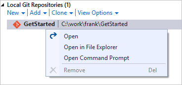

#  Git command reference 

**Azure Repos | Azure DevOps Server 2020 | Azure DevOps Server 2019 | TFS 2018 | TFS 2017 | TFS 2015 | VS 2017 | VS 2015 Update 2**

Visual Studio's [Team Explorer](../../user-guide/work-team-explorer.md) lets you do most common Git tasks that you'll need for your daily work. 
From the Visual Studio **View** menu, open Team Explorer or use the **Ctrl+\, Ctrl+M** hotkey. 

Team Explorer and the Git command-line work great together. When you make updates and run commands through one interface, you'll see those changes reflected in the other.

[Git Installation instructions](/devops/develop/git/install-and-set-up-git) are available if you don't have Git installed on your computer.

> [!TIP]
> Windows users: If you aren't using Visual Studio, install[Git for Windows](https://git-scm.com/download/win) to set up the [Git Credential Manager Core](set-up-credential-managers.md). The credential manager makes it easy to authenticate with Azure Repos.

While in Visual Studio, open a command prompt in your repo from Team Explorer's **Connect** view. Right-click your local repo and select **Open Command Prompt**
   

> [!IMPORTANT]
> Some commands require having [specific Git permissions](set-git-repository-permissions.md#git-repository) in Azure Repos to complete.

## Repos

---
:::row:::
   :::column span="1":::
      **How do I?** 
   :::column-end:::
   :::column span="1":::
     **Git command-line**
   :::column-end:::
   :::column span="1":::
     **Visual Studio**
   :::column-end:::
:::row-end:::
---
:::row:::
   :::column span="1":::
      Create a repo in a new folder
   :::column-end:::
   :::column span="1":::
     `git init` *foldername*
   :::column-end:::
   :::column span="1":::
     Select the **Connect** button (  ) in Team Explorer to open the **Connect** view, then select **New** under **Local Git repositories**  
   :::column-end:::
:::row-end::: 
---
:::row:::
   :::column span="1":::
      Create a repo with code in an existing folder
   :::column-end:::
   :::column span="1":::
     `git init` *foldername* `git add --all` `git commit -m "Initial commit"`
   :::column-end:::
   :::column span="1":::
     Create the repo from the command line, then open Team Explorer's **Connect** view and select **Add** under **Local Git repositories**  
   :::column-end:::
:::row-end:::
---
:::row:::
   :::column span="1":::
      Create a repo from an existing Visual Studio solution
   :::column-end:::
   :::column span="1":::
     `git init` *foldername* `cd` *foldername* `git add --all` `git commit -m "Initial commit"`
   :::column-end:::
   :::column span="1":::
     Open the solution and select **Publish** (   ) from the status bar in the lower right.  
   :::column-end:::
:::row-end:::
---
:::row:::
   :::column span="1":::
      Create a new repo in your Project
   :::column-end:::
   :::column span="1":::
     Not applicable
   :::column-end:::
   :::column span="1":::
     From the web, select **Repos** (or **Code** if you haven't enabled the new navigation preview), then select the drop-down next to the current repo name and choose **New Repository...**  
   :::column-end:::
:::row-end:::
---
:::row:::
   :::column span="1":::
      Clone a repo into a local folder
   :::column-end:::
   :::column span="1":::
     `git clone` *URL* *foldername*
   :::column-end:::
   :::column span="1":::
     Select **Clone** under **Local Git repositories** in Team Explorer's **Connect** view  
   :::column-end:::
:::row-end::: 
---
:::row:::
   :::column span="1":::
      Clone a repo in your Project
   :::column-end:::
   :::column span="1":::
     `git clone` *URL* *foldername*
   :::column-end:::
   :::column span="1":::
     Open the **Connect** view in Team Explorer and right-click the Git repo in your Project under the account name. Select **Clone...**  
   :::column-end:::
:::row-end:::
---
:::row:::
   :::column span="1":::
      Add an existing repo to Visual Studio
   :::column-end:::
   :::column span="1":::
     Not applicable
   :::column-end:::
   :::column span="1":::
     Open the solution file in Visual Studio (this will automatically add the repo to Team Explorer) or select **Add** under **Local Git repositories** in the **Connect** view  
   :::column-end:::
:::row-end:::
---
:::row:::
   :::column span="1":::
      Delete the Git repo and history, but keep the current version of the files
   :::column-end:::
   :::column span="1":::
     Delete the hidden .git folder created at the root of the repo
   :::column-end:::
   :::column span="1":::
     Delete the hidden .git folder created at the root of the repo from Windows Explorer or the command line  
   :::column-end:::
:::row-end:::
---
:::row:::
   :::column span="1":::
      Delete a local repo and all files
   :::column-end:::
   :::column span="1":::
     Delete the folder containing your repo from your computer's filesystem
   :::column-end:::
   :::column span="1":::
     Close any open solutions using files in the repo, then delete the folder containing your repo from your computer's filesystem. 
   :::column-end:::
:::row-end::: 
---
:::row:::
   :::column span="1":::
      Delete a repo in your Project
   :::column-end:::
   :::column span="1":::
     Not applicable
   :::column-end:::
   :::column span="1":::
     Not applicable, instead see [Delete an existing repo](delete-existing-repo.md)  
   :::column-end:::
:::row-end:::
---
:::row:::
   :::column span="1":::
      Add a remote
   :::column-end:::
   :::column span="1":::
     `git remote add` *name* *url*
   :::column-end:::
   :::column span="1":::
     Open the repository using the **Connect** view in Team Explorer, then open the **Settings** view in Team Explorer. Select **Repository Settings**, and select **Add** under **Remotes**  
   :::column-end:::
:::row-end:::
---
:::row:::
   :::column span="1":::
      Update a remote
   :::column-end:::
   :::column span="1":::
     `git remote set-url` *name* *url*
   :::column-end:::
   :::column span="1":::
     Open the repository using the **Connect** view in Team Explorer, then open the **Settings** view in Team Explorer. Select **Repository Settings**, and select **Edit** under **Remotes**
   :::column-end:::
:::row-end:::
---

For additional information, see the following resources: 

- [Create a new repo](creatingrepo.md)  
- [Clone an existing repo](clone.md)   
- [Share your code in Git with the command line](share-your-code-in-git-cmdline.md)   
- [Share your code in Git with Visual Studio 2015](share-your-code-in-git-vs.md)   
- [Share your code in Git with Visual Studio 2013](share-your-code-in-git-vs-2013.md)   
- [Create a new repo in your Project](create-new-repo.md)   
- [Delete a repo in your Project](delete-existing-repo.md)

## Branches

---
:::row:::
   :::column span="1":::
      **How do I?** 
   :::column-end:::
   :::column span="1":::
     **Git command-line**
   :::column-end:::
   :::column span="1":::
     **Visual Studio**
   :::column-end:::
:::row-end:::
---
:::row:::
   :::column span="1":::
      Create a new branch
   :::column-end:::
   :::column span="1":::
     `git branch` *branchname*
   :::column-end:::
   :::column span="1":::
     Open the **Branches** view in Team Explorer, then right-click a branch and choose **New Local Branch From...**  
   :::column-end:::
:::row-end:::  
---
:::row:::
   :::column span="1":::
      Swap to a different branch
   :::column-end:::
   :::column span="1":::
     `git checkout` *branchname*
   :::column-end:::
   :::column span="1":::
     Open the **Branches** view in Team Explorer, then double click a local branch. Alternatively, click the current branch name from the status bar and select a different branch. 
   :::column-end:::
:::row-end:::
---
:::row:::
   :::column span="1":::
      Create and switch to a new branch
   :::column-end:::
   :::column span="1":::
     `git checkout -b` *branchname*
   :::column-end:::
   :::column span="1":::
     Open the **Branches** view in Team Explorer, then right-click a branch and choose **New Local Branch From...** 
   :::column-end:::
:::row-end:::
---
:::row:::
   :::column span="1":::
      Delete a local branch
   :::column-end:::
   :::column span="1":::
     `git branch -d` *branchname*
   :::column-end:::
   :::column span="1":::
     Open the **Branches** view in Team Explorer, then right-click the branch and select **Delete**. You must be checked out to a different branch than the one you want to delete. 
   :::column-end:::
:::row-end:::
---
:::row:::
   :::column span="1":::
      Delete a remote branch
   :::column-end:::
   :::column span="1":::
     `git push origin --delete` *branchname*
   :::column-end:::
   :::column span="1":::
     Open the **Branches** view in Team Explorer, expand the remote that has the branch you want to delete. Right-click the remote and select **Delete Branch from Remote** 
   :::column-end:::
:::row-end:::
---
:::row:::
   :::column span="1":::
      Lock a branch, preventing updates to it
   :::column-end:::
   :::column span="1":::
     Not applicable.
   :::column-end:::
   :::column span="1":::
     From the web, select the **Branches** tab while viewing your repo. Select the **...** next to the branch you want to lock and choose **Lock**. Unlock the branch with **Unlock**.
   :::column-end:::
:::row-end:::
---
:::row:::
   :::column span="1":::
      Set a default branch in your Azure DevOps repo
   :::column-end:::
   :::column span="1":::
     Not applicable.
   :::column-end:::
   :::column span="1":::
     Select the settings icon on the web (  ), then select the **Version Control** tab. Select your Git repository, then select the **...** next to the branch name and choose **Set as default branch**. 
   :::column-end:::
:::row-end:::
---
:::row:::
   :::column span="1":::
      Set a compare branch for pull requests in  Azure DevOps repo
   :::column-end:::
   :::column span="1":::
     Not applicable.
   :::column-end:::
   :::column span="1":::
     From the web, select the **Branches** tab while viewing your repo. Select the **...** next to the branch you want to lock and choose **Compare branch**.
   :::column-end:::
:::row-end:::
---

For additional information, see the following resources: 

- [Create and manage your work in branches](./create-branch.md)   
- [Managing your Git branches in Azure DevOps Services/TFS](manage-your-branches.md)   
- [Delete a Git branch on your Azure DevOps Services/TFS repo](delete-branch.md)   
- [Lock and unlock an Azure DevOps Services/TFS branch](lock-branches.md)

## Commits

---
:::row:::
   :::column span="1":::
      **How do I?** 
   :::column-end:::
   :::column span="1":::
     **Git command-line**
   :::column-end:::
   :::column span="1":::
     **Visual Studio**
   :::column-end:::
:::row-end:::
---
:::row:::
   :::column span="1":::
      Create a new commit
   :::column-end:::
   :::column span="1":::
     `git commit -m `"*message*"
   :::column-end:::
   :::column span="1":::
     Open the **Changes** view in Team Explorer. Stage changes by right-clicking on the modified files and selecting **Stage**. Enter a commit message and select **Commit Staged**. 
   :::column-end:::
:::row-end:::
---
:::row:::
   :::column span="1":::
      Amend the last commit with staged changes
   :::column-end:::
   :::column span="1":::
     `git commit --amend -m` "*Updated message*"
   :::column-end:::
   :::column span="1":::
     Open the **Changes** view in Team Explorer, stage your changes, then select **Amend Previous Commit** from the **Actions** drop-down. 
   :::column-end:::
:::row-end:::
---
:::row:::
   :::column span="1":::
      Stage all file changes
   :::column-end:::
   :::column span="1":::
     `git add --all`
   :::column-end:::
   :::column span="1":::
     Open the **Changes** view in Team Explorer. Select the **+** icon in the **Changes** list to stage all changes for the next commit. 
   :::column-end:::
:::row-end:::
---
:::row:::
   :::column span="1":::
      Stage a specific file change
   :::column-end:::
   :::column span="1":::
     `git add` *filename*
   :::column-end:::
   :::column span="1":::
     Open the **Changes** view in Team Explorer. Stage changes by right-clicking on the changed file and selecting **Stage**. 
   :::column-end:::
:::row-end:::
---
:::row:::
   :::column span="1":::
      Review unstaged changes
   :::column-end:::
   :::column span="1":::
     `git status --untracked`
   :::column-end:::
   :::column span="1":::
     Open the **Changes** view in Team Explorer. Unstaged changes are listed under **Changes** section. 
   :::column-end:::
:::row-end::: 
---
:::row:::
   :::column span="1":::
      Delete a file
   :::column-end:::
   :::column span="1":::
     `git rm` *filename* `git commit -m` "*filename*"
   :::column-end:::
   :::column span="1":::
     Delete the file through Solution Explorer, the command line, or any other means. Right-click the deleted file in Team Explorer's **Changes** view and select **Stage**. Select **Commit Staged** to commit the deletion. 
   :::column-end:::
:::row-end:::
---
:::row:::
   :::column span="1":::
      Move a file
   :::column-end:::
   :::column span="1":::
     `git mv` *filename* `git commit -m` "Moved *filename*"
   :::column-end:::
   :::column span="1":::
     Move a file from one location to another in your repo through Solution Explorer, the command line, or any other means. Right-click the moved file in Team Explorer's **Changes** view and select **Stage** . Select **Commit Staged** to commit the move. 
   :::column-end:::
:::row-end:::
---
:::row:::
   :::column span="1":::
      Tag a commit
   :::column-end:::
   :::column span="1":::
     `git tag -a` *tagname* `-m` "*description*"
   :::column-end:::
   :::column span="1":::
     Open the **Changes** view in Team Explorer, then choose **View history..."** from the **Action** drop-down. Locate the commit in the History view, then right-click and select **Create Tag**
   :::column-end:::
:::row-end:::
--- 

To learn more, see [Save your work with commits](commits.md).

## Compare files and versions
 

---
:::row:::
   :::column span="1":::
      **How do I?** 
   :::column-end:::
   :::column span="1":::
     **Git command-line**
   :::column-end:::
   :::column span="1":::
     **Visual Studio**
   :::column-end:::
:::row-end:::
---
:::row:::
   :::column span="1":::
      Compare the current contents of a single file and the contents in the last commit 
   :::column-end:::
   :::column span="1":::
     `git diff HEAD` *filename* 
   :::column-end:::
   :::column span="1":::
     Right-click the change in the **Changes** view in Team Explorer and select **Compare with unmodified**.  
   :::column-end:::
:::row-end:::
---
:::row:::
   :::column span="1":::
      Compare your current version with a branch
   :::column-end:::
   :::column span="1":::
     `git diff` *branchname*
   :::column-end:::
   :::column span="1":::
     Right-click a file in Solution Explorer and select **View History...**, then select both on the latest commit on your current branch and the latest commit on the remote branch. Right-click and select **Compare** 
   :::column-end:::
:::row-end:::
---
:::row:::
   :::column span="1":::
      Compare changes between two branches
   :::column-end:::
   :::column span="1":::
     `git diff` *branchname1* *branchname2*
   :::column-end:::
   :::column span="1":::
     Right-click a file in Solution Explorer and select **View History...**, then select the most recent commits for both branches. Right-click and select **Compare**
   :::column-end:::
:::row-end:::
---

To learn more, see [Compare versions and review history](review-history.md).

## Sync changes

---
:::row:::
   :::column span="1":::
      **How do I?** 
   :::column-end:::
   :::column span="1":::
     **Git command-line**
   :::column-end:::
   :::column span="1":::
     **Visual Studio**
   :::column-end:::
:::row-end:::
---
:::row:::
   :::column span="1":::
      Download new branches and commits from a remote repo, but do not merge them into your local branches
   :::column-end:::
   :::column span="1":::
     `git fetch`
   :::column-end:::
   :::column span="1":::
     Open the **Sync** view from Team Explorer and select **Fetch**. 
   :::column-end:::
:::row-end::: 
---
:::row:::
   :::column span="1":::
      Merge updates from a remote repo into your local repo
   :::column-end:::
   :::column span="1":::
     `git pull` *remote* *branchname*
   :::column-end:::
   :::column span="1":::
     While working on the branch in your local repo, open the **Sync** view in Team Explorer, then select **Pull**.  
   :::column-end:::
:::row-end::: 
---
:::row:::
   :::column span="1":::
      Publish a local branch to a remote repo
   :::column-end:::
   :::column span="1":::
     `git push -u `*remote* *branchname*
   :::column-end:::
   :::column span="1":::
     Open the **Sync** view in Team Explorer and select **Publish** under **Outgoing Commits**. 
   :::column-end:::
:::row-end::: 
---
:::row:::
   :::column span="1":::
      Synchronize your local branch with a remote branch, pushing your local changes and pulling remote ones
   :::column-end:::
   :::column span="1":::
     `git pull` *remote* *branchname* git push -u *remote* *branchname*
   :::column-end:::
   :::column span="1":::
     Open the **Sync** view in Team Explorer. Select **Sync**.  
   :::column-end:::
:::row-end:::
---
:::row:::
   :::column span="1":::
      Force push a branch, rewriting the remote branch history with the history of your current branch
   :::column-end:::
   :::column span="1":::
     `git push --force -u origin` *remote_branchname*
   :::column-end:::
   :::column span="1":::
     Use command line 
   :::column-end:::
:::row-end:::
---
   
For additional information, see the following resources: 

- [Share code with push](pushing.md)   
[Update your code with fetch and pull](pulling.md)   
[Resolve merge conflicts](merging.md)

## Merge and rebase

---
:::row:::
   :::column span="1":::
      **How do I?** 
   :::column-end:::
   :::column span="1":::
     **Git command-line**
   :::column-end:::
   :::column span="1":::
     **Visual Studio**
   :::column-end:::
:::row-end:::
---
:::row:::
   :::column span="1":::
      Merge a branch into the current branch
   :::column-end:::
   :::column span="1":::
     `git merge` *branchname*
   :::column-end:::
   :::column span="1":::
     In the Team Explorer **Branches** view, right-click the branch you want to merge and select **Merge From..**. Verify the options set and select **Merge**.
   :::column-end:::
:::row-end:::
---
:::row:::
   :::column span="1":::
      Merge a remote branch into the current branch
   :::column-end:::
   :::column span="1":::
     `git pull origin` *branchname*
   :::column-end:::
   :::column span="1":::
      In the Team Explorer **Branches** view, right-click the remote branch you want to merge and select **Merge From..**. Verify the options set and select **Merge**.
   :::column-end:::
:::row-end:::
---
:::row:::
   :::column span="1":::
      Rebase your current branch onto the history of another branch
   :::column-end:::
   :::column span="1":::
     `git rebase` *branchname*
   :::column-end:::
   :::column span="1":::
     In the Team Explorer **Branches** view, right-click the branch you want to rebase your current branch changes onto and select **Rebase Onto...**
   :::column-end:::
:::row-end:::
---
:::row:::
   :::column span="1":::
      Do an interactive rebase of the last *n* commits
   :::column-end:::
   :::column span="1":::
     `git rebase -i HEAD`~*n* (Linux and macOS) `git rebase -i "HEAD`^*n*" (Windows)
   :::column-end:::
   :::column span="1":::
     Not applicable
   :::column-end:::
:::row-end:::
---
:::row:::
   :::column span="1":::
      Cherry-pick a commit into the current branch
   :::column-end:::
   :::column span="1":::
     `git cherry-pick` *commitID*
   :::column-end:::
   :::column span="1":::
     Open the **Changes** view in Team Explorer, then choose **View history...** from the **Action** drop-down. Locate the commit in the History view, then right-click and select **Cherry-pick** 
   :::column-end:::
:::row-end:::
---
   
For additional information, see the following resources: 

- [Resolve merge conflicts](merging.md)   
[Catch up and replay changes with rebase](rebase.md)   
[Copy changes with cherry-pick](cherry-pick.md)

## Undo

> [!WARNING]
> If you are not an experienced Git user, exercise caution when using the `reset` command. [Learn more](undo.md)

---
:::row:::
   :::column span="1":::
      **How do I?** 
   :::column-end:::
   :::column span="1":::
     **Git command-line**
   :::column-end:::
   :::column span="1":::
     **Visual Studio**
   :::column-end:::
:::row-end:::
---
:::row:::
   :::column span="1":::
      Revert all changes and roll back to the most recent commit
   :::column-end:::
   :::column span="1":::
     `git reset --hard HEAD`
   :::column-end:::
   :::column span="1":::
     Open the **Changes** view in Team Explorer. Select **Actions and choose **View History** from the drop-down. Right-click the commit where the branch is currently located and select **Reset and Delete changes....** 
   :::column-end:::
:::row-end:::
---   
:::row:::
   :::column span="1":::
      Revert staging of files, but keep file changes
   :::column-end:::
   :::column span="1":::
     `git reset --mixed HEAD`
   :::column-end:::
   :::column span="1":::
     Open the **Changes** view in Team Explorer. Select **Actions and choose **View History** from the drop-down. Right-click the commit where the branch is currently located and select **Reset and Keep changes....**
   :::column-end:::
:::row-end:::
---   
:::row:::
   :::column span="1":::
      Delete untracked files
   :::column-end:::
   :::column span="1":::
     `git clean -f`
   :::column-end:::
   :::column span="1":::
     In the **Changes** view in Team Explorer, right-click the files to remove under **Changes** marked with **[add]** and select **Delete**.  
   :::column-end:::
:::row-end:::
---   
:::row:::
   :::column span="1":::
      Reset your local branch to the most recent commit on a remote branch
   :::column-end:::
   :::column span="1":::
     `git reset --hard` *remote*/*branchname* (for example, `git reset --hard origin/master`)
   :::column-end:::
   :::column span="1":::
     Right-click the branch from Team Explorer's **Branches** view and select **Reset and Delete changes....**  
   :::column-end:::
:::row-end:::
---   
:::row:::
   :::column span="1":::
      Revert a commit pushed to a remote repository
   :::column-end:::
   :::column span="1":::
     `git revert` *commitID*
   :::column-end:::
   :::column span="1":::
     Open the **Changes** view in Team Explorer. Select **Actions and choose **View History** from the drop-down. Right-click the commit to revert and select **Revert**. 
   :::column-end:::
:::row-end:::
--- 

 
To learn more, see [Undo changes and commits](undo.md).
