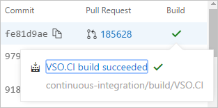

# Commit history

#### Azure Repos | TFS 2018 | TFS 2017 Update 1

## Commit history view

The commit history view shows you the history of all the commits for a particular branch in a repository. By default, all results are shown in reverse chronological order. 
 

For each commit, you can view the following key elements:

* Author details - You can view the author and committer of each commit along with the associated time. 

    

* Complete commit message - If the commit message is too long, you can click on the down-arrow to expand the commit message to view the entire commit message. 

    
	
* Copy commit SHA - You can copy the 40 character commit SHA by clicking on the **Copy full SHA to clipboard** button. You can click on a commit ID or commit message to open the commit details page.
	
    	
	
* Build and PR information - You can view the pull request that brought this commit to the branch selected on the page, and view the build status of the current commit.

    

* You can select a repository from the repository picker to view the history of a particular repository.

    

* You can select a particular branch or tag from the branch picker to view associated history.

    

* You can further filter the results by selecting a particular file from the code explorer. 

    

* You can also find a file or folder to view its history. In the following example, when you type "get", you see results of all files and folders in the repository that contain the word **src**.

    

## History result filtering

You can filter the results using the following advanced filtering modes: **simple history**, **first parent**, **full history**, and **full history with simplified merges**. For more information, see [advanced git history options](https://git-scm.com/book/en/v2/Git-Basics-Viewing-the-Commit-History).

You can also filter commits by authors. You will see authors of most recent commits in the author filter drop down. In case you are not able to find an author in the drop down, then you can type the author name or email address and search for all commits by that author.

In case you want to view commits that were authored between any two dates, you can use the **From date** and **To date** filter to scope down the list of commits.

## Commit search

You can also search for a commit using its Commit ID. You can search for all commits starting with a commit ID. If you enter the 40 character Commit ID then you will be redirected directly to the commit details page.

## Commit for file renames

In case a file or folder is renamed, you will see all commits until the file or folder got renamed. You will also see a link suggesting **Show rename history**. 

When you click on **Show rename history** you can view all the commits of the file or folder before the rename.

