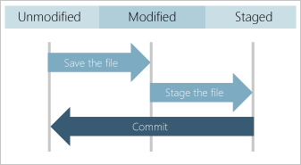
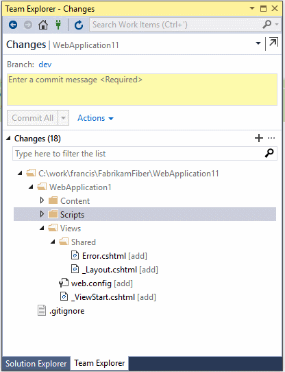

# Save work with commits

#### Azure Repos | TFS 2018 | TFS 2017 | TFS 2015 | VS 2017 | VS 2015 Update 2

Git does not automatically snapshot your code as you make edits to files in your repo.  You must tell Git exactly which changes you want to add to the next snapshot by staging those changes.
After staging your changes, create a commit to save the snapshot to your repo. 

In this tutorial you learn:

> [!div class="checklist"]
> * How Git tracks changes
> * What's in a commit
> * How to stage your changes
> * How to create a commit
> * How to update your last commit

## How Git tracks changes

Git tracks file changes in your repo as you work, and separates the files in your repo into three categories:

- Unmodified files - These files haven't changed since your last commit.
- Modified files - These files have changes since your last commit, but you haven't yet staged for the next commit.
- Staged files - These files have changes that will be added to the next commit.   

   

When you create a commit, only the staged changes and unchanged files are used for the snapshot. 
Changes to unstaged but modified files are kept, but the commit uses the unmodified version from the previous commit in its snapshot.
   
Commits are created in your local Git repository, so you don't have to worry about your changes being perfect. 
Continue to create commits as you work, [pushing](pushing.md) your changes to the team when they are ready to share.

### Video overview

<iframe src="https://channel9.msdn.com/series/Team-Services-Git-Tutorial/Git-Tutorial-Commits/player" width="640" height="360" allowFullScreen frameBorder="0"></iframe>

## What's in a commit

Commits include the following information:

- A snapshot of the files saved in the commit. Git snapshots the contents of all files in your repo at the time of the commit&mdash;this makes switching versions very fast and helps Git [merge](merging.md) changes.
- A reference to the parent commit(s). Commits with multiple parents occur when [branches](branches.md) are merged together.
- A short and to the point message describing the changes in the commit. You enter this message when you create the commit.  

Git uses the references between commits along with the file snapshots to maintain a complete record of development in your repo.

[Learn more about Git history](/azure/devops/learn/git/understand-git-history) and how to [review history](history.md) to investigate changes made to your code.

<a name="stage-your-changes-and-commit"></a>

## Stage your changes

Git does not automatically add changed files to the snapshot when you create a commit. 
You must first stage your changes to let Git know which updates you want to add to the next commit. 
Staging lets you to selectively add files to a commit while excluding changes made in other files.

[Ignore](ignore-files.md) temp files, logs, and other files that might change on your local machine but you don't want to add to version control.

# [Visual Studio](#tab/visual-studio)

#### Visual Studio 2015 (Update 2) and 2017
   
Visual Studio keeps track of file changes to your project as you do your work. When you are ready to stage changes, open up the **Changes** view in Team Explorer. 

Stage individual file changes by right-clicking a file in the **Change** view and selecting **Stage**. 
Staging a change creates a **Staged Changes** section in Team Explorer. Only changes in the **Staged Changes** section are added to the next commit. 


> [!NOTE]
> The Team Explorer **Changes** view had **Included Files** and **Excluded Files** sections before Visual Studio 2015 Update 2. The **Changes** view was updated in Visual Studio 2015 Update 2 for better
compatibility with other Git tools.</blockquote>
   
Stage multiple files or folders by selecting them then right-clicking and choosing **Stage** or by dragging and dropping files from the **Changes** list into the **Staged Changes** list. 

Ignore files by right-clicking and selecting **Ignore this local item** or **Ignore this extension**. This adds an entry to the .gitignore file in your local repo. If the ignored file was added 
to your repo in an earlier commit, ignoring the file will not remove it from the **Changes** list. See [excluding and ignoring files section](ignore-files.md) for more information on how to ignore files already tracked by Git.   

# [Command Line](#tab/command-line)

Stage all pending changes in your repo with the following command:

```
git add --all
git status
```

The `--all` flag stages all changes made in the repo since the last commit. Note that adding all changes might include files you don't want to commit to version control
such as IDE project files, build outputs, and editor autosaves. Tell Git to [ignore](ignore-files.md) these files by setting up a `.gitignore` for your repository.
You can find a large, up-to-date set of gitignore configurations for a variety of tools in the [GitHub gitignore repository](https://github.com/github/gitignore).

If you need to selectively stage file changes, you can use the Git `add`, `rm`, and `mv` commands to add changes and updates, remove files, and move/rename files respectively. 
See the [tutorial command reference](command-prompt.md#commits) and the [Git command line reference](https://git-scm.com/docs) for more information on using these commands.

Run the `status` command after you stage files to review your changes before making a commit. Checking `status` before committing is a great way to avoid trouble.

---

## Create a commit

# [Visual Studio](#tab/visual-studio)

Open the **Changes** view in Team Explorer.

Enter a commit message describing your changes and select **Commit Staged** to create a new commit that includes the changes listed in the **Staged Changes** section.

 

Skip staging files if you just want to commit all changes listed by entering a commit message and selecting **Commit All** when you have no staged changes.



When you commit in Visual Studio you can [push](pushing.md) the commit and [sync](pulling.md) the branch with a remote repository. 
These options are available in the drop-down on the **Commit** button.   

# [Command Line](#tab/command-line)

Run the `status` command before `commit` to review your staged and unstaged changes. Checking `status` before creating a commit helps avoid trouble.

```
git status
git commit -m
```

The `commit` command runs with the `-m` flag, which allows you to pass a message through the command line. If you don't provide this, Git will open up an editor in the
terminal so you can enter a commit message.

---

## Update your last commit

Amend your last commit to correct small errors without making a new commit.

> [!WARNING]
> Do not amend [pushed](pushing.md) commits. If you need to update pushed code, [undo the changes with revert](undo.md) or create and push another commit.

# [Visual Studio](#tab/visual-studio)

0. Open the **Changes** view in Team Explorer and stage your updated changes. You can amend just the commit message by leaving the staged changes empty.
0. Enter the updated commit message and select **Amend Previous Commit** from the **Actions** drop-down.   

    

# [Command Line](#tab/command-line)

0. Stage your changes using `git add` just as you would if you were creating a new commit.
0. Use the `--amend` option to the `commit` command to update the most recent commit with the staged changes and updated description.

    ```
    git commit -m --amend "short descriptive message"
    ```

---

## Next steps

> [!div class="nextstepaction"]
> [Create work in branches](branches.md).
