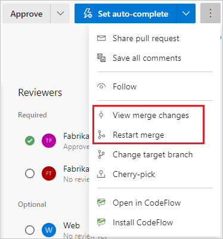
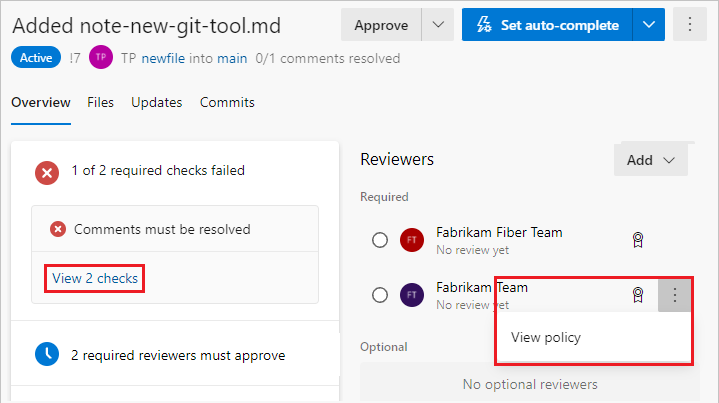
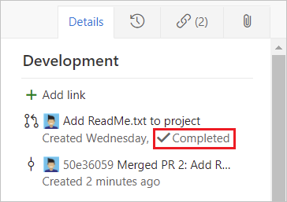
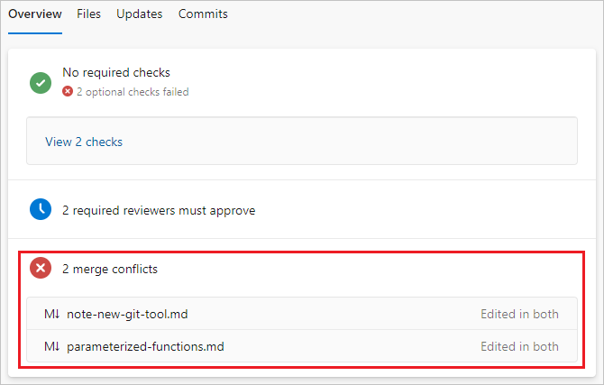
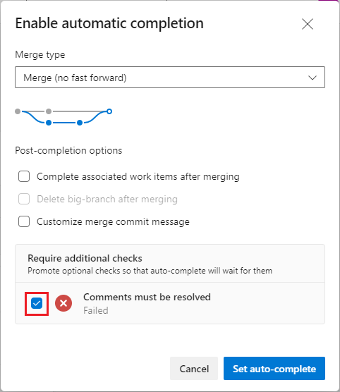
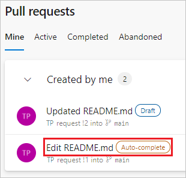

# Complete, abandon, or revert pull requests

[!INCLUDE [version-lt-eq-azure-devops](../../includes/version-lt-eq-azure-devops.md)]
[!INCLUDE [version-vs-gt-eq-2019](../../includes/version-vs-gt-eq-2019.md)]

Once all required reviewers approve your pull request (PR) and the PR meets all [branch policy](branch-policies.md) requirements, you can merge your changes into the target branch and [complete the PR](#complete-a-pull-request). Or if you decide not to proceed with the changes in the PR, you can [abandon the PR](#abandon-the-pr).

To address reviewers' changes, and respond to and resolve review comments, see [Address comments](review-pull-requests.md#address-comments).

## Prerequisites

::: moniker range="azure-devops"
- **Repos** must be enabled on your project. If the **Repos** hub and associated pages don't display, see [Turn an Azure DevOps service on or off](../../organizations/settings/set-services.md) to reenable Repos.
 
- To complete your PR, you must be a member of the **Contributors** security group, or have the corresponding permissions, in the project the PR is in.

- To contribute to a PR, you must be a member of the **Readers** security group or have the corresponding permissions.

- To view or review PRs, you must have **Basic** or higher access to the Azure DevOps project.

- If you aren't a member of the project you want to contribute to, [get added](../../organizations/accounts/add-organization-users.md).

  > [!NOTE]
  > For public projects, users granted **Stakeholder** access have full access to Azure Repos.
::: moniker-end

::: moniker range=">= azure-devops-2019 < azure-devops"
- **Repos** must be enabled on your project. If the **Repos** hub and associated pages don't display, see [Turn an Azure DevOps service on or off](../../organizations/settings/set-services.md) to reenable Repos.
- To complete a PR, you must be a member of the **Contributors** security group, or have the corresponding permissions, in the project you want to change.
- To contribute to a PR, you must be a member of the **Readers** security group or have the corresponding permissions.
- To view or review PRs, you must be a member of the Azure DevOps project with **Basic** access or higher. If you aren't a project member, [get added](../../organizations/security/add-users-team-project.md).
::: moniker-end

::: moniker range="< azure-devops-2019"
- To complete a PR, you must be a member of the **Contributors** security group for the Azure DevOps project, or have the corresponding permissions.
- To view or review PRs, you must be a member of the Azure DevOps project with **Basic** access or higher. If you aren't a project member, [get added](../../organizations/security/add-users-team-project.md).
- To contribute to a PR, you must be a member of the **Readers** security group for the Azure DevOps project or have the corresponding permissions.

::: moniker-end

- To learn more about permissions and access, see [Default Git repository and branch permissions](../../organizations/security/default-git-permissions.md) and [About access levels](../../organizations/security/access-levels.md).

::: moniker range="azure-devops"
- In Azure DevOps Services, you can manage PRs and other resources from the [Azure command-line interface (CLI)](/cli/azure/) with the `azure-devops` extension. To learn how to work with the Azure DevOps Services CLI, see [Get started with Azure DevOps CLI](../../cli/index.md). Azure Repos CLI commands for PRs use [az repos pr](/cli/azure/repos/pr).
::: moniker-end

## Check merge changes

When you complete a PR, Git adds a new *merge commit* to the end of the main branch. This merge commit links the earlier histories of the main branch and the PR source branch. To see the preview merge commit and check for [merge conflicts](merging.md), select the **More options** menu at upper right on a PR **Overview** page, and then select **View merge changes**.

If you changed the target branch after creating the PR, select **Restart merge** to create a new preview merge commit and update the merge change diff view.



## Review branch policies

Teams can set [branch policies](branch-policies.md) that require PRs in protected branches to meet specific criteria before the PRs can merge. You can see the branch policies in effect for your PR, whether they're required for merge, and whether the PR is passing or failing.

# [Browser](#tab/browser)

The PR **Overview** tab summarizes branch policies that are passing or failing for the PR. The overview lists only failed policies, but you can see all the policy checks by selecting **View \<n> checks**.

On the PR Overview page, branch policy requirements have an :::image type="icon" source="./media/complete-pull-requests/policies-icon.png"::: icon. Select **More options** next to the requirement and then select **View policy** to go to the branch's **Branch Policies** page in **Project Settings**.



# [Visual Studio](#tab/visual-studio)

You can open a PR in Visual Studio and then review branch policies as described in the Browser tab.

To open a PR from Visual Studio, in the **Git** menu, select **\<your Git service>** > **View Pull Requests**, and select a pull request to open it.

Visual Studio 2019 version 16.8 and later versions provides a Git version control experience while maintaining the **Team Explorer** Git user interface. To use **Team Explorer**, uncheck **Tools** > **Options** > **Preview Features** > **New Git user experience** from the menu bar. You can exercise Git features from either interface interchangeably.

To access PRs from Visual Studio Team Explorer:

1. [Connect to your project from Visual Studio](../../organizations/projects/connect-to-projects.md).

1. Select **View** > **Team Explorer** to open Team Explorer. You can also press **Ctrl**+**\\**, **Ctrl**+**M**.

1. From **Home**, select **Pull Requests** to view lists of PRs opened by you or assigned to you.

1. To open a PR in the web portal and view the policies in effect, right-click the PR and select **Open in browser**.

# [Azure DevOps CLI](#tab/azure-devops-cli)

::: moniker range="azure-devops"

To see all branch policies that are in effect for a PR, use [az repos pr policy list](/cli/azure/repos/pr/policy) with the required `id` parameter.

```azurecli
az repos pr policy list --id
                        [--detect {false, true}]
                        [--org]
                        [--query-examples]
                        [--skip]
                        [--subscription]
                        [--top]
```

### Parameters

|Parameter|Description|
|---------|-----------|
|`--id`|ID of the pull request. **Required.**|
|`--detect`|Automatically detect organization. Accepted values: `false`, `true`.|
|`--org`<br>`--organization`|Azure DevOps organization URL. You can configure the default organization by using `az devops configure -d organization=<ORG_URL>`. **Required** if not configured as default or picked up via git config. Example: `https://dev.azure.com/MyOrganizationName/`.|
|`--query-examples`|Recommended JMESPath string. You can copy one of the queries and paste it after the `--query` parameter in double quotation marks to see the results. You can add one or more positional keywords so suggestions are based on these keywords.|
|`--skip`|Number of policies to skip.|
|`--subscription`|Name or ID of subscription. You can configure the default subscription by using `az account set -s <NAME_OR_ID>`.|
|`--top`|Maximum number of policies to list.|

### Example

For example, to see the policies in effect on PR #28, run the following command:
```azurecli
az repos pr policy list --id 28 --output table

Evaluation ID                         Policy                                         Blocking    Status    Expired    Build ID
------------------------------------  ---------------------------------------------  ----------  --------  ---------  ----------
84e7ca6d-0b42-4819-9f62-f41df5e319f3  Minimum number of reviewers (1)                True        Approved
1ba061d8-9e9f-401b-ab61-e2ed1c200aba  Required reviewers (1)                         True
37620a4b-adc4-483d-9ca2-3f4e6ffe2990  Comment requirements                           False       Approved
34b7cae8-812a-4c14-9229-f71a0e662e8b  Required reviewers (1) ([Fabrikam Fiber]\Web)  False
a6e4380e-9f38-4aa5-863c-0fc496027362  Work item linking                              False       Rejected

```
::: moniker-end

[!INCLUDE [temp](../../includes/note-cli-not-supported.md)] 


***


<a name="complete-the-pull-request"></a>

## Complete a pull request

After you resolve any merge conflicts, and the PR meets all branch policies and has all required approvals, you can complete the PR.

# [Browser](#tab/browser)

::: moniker range="azure-devops"

1. Select **Complete** at upper right to complete the PR. Or select the dropdown arrow next to the **Complete** button, and select one of the options.

   

   - **Complete**: Complete the PR now, and merge the changes to the target branch.
   - **Set auto-complete**: Configure the PR to complete and merge once it meets all required branch policies.
   - **Mark as draft**: Return the PR to draft status and remove all votes.
   - **Abandon**: Close the PR without merging the changes.

1. In the **Complete pull request** pane, under **Merge type**, select one of the merge options.

   :::image type="content" source="media/complete-pull-requests/pull-request-complete-merge-2020.png" alt-text="Screenshot that shows the complete P R dialog.":::

   - **Merge (no fast forward)**: Merge with a non-linear history that preserves all commits.
   - **Squash commit**: Merge with a linear history that combines all source commits into a single commit on the target, or [squash merges](merging-with-squash.md) the PR. Be aware that a new commit will be created for the target branch without keeping the commit history from the source branch.
   - **Rebase and fast-forward**: Rebase the source commits onto the target and fast-forward.
   - **Semi-linear merge**: Rebase source commits onto the target and create a two-parent merge.
   
   > [!NOTE]
   > Existing policies are enforced. For example, if your branch currently has a "squash merge only" policy, you have to change that policy if you want to use another merge type.
   
1. Select any of the following post-completion options. Some options aren't available for some merge types.

   - **Complete associated work items after merging**: Complete any linked work items.
   - **Delete \<branch name> after merging**: Delete the PR's source branch after merging.
   - **Customize merge commit message**: Add a custom merge commit message. If you select this option, update the [merge commit](merging.md) message.
   - **Override branch policies and enable merge**. Force the merge even if the PR doesn't satisfy all branch policies. This option is only available if you have [Exempt from policy enforcement](branch-policies.md#bypass-branch-policies) permission.

1. Select **Complete merge**.

::: moniker-end

::: moniker range=">= azure-devops-2019 <= azure-devops-2020"

1. Select **Complete** at upper right to complete the PR. Or, select the dropdown arrow next to the **Complete** button, and select one of the following options:

   

   - **Complete**: Complete the PR now, and merge the changes to the target branch.
   - **Set auto-complete**: If you have branch policies, configure the PR to complete and merge once it meets all required branch policies.
   - **Abandon**: Close the PR without merging the changes.

1. On the **Complete pull request** screen, enter the message for the [merge commit](merging.md) and update the PR description.

   

1. Select any of the following options:
   - **Complete linked work items after merging** to complete any linked work items.
   - **Delete `<branch name>` after merging** to delete the source branch from the PR.
   - **Squash changes when merging** to [squash merge](merging-with-squash.md) your PR. Be aware that a new commit will be created for the target branch without keeping the commit history from the source branch.
   - **Override branch policies and enable merge** to force a branch to merge even if it doesn't satisfy all branch policies. This option is only available if you have [Exempt from policy enforcement](branch-policies.md#bypass-branch-policies) permissions.
     
     
     > [!NOTE]
     > Existing policies are still enforced. For example, if your branch currently has a "squash merge only" policy in place, you have to edit that policy in order to use the other merge types.  

5. Select **Complete merge**.

::: moniker-end

::: moniker range=">= azure-devops-2019"
When you complete the merge, any [linked work items](pull-requests.md#link-work-items) automatically update to show the PR completion.



::: moniker-end

::: moniker range="tfs-2018"

1. Select **Complete** in the upper right of the PR view to complete your PR after the reviewers approve of the changes.

   

   - **Complete**: Complete the PR now and merge the changes to the target branch.
   - **Set auto-complete**: If you have branch policies, you can choose **Set auto-complete** to configure the PR to close once it meets all branch policies.
   - **Abandon**: Close the PR without merging the changes.

2. In **Complete pull request**, enter the message for the [merge commit](merging.md) and update the PR description.

   

3. Select any of the following post-completion options:

   - **Complete linked work items after merging** to complete any linked work items.
   - **Delete `<branch name>` after merging** to delete the source branch from the PR.
   - **Squash changes when merging** to [squash merge](merging-with-squash.md) your PR. Be aware that a new commit will be created for the target branch without keeping the commit history from the source branch.
   - **Override branch policies and enable merge** to force a branch to merge even if it doesn't satisfy all branch policies. This option is only available if you have [Exempt from policy enforcement](branch-policies.md#bypass-branch-policies) permissions.

4. Select **Complete merge**.

Linked work items are also updated showing the PR completion.


::: moniker-end

# [Visual Studio](#tab/visual-studio)

To complete a PR, open the PR in the browser, and on the **Overview** page, select **Complete** or set other options.

To open a PR from Visual Studio, in the **Git** menu, select **\<your Git service>** > **View Pull Requests**, and select a pull request to open it.

To access PRs from Visual Studio 2019 Team Explorer:

1. [Connect to your project from Visual Studio](../../organizations/projects/connect-to-projects.md).

1. Select **View** > **Team Explorer** to open Team Explorer. You can also press **Ctrl**+**\\**, **Ctrl**+**M**.

1. From **Home**, select **Pull Requests** to view lists of PRs opened by you or assigned to you.

1. To open a PR in the web portal, right-click the PR and select **Open in browser**.

# [Azure DevOps CLI](#tab/azure-devops-cli)

::: moniker range="azure-devops"

To complete a PR and merge the changes, use [az repos pr update](/cli/azure/repos/pr#az-repos-pr-update) to update the PR `--status` to `completed`.

For example, to complete PR #21, use:

```azurecli
az repos pr update --id 21 --status completed
```

<a id="set-completion-options" /> 

### Set completion options

You can set PR completion options when you [create a PR](pull-requests.md#create-a-pull-request) with `az repos pr create`, or update creation options in existing PRs with `az repos pr update`. 

PR completion options include:

- `bypass-policy {false, true}`: Whether to bypass any required policies and complete the pull request once it can be merged.
- `bypass-policy-reason`: Reason for bypassing required policies.
- `delete-source-branch {false, true}`: Whether to delete the source branch after the pull request has been completed and merged.
- `merge-commit-message`: Customize the merge commit message.
- `squash {false, true}`: Whether to squash the source commits into a single target commit for merge.
- `transition-work-items {false, true}`: Whether to resolve linked work items when the PR merges.

To set completion options and complete an existing PR, use `az repos pr update` with the required `id` parameter.

```azurecli
az repos pr update --id
                   [--auto-complete {false, true}]
                   [--bypass-policy {false, true}]
                   [--bypass-policy-reason]
                   [--delete-source-branch {false, true}]
                   [--description]
                   [--detect {false, true}]
                   [--draft {false, true}]
                   [--merge-commit-message]
                   [--org]
                   [--squash {false, true}]
                   [--status {abandoned, active, completed}]
                   [--subscription]
                   [--title]
                   [--transition-work-items {false, true}]
```

### Parameters

|Parameter|Description|
|---------|-----------|
|`--id`|ID of the pull request. **Required**.
|`--auto-complete`|Set the pull request to complete automatically when all policies have passed and the source branch can be merged into the target branch. Accepted values: `false`, `true`.|
|`--bypass-policy`|Bypass any required policies and complete the pull request once it can be merged. Accepted values: `false`, `true`.|
|`--bypass-policy-reason`|Reason for bypassing required policies.|
|`--delete-source-branch`|Delete the source branch after the pull request is completed and merged into the target branch. Accepted values: `false`, `true`.|
|`--description -d`|New description for the pull request. Can include Markdown. Each value is new line. For example: `--description "First Line" "Second Line"`.|
|`--detect`|Automatically detect organization. Accepted values: `false`, `true`.|
|`--draft`|Convert the PR to draft mode or publish it. Accepted values: `false`, `true`.|
|`--merge-commit-message`|Message to display when commits are merged.|
|`--org`<br>`--organization`|Azure DevOps organization URL. You can configure the default organization by using `az devops configure -d organization=<ORG_URL>`. **Required** if not configured as default or picked up via git config. Example: `https://dev.azure.com/MyOrganizationName/`.|
|`--squash`|Squash the commits in the source branch when merging into the target branch. Accepted values: `false`, `true`.|
|`--status`|Set the new state of pull request. Accepted values: `abandoned`, `active`, `completed`.|
|`--subscription`|Name or ID of subscription. You can configure the default subscription by using `az account set -s <NAME_OR_ID>`.|
|`--title`|New title for the pull request.|
|`--transition-work-items`|Transition any work items linked to the pull request into the next logical state, for example Resolved. Accepted values: `false`, `true`.|

### Example

The following example completes PR #21, deletes its source branch, resolves its linked work items, and adds a merge commit message:

```azurecli
az repos pr update --id 21 --status completed --delete-source-branch true --transition-work-items true --merge-commit-message "This update is complete."
```

::: moniker-end

[!INCLUDE [temp](../../includes/note-cli-not-supported.md)] 

***


::: moniker range=">= azure-devops-2019"

### Rebase during PR completion

There are a few situations when rebasing during PR completion isn't possible:

- If a policy on the target branch prohibits using rebase strategies, you need **Override branch policies** permission to rebase.
- If the PR source branch has policies, you can't rebase it. Rebasing would modify the source branch without going through the policy approval process.
- If you used the Merge Conflict Extension to resolve merge conflicts, you can't rebase. Conflict resolutions applied to a three-way merge are seldom successful or valid when rebasing all the PR commits individually.

In all these cases, you can still rebase your branch locally and then push upstream, or squash-merge your changes when you complete the PR.

::: moniker-end

### Multiple merge base issue

In some cases, a PR has more than one true merge base, and this situation can cause security issues. If the files in the PR have different versions between the merge bases, a multiple merge base warning happens. For more information and remediation, see [Multiple merge bases](about-pull-requests.md#multiple-merge-bases). 


## Resolve merge conflicts

File changes in your branch can conflict with changes in another branch. When it isn't clear how to merge changes, Git shows the files that conflict on the PR's **Overview** page. You must resolve any *merge conflicts* between the PR branch and the target branch before you can merge a PR or set the PR to autocomplete. For instructions on resolving merge conflicts, see [Resolve merge conflicts](merging.md).




<a name="complete-automatically"></a>

## Set a pull request to autocomplete

# [Browser](#tab/browser)


Select **Set auto-complete** from the **Complete** dropdown list to complete and merge the PR changes as soon as conditions satisfy all [branch policies](branch-policies.md). When the PR is completed, you receive an email notification. If a conflict or error prevents PR completion, email notifies you of the issue.

>[!NOTE]
>The **Set auto-complete** option is available in Azure Repos and TFS 2017 and higher when you have branch policies. If you don't see **Set auto-complete**, you don't have any branch policies. For more information, see [Branch policies](branch-policies.md).

By default, a PR that's set to autocomplete waits only on required policies. In the **Enable automatic completion** panel, you can choose to wait on optional policies as well.



Starting with TFS 2018 Update 2, the PR **Overview** page displays the list of outstanding policy criteria the PR is waiting for. If you set a policy to be required in the **Enable automatic completion** panel, you can set it back to optional on the **Overview** page.

Select **Cancel auto-complete** to turn off autocomplete. 

::: moniker range="azure-devops"

::: moniker-end 

::: moniker range="< azure-devops"

::: moniker-end 

A PR set to autocomplete displays an **Auto-complete** badge on the **Pull requests** page.



# [Visual Studio](#tab/visual-studio)

Open a pull request in the web portal. On the **Overview** page, select **Set auto-complete**.

To open a PR from Visual Studio, in the **Git** menu, select **\<your Git service>** > **View Pull Requests**, and select a pull request to open it.

To access PRs from Visual Studio 2019 Team Explorer:

1. [Connect to your project from Visual Studio](../../organizations/projects/connect-to-projects.md).

1. Select **View** > **Team Explorer** to open Team Explorer. You can also press **Ctrl**+**\\**, **Ctrl**+**M**.

1. From **Home**, select **Pull Requests** to view lists of PRs opened by you or assigned to you.

1. To open a PR in the web portal and view the policies in effect, right-click the PR and select **Open in browser**.

# [Azure DevOps CLI](#tab/azure-devops-cli)

::: moniker range="azure-devops"

Set autocomplete to complete a PR automatically when it passes all required approvals and branch policies. You can set autocomplete at PR creation, or update an existing PR.

- To set autocomplete at PR creation, use `az repos pr create --auto-complete true`.
- To update an existing PR to autocomplete, use `az repos pr update --id <PR Id> --auto-complete true`.

::: moniker-end

[!INCLUDE [temp](../../includes/note-cli-not-supported.md)] 


***


<a name="abandon-the-pr"></a>
<a name="abandon-a-pr"></a>
<a name="abandon-a-pull-request"></a>

## Abandon or reactivate a pull request

# [Browser](#tab/browser)
To abandon your changes and your PR without merging, select **Abandon** from the dropdown list on the **Complete** button. You can still view the abandoned PR, and it stays linked to work items.

To reactivate an abandoned PR at any time, open the PR from the **Abandoned** tab in the **Pull Request** view, and select **Reactivate** at upper right.

<a id="abandon-pr"></a>

# [Visual Studio](#tab/visual-studio)

Open a pull request in the web portal. On the Overview page, select **Abandon**.

To open the PR in the web portal, use the procedure from [Complete a pull request](#complete-a-pull-request).

# [Azure DevOps CLI](#tab/azure-devops-cli)

::: moniker range="azure-devops"

To abandon a PR without merging the changes, use `az repos pr update --id <PR Id> –-status abandoned`. You can reactivate the PR by setting the status to `active`.

::: moniker-end

[!INCLUDE [temp](../../includes/note-cli-not-supported.md)] 

***

<a name="revert-a-completed-pr"></a>

## Revert a completed pull request

To undo the changes from a PR, follow these steps. For more information, see [Undo changes](undo.md).

1. Open the completed PR and select **Revert**. This action creates a new branch with changes that undo the PR in an existing target branch in your repo.

1. In the **Revert pull request** pane:

   1. Under **Target branch**, select the branch where you want to undo the PR changes.
   1. Under **Topic branch name required**, change the revert PR branch name if you want.
   1. Select **Revert**.

1. On the **New pull request** screen, select **Create**.

1. Merge the new PR to complete the revert.

> [!NOTE]
> The branch created during this revert has a single commit that reverts all the file changes from the original PR. The branch doesn't contain a reverted commit for each of the commits in the original PR.


## Next steps

> [!div class="nextstepaction"]
> [Copy changes with cherry-pick](cherry-pick.md)
 
## Related articles

- [Pull request update notifications](pull-request-notifications.md)
- [About pull requests and permissions](about-pull-requests.md)
