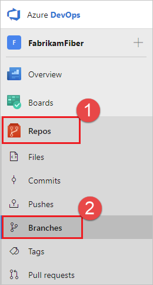
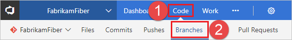
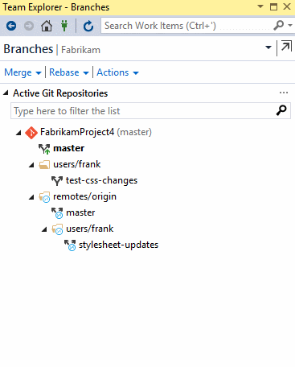

# Create a new Git branch

**Azure Repos | Azure DevOps Server 2020 | Azure DevOps Server 2019 | TFS 2018 | TFS 2017**

>[!TIP]
> Need help creating a new Git branch in your local repo from Visual Studio or the command line? Visit the [Git tutorial]().

>[!IMPORTANT]
> Users of TFS 2015 and previous won't have the **Branches** tab in the **Code** view. When using those versions, you can create a new branch in TFS from the **Code** view by selecting the dropdown list next to the branch name and then selecting **New branch**.


## Create a new branch

#### [Browser](#tab/browser) 

::: moniker range=">= azure-devops-2019"

1. View your repo's branches by selecting **Repos** > **Branches** while viewing your repo on the web.

   

2. Select **New branch** in the upper-right corner of the page.

   

3. In the **Create a branch** dialog box, enter a name for your new branch, select a branch to base the work off of, and associate any work items.

   :::image type="content" source="media/branches/create-branch-web-2020.png" alt-text="Screenshot that shows the creation of a branch with the new branch dialog.":::

4. Select **Create branch**.

::: moniker-end

::: moniker range="<= tfs-2018"

1. View your repo's branches by selecting **Branches** while viewing your repo on the web.

   

2. Select **New branch** in the upper-right corner of the page.

   

3. In the **Create a branch** dialog box, enter a name for your new branch, select a branch to base the work off of, and associate any work items.

   

4. Select **Create branch**.

::: moniker-end

>[!TIP]
> You will need to [fetch](pulling.md) the branch before you can see it and swap to it in your local repo.

#### [Visual Studio](#tab/visual-studio)

[!INCLUDE [temp](includes/note-new-git-tool.md)]  

**Visual Studio 2015 & 2017**

1. Open up Team Explorer and go to the **Branches** view.
2. Right-click the parent branch (usually `main`) to base your changes and choose **New Local Branch From...**. 
3. Supply a branch name in the required field and select **Create Branch**. Visual Studio automatically performs a `checkout` to the newly created branch.
   
         


#### [Command Line](#tab/command-line)

Use the `branch` command to create the branch and `checkout` to swap to that branch.

```console
git branch feature1
git checkout feature1
```

---