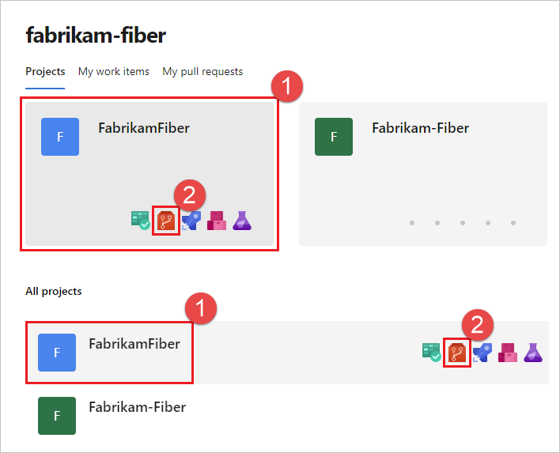
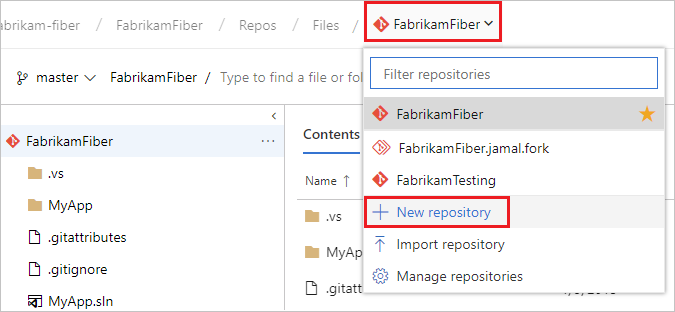
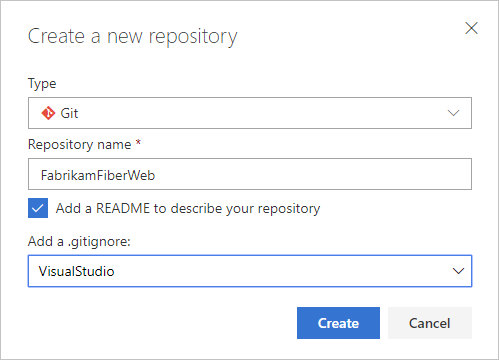

# Create a new Git repo in your project

[!INCLUDE [version-lt-eq-azure-devops](../../includes/version-lt-eq-azure-devops.md)]

Azure DevOps Services and TFS projects contain Git repositories, work items, builds, and releases. You can use Git repos in your projects to manage your source code as your project grows. This guide shows you how to create a Git repo using the web portal for either Azure DevOps Services (hosted on Azure) or Team Foundation Server (TFS - on-premises).

## Prerequisites

* An organization in Azure DevOps. If you don't have one, you can [sign up](../../organizations/accounts/create-organization.md) for one for free. Each organization includes free, unlimited private Git repositories.
* You must have the **Create repository** permission, which is granted by default to project administrators. For more information, see [Set Git repository permissions](set-git-repository-permissions.md).
* Git command-line tools:
  * [Install Git for Windows](https://git-scm.com/download/win), which includes [Git Credential Manager](set-up-credential-managers.md#windows)
  * [Install Git for macOS and Linux](https://git-scm.com/downloads).
    * For macOS and Linux, we recommend [configuring SSH authentication](../git/use-ssh-keys-to-authenticate.md)

## Create a repo using the web portal 

::: moniker range=">= azure-devops-2019"

1. Open the **Repos** page in your project by browsing to `https://dev.azure.com/OrganizationName`, hover your mouse over the name of your project, and select the **Repos** icon. You can select it from the **All** projects list, or from the **Recent** projects list if you've accessed it recently.

   

2. From the repo drop-down, select **New repository**.

   

3. In the **Create a new repository** dialog, verify that Git is the repository type and enter a name for your new repository. For naming restrictions, see [Naming restrictions, Azure Repos (git)](../../organizations/settings/naming-restrictions.md#repos-git). 

   

	You can also add a README and create a .gitignore for the type of code you plan to manage in the repo. A [README](create-a-readme.md) contains information about the code in your repo. The [.gitignore](ignore-files.md) file tells Git which types of files to ignore, such as temporary build files from your development environment.

4. When you're happy with the repo name and choices, select **Create**.

   A new empty Git repo is now created in your project. 

    - If you created an empty repo with no README or .gitignore files, you'll see instructions on how to [clone](clone.md) the repo to your computer. You'll also see instructions on how to [push](pushing.md) code in an existing repo into the newly created one.
    - In this example, you created a README and a .gitignore. You'll now see an overview of the files in your repo. You can [clone](clone.md) the repo using the **Clone** link on the upper right of the page to get working with a local copy of the repo immediately. 

::: moniker-end

::: moniker range="tfs-2018"

1. Navigate to your project by browsing to `https://dev.azure.com/<your organization name>` and selecting the name of your project. You can select it from the **All projects** list, or from the **Recent** projects list at the top if you've accessed it recently.

    

2. In the **Project** area in the web portal, select **Code**, then select the drop-down next to the current repo name and choose **New Repository**.

   

3. In the **Create a new repository** dialog, verify that Git is the repo type and enter a name for your new repo. For naming restrictions, see [Naming restrictions, Azure Repos (git)](../../organizations/settings/naming-restrictions.md#repos-git). 

   

	You can also add a README and create a .gitignore for the type of code you plan to manage in the repo. A [README](create-a-readme.md) contains information about the code in your repo. The [.gitignore](ignore-files.md) file tells Git which types of files to ignore, such as temporary build files from your development environment.

4. When you're happy with the repo name and choices, select **Create**.

   A new empty Git repo is now created in your project. 

    - If you created an empty repo with no README or .gitignore files, you'll see instructions on how to [clone](clone.md) the repo to your computer. You'll also see instructions on how to [push](pushing.md) code in an existing repo into the newly created one.
    - In this example. you created a README and a .gitignore. You'll now see an overview of the files in your repo. You can [clone](clone.md) the repo using the **Clone** link on the upper right of the page to get working with a local copy of the repo immediately. 

::: moniker-end

## Clone the repo to your computer

To work with a Git repo, you clone it to your computer. Cloning a repo creates a complete local copy of the repo for you to work with. Cloning also downloads all [commits](commits.md) and [branches](./create-branch.md) in the repo and sets up a named relationship with the repo on the server. Use this relationship to interact with the existing repo, pushing and pulling changes to share code with your team.

::: moniker range=">= azure-devops-2019"

1. From your web browser, open the team project for your organization in Azure DevOps and select **Repos** > **Files**. If you don't have a team project, [create one now](../get-started/sign-up-invite-teammates.md). 

   

2. Select **Clone** in the upper-right corner of the **Files** window and copy the clone URL.

   

3. Open the Git command window (Git Bash on Git for Windows). Then, browse to the folder where you want the code from the repo stored on your computer. Run `git clone` followed by the path copied from the **Clone URL** in the previous section, as shown in the following example.

   ```
   git clone https://dev.azure.com/fabrikam-fiber/MyFirstProject/_git/
   ```

   Git downloads a copy of the code into a new folder for you to work with. The download includes all [commits](../git/commits.md) and [branches](./create-branch.md) from the repo.

4. Switch your directory to the repository that you cloned.

   ```
   cd fabrikam-fiber
   ```

   Keep this command window open, because you'll use it in the following steps.

::: moniker-end

::: moniker range="tfs-2018"

1. Select **Clone** in the upper-right corner of the **Code** window and copy the **Clone URL**.

   

2. Open the Git command window (Git Bash on Git for Windows), navigate to the folder where you want the code from the repo stored on your computer, and run `git clone` followed by the path copied from the **Clone URL** in the previous step, as shown in the following example.

   ```
   git clone https://fabrikam-fiber.visualstudio.com/DefaultCollection/MyFirstProject/_git/
   ```
  
   After running the previous command, Git downloads a copy of the code into a new folder for you to work with. This download includes all [commits](commits.md) and [branches](./create-branch.md) from the repo.

   Keep this command window open, as you'll use it in the following steps.

::: moniker-end

## Work with the code

In this step, we'll make a change to the files on your computer, commit the changes locally, push the commit up to the repo on the server, and view the changes there.

1. Browse to the folder on your computer where you cloned the repo and open the `README.md` file in your editor of choice.

2. Make some changes, for example add `This is my first edit.` to the file, and save and close the file.

3. In the Git command window, navigate to the `fabrikam-fiber` directory by entering the following command: 

   ```
   cd fabrikam-fiber
   ```

4. Commit your changes by entering the following command in the Git command window:

   ```
   git commit -a -m "My first commit"
   ```

   When using `git commit`, `-a` means to commit all changed files, and `-m` specifies a commit message.

5. Push your changes up to the Git repo by entering the following command into the Git command window:

   ```
   git push
   ```

6. Switch back to the web portal and select **History** from the **Code** view to view your new commit. The new repo has two commits. The first is the commit where the README and .gitignore were added when the repo was created. The second is the commit you just made.

   

7. Switch to the **Files** tab and select the README file to view your changes.

     

## Next steps

> [!div class="nextstepaction"]
> [New to Git repos? Learn more](/devops/develop/git/set-up-a-git-repository)

> [!div class="nextstepaction"]
> [Learn more about using Git in the Git tutorial](gitworkflow.md)
