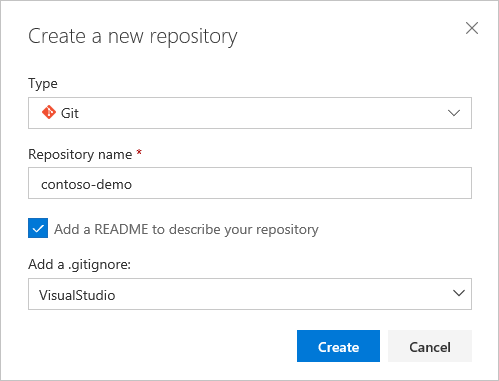
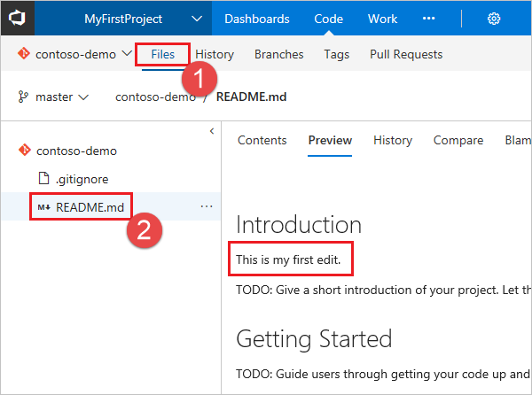

# Create a new Git repo in your project

#### Azure Repos | TFS 2018 | TFS 2017 | TFS 2015

Azure DevOps Services and TFS projects contain Git repositories, work items, builds, and releases. You can use Git repos in your projects to manage your source code as your project grows. This guide shows you how to create a Git repo using the web portal for either Azure DevOps Services (hosted on Azure) or Team Foundation Server (TFS - on-premises).

## Prerequisites

* An Azure DevOps organization. If you don't have one, you can [sign up](../../organizations/accounts/create-organization.md) for one for free. Each organization includes free, unlimited private Git repositories.
* Git command line tools:
  * [Install Git for Windows](https://git-scm.com/download/win), which includes [Git Credential Manager - Windows](set-up-credential-managers.md#windows)
  * [Install Git for macOS and Linux](https://git-scm.com/downloads). For information on Git credential managers for these platforms, see [Install the Git Credential Manager - macOS and Linux](set-up-credential-managers.md#macos-and-linux)

## Create a repo using the web portal 

0. Navigate to your project by browsing to `https://<your account name>.visualstudio.com` and selecting the name of your project. You can select it from the **All** projects list, or from the **Recent** projects list if you have accessed it recently.

   

0. In the **Project** area in the web portal, select **Code**, then select the drop-down next to the current repo name and choose **New Repository**.

      

0. In the **Create a new repository** dialog, verify that Git is the repo type and enter a name for your new repo. You can also choose to add a README and create a .gitignore for the type of code you plan to manage in the repo. A [README](create-a-readme.md) contains information about the code in your repo, and a [.gitignore](ignore-files.md) file tells Git which types of files to ignore, such as temporary build files from your development environment.

  

0. When you're happy with the repo name and choices, select **Create**.

  A new empty Git repo is now created in your project. 

    - If you created an empty repo (no README or .gitignore), you'll see instructions on how to [clone](clone.md) the repo to your computer or [push](pushing.md) code in an existing repo into the newly created one.
    - In this example you created a README and a .gitignore, so you'll see an overview of the files in your repo, and you can [clone](clone.md) the repo using the **Clone** link on the upper right of the page to get working with a local copy of the repo immediately. 

## Clone the repo to your computer

To work with a Git repo, you clone it to your computer. Cloning a repo creates a complete local copy of the repo for you to work with, and downloads all [commits](commits.md) and [branches](branches.md) in the repo and sets up a named relationship with the repo on the server. Use this relationship to interact with the existing repo, pushing and pulling changes to share code with your team.

0. Select **Clone** in the upper-right corner of the **Code** window and copy the **Clone URL**.

  

0. Open the Git command window (Git Bash on Git for Windows), navigate to the folder where you want the code from the repo stored on your computer, and run `git clone` followed by the path copied from the **Clone URL** in the previous step, as shown in the following example.

  ```
  git clone https://contoso-ltd.visualstudio.com/MyFirstProject/_git/contoso-demo
  ```
  After running the previous command, Git downloads a copy of the code, including all [commits](commits.md) and [branches](branches.md) from the repo, into a new folder for you to work with.

  Keep this command window open, as you'll use it in the following steps.

## Work with the code

In this step, we'll make a change to the files on your computer, commit the changes locally, push the commit up to the repo that is stored on the server, and view the changes there.

0. Browse to the folder on your computer where you cloned the repo and open the `README.md` file in your editor of choice.

0. Make some changes, for example add `This is my first edit.` to the file, and save and close the file.

0. In the Git command window, navigate to the `contoso-demo` directory by entering the following command: 

  ```
  cd contoso-demo
  ```

0. Commit your changes by entering the following command in the Git command window:

  ```
  git commit -a -m "My first commit"
  ```

  When using `git commit`, `-a` means to commit all changed files, and `-m` specifies a commit message.

0. Push your changes up to the Git repo on the server by entering the following command into the Git command window:

  ```
  git push
  ```

0. Switch back to the web portal and select **History** from the **Code** view to view your new commit. The new repo has two commits: the first commit where the README and .gitignore were added when the repo was created, and the commit you just made.

  

0. Switch to the **Files** tab and click on the README file to view your changes.

    

## Next steps

> [!div class="nextstepaction"]
> [New to Git repos? Learn more](/azure/devops/learn/git/set-up-a-git-repository)

> [!div class="nextstepaction"]
> [Learn more about using Git in the Git tutorial](gitworkflow.md)
