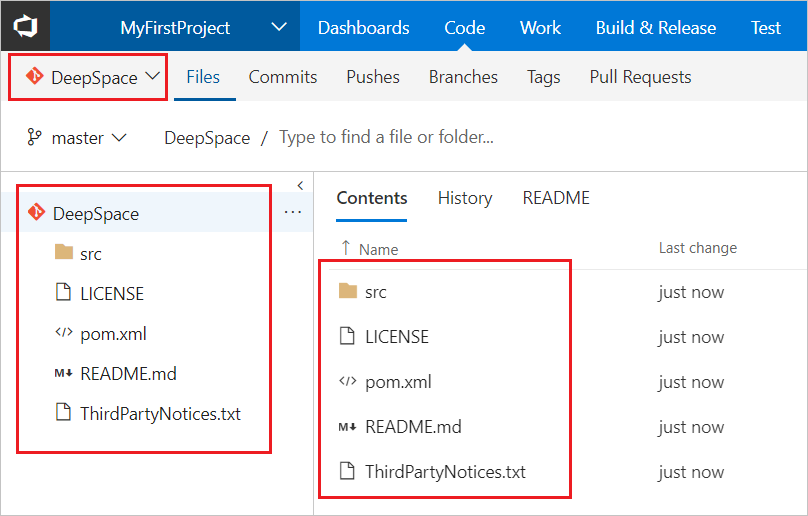
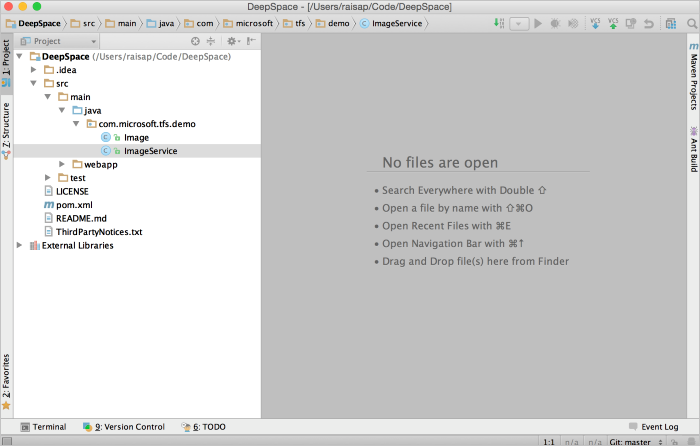
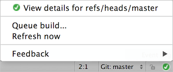

# Use the Azure DevOps plugin for IntelliJ IDEA and Android Studio

[!INCLUDE [version-lt-eq-azure-devops](../../includes/version-lt-eq-azure-devops.md)]

IntelliJ IDEA is an IDE produced by JetBrains. You can find out more about it at [https://www.jetbrains.com/idea/](https://www.jetbrains.com/idea/).
The [Azure DevOps Plugin for IntelliJ](https://plugins.jetbrains.com/plugin/7981-azure-devops) allows you to connect to your Git repositories to Azure DevOps in a seamless and intuitive way.
You can also use this plugin to import projects into Azure Repos or create pull requests in your Azure DevOps Git repository.

## Prerequisites

| Category | Requirements |
|-------------|-------------|
| **Organization** | An [organization in Azure DevOps](../../organizations/accounts/create-organization.md) with a Git repository. |
|**Tools**| - [IntelliJ IDEA](https://www.jetbrains.com/idea).<br>- [IntelliJ Plugin](https://plugins.jetbrains.com/plugin/7981-azure-devops).<br>- [Git Credential Manager](set-up-credential-managers.md) for Windows or [Git SCM](https://git-scm.com/downloads) for macOS and Linux.|

## Create a repo
1. Navigate to your project in Azure DevOps by browsing to `https://dev.azure.com/{your organization}` and selecting the name of your project. You can select it from the **All** projects list, or from the **Recent** projects list if you accessed it recently.

    

   [!INCLUDE [project-urls](../../includes/project-urls.md)]
  
2. In the **Project** area in the web portal, select **Code**, then select the drop-down next to the current repo name and choose **New Repository**.

       

3. In the **Create a new repository** dialog, verify that Git is the repo type, enter **DeepSpace** for your new repo name, and select **Create**.

   

## Add sample code to your repo

1. Select **Clone** in the upper-right corner of the **Code** window and copy the **Clone URL**.

   

2. Open the Git command window (Git Bash on Git for Windows), navigate to the folder where you want the code from the repo stored on your computer, and run `git clone` followed by the path copied from the **Clone URL** in the previous step, as shown in the following example.

    ```
    git clone https://dev.azure.com/contoso-ltd/MyFirstProject/_git/DeepSpace
    ```

3. Switch to the DeepSpace folder by running the following command.

    ```
    cd DeepSpace
    ```

   Keep this window open for use in subsequent steps.  

4. Download the [DeepSpace sample code](https://github.com/microsoft/deep-space) and extract it to the local directory on your computer where you cloned the DeepSpace repo.

5. Switch back to your Git command window and run the following command, which commits the sample code files to your local repo.

    ```
    git add --all
    ```

   You might see some warnings stating the line feeds get replaced with carriage return line feeds. You can ignore these warnings.

6. Commit the files to the local repo by running the following command.

    ```
    git commit -m "Committing DeepSpace sample files"
    ```

7. Run the following command to push the commit of DeepSpace sample files up to your Azure Repos DeepSpace repo.

    ```
    git push
    ```

8. Switch back to the Azure DevOps web portal and refresh. The files were added.

   

## Clone your repo in IntelliJ

Now that we have a Git repo with some sample code, let's look at how we can work with the code from IntelliJ IDEA. You don't even need to know the URL for the repo to clone it.

1. Open IntelliJ IDEA and select **Check out from Version Control** and then choose **VSTS Git**.

   

2. Sign in to Azure DevOps.

   

3. When you select **Sign in**, you're presented with the standard Azure DevOps sign-in UI.
   Once signed in, you should see the list of all repositories you have access to on Azure DevOps.
   Choose the correct repo, **DeepSpace**, and select the **Clone** button. Also change the parent directory, where your repo gets cloned to your hard drive.

   

4. After the clone finishes, IntelliJ will ask you if you want to open the project.
   Select **Yes** and you should end up with the **DeepSpace** project opened in IntelliJ IDEA.

   

## Make some changes in IntelliJ

1. Ensure that the project builds using **Build** > **Make project**. If you're prompted to add an SDK for the project, add the latest Java JDK installed on your machine. 

   To run the project now to see what it does, do the following steps:
   1. From the DeepSpace root folder in your git repo, run the command `mvn jetty:run`, which requires Maven installation.
   2. From a browser, go to http://localhost:3030/.

   Stars and planets should be flying by! If you look closely, you might notice that Earth doesn't fly by.

1. In our **DeepSpace** example, there are some code sections that are commented out.
   If you open the `src/main/java/com.microsoft.tfs.demo/ImageService.java` file in IntelliJ, you can see one of the sections.

   

   Let's fix this section of code locally. Typically, when working in a Git repo, you should create a branch for your work and commit to that branch. Create a branch through IntelliJ using the built-in **VCS** > **Git** > **Branches** window. When prompted, use the branch name **fixBugs**. Once we have a branch to make our changes in, we can uncomment the code and rebuild the project. If you follow the previous instructions to run the program again, you should see the Earth fly by.

2. Now that our changes are built and tested, we can commit them locally using the **VCS** > **Commit Changes** menu. In the commit dialog, you see a VSTS button above the commit message text box. Select on that button to view your list of work items
   assigned to you. Select the **Add Missing Earth** work item and select **OK**. A commit message displays the text box populated with the work item's type, number, and title, which associates the work item to this commit for traceability in the future.

   

   This change is only done locally; it isn't changed in our Azure DevOps repo yet.

## Create a pull request

You can push your local branch to the server and create a pull request for your team to review.
Our plugin helps you create the pull request based on your current context within IntelliJ.
This action saves you several steps and eliminates the need for you to switch to your browser to create the pull request.

Select **VCS** > **Git** > **Create Pull Request**. This action opens up the **Create Pull Request** dialog.
This dialog provides much information including the files that changed and the commits to be pushed.
You can give the pull request a title and a description.


After you select **Create Pull Request**, you should receive a notification that the pull request was created.
It also contains a link to the pull request in case you want to add specific reviewers or comments.
Once the code reviews are done, you can merge the pull request into your main branch.

## Check build status

After you merge your changes into your main branch, you can check if your CI build succeeded from within IntelliJ. In the bottom right corner,
there's an icon that displays your build status to you. If you see a green checkmark, that means your build succeeded. If you see a red X,
then your build failed. If you see a gray question mark, your build wasn't found or your credentials might be expired.


You can select on the icon for more options such as viewing build details, queuing a new build, and updating the status manually.



## View pull requests and work items

Under the **Version Control** menu, the **Pull Request** and **Work Items** tabs let you view the information you need without leaving the IDE. The **Pull Request** tab shows you the current pull requests created by you and assigned to you along with their status. The tab also gives you the ability to create and/or abandon pull requests.


Under the **Work Items** tab, you can view the work items based on queries that you created or use the default query to see work items assigned to you. You can also create a branch based off of a work item so that you can associate a work item with branch for future traceability purposes.


## Next steps

> [!div class="nextstepaction"]
> [Use the DeepSpace IntelliJ tutorial](/azure/devops/java/labs/e2eintellij)

## Related articles

- [View the IntelliJ plugin FAQ](/previous-versions/azure/devops/all/java/intellij-faq)
