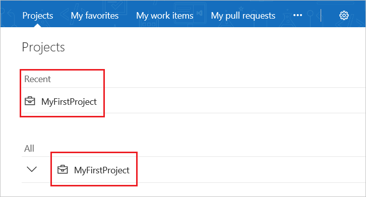
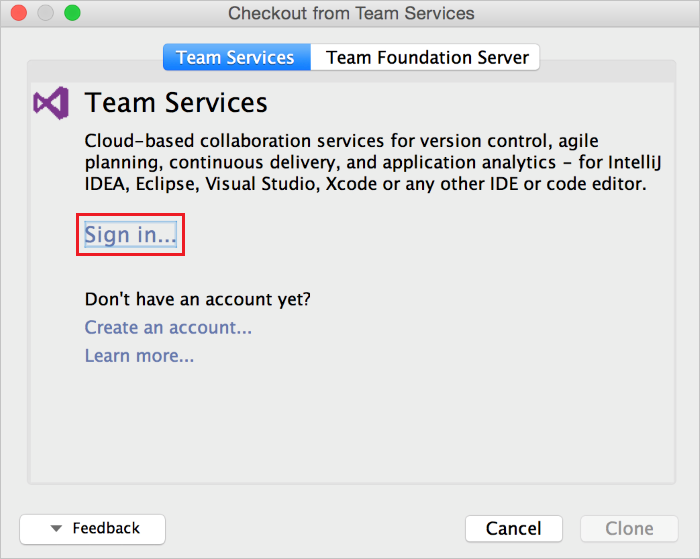
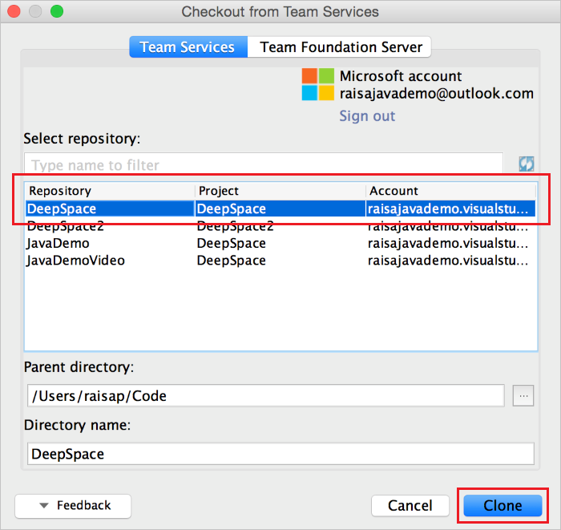
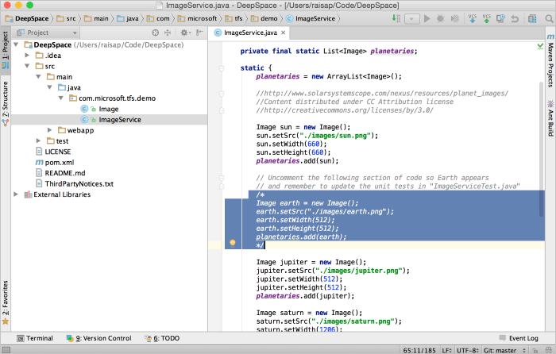
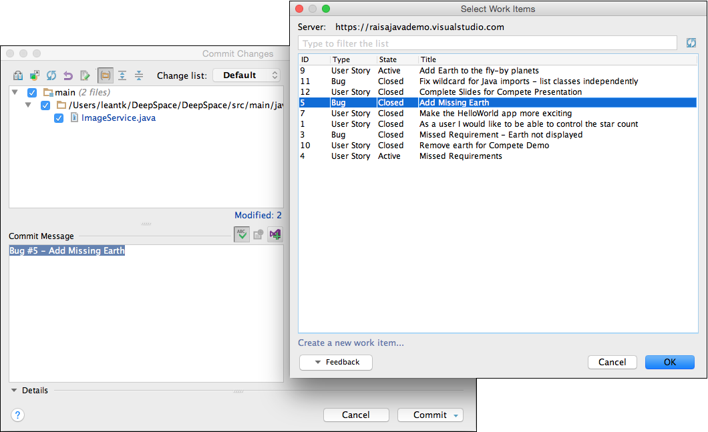
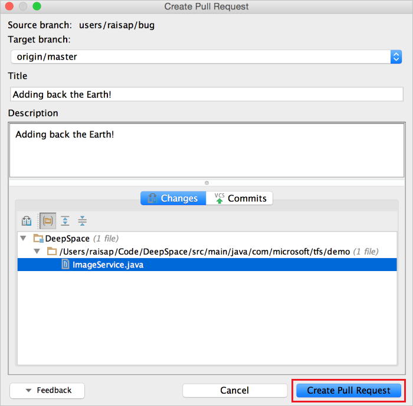
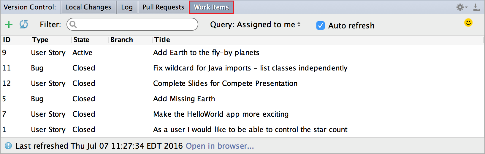

# Azure Repos Plugin for IntelliJ IDEA and Android Studio

#### Azure Repos | TFS 2018 | TFS 2017 | TFS 2015

IntelliJ IDEA is an IDE produced by JetBrains. You can find out more about it at [https://www.jetbrains.com/idea/](https://www.jetbrains.com/idea/).
The Azure Repos Plugin for IntelliJ allows you to connect to your Git repositories on Azure DevOps Services and Team Foundation Server (TFS) in a seamless and intuitive way.
You can also use this plugin to import projects into Azure Repos or create pull requests in your Azure DevOps Services/TFS Git repository.

In this guide, we show you how to create a Git repo using the Azure DevOps Services web portal, add some sample code, and then clone the repo and create pull requests all from within IntelliJ IDEA.

## Prerequisites
To complete the steps in this guide you need:

* An organization in Azure DevOps. If you don't have an organization, you can [sign up](../../organizations/accounts/create-organization.md) for one for free. Each organization includes free, unlimited private Git repositories.
* IntelliJ IDEA installed on your machine. If you don't have it, [get IntelliJ IDEA](https://www.jetbrains.com/idea).
* The Azure Repos plugin for IntelliJ. See [IntelliJ Plugin download page](/azure/devops/java/download-intellij-plug-in) for installation instructions. This plugin is compatible with IntelliJ IDEA Ultimate and Community editions, Android Studio, RubyMine, WebStorm, PhpStorm, PyCharm, AppCode, MPS, 0xDBE, and CLion.
* Git command line tools.
  * To install Git for Windows, including Git Credential Manager, see [Install the Git Credential Manager - Windows](set-up-credential-managers.md#windows).
  * To install Git for macOS and Linux, see [Install the Git Credential Manager - macOS and Linux](set-up-credential-managers.md#macos-and-linux).

## Create a repo
1. Navigate to your project in Azure DevOps by browsing to `https://dev.azure.com/{your organization}` and selecting the name of your project. You can select it from the **All** projects list, or from the **Recent** projects list if you have accessed it recently.

   

  [!INCLUDE [project-urls](../../_shared/project-urls.md)]
  
0. In the **Project** area in the web portal, select **Code**, then select the drop-down next to the current repo name and choose **New Repository**.

      

0. In the **Create a new repository** dialog, verify that Git is the repo type, enter **DeepSpace** for your new repo name, and click **Create**.

  

## Add sample code to your repo

0. Select **Clone** in the upper-right corner of the **Code** window and copy the **Clone URL**.

  

0. Open the Git command window (Git Bash on Git for Windows), navigate to the folder where you want the code from the repo stored on your computer, and run `git clone` followed by the path copied from the **Clone URL** in the previous step, as shown in the following example.

    ```
    git clone https://dev.azure.com/contoso-ltd/MyFirstProject/_git/DeepSpace
    ```

0. Switch to the DeepSpace folder by running the following command.

    ```
    cd DeepSpace
    ```

  Keep this window open as you'll use it for subsequent steps.  

0. Download the [DeepSpace sample code](https://deepspace.blob.core.windows.net/downloads/DeepSpace.zip) and extract it to the local directory on your computer where you cloned the DeepSpace repo.

0. Switch back to your Git command window and run the following command, which commits the sample code files to your local repo.

    ```
    git add --all
    ```

    You may see some warnings stating the line feeds will be replaced with carriage return line feeds (i.e. Warning: LF will be replaced by CRLF). These warnings can be ignored.

0. Commit the files to the local repo by running the following command.

    ```
    git commit -m "Committing DeepSpace sample files"
    ```

0. Run the following command to push the commit of DeepSpace sample files up to your Azure Repos DeepSpace repo.

    ```
    git push
    ```

0. Switch back to the Azure DevOps Services web portal and refresh, and you can see the files that were added.

  


## Clone your repo in IntelliJ
Now that we've got a Git repo with some sample code, let's take a look at how we can work with the code from IntelliJ IDEA. To clone your VSTS repo in IntelliJ is extremely simple. You don't even need to know the URL for the repo.


0. Open IntelliJ IDEA and select **Check out from Version Control** and then choose **VSTS Git**.

  

0. Next just sign in to Azure DevOps Services...

  

0. When you click **Sign in**, you will be presented with the standard Azure DevOps Services sign in UI.
Once signed in, you should see the list of all repositories you have access to on Azure DevOps Services.
Choose the correct repo, **DeepSpace**, and click the **Clone** button.
(You may also want to choose where on your hard drive the repo is cloned to by changing the Parent Directory.)

  

0. After the clone finishes, IntelliJ will ask you if you want to open the project.
Click **Yes** and you should end up with the **DeepSpace** project opened in IntelliJ IDEA.

  


## Make some changes in IntelliJ
0. Start by making sure the project builds using **Build** > **Make project**. If you are prompted to add an SDK for the project,
simply add the latest Java JDK installed on your machine. 

  If you want to run the project now to see what it does,
you can do the following:
  0. From the DeepSpace root folder in your git repo, run the command `mvn jetty:run` (this requires maven to be installed)
  0. From a browser, go to http://localhost:3030/

  You should see stars and planets flying by! If you look closely, you may notice that Earth does not fly by.

0. In our **DeepSpace** example, there are some code sections that have been commented out.
If you open the `src/main/java/com.microsoft.tfs.demo/ImageService.java` file in IntelliJ, you can see one of the sections.

  

  Let's fix this section of code locally. Typically, when working in a Git repo, you should create a branch for your work and commit to that branch. Create a branch through IntelliJ using the built-in **VCS** > **Git** > **Branches** window. When prompted, use the branch name **fixBugs**. Once we have a branch to make our changes in, we can uncomment the code and rebuild the project. If you follow the instructions above to run the program again, you should see the Earth fly by.

0. Now that our changes are built and tested, we can commit them locally using the **VCS** > **Commit Changes** menu. In the commit dialog, you will see a VSTS button above the commit message text box. Click on that button to view your list of work items
assigned to you. Select the **Add Missing Earth** work item and click **OK**. You will see the commit message text box populate with the work item's type, number, and title. This will associate the work item to this commit for traceability in the future.

  

  Note that this change is only done locally; it hasn't been changed in our Azure DevOps Services repo yet.

## Create a pull request
You can push your local branch to the server and create a pull request for your team to review.
Our plugin helps you create the pull request based on your current context within IntelliJ.
This saves you several steps and eliminates the need for you to switch to your browser to create the pull request.

To accomplish this, simply select **VCS** > **Git** > **Create Pull Request**. This opens up the **Create Pull Request** dialog.
This dialog provides a lot of information including the files that have changed and the commits that will be pushed.
You can give the pull request a title and a description.



After you click **Create Pull Request**, you should receive a notification that the pull request was created.
It also contains a link to the pull request in case you want to add specific reviewers or comments.
Once the code reviews are done, you can merge the pull request into master.

## Check build status
After you have merged your changes into master, you can check if your CI build has succeeded from within IntelliJ. In the bottom right corner,
there is an icon that displays your build status to you. If you see a green checkmark, that means your build has succeeded. If you see a red X,
then your build failed. If you see a gray question mark, your build was not found or your credentials may have expired.


You can click on the icon for more options such as viewing build details, queuing a new build, and updating the status manually.


## View Pull Requests and Work Items
Under the **Version Control** menu, a **Pull Request** tab and **Work Items** tab exist to allow you to easily view the information you need without leaving
the IDE. The **Pull Request** tab shows you the current pull requests created by you and assigned to you along with their status. The tab also
gives you the ability to create and/or abandon pull requests.


Under the **Work Items** tab, you can view the work items based on queries that you have created or use the default query to see work items
that are assigned to you. You can also create a branch based off of a work item so that you can associate a work item with branch for
future traceability purposes.




## Next Steps

> [!div class="nextstepaction"]
> [Check out the entire DeepSpace IntelliJ tutorial](/azure/devops/java/labs/e2eintellij)

> [!div class="nextstepaction"]
> [View the IntelliJ plugin FAQ](/azure/devops/java/intellij-faq)

