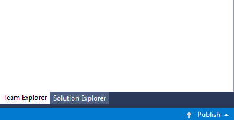

#  Create a new Git repo

#### Azure Repos | TFS 2018 | TFS 2017 | TFS 2015 | VS 2017 | VS 2015 Update 2

A Git repository, or repo, is a folder that you've told Git to help you track file changes in. 
You can have any number of repos on your computer, each stored in their own folder. 
Each Git repo on your system is independent, so changes saved in one Git repo don't affect the contents of another.

A Git repo contains every version of every file saved in the repo. Git saves these files very efficiently, so having a large number of versions doesn't mean that it uses a lot of disk space.
Storing each version of your files helps Git merge code better and makes working with multiple versions of your code quick and easy.

In this tutorial you learn how to:

> [!div class="checklist"]
> * Create a new Git repo

## Video tutorial

The following video explains what Git repos are, and shows you how to create them on your computer using Visual Studio 2015 Update 2.

<iframe src="https://channel9.msdn.com/series/Team-Services-Git-Tutorial/Git-Tutorial-Create-a-Git-repo-in-Visual-Studio-2015/player" width="560" height="315" allowFullScreen frameBorder="0"></iframe>

>[!TIP]
> Working from the command line? You can view our video overview using command line steps on [Channel9](https://channel9.msdn.com/series/Team-Services-Git-Tutorial/Git-Tutorial-Create-a-repo-from-the-command-line).

## Create a new repo

Manage any folder with source code or Visual Studio solution in Git by creating a repo for them. 
Later you can connect this Git repo to a remote Git repo to share your work with others. 

# [Visual Studio](#tab/visual-studio)

### Create a repo 

* [Create a repo from a new solution](#from-a-new-solution)
* [Create a repo from an existing solution](#from-an-existing-solution)
* [Create a repo in an empty folder](#in-an-empty-folder)
* [Connect a local repo to a remote](#connect-a-local-repo-to-a-remote)

### From a new solution

Create a new Git repo for your new Visual Studio solution by selecting **Create new Git repository** when creating the solution:
   
 

### From an existing solution

To create a repo from an existing solution not in version control, select the **Publish** button in the bottom-right of the lower status bar .
This creates a new Git repo in the same directory as your solution and opens up the **Publish** view in Team Explorer so you can [push](pushing.md) your code to Azure Repos or 
another remote Git repository.



### In an empty folder

0. Open the **Connect** view in Team Explorer by choosing **Projects** then **Manage Connections** from the context menu. 
0. Under **Local Git Repositories**, select **New** and enter a folder where the repo will be created. This directory must be empty.  
0. Select **Create** to create the repo.

  </ol>

<a name="remotes" />
### Connect a local repo to a remote

To connect a local repository to a hosted remote Git repository to share your work, go the **Settings** page in Team Explorer. Select **Repository Settings**.
Under **Remotes**, select **Add**.    


Enter `origin` in the **Name** field and enter the [clone URL](clone.md#clone_url) for your repo in the **Fetch** field. 
Make sure that **Push matches fetch** is checked and select **Save**. 

# [Command Line](#tab/command-line)

Open up a command prompt and navigate to the top-level folder containing your project's code, or a new folder if you are starting from scratch. 
Create the Git repository using the `init` command as shown in the following example. After the repo is created, you'll see a confirmation like `Initialized empty Git repository in current directory`. 

```
git init .
```

Work in [branches](branches.md) to keep track of your work and create [commits](commits.md) to snapshot your changes into Git.   

Once you are ready to share your code, [get the clone URL](clone.md#clone_url) for the repository you want to connect to and then set up a remote relationship (in this case, `origin`) so your repo 
can [push](pushing.md) changes to a shared repo.

```
git remote add origin https://dev.azure.com/fabrikam/Fabrikam/_git/FabrikamFiber
```

[Push](pushing.md) your changes to the `origin` repository to share with others:

```
git push origin users/frank/feature
```

> [!NOTE]
> You can also create and get repos from the command line or scripts using the [Azure DevOps Services CLI](/cli/azure/ext/azure-devops/?view=azure-cli-latest).

---

## Next steps

> [!div class="nextstepaction"]
> [Save work with commits](commits.md)
