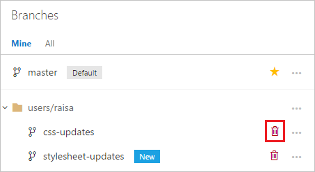

# Delete a Git branch from the web portal

#### Azure Repos | TFS 2018 | TFS 2017

>[!IMPORTANT]
> This topic covers deleting a Git branch via the web in Azure DevOps Services and TFS. If you need to delete a Git branch in your own repo from Visual Studio or the command line,
> follow [these steps](branches.md#delete-a-branch) in the [Azure Repos Git tutorial](gitworkflow.md).

0. Open your repo on the web and [select the **Branches** view](manage-your-branches.md).

0. Locate your branch on the branches page. If you don't see it, select **All** to view all branches and filter the branches using the **Search all branches** box in the upper right.

0. Select the trashcan icon next to the branch you want to delete. 

    
