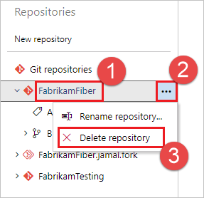
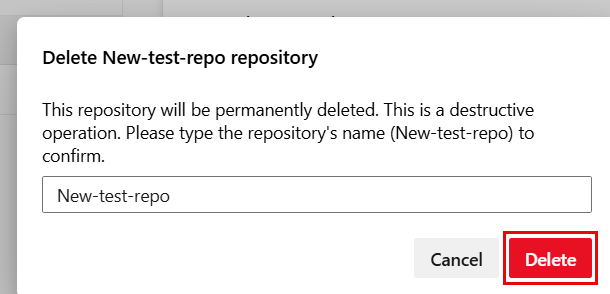
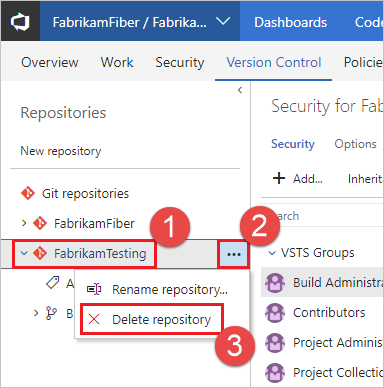

# Delete a Git repo from your project

[!INCLUDE [version-lt-eq-azure-devops](../../includes/version-lt-eq-azure-devops.md)]

Remove unused Git repos from your project when they are no longer needed. The steps in this article show how to delete a Git repo from your Azure DevOps project. If you want to delete the entire project, see [Delete a project](../../organizations/projects/delete-project.md).

> [!IMPORTANT]
> You cannot remove a repo if it is the only Git repo in the Azure DevOps project. If you need to delete the only Git repo in a project, [create a new Git repo](create-new-repo.md) first, then delete the repo.


## Prerequisites 

- You must have [Delete Repository permissions](set-git-repository-permissions.md) to delete a repo from a project. 

::: moniker range="azure-devops"

> [!NOTE]   
> If you want to use the Azure DevOps CLI **az repos delete** command, follow the steps in [Get started with Azure DevOps CLI](../../cli/index.md).
::: moniker-end


## Delete a Git repo from the web 

> [!TIP]
> Consider [renaming](repo-rename.md) the repo and [locking](lock-branches.md) its default branch instead of removing it. The [commit history](review-history.md) of the repo will be lost when it is deleted.
 

# [Browser](#tab/browser)

::: moniker range=">= azure-devops-2019"

1. Select **Repos**, **Files**.

   

2. From the repo drop-down, select **Manage repositories**.

   

3. Select the name of the repository from the **Repositories** list, choose the **...** menu, and then choose **Delete repository**.

   

4. Confirm the deletion of the repository by typing the repo's name and selecting **Delete**.

   

::: moniker-end

::: moniker range="tfs-2018"

1. Select the settings icon in the web to bring up the project administration page and choose **Version Control**.

   

2. Select the Git repository to remove from the list shown and select the **...** next to the name. Choose **Delete Repository**.

   

   >[!NOTE]
   >If the **Repositories** pane is not expanded, select **>** to expand it and display the list of repositories.
   >
   >

3. Confirm the deletion of the repository by typing the repo's name and selecting **Delete**.

   

::: moniker-end

# [Azure DevOps CLI](#tab/azure-devops-cli)

::: moniker range=">= azure-devops-2020" 

You can use Azure DevOps CLI to delete an Azure DevOps Git repository.  


```azurecli
az repos delete --id
                     [--detect {false, true}]
                     [--org]
                     [--project]
                     [--subscription]
                     [--yes] 
```

**Parameters**

|Parameter|Description|
|---------|-----------|
|`id`|ID of the repository. You can get the repository ID by running `az repos list`. |
|`detect`|Automatically detect organization. Accepted values: `false`, `true`.|
|`org`, `organization`|Azure DevOps organization URL. You can configure the default organization by using `az devops configure -d organization=<ORG_URL>`. **Required** if not configured as default or picked up via git config. Example: `https://dev.azure.com/MyOrganizationName/`.|
|`project`, `p`|Name or ID of the project. You can configure the default project using `az devops configure -d project=<NAME_OR_ID>`. **Required** if not configured as default or picked up via git config.|
|`subscription`|Name or ID of subscription. You can configure the default subscription using `az account set -s <NAME_OR_ID>`.|
|`yes`|Don't prompt for confirmation.|


**Example**

The following command deletes the Fabrikam repository, ID `0d58f562-4a10-495d-94d7-7ac61a22d7cc`. This example uses the following default configuration: `az devops configure --defaults organization=https://dev.azure.com/fabrikamprime project="Fabrikam Fiber"`.


```azurecli
az repos delete --id  0d58f562-4a10-495d-94d7-7ac61a22d7cc
Are you sure you want to delete this repository? (y/n): y
```
 

::: moniker-end

::: moniker range="< azure-devops-2020"
[!INCLUDE [temp](../../includes/note-cli-not-supported.md)]
::: moniker-end


***