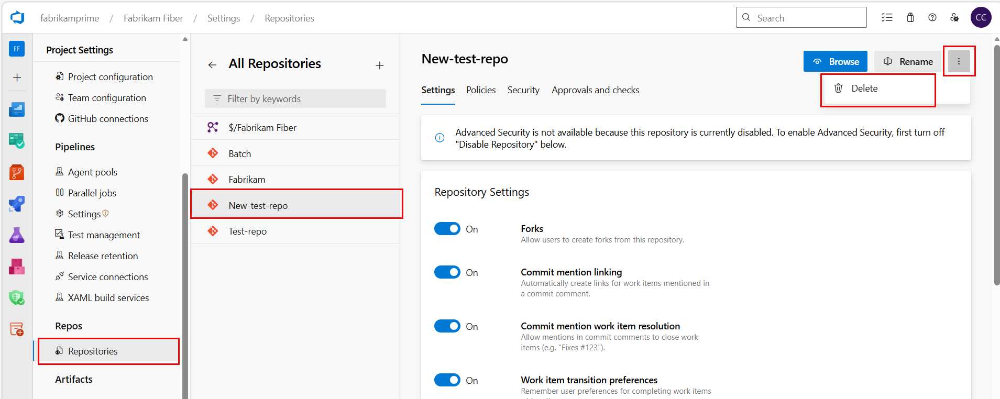
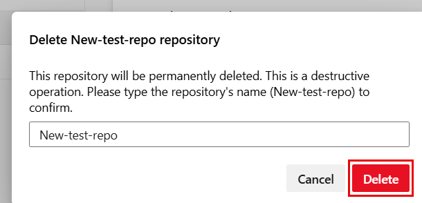

# Delete a Git repo from your project

[!INCLUDE [version-lt-eq-azure-devops](../../includes/version-lt-eq-azure-devops.md)]

Remove unused Git repos from your project when they're no longer needed. The steps in this article show how to delete a Git repo from your Azure DevOps project. If you want to delete the entire project, see [Delete a project](../../organizations/projects/delete-project.md).

> [!IMPORTANT]
> - Deleted Git repositories are soft-deleted and remain in a recycle bin for 30 days. During this period, you can restore a deleted repository by using the [Restore Repository From Recycle Bin](/rest/api/azure/devops/git/repositories/restore-repository-from-recycle-bin) REST API. After 30 days, repositories are permanently deleted and can't be recovered.
> - You can't remove a repo if it's the only Git repo in the Azure DevOps project. If you need to delete the only Git repo in a project, [create a new Git repo](create-new-repo.md) first, and then delete the repo.

## Prerequisites

| Category | Requirements |
|-------------|-------------|
| Permissions | [Delete Repository permission](set-git-repository-permissions.md) |

::: moniker range="azure-devops"

> [!NOTE]
> To use the Azure DevOps CLI `az repos delete` command, see [Get started with Azure DevOps CLI](../../cli/index.md).
::: moniker-end

## Delete a Git repo from the web

> [!TIP]
> Instead of deleting a repo, consider [renaming](repo-rename.md) it with an `_archived` prefix and [locking](lock-branches.md) its default branch. This approach retires the repo from active use while preserving commit history, pull request records, and existing links.

# [Browser](#tab/browser)

1. Sign in to your project (`https://dev.azure.com/{Your-Organization}/{Your-Project}`).
1. Select **Project settings**.
1. Select **Repositories** and the name of the repository from the **Repositories** list. Select the ellipsis (**...**) for more actions, and then select **Delete**.

   

1. To confirm the deletion of the repository, enter the name of the repo and select **Delete**.

   

   The repository is removed from the **Repositories** list. It remains in the recycle bin for 30 days before permanent deletion.

# [Azure DevOps CLI](#tab/azure-devops-cli)

::: moniker range="azure-devops" 

You can use Azure DevOps CLI to delete an Azure DevOps Git repository.  

```azurecli
az repos delete --id
                     [--detect {false, true}]
                     [--org]
                     [--project]
                     [--subscription]
                     [--yes] 
```

#### Parameters

| Parameter | Description |
|---------|-----------|
| `id` | ID of the repository. You can get the repository ID by running `az repos list`. |
| `detect` | Automatically detect organization. Accepted values are `false` and `true`. |
| `org`, `organization` | Azure DevOps organization URL. You can configure the default organization by using `az devops configure -d organization=<ORG_URL>`. *Required* if not configured as default or picked up via `git config`. An example is `https://dev.azure.com/MyOrganizationName/`. |
| `project`, `p` | Name or ID of the project. You can configure the default project by using `az devops configure -d project=<NAME_OR_ID>`. *Required* if not configured as default or picked up via `git config`. |
| `subscription` | Name or ID of the subscription. You can configure the default subscription by using `az account set -s <NAME_OR_ID>`. |
| `yes` | Don't prompt for confirmation. |

#### Example

The following command deletes the Fabrikam repository, ID `0d58f562-4a10-495d-94d7-7ac61a22d7cc`. This example uses the following default configuration: `az devops configure --defaults organization=https://dev.azure.com/fabrikamprime project="Fabrikam Fiber"`.

```azurecli
az repos delete --id  0d58f562-4a10-495d-94d7-7ac61a22d7cc
Are you sure you want to delete this repository? (y/n): y
```
 

::: moniker-end

::: moniker range="< azure-devops"
[!INCLUDE [temp](../../includes/note-cli-not-supported.md)]
::: moniker-end

***

## Related content

- [Restore repository from recycle bin REST API](/rest/api/azure/devops/git/repositories/restore-repository-from-recycle-bin)
- [Get recycle bin repositories REST API](/rest/api/azure/devops/git/repositories/get-recycle-bin-repositories)
- [Rename a Git repo](repo-rename.md)
- [Delete a project](../../organizations/projects/delete-project.md)
- [Restore a deleted wiki](../../project/wiki/restore-deleted-wiki.md)
