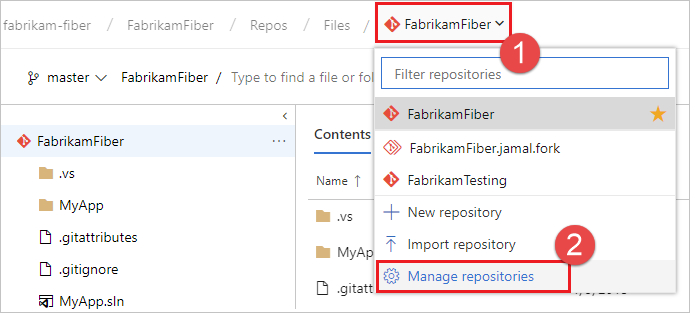
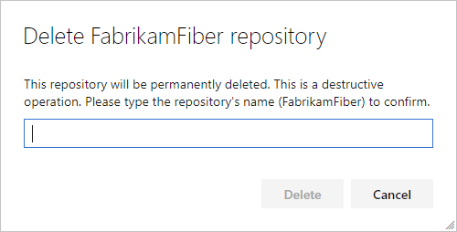

# Delete a Git repo from your project
#### Azure Repos | TFS 2018 | TFS 2017 | TFS 2015

Remove unused Git repos from your project when they are no longer needed. 

>[!TIP]
> Consider [renaming](repo-rename.md) the repo and [locking](lock-branches.md) its default branch instead of removing it. The [commit history](review-history.md) of the repo will be lost when it is deleted.

>[!IMPORTANT]
> You cannot remove a repo if it is the only Git repo in the Project. If you need to delete the only Git repo in a Project, [create a new Git repo](create-new-repo.md) first, then delete the repo.
>      
> You must have [Delete Repository permissions](../../organizations/security/set-git-tfvc-repository-permissions.md#git-repository) to delete a repo from a project. 

>[!NOTE]
>The steps in this article show how to delete a Git repo from your project. If you want to delete the entire project, see [Delete a project](../../organizations/projects/delete-project.md).

## Delete a Git repo from the web 

::: moniker range=">= azure-devops-2019"

1. Select **Repos**, **Files**.

  

1. From the repo drop-down, select **Manage repositories**.

  

1. Select the name of the repository from the **Repositories** list, choose the **...** menu, and then choose **Delete repository**.

  

1. Confirm the deletion of the repository by typing the repo's name and selecting **Delete**.

  

::: moniker-end

::: moniker range="<= tfs-2018"

1. Select the settings icon in the web to bring up the project administration page and choose **Version Control**.

   

1. Select the Git repository to remove from the list shown and select the **...** next to the name. Choose **Delete Repository**.

   

   >[!NOTE]
   >If the **Repositories** pane is not expanded, select **>** to expand it and display the list of repositories.
   >
   >

1. Confirm the deletion of the repository by typing the repo's name and selecting **Delete**.

  

::: moniker-end
