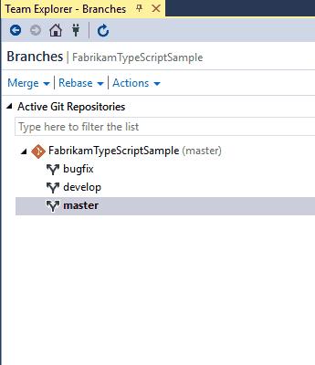

# Delete a Git branch

[!INCLUDE [version-lt-eq-azure-devops](../../includes/version-lt-eq-azure-devops.md)]
[!INCLUDE [version-vs-gt-eq-2019](../../includes/version-vs-gt-eq-2019.md)]

This article describes how to delete a Git branch by using two different methods: in Visual Studio and from the command line.

> [!NOTE] 
> Deleting a branch in your local repo doesn't remove the branch on the remote.

#### [Browser](#tab/Browser/)

1. View your repo's branches by selecting **Repos** > **Branches** while viewing your repo on the web.

   :::image type="content" source="media/repos-navigation/repos-branches.png" alt-text="Screenshot that shows how to access your branches.":::

2. Select the **More** options button at the end of the row of the branch you want to delete.

   :::image type="content" source="media/delete-git-branch/more-options.png" alt-text="Screenshot that shows how to access the menu to delete a branch.":::

3. In the options menu, select **Delete branch**.

4. In the **Delete branch** dialog box, select **Delete**.

#### [Visual Studio](#tab/visual-studio/)

To delete a branch, follow these steps:

1. From the **Git** menu on the menu bar, choose **Manage Branches**.

1. Under **Branches**, right-click a branch and select **Delete**. If you have unpublished changes, Visual Studio asks if you're sure you want to delete the branch.

Visual Studio 2019 version 16.8 and later versions provides a Git version control experience while maintaining the **Team Explorer** Git user interface. To use **Team Explorer**, uncheck **Tools** > **Options** > **Preview Features** > **New Git user experience** from the menu bar. You can exercise Git features from either interface interchangeably.

1. Open up Team Explorer and go to the **Branches** view.
2. Locate the branch you want to delete. Remember that you can't delete a branch you're currently working in.
3. Right-click the branch name and select **Delete**. Visual Studio will ask if you're sure you want to delete the branch if you have unpublished changes.

    

You can delete a remote branch using the same method. Locate the tree for the remote in Team Explorer's **Branches** view (such as `remotes/origin`), right-click, and select **Delete**.

#### [Command Line](#tab/command-line/)
Delete a local branch using the `git branch -d` command while checked out to a different branch.

```
git branch -d <branch_name>
```

Deleting a remote branch requires use of the `git push` command using the `--delete` option.

```
git push origin --delete <branch_name>
```

* * *

## Next Steps

> [!div class="nextstepaction"]
> [Restore a deleted branch](./restore-deleted-branch.md)