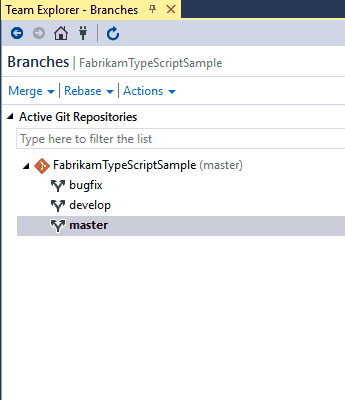

# Delete a Git branch

[!INCLUDE [version-lt-eq-azure-devops](../../includes/version-lt-eq-azure-devops.md)]
[!INCLUDE [version-vs-gt-eq-2019](../../includes/version-vs-gt-eq-2019.md)]

This article describes how to delete local and remote Git branches by using the Azure DevOps web portal, Visual Studio, or the Git command line.

> [!NOTE] 
> Deleting a branch in your local repo doesn't remove the branch on the remote.

## Prerequisites

[!INCLUDE [azure-repos-prerequisites](includes/azure-repos-prerequisites.md)]

The following requirements depend on whether you delete a local or remote branch:

| Category | Requirements |
|----------|--------------|
| **Local branch** | Check out a different branch before you delete the branch. Azure DevOps permissions, policies, and locks don't apply when you delete only a local branch. |
| **Remote branch permission** | Have the branch-level [**Force push (rewrite history, delete branches and tags)** permission](branch-permissions.md#set-permissions) set to **Allow**. This requirement applies whether you delete the remote branch in the web portal, Visual Studio, or from the command line. Branch creators receive this permission by default unless the permission assignment is changed. |
| **Required branch policies** | [Disable or remove all required branch policies](branch-policies.md) before you delete the branch. You need the **Edit policies** permission or membership in the **Project Administrators** security group to manage branch policies. |
| **Default branch** | [Set another branch as the repository's default branch](change-default-branch.md) before you delete the current default branch. |
| **Locked branch** | [Unlock the branch](lock-branches.md) before you delete it. To unlock a branch that another user locked, you need the **Remove others' locks** permission. |

If **Delete branch** isn't available, check your effective **Force push** permission and verify that the branch has no required policies, isn't the repository's default branch, and isn't locked.

## Delete branch

#### [Browser](#tab/Browser/)

1. View your repo's branches by selecting **Repos** > **Branches** while viewing your repo on the web.

   :::image type="content" source="media/repos-navigation/repos-branches.png" alt-text="Screenshot that shows how to access your branches.":::

2. Select the **More** options button at the end of the row of the branch you want to delete.

   :::image type="content" source="media/delete-git-branch/more-options.png" alt-text="Screenshot that shows how to access the menu to delete a branch.":::

3. In the options menu, select **Delete branch**.

4. In the **Delete branch** dialog box, select **Delete**.

#### [Visual Studio](#tab/visual-studio/)

To delete a branch, follow these steps:

1. From the **Git** menu on the menu bar, choose **Manage Branches**.

1. Under **Branches**, right-click a branch and select **Delete**. If you have unpublished changes, Visual Studio asks if you're sure you want to delete the branch.

Visual Studio 2019 version 16.8 and later versions provides a Git version control experience while maintaining the **Team Explorer** Git user interface. To use **Team Explorer**, uncheck **Tools** > **Options** > **Preview Features** > **New Git user experience** from the menu bar. You can exercise Git features from either interface interchangeably.

1. Open up Team Explorer and go to the **Branches** view.
2. Locate the branch you want to delete. Remember that you can't delete a branch you're currently working in.
3. Right-click the branch name and select **Delete**. Visual Studio will ask if you're sure you want to delete the branch if you have unpublished changes.

    

You can delete a remote branch using the same method. Locate the tree for the remote in Team Explorer's **Branches** view (such as `remotes/origin`), right-click, and select **Delete**.

#### [Command Line](#tab/command-line/)
Delete a local branch using the `git branch -d` command while checked out to a different branch.

```
git branch -d <branch_name>
```

Deleting a remote branch requires use of the `git push` command using the `--delete` option.

```
git push origin --delete <branch_name>
```

* * *

## Next steps

> [!div class="nextstepaction"]
> [Restore a deleted branch](./restore-deleted-branch.md)

## Related content

- [Set branch permissions](branch-permissions.md)
- [Set and manage branch policies](branch-policies.md)
- [Change the default branch](change-default-branch.md)
- [Lock a branch](lock-branches.md)
