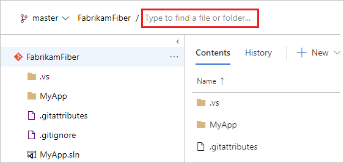
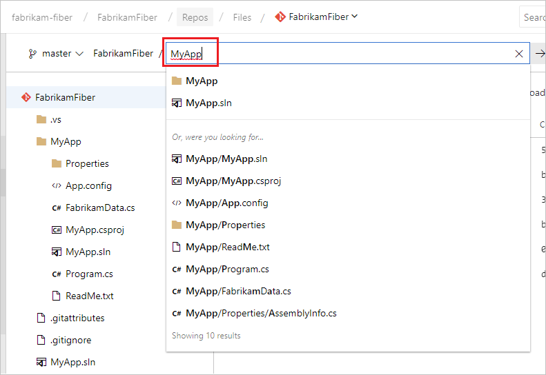

# Find a file or folder in your Git repository

[!INCLUDE [version-lt-eq-azure-devops](../../includes/version-lt-eq-azure-devops.md)]

Quickly find and go to a file or folder in your Git repository by using the path control on the **Files** page.

## Usage

While you browse your Git repository, start typing in the path control box to search for the file or folder that you're looking for. The interface lists the results that start from your current folder followed by matching items from across the repo.

### Hot key navigation

::: moniker range="<=azure-devops"

To open the **Find a File** experience, use the **t** shortcut on the keyboard on the **Files** or **Commits** pages in the **Repos** view. Use the Up and Down arrows to cycle through the results, and select **Enter** to open a result. To close the **Find a File** experience, select **Esc**.

::: moniker-end