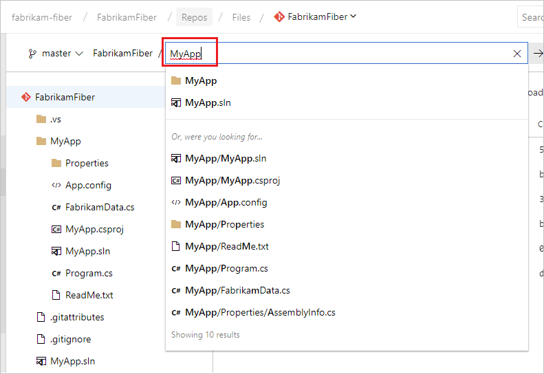

# Find a file or folder in your Git repository

#### Azure Repos | TFS 2018 | TFS 2017

Quickly find and navigate to a file or folder in your Git repository using the path control in the **Files** page.

## Usage

While browsing your Git repository, start typing in the path control box to search for the file or folder you are looking for. The interface lists the results starting from your current folder followed by matching items from across the repo. 

### Hotkey navigation

::: moniker range=">= azure-devops-2019"

Launch the Find a File experience from the keyboard with the `t` shortcut from the **Files** or **Commits** pages in the **Repos** view. Use the up and down arrows to cycle through the results, and click or press Enter to open a result. Press `Esc` to close the Find a File experience.

::: moniker-end

::: moniker range="<= tfs-2018"

Launch the Find a File experience from the keyboard with the `t` shortcut from the **Files** or **History** tabs in the **Files** page. Use the up and down arrows to cycle through the results, and click or press Enter to open a result. Press `Esc` to close the Find a File experience.

::: moniker-end

