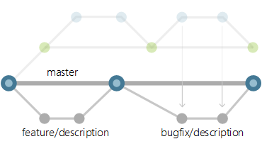

# Adopt a Git branching strategy

Distributed version control systems like Git give individuals wide flexibility in how they use version control to share and manage code.
Your team should find a balance between this flexibility and the need to collaborate and share code in a consistent manner.
   
Team members publish, share, review, and iterate on code changes through Git branches shared with others. 
Adopt a branching strategy for your team so that you collaborate better and spend less time managing version control and more time developing code. 

The following branching strategies are based on the way we use Git here at Microsoft. For more information, see [How we use Git at Microsoft](/azure/devops/learn/devops-at-microsoft/use-git-microsoft).

## Keep your branch strategy simple

Keep your branch strategy simple by building your strategy from these three concepts:

0. Use feature branches for all new features and bug fixes.
0. Merge feature branches into the master branch using pull requests. 
0. Keep a high quality, up-to-date master branch.  

A strategy that extends these concepts and avoids contradictions will result in a version control workflow for your team that is consistent and easy to follow. 

### Use feature branches for your work

Develop your features and fix bugs in feature branches (also known as topic branches) based off your master branch. 
Feature branches isolate work in progress from the completed work in the master branch.
Git branches are inexpensive to create and maintain, so even small fixes and changes should have their own feature branch. 

Creating feature branches for all your changes makes reviewing history very simple. Look at the commits made in the branch and look at the pull request that merged the branch. 

#### Name your feature branches by convention

Use a consistent naming convention for your feature branches to identify the work done in the branch.
You can also include other information in the branch name, such as who created the branch.
    
Some suggestions for naming your feature branches: 
   
- `users/username/description`   
- `users/username/workitem`  
- `bugfix/description` 
- `features/feature-name` 
- `features/feature-area/feature-name`  
- `hotfix/description`  

::: moniker range=">= tfs-2018" 
 
>[!NOTE]
>For information on setting policies to enforce a branch naming strategy, see [Require branch folders](require-branch-folders.md).

::: moniker-end 

#### Use feature flags to manage long-running branches
 
Long-lived feature branches present problems when you need to build code on top of the branch before the work in the branch is finished. 
Merge unfinished features into the master branch so others can build off their work, but keep them hidden from your users and testers behind feature flags.
Enable the flag in development to use the feature without the changes affecting anyone else. 
Once the feature is finished, you can remove the flags or use them to roll out the feature to select users and testers.

[Learn more](http://martinfowler.com/articles/feature-toggles.html) about using feature flags in your code.

### Review and merge code with pull requests

The review that takes place in a pull request is critical for improving code quality.
Only merge branches through pull requests that pass your review process. Avoid merging branches to the master branch without a pull request.
    
Reviews in pull requests take time to complete, so your team should agree on what's expected from pull request creators and reviewers. 
Distribute reviewer responsibilities to share ideas across your team and spread out knowledge of your codebase.

Some suggestions for successful pull requests:    
   
- Two reviewers is an optimal number [based on research](https://www.microsoft.com/research/publication/convergent-software-peer-review-practices/). 
- If your team already has a code review process, bring pull requests into what you're already doing.
- Take care assigning the same reviewer(s) to a large number of pull requests. Pull requests work better when reviewer responsibilities are shared across the team.
- Provide enough detail in the description to quickly bring reviewers up to speed with your changes.   
- Include a build or linked version of your changes running in a staged environment with your pull request so others can easily test the changes.   
  

### Keep a high quality, up-to-date master branch

The code in your master branch should pass tests, build cleanly, and always be up to date. 
Your master branch needs these qualities so that feature branches created by your team start from a known good version of code.

::: moniker range=">= tfs-2015" 

Set up a [branch policy](branch-policies.md) for your master branch that:   

0. Requires a pull request to merge code. This prevents direct pushes to the master branch and ensures discussion of proposed changes.
0. Automatically adds reviewers when a pull request is created. The added team members review the code and comment on the changes in the pull request.
0. Requires a successful build to complete a pull request. Code merged into the master branch should build cleanly.    

>[!TIP]
>The build pipeline for your pull requests should be quick to complete, so it doesn't interfere with the review process. 

::: moniker-end 

## Manage releases

Use release branches to coordinate and stabilize changes in a release of your code.
This branch is long-lived and isn't merged back into the master branch in a pull request, unlike the feature branches.
Create as many release branches as you need, but keep in mind that each active release branch represents another version of the code you'll need to support. 
Lock release branches when you're ready to stop supporting a particular release.

### Use release branches 

Create a release branch from the master branch as you get close to your release or other milestone, such as the end of a sprint.
Give this branch a clear name associating it with the release, for example `release/20`.   

Create branches to fix bugs from the release branch and merge them back into the release branch in a pull request.  
   

### Port changes back to the master branch

Bring over changes made in your release branch into your master branch to prevent regression in your code.
Port your changes from your release branch into a new feature branch to bring them back into the master branch.
Use cherry-picking instead of merging so that you have exact control over which commits are ported back to the master branch.
Merging the feature branch into the master branch can bring over release-specific changes you don't want in the master branch.

Update the master branch with a change made in the release branch with these steps:

0. Create a new feature branch off the master branch to port the changes.
0. Cherry-pick the changes from the release branch to your new feature branch.
0. Merge the feature branch back into the master branch in a second pull request. 
   

This release branch workflow keeps the pillars of the basic workflow intact: feature branches, pull requests, and a strong master branch that always has the latest version of the code. 

### Why not use tags for releases?

Other branching workflows use Git [tags](https://git-scm.com/book/en/v2/Git-Basics-Tagging) to mark a specific commits as a release.
Tags are useful for marking points in your history as important, but tags introduce extra steps in your workflow that aren't necessary if you are using branches for your releases.

Tags are maintained and pushed separately from your commits.
Team members can easily miss tagging a commit and then have to go back through the history afterwards to fix the tag. 
You can also forget the extra step to push the tag, leaving the next developer working from an older version of the code when supporting the release.   

The release branch strategy extends the basic feature branch workflow to handle releases.
Your team doesn't have to adopt any new version control process other than the cherry-pick to port changes.

## Manage deployments

You can handle multiple deployments of your code in the same way you handle multiple releases.
Create a clear naming convention (such as `deploy/performance-test`) and treat the environment branches like release branches.
Your team should agree on a process to update deployment branches with the code from your master branch. 
Cherry-pick bugfixes in the deployment branch back to the master branch using the same steps as porting changes from a release branch.

An exception to this recommendation is if you are using a form of continuous deployment. 
Use [Azure Pipelines or Build &amp; Release in TFS](../../pipelines/index.md) when working with continuous deployment to promote builds from your master branch to your deployment targets.

## Videos
> [!VIDEO https://www.youtube.com/embed/t_4lLR6F_yk?start=0]
