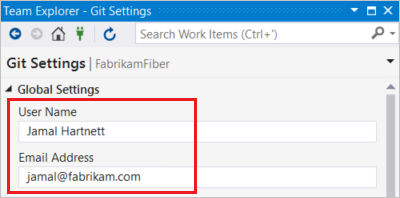
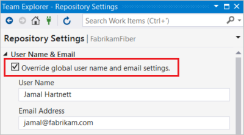

# Git preferences and settings in Visual Studio

#### Azure Repos | TFS 2018

Visual Studio allows you to configure and view common Git settings and preferences, such as your name and email address, your preferred diff and merge tools, and more. These preferences and settings can be viewed and configured in **Team Explorer** on either the **Global Settings** page (applies to all your repositories) or the **Repository Settings** page (applies to the current repository).

Visual Studio allows you to configure two types of settings:

- [Git settings](#git-settings) - The settings in this section correspond to Git settings that are saved in Git configuration files. These settings can be viewed and modified in Visual Studio, but are managed by Git configuration files.
- [Visual Studio settings](#visual-studio-settings) - The settings in this section configure Git-related settings and preferences that are managed by Visual Studio.

This article shows you how to configure and view Git settings and preferences in Visual Studio, and where applicable shows you the Git command line equivalents.

## How to configure settings


0. To configure Git settings in Visual Studio, choose **Settings** from Team Explorer.

    

0. Choose **Global Settings** or **Repository Settings** to view and configure global-level or repository-level settings.

	

0. Visual Studio allows you to configure several common Git settings, as described in the following sections of this article. After configuring your desired settings, select **Update** to save the updated settings.

    


## Git settings

Visual Studio allows you to configure and check some of the most common Git configuration settings. The settings in this section can be viewed and modified in Visual Studio, but are managed by Git configuration files.

- [Name and email](#name-and-email)
- [Prune remote branches during fetch](#prune-remote-branches-during-fetch)
- [Rebase local branch when pulling](#rebase-local-branch-when-pulling)
- [Cryptographic network provider](#cryptographic-network-provider)
- [Ignore & attributes files](#ignore--attributes-files)
- [Diff & merge Tools](#diff--merge-tools)
- [Remotes](#remotes)
- [Other](#other)

>[!NOTE]
>Git settings configured in Visual Studio's **Global Settings** correspond to settings in Git's user-specific configuration file, and the settings in **Repository Settings** correspond to settings in the repository-specific configuration file. For more information about Git configuration, see the [Pro Git chapter on customizing Git](https://git-scm.com/book/en/v2/Customizing-Git-Git-Configuration), the [git-config documentation](https://git-scm.com/docs/git-config), and the [Pro Git reference on configuration files](https://git-scm.com/docs/git-config#FILES). To configure Git settings not exposed in Visual Studio, use the `git config` command to write a value to your configuration files: `git config [--local|--global|--system] section.key value`.

### Name and email
The name and email that you provide will be used as the committer information for any commit you make. This setting is available at both global and repository scopes, and corresponds to the `git config` [user.email](https://git-scm.com/docs/git-config#git-config-useremail) and [user.name](https://git-scm.com/docs/git-config#git-config-username) settings.

# [Visual Studio](#tab/visual-studio)
0. In Team Explorer, go to **Settings**. To set your user name and email at the global level, go to **Global Settings**; to set these at the repository level, go to **Repository Settings**.

0. Provide your user name and email, then choose **Update** to save. 

	

    Note that for **Repository Settings**, you'll first need to check **Override global user name and email settings**.

	

# [Command Line](#tab/command-line)
To set your user name, open a command prompt, navigate to the repository, and run:
```
git config user.name "Jamal Hartnett"
```

By default, this command writes to the local repository configuration file. To write to other files, pass one of the following options: `--system`, `--global`, or `--file <filename>`.

For example, to write to the global configuration file, run:
```
git config --global user.name "Jamal Hartnett"
```

Similarly, to set your email, run `git config --global user.email "jamal@fabrikam.com"`.

---


### Prune remote branches during fetch
Pruning removes remote-tracking branches that no longer exist on the remote and helps you keep your branches list clean and up to date. This setting is available at both global and repository scopes, and corresponds to the `git config` [fetch.prune](https://git-scm.com/docs/git-config#git-config-fetchprune) setting.


We recommend setting this option to **True** at the global level. Valid settings are:

- True (recommended)
- False
- Unset (default)

# [Visual Studio](#tab/visual-studio)
Requires Visual Studio 2017 Update 5 and later.
0. In Team Explorer, go to **Settings**. Go to **Global Settings** and set **Prune remote branches during fetch** to **True** (recommended). Select **Update** to save.

	

# [Command Line](#tab/command-line)
To prune branches on every `fetch`, open a command prompt, and run:
```
git config --global fetch.prune true
```

This command will set fetch.prune to true in your global configuration file (recommended).

---

### Rebase local branch when pulling
Rebasing sets aside the changes made by commits in the current branch that are not in the upstream branch, resets the current branch to the upstream branch, 
then applies the changes that were set aside. This setting is available at both global and repository scopes, and corresponds to the `git config` [pull.rebase](https://git-scm.com/docs/git-config#git-config-pullrebase) setting. Valid settings are:

- True: Rebase current branch on top of upstream branch after fetch.
- False: Merge the current branch into the upstream branch.
- Unset (default): Unless specified in other configuration files, merge the current branch into the upstream branch.
- Interactive: Rebase in interactive mode.
- Preserve: Rebase without flattening locally created merge commits.

# [Visual Studio](#tab/visual-studio)
Requires Visual Studio 2017 Update 5 and later.
0. In Team Explorer, go to **Settings**. Go to **Global Settings** to configure this option at the global level; go to **Repository Settings** to configure this option at the repo level.

0. Set **Rebase local branch when pulling** to the desired setting, and select **Update** to save.

	

Note that it is not possible to configure `pull.rebase` to **Interactive** in Visual Studio. Visual Studio does not have interactive rebase support.
To configure `pull.rebase` to use interactive mode, use the command line.

# [Command Line](#tab/command-line)
To configure pull.rebase, open a command prompt, and run:
```
git config [--local|--global|--system] pull.rebase [true|false|interactive|preserve]
```

---

### Cryptographic network provider

Cryptographic network provider is a Git configuration setting at global scope that configures which SSL backend to use at runtime, and corresponds to the `git config` [http.sslBackend](https://github.com/git-for-windows/repos/git/commit/d81216ee4dd46ae59a388044d1266d6fa9030c19) setting. The values are:

- OpenSSL: Use [OpenSSL](https://www.openssl.org/) for TLS and SSL protocols.
- Secure Channel: Use [Secure Channel (schannel)](https://msdn.microsoft.com/library/windows/desktop/aa380123) for TLS and SSL protocols. Schannel is the native
Windows solution, accessing the Windows Credential Store, thereby
allowing for enterprise-wide management of certificates.
- Unset (default): If this setting is unset, OpenSSL is the default.

# [Visual Studio](#tab/visual-studio)
Requires Visual Studio 2017 Update 7 and later.

0. In Team Explorer, go to **Settings**. Go to **Global Settings** to configure this setting.

0. Set **Cryptographic network provider** to the desired value, and select **Update** to save.


# [Command Line](#tab/command-line)

To configure http.sslBackend, open a command prompt, and run:
```
git config --global http.sslBackend [openssl|schannel]
```

---

### Ignore & attributes files

The **Ignore & attributes files** section is available at repository scope and allows you to view and edit the [gitignore](https://git-scm.com/docs/gitignore) and [gitattributes](https://git-scm.com/docs/gitattributes) files for your repository.


### Diff & merge Tools
Git will show diffs and merge conflicts in your preferred tools. The settings in this section correspond to the `git config` [diff.tool](https://git-scm.com/docs/git-config#git-config-difftool) and [merge.tool](https://git-scm.com/docs/git-config#git-config-mergetool) settings. You can configure Git to use Visual Studio as your merge or diff tool in **Global Settings** and **Repository Settings** by selecting **Use Visual Studio**. To configure other diff and merge tools, use `git config` with the [diff.tool](https://git-scm.com/docs/git-config#git-config-difftool) or [merge.tool](https://git-scm.com/docs/git-config#git-config-mergetool) switch.


### Remotes

The **Remotes** section allows you to configure the remotes for this repository. This setting corresponds to the [git remote](https://git-scm.com/docs/git-remote) command and is available at the repository scope.


### Other

The **Other** section allows you to view the Git configuration settings for this repository, with the exception of settings that are displayed and managed in the Visual Studio Git settings pane.


To view all of your Git configuration settings, you can open and view the configuration files themselves, or you can run `git config --list` to display the settings.


## Visual Studio settings

The following settings manage Git-related preferences in Visual Studio, and are managed by Visual Studio instead of Git configuration files. All of the settings in this section are configured on the **Global Settings** page.

- [Default repository location](#default-repository-location)
- [Enable download of author images from 3rd party source](#enable-download-of-author-images-from-3rd-party-source)
- [Commit changes after merge by default](#commit-changes-after-merge-by-default)
- [Enable push --force](#enable-push---force)

### Default repository location

**Default repository location** configures the default folder in which repositories are cloned.


### Enable download of author images from 3rd party source

Enable download of author images from 3rd party source is a Visual Studio specific setting at global scope. When checked, author images are downloaded from the [Gravatar image service](http://en.gravatar.com/), if available, and displayed in the commit and history views.


>[!IMPORTANT]
>In order to provide author images in the Commit and History views, the tool creates an MD5 hash for the author email addresses stored in the active repository. This hash is then sent to Gravatar to find a matching hash value for users that have previously signed up for the service. If a match is found, the user image will be retrieved from the service and displayed in Visual Studio. Users that have not configured the service will return a randomly generated image. Note, email addresses are not recorded by Microsoft, nor are they ever shared with Gravatar or any other third party.

### Commit changes after merge by default

When **Commit changes after merge by default** is enabled, Git automatically creates a new commit when a branch is merged with the current branch.


- When checked, `git merge` commands issued by Visual Studio are run with the `--commit` option.
- When unchecked, `git merge` commands issued by Visual Studio are run with the `--no-commit --no-ff` options.

For more information on these options, see [--commit and --no-commit](https://git-scm.com/docs/git-merge#git-merge---commit) and [--no-ff](https://git-scm.com/docs/git-merge#git-merge---no-ff).


### Enable push --force
Requires Visual Studio 2017 and later.

When enabled, this setting allows you to `push --force` from within Visual Studio. By default **Enable push --force** is disabled.


>[!WARNING]
>Use `push --force` with caution as it can overwrite changes that have been pushed to the branch since your last pull. For more information, see [push --force](https://git-scm.com/docs/git-push#git-push---force).

