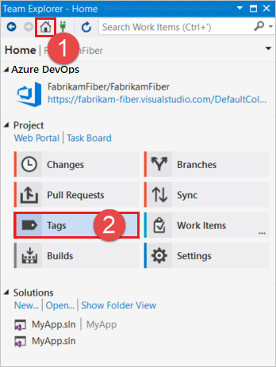
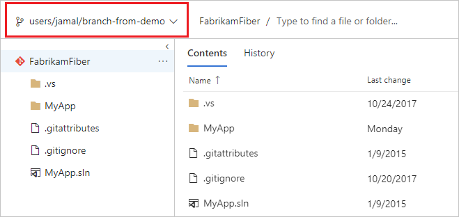

# Working with Git tags

#### Azure Repos | TFS 2018 | TFS 2017 | VS 2017 | VS 2015

Azure DevOps Services and TFS support both annotated and lightweight tags. Lightweight tags are a pointer to specific commit, while annotated tags contain more information such as the tagger, message, and date. You can create annotated tags using the web portal, and starting with Visual Studio 2017 Update 6, you can create both lightweight and annotated tags from within Visual Studio. For more information on Git tags, see [2.6 Git Basics - Tagging](https://git-scm.com/book/en/v2/Git-Basics-Tagging) from the Pro Git book.

This article provides an overview of working with Git tags in Azure DevOps Services, TFS, and Visual Studio.

>[!IMPORTANT]
>The **Tags** view in Visual Studio was introduced in Visual Studio 2017 Update 6. If you are on versions earlier than this, you can view and create tags from the history and commit details views starting with Visual Studio 2015, but you won't be able to perform the operations in the **Tags** view as described in this article.

## View and filter tags

::: moniker range=">= azure-devops-2019"

You can view tags in the **Tags** view and in the **Commits** view in the web portal.

[!INCLUDE [project-urls](../../_shared/project-urls.md)]

### View tags in the Tags view

1. To view the tags in your repo, navigate to your project in the web portal, choose **Repos**, **Tags**, and select the desired repo.

  

  Annotated tags are displayed with a tag name, message, commit, tagger, and creation date. Lightweight tags are displayed with a tag name and commit.

1. To filter the list of tags, type a search term into the **Search tag name** box and press **Enter**.

  

### View tags in the Commits view

1. To view tags for a specific branch in the **Commits** view, navigate to your repo in the web portal, choose **Repos**, **Commits**, and select your branch.

  

::: moniker-end

::: moniker range="<= tfs-2018"

You can view tags in the **Tags** view and in the **Commits** view in the web portal.

[!INCLUDE [project-urls](../../_shared/project-urls.md)]

### View tags in the Tags view

1. To view the tags in your repo, navigate to your project in the web portal, choose **Code**, select the desired repo, and choose **Tags**.

  

  Annotated tags are displayed with a tag name, message, commit, tagger, and creation date. Lightweight tags are displayed with a tag name and commit.

1. To filter the list of tags, type a search term into the **Search tag name** box and press **Enter**.

  

### View tags in the Commits view

1. To view tags for a specific branch in the **Commits** view, navigate to your repo in the web portal, choose **Code**, **Commits**, and select your branch.

  

::: moniker-end

### Visual Studio

You can view tags in the **Tags** view and in the **History** view.

### View tags in the Tags view

1. To view all tags in a repo, select **Tags** from the **Home** view.

  

1. Tags are displayed under the currently connected repo name. 

  

  Annotated tags display a tooltip that contains the tag name, tagger, tag date, and message. Lightweight tags have only the tag name in the tooltip.

  

  For more information about the tagged commit, right-click the tag and select **View Commit Details**.

  

1. To filter the list of tags, type a search term into the **Type here to filter the list** box.

  

To retrieve the current list of tags from the source repo, perform a [fetch](pulling.md?tabs=visual-studio#download-changes-with-fetch) operation.

### View tags in the History view

You can also view tags in the **History** view, for example by navigating to the **Branches** view, right-clicking the desired branch, and choosing **View History**. The red shapes are branches, and the green shapes are tags.

## Create tag

To create a tag, you must have the [Create Tag](../../organizations/security/permissions.md#git-repository-object-level) permission, which is included [by default](../../organizations/security/default-git-permissions.md) in the [Contributors](../../organizations/security/permissions.md#project-level-groups) group and higher.

::: moniker range=">= azure-devops-2019"

You can create annotated tags using the web portal from both the **Tags** view and the **Commits** view.

>[!IMPORTANT]
> You can only create annotated tags in the web portal. To create a lightweight tag, you can use [Git command line](https://git-scm.com/book/en/v2/Git-Basics-Tagging) or [Visual Studio](git-tags.md?tabs=visual-studio#create-tag).

### Create tags from the Tags view

1. Select **Create Tag** from the **Tags** view in the web portal to create a new annotated tag.

  

1. Specify a **Name**, select the branch to **Tag from**, enter a **Description** (required since you are creating an annotated tag), and select **Create**.

  

1. The new tag is displayed in the tag list.

  

### Create tags from the Commits view

1. To create a tag directly from the commits view, right-click the desired tag and choose **Create tag**.

  

::: moniker-end

::: moniker range="<= tfs-2018"

You can create annotated tags using the web portal from both the **Tags** view and the **Commits** view.

>[!IMPORTANT]
> You can only create annotated tags in the web portal. To create a lightweight tag, you can use [Git command line](https://git-scm.com/book/en/v2/Git-Basics-Tagging) or [Visual Studio](git-tags.md?tabs=visual-studio#create-tag).

### Create tags from the Tags view

1. Select **Create Tag** from the **Tags** view in the web portal to create a new annotated tag.

  

1. Specify a **Name**, select the branch to **Tag from**, enter a **Description** (required since you are creating an annotated tag), and select **Create**.

  

1. The new tag is displayed in the tag list.

  

### Create tags from the Commits view

1. To create a tag directly from the commits view, right-click the desired tag and choose **Create tag**.

  

::: moniker-end

### Visual Studio

You can create both annotated and lightweight tags in Visual Studio from both the **Tags** view and the **History** view. To create an annotated tag, provide both a name and a message when creating the tag. To create a lightweight tag, omit the message and supply only a name.

### Create tags from the Tags view

1. Select **New Tag** in the **Tags** view to create a new tag.

  

1. To create a tag against the tip of the current branch, specify a name in the **Enter a tag name <Required>** box, optionally provide a tag message, and select **Create Tag**.

  

  To select the branch to create the tag from, clear the **Create tag against tip of current branch** check box, and select a branch from the **Select a branch** drop-down.

  

1. The new tag is created locally. Right-click the new tag and choose **Push** to push it to the remote repo. Select **Push All** to push all new local tags to the remote repo.

  

### Create tags from the History view

1. To create a tag directly from the history view, right-click the desired commit and choose **Create Tag**.

  

## Delete tag

>[!IMPORTANT]
>Use caution when deleting tags from your repo. If the repo has been pulled, forked, or cloned by another user, the tag will still exist in their copy of the repo. You should only delete local tags, or if you are sure that the repo hasn't been pulled, cloned, or forked since you created your tag.

To delete a tag, you must have the [Force Push](../../organizations/security/permissions.md#git-repository-object-level) permission at the **Repository** level or the **All tags** level (which inherits its permissions from the repository level if not explicitly set).

::: moniker range=">= azure-devops-2019"

### Delete a tag in the remote repo

The steps in this procedure show you how to delete a tag in the remote repo using the Azure DevOps Services web portal.

1. To delete a tag, select the ellipsis to the right of the tag name and choose **Delete tag**.

  

1. Select **Delete** to confirm.

  

1. The tag is deleted, and won't be displayed the next time you navigate to the **Tags** view.

  

::: moniker-end

::: moniker range="<= tfs-2018"

### Delete a tag in the remote repo

The steps in this procedure show you how to delete a tag in the remote repo using the Azure DevOps Services web portal.

1. To delete a tag, select the ellipsis to the right of the tag name and choose **Delete tag**.

  

1. Select **Delete** to confirm.

  

1. The tag is deleted, and won't be displayed the next time you navigate to the **Tags** view.

  

::: moniker-end

### Visual Studio

The steps in this procedure show you how to delete a tag in the local repo using Visual Studio 2017 Update 6.

1. Right-click the tag to delete and choose **Delete Locally**

  

>[!IMPORTANT]
>If your tag has already been pushed to the remote repo, you should not delete it. If the repo has been pulled, forked, or cloned by another user, the tag will still exist in their copy of the repo. You should only delete local tags.

## Create branch from a tag

::: moniker range=">= azure-devops-2019"

1. To create a branch from a tag, select the ellipsis to the right of the tag name and choose **New branch**.

  

1. Specify a **Name**, optionally select any **Work items to link**, and choose **Create branch**.

  

1. The branch is created and you are taken to the new branch in the web portal.

  

::: moniker-end

::: moniker range="<= tfs-2018"

1. To create a branch from a tag, select the ellipsis to the right of the tag name and choose **New branch**.

  

1. Specify a **Name**, optionally select any **Work items to link**, and choose **Create branch**.

  

1. The branch is created and you are taken to the new branch in the web portal.

  

::: moniker-end

### Visual Studio

1. To create a branch from a tag, right-click the tag and choose **New Local Branch From**. You can also choose **Create Branch From Tag**.

  

1. Specify a branch name, verify the desired tag, and choose **Create Branch**. To checkout the new branch after it is created, choose **Checkout branch**.

  

1. To view your newly created branch, select **Branches** from the **Home** view.

  

1. Note that your new branch is created locally. To push the branch, right-click it and choose **Push Branch**.

  

## View tag history

::: moniker range=">= azure-devops-2019"

1. To view the history for a tag, select the ellipsis to the right of the tag name and choose **View history**.

  

1. You are taken to the commits view for the tag.

  

::: moniker-end

::: moniker range="<= tfs-2018"

1. To view the history for a tag, select the ellipsis to the right of the tag name and choose **View history**.

  

1. You are taken to the commits view for the tag.

  

::: moniker-end

### Visual Studio

1. To view the history for a tag, right-click the tag and choose **View History**.

  

1. The history is displayed in the **History** view.

  
