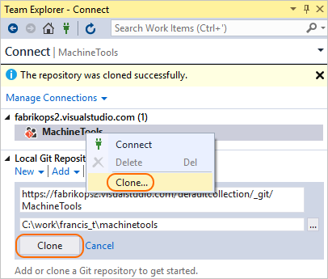

#  Get Started with Git and Azure DevOps Services

> [!div class="op_single_selector"]
> - [Visual Studio 2017](gitquickstart.md)
> - [Visual Studio 2015 Update 2](gitquickstart-vs2015.md)
> - [Visual Studio 2013 and Visual Studio 2015 RTM/Update 1](get-started-vs2013.md) 

#### Azure Repos | TFS 2018 | TFS 2017 | TFS 2015

This guide covers the basics so you can get up and running using Git with code already in Azure DevOps Services or Team Foundation Server (TFS). 
Explore our [full tutorial](gitworkflow.md) for more information on how to use Git from Visual Studio or the command line. 

If you don't have your code in an Azure DevOps Services or TFS Git repo, visit our [Visual Studio](share-your-code-in-git-vs.md) or [command line](share-your-code-in-git-cmdline.md) getting started articles to learn how to create a local repo for your code and push it to Azure Repos.

## Get your code 

To get a copy of the source code, you will [clone](clone.md) a Git repository. Cloning creates both a copy
of the source code for you to work with and all the version control information so Git can manage the source code.

If you don't have a Git repository yet, you can create one [using your own code](creatingrepo.md) and continue with the steps to commit and share your work.

# [Visual Studio](#tab/visual-studio)

 0. In Team Explorer, open up the Connect page by choosing **Projects and My Teams** then **Manage Connections**    

   
  
1. Choose **Connect**, select your organization, choose the projects you want to work on, then
click **Connect**.   

0. Right click on the project and click **Clone...**. Then enter a local folder on your drive to store the downloaded code.      
   
   

# [Command Line](#tab/command-line)

1. [Download and install Git](http://git-scm.com/download) and the [Git Credential Manager](set-up-credential-managers.md) for your platform.   
2. Open the Azure DevOps Services web portal in your browser and find your Git repository. 
Copy the command line instructions from the **Clone** pop-up.   

  

0. Navigate to the folder where you want the code stored on your local computer using the command line.
0. From the command line, paste the command you copied from the command line instructions. It will look like this
on the command prompt:

    <pre style="color:white;background-color:black;font-family:Consolas,Courier,monospace;padding:10px">
    &gt; git clone <a style="color: #b5bd68;">https://dev.azure.com/fabrikam/DefaultCollection/Fabrikam/_git/FabrikamFiber</a>  
    </pre>

Git will download and create your own copy of the code in a new folder for you to work with. 

---

## Commit your work

Git [branches](branches.md) isolate your changes from other work being done in the project. The recommended [Git workflow](gitworkflow.md) 
uses a new branch for every feature or fix you work on. You make [commits](commits.md) in your local Git repository to save your changes on that branch.

# [Visual Studio](#tab/visual-studio)

0. In Team Explorer, click the drop down and choose **Branches**. Right click the master branch and choose **New Local Branch From...**    

    

  Choose a descriptive branch name for your work to remind you and others what kind of work is in the branch. 

0. Make changes to your files in the cloned repo. From the Team Explorer **Home** view, you can open up Visual Studio solutions in the repo or browse the repo contents using the  **Show Folder View** link. Git keeps track of changes made to your code both inside and outside of Visual Studio.

0. When you are satisfied with the changes, save them in Git using a commit. Open up the 
**Changes** view from Team Explorer. Stage the changes to add to your next commit by right-clicking the files and selecting **Stage**, add a message describing the commit, then select **Commit Staged**.    
 
  

# [Command Line](#tab/command-line)

0. Create a branch where you will work with the code and make your changes.

    <pre style="color:white;background-color:black;font-family:Consolas,Courier,monospace;padding:10px">
    &gt; git checkout -b my-feature
    </pre>

  Choose a descriptive branch name for your work to remind you and others what kind of work is in the branch. You can also use this command to start working on a branch that other team members are already working in.

0. Make changes using your favorite tools on the code. 
0. When you're satisfied with the changes-even if you aren't ready to share the work-save them in Git using a commit.

    <pre style="color:white;background-color:black;font-family:Consolas,Courier,monospace;padding:10px">
    &gt; git commit -A -m "descriptive message"
    </pre>

  This will save your changes locally to a new [commit](commits.md) in Git. Make sure to give the commit a short message describing your changes after the -m flag.   

---

## Share your changes
When you are ready to share your changes with the team, you [push](pushing.md) those changes so that others can reach them. You can only
push changes after you add commits to a branch. 

Once you push the changes, you can create a [pull request](pullrequest.md) to let others know you'd like to have the changes reviewed and added to the master 
branch of the code.   

# [Visual Studio](#tab/visual-studio)

0. Open up the **Synchronization** view in Team Explorer. You can see the outgoing commits and share them by clicking **Push** if you are working with a branch that is already shared, or **Publish** if you are working with a newly created local branch.    

   
  
0. Create a pull request so that others can review your changes. Open **Pull Requests** in Team Explorer, and click **New Pull Request**. Verify the remote branch to merge the changes into, such as `my-feature`.   

  

0. You can review comments made in your [pull request](pullrequest.md) in a web browser on the Azure Repos pull request page. Once all changes are approved by the
team, you complete the pull request through the web browser.

# [Command Line](#tab/command-line)

0. Push your branch so that others can see the changes you've saved.

    <pre style="color:white;background-color:black;font-family:Consolas,Courier,monospace;padding:10px">
    &gt; git push -u origin dev</pre>

1. Open up the project in the web portal and browse to your repository under the "Code" tab. Click the **Create Pull Request** button to create a pull request for the branch that you pushed.   

      

2. Create the pull request, adding in team members to review and approve the code changes.

3. Once the changes are approved, complete the pull request. 
This will pull your changes from the branch into the master branch of the code.

---

## Sync with others

To get changes from others and keep your code up to date, you [pull](pulling.md) commits made by others and merge them into your branch. Git is very good
about merging multiple changes even in the same file, but sometimes you might have to [resolve a merge conflict](merging.md).  It's a good idea to 
pull your branches regularly to keep them up to date with the changes from others. This makes sure that your feature branches from your main branch are using the latest version of the code.   

# [Visual Studio](#tab/visual-studio)

0. Open up the **Sync** view in Team Explorer. You can download the latest changes to the branch you are on using the "Pull" link.   

  

# [Command Line](#tab/command-line)

0. Switch to the branch where you want to download the changes others have made

    <pre style="color:white;background-color:black;font-family:Consolas,Courier,monospace;padding:10px">
    &gt; git checkout dev</pre>

0. Pull in the changes made by others to your local branch.

    <pre style="color:white;background-color:black;font-family:Consolas,Courier,monospace;padding:10px">
    &gt; git pull
    </pre>

Git will download the changes and merge them with your own changes into your local branch. 

---
