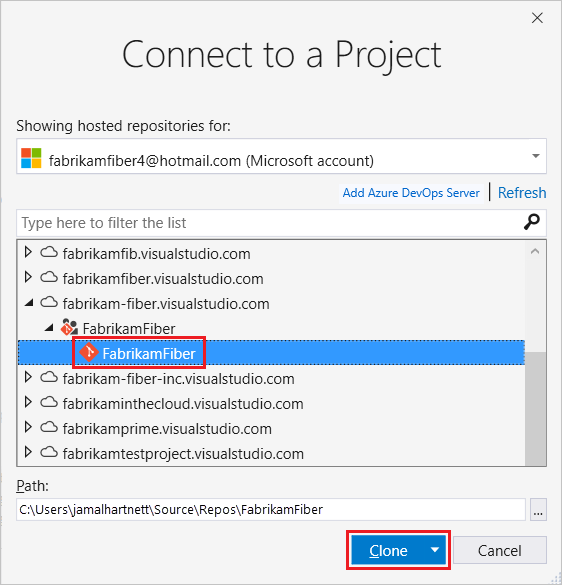
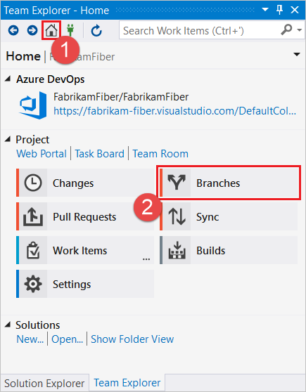
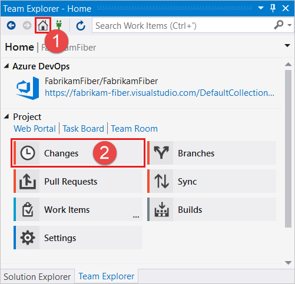
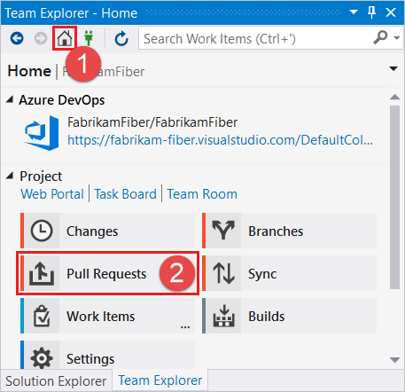
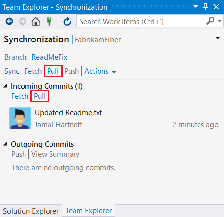

# Get started with Azure Repos and Visual Studio

[!INCLUDE [temp](../includes/version-tfs-2015-cloud.md)] 
[!INCLUDE [temp](../includes/version-vs-2013-vs-2019.md)] 

 

Get up and running using Git with code already in Azure Repos. 
For more information on how to use Git from Visual Studio or the command line, see [Azure Repos Git tutorial](gitworkflow.md).

If you don't have your code in an Azure Repos or Azure DevOps Server Git repo, visit our [Visual Studio](share-your-code-in-git-vs.md) or [command line](share-your-code-in-git-cmdline.md) getting started articles to learn how to create a local repo for your code and push it to Azure Repos.

[!INCLUDE [temp](includes/note-new-git-tool.md)]  

<a name="clone"></a>

## Get your code

To get a copy of the source code, you [clone](clone.md) a Git repository. Cloning creates both a copy of the source code for you to work with and all the version control information so Git can manage the source code.

If you don't have a Git repository yet, you can create one [using your own code](creatingrepo.md). Continue with the steps in this article to commit and share your work.

#### [Visual Studio 2017](#tab/visual-studio-2017)

[!INCLUDE [temp](includes/note-new-git-tool.md)]

1. In Team Explorer, select **Connect** to open the **Connect** page, and then choose **Manage Connections** > **Connect to Project**.

    

1. In **Connect to a Project**, select the repo you want to clone and select **Clone**. If you don't see your repo, select **Add Azure DevOps Server** to add a server that hosts a repo. You can filter the list to find your repo.

   

   [!INCLUDE [project-urls](../../includes/project-urls.md)]

1. Verify the location of the cloned repo on your computer and select **Clone**.

 
#### [Visual Studio 2015](#tab/visual-studio-2015)

1. In Team Explorer, open up the Connect page by choosing **Projects and My Teams** then **Manage Connections**    

    

2. Choose **Connect**, select your organization, choose the projects you want to work on, then
click **Connect**.   

3. Right click on the project and click **Clone...**. Then enter a local folder on your drive to store the downloaded code.      

   

#### [Visual Studio 2013](#tab/visual-studio-2013)


1. Go to your team's project page (`https://dev.azure.com/{yourorganization}/{yourteamproject}`) and then open Visual Studio to connect to your project.  Click **Allow** if prompted to open Visual Studio.

	

2. Sign in to Azure DevOps Services from Visual Studio.

3. Clone the repository to your computer.

	
	
4. The clone URL is automatically populated and a default local path is provided.  Change the local path to the location where you want to store your repo.  Click **Clone** to start copying the repo locally.

	  


#### [Command Line](#tab/command-line)

1. [Download and install Git](http://git-scm.com/download) and the [Git Credential Manager](set-up-credential-managers.md) for your platform.

1. Open the Azure DevOps Services web portal in your browser by going to `https://<your account name>.visualstudio.com`.

1. Open the Azure DevOps Services web portal in your browser by navigating to `https://<your account name>.visualstudio.com` and find your Git repository. Copy the clone URL from the **Clone** pop-up.   

   

   [!INCLUDE [project-urls](../../includes/project-urls.md)]

1. At the command prompt, go to the folder where you want the code stored on your local computer.

1. From the command prompt, run `git clone` followed by the clone URL, as shown in the following example.

	> [!div class="tabbedCodeSnippets"]
	```Git CLI
	> git clone https://dev.azure.com/fabrikam-fiber/_git/FabrikamFiber
	```

   Git downloads and creates your own copy of the code in a new folder for you.

* * *
<a name="commit"></a>

## Commit your work

Git [branches](./create-branch.md) isolate your changes from other work in the project.
The recommended [Git workflow](gitworkflow.md) uses a new branch for every feature or fix you work on.
You make [commits](commits.md) in your local Git repository to save your changes on that branch.

#### [Visual Studio 2017](#tab/visual-studio-2017)


[!INCLUDE [temp](includes/note-new-git-tool.md)]

1. In Team Explorer, select the **Home** button and choose **Branches**. 

   

1. Right-click the main branch and choose **New Local Branch From**.

     

1. Enter a descriptive branch name for your work to remind you and others what kind of work is in the branch. Select **Create Branch**.

    

1. Make changes to your files in the cloned repo. From the Team Explorer **Home** view, you can open Visual Studio solutions in the repo or browse the repo contents using **Show Folder View**. Git keeps track of changes made to your code both inside and outside of Visual Studio.

1. When you're satisfied with the changes, save them in Git using a commit. Open the **Changes** view from Team Explorer by selecting the **Home** button and choosing **Changes**.

   

1. Enter a message that describes the commit, and select **Commit All**.

   

   >[!NOTE]
   >If you have multiple files and you don't want to commit them all, you can right-click each file and choose **Stage**. When you have staged all the files you would like to commit, select **Commit Staged**. **Commit Staged** replaces **Commit All** when you manually stage your changes before the commit.
   >
   >

#### [Visual Studio 2015](#tab/visual-studio-2015)


1. In Team Explorer, click the drop down and choose **Branches**. Right click the main branch and choose **New Local Branch From...**    

     


   Choose a descriptive branch name for your work to remind you and others what kind of work is in the branch. 

2. Make changes to your files in the cloned repo. From the Team Explorer **Home** view, you can open up Visual Studio solutions in the repo or browse the repo contents using the  **Show Folder View** link. Git keeps track of changes made to your code both inside and outside of Visual Studio.

3. When you are satisfied with the changes, save them in Git using a commit. Open up the 
   **Changes** view from Team Explorer. Stage the changes to add to your next commit by right-clicking the files and selecting **Stage**, add a message describing the commit, then select **Commit Staged**.    

   

#### [Visual Studio 2013](#tab/visual-studio-2013)


1. Go to your team's project page (`https://dev.azure.com/{yourorganization}/{yourteamproject}`) and then open Visual Studio to connect to your project.  Click **Allow** if prompted to open Visual Studio.

	

2. Sign in to Azure DevOps from Visual Studio.

3. Clone the repository to your computer.

	
	
4. The clone URL is automatically populated and a default local path is provided.  Change the local path to the location where you want to store your repo.  Click **Clone** to start copying the repo locally.

	  


#### [Command Line](#tab/command-line)

1. Create a branch where you make your changes to the code. If you're collaborating with someone using a branch they've created, you can skip to the following `git checkout` step.

	> [!div class="tabbedCodeSnippets"]
	```Git CLI
	> git branch ReadMeFix
    ```

   Choose a descriptive branch name for your work to remind you and others what kind of work is in the branch.

1. Check out your branch so you can start working in it.

	> [!div class="tabbedCodeSnippets"]
	```Git CLI
	> git checkout ReadMeFix
    ```

   You can also use the `checkout` command to start working on a branch that other team members are already working in.

1. Make changes using your favorite tools on the code.

1. When you're satisfied with the changes, even if you aren't ready to share the work, save them in Git using a commit. Your changes won't be shared until you push them, as described in the following section.

	> [!div class="tabbedCodeSnippets"]
	```Git CLI
	> git commit -a -m "Descriptive message"
    ```

   This command saves your changes locally to a new [commit](commits.md) in Git. Make sure to give the commit a short message that describes your changes after `-m`.

* * *
<a name="push"></a>

## Share your changes

When you're ready to share your changes with the team, [push](pushing.md) those changes so that others can reach them. You can only
push changes after you add commits to a branch.

Once you push the changes, you can create a [pull request](pull-requests.md). A pull request lets others know you'd like to have the changes reviewed. After approval, a pull request adds your changes to the main branch of the code.

#### [Visual Studio 2017](#tab/visual-studio-2017)

[!INCLUDE [temp](includes/note-new-git-tool.md)]

1. In Team Explorer, select **Home** and then choose **Sync** to open **Synchronization**.

   

   You can also go to the **Synchronization** view from **Changes** by choosing **Sync** immediately after making a commit.

   

1. Select **Push** to share your commit with the remote repository.

   

   If this push is your first to the repository, you'll see the following message: `The current branch does not track a remote branch. Push your changes to a new branch on the origin remote and set the upstream branch.` Select **Push** to push your changes to a new branch on the remote repository and set the upstream branch. The next time you push changes, you'll see the list of commits.

1. Create a pull request so that others can review your changes. Open **Pull Requests** in Team Explorer by selecting **Home** and choosing **Pull Requests**.

   

1. In **Pull Requests**, you can view pull requests opened by you, assigned to you, and you can create new pull requests. Select **New Pull Request** to open a web browser where you can create the new pull request in the Azure Repos web portal.

   

1. Verify your branches. In this example, we want to merge the commits from the `ReadMeFix` branch into the `main` branch. Enter a title and optional description, specify any reviewers, optionally associate any work items, and then select **Create**.

   

   For more information on pull requests, see the [pull request](pull-requests.md) tutorial.


#### [Visual Studio 2015](#tab/visual-studio-2015)


1. Open up the **Synchronization** view in Team Explorer. You can see the outgoing commits and share them by clicking **Push** if you are working with a branch that is already shared, or **Publish** if you are working with a newly created local branch.    

    

2. Create a pull request so that others can review your changes. Open **Pull Requests** in Team Explorer, and click **New Pull Request**. Verify the remote branch to merge the changes into, such as `my-feature`.   

   

3. You can review comments made in your [pull request](pull-requests.md) in a web browser on the Azure Repos pull request page. Once all changes are approved by the
   team, you complete the pull request through the web browser.

#### [Visual Studio 2013](#tab/visual-studio-2013)

To share the changes in your topic branch, you'll need to publish it to the server.

1. Click on the **Sync** link in the successful commit notification to open the Synchronization page.

	
	
2. On the Sync page, click on the **Publish** link to push the changes on your topic branch to the server.

	


#### [Command Line](#tab/command-line)

1. Push your branch so that others can see the changes you've saved.

	> [!div class="tabbedCodeSnippets"]
	```Git CLI
	> git push -u origin ReadMeFix
    ```

1. Open the project in the web portal and browse to your repository under the **Code** tab. Select **Create a pull request** to create a pull request for the branch that you pushed.

   

1. Verify your branches. In this example, we want to merge the commits from the `ReadMeFix` branch into the `main` branch. Enter a title and optional description, specify any reviewers, optionally associate any work items, and select **Create**.

   

1. Once the changes are approved, complete the pull request.
   A complete pull request adds your changes from the branch into the main branch of the code.

   For more information on pull requests, see the [pull request](pull-requests.md) tutorial.

* * *


<a name="pull"></a>

## Sync with others

To keep your code up to date, [pull](pulling.md) commits made by others and merge them into your branch.
Git is very good about merging multiple changes even in the same file, but sometimes you might have to [resolve a merge conflict](merging.md).
It's a good idea to pull your branches regularly to keep them up to date with the changes from others.
Pulling often makes sure that your feature branches from your main branch are using the latest version of the code.

#### [Visual Studio 2017](#tab/visual-studio-2017)


[!INCLUDE [temp](includes/note-new-git-tool.md)]

1. In Team Explorer, select **Home** and choose **Sync** to open **Synchronization**.

   

1. You can download the latest changes to your branch using the **Pull** link. There are two **Pull** links, one near the top and one in the **Incoming Commits** section. You can use either because they both do the same thing.

   

#### [Visual Studio 2015](#tab/visual-studio-2015)


1. Open up the **Sync** view in Team Explorer. You can download the latest changes to the branch you are on using the "Pull" link.   

   

#### [Visual Studio 2013](#tab/visual-studio-2013)

1. Open up the **Sync** view in Team Explorer. You can download the latest changes to the branch you are on using the "Pull" link.   

   


#### [Command Line](#tab/command-line)

1. Switch to the branch where you want to download the changes others have made. 

	> [!div class="tabbedCodeSnippets"]
	```Git CLI
	> git checkout ReadMeFix
    ```

    In this example, you pull changes made by others on your team to the `ReadMeFix` branch to your local copy of the branch.

1. Pull the changes made by others to your local branch.

	> [!div class="tabbedCodeSnippets"]
	```Git CLI
	> git pull
    ```

   Git downloads the changes and merges them with your own changes into your local branch.

* * *

## Related articles

- [Frequently Asked Git Questions](howto.yml)