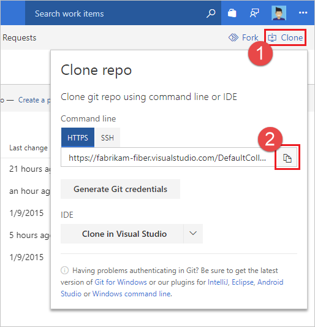
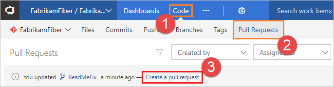
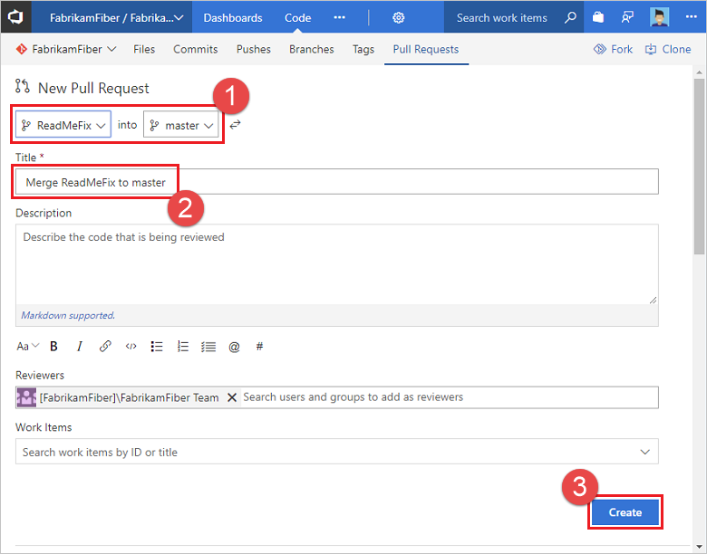

# Get started with Git in Azure Repos

[!INCLUDE [version-lt-eq-azure-devops](../../includes/version-lt-eq-azure-devops.md)] 
[!INCLUDE [version-vs-gt-eq-2019](../../includes/version-vs-gt-eq-2019.md)] 

Get started with developing your code using Azure Repos and Git repositories. You can use Visual Studio or Git commands to clone a repository, define local branches, commit and push changes, and sync with others. If you need to create or import a repository, see [Create a new Git repo in your project](create-new-repo.md) or [Import a Git repository](import-git-repository.md).

>[!NOTE]
>This article describes how to use Visual Studio to manage Azure Repos Git repositories. Using similar procedures, you can use Visual Studio to manage GitHub repositories. To clone a GitHub repository, get the URL as described in [Cloning a repository](https://docs.github.com/en/repositories/creating-and-managing-repositories/cloning-a-repository).

For an overview of the Git workflow, see [Azure Repos Git tutorial](gitworkflow.md).

[!INCLUDE [temp](includes/note-new-git-tool.md)]

<a name="prerequisites"></a>

## Prerequisites

[!INCLUDE [azure-repos-prerequisites](includes/azure-repos-prerequisites.md)]

To learn more about permissions and access, see [Default Git repository and branch permissions](../../organizations/security/default-git-permissions.md) and [About access levels](../../organizations/security/access-levels.md).

<a name="clone"></a>

## Get your code

You can [clone](clone.md) a remote Git repository to create a local copy of it. Cloning creates both a copy of the source code for you to work with and version control information so Git can manage the source code.

If you prefer to create a local repository without cloning, see [Create a new Git repo](creatingrepo.md). After creating your local repository you can proceed to [commit](#commit), [share](#push), and [sync](#pull) your work.

#### [Visual Studio 2022](#tab/visual-studio-2022)

Visual Studio 2022 provides a Git version control experience by using the **Git** menu, **Git Changes**, and through context menus in **Solution Explorer**. Visual Studio 2019 version 16.8 also offers the **Team Explorer** Git user interface. For more information, see the **Visual Studio 2019 - Team Explorer** tab.

[!INCLUDE [Get your code](includes/git-quickstart-get-code.md)]
[!INCLUDE [project-urls](../../includes/project-urls.md)]

#### [Visual Studio 2019 - Git menu](#tab/visual-studio-2019-git-menu)

Visual Studio 2019 provides a Git version control experience by using the **Git** menu, **Git Changes**, and through context menus in **Solution Explorer**.

[!INCLUDE [Get your code](includes/git-quickstart-get-code.md)]
[!INCLUDE [project-urls](../../includes/project-urls.md)]

#### [Visual Studio 2019 - Team Explorer](#tab/visual-studio-2019-team-explorer)

Visual Studio 2019 version 16.8 and later versions provides a Git version control experience while maintaining the **Team Explorer** Git user interface. You can exercise Git features from either interface interchangeably.

> [!NOTE]
> One advantage of connecting to a project through **Team Explorer** is you gain access to the Work Items hub. For an overview of **Team Explorer** features, see [Navigate in Visual Studio Team Explorer](../../user-guide/work-team-explorer.md).

1. In **Team Explorer**, select **Connect** to open the **Connect** page, and then choose **Manage Connections** > **Connect to Project**.

   :::image type="content" source="media/gitquickstart/visual-studio-2019/team-explorer/manage-connections.png" border="true" alt-text="Screenshot of the 'Connect to a Project' link in Team Explorer in Visual Studio 2019." lightbox="media/gitquickstart/visual-studio-2019/team-explorer/manage-connections-lrg.png":::

1. In the **Connect to a Project** window, choose the repo you want to clone and select **Clone**. If you don't see your repo, select **Add Azure DevOps Server** to add a server that hosts a repo. You can filter the list to find your repo.

   :::image type="content" source="media/gitquickstart/visual-studio-2019/team-explorer/connect-add-server.png" border="true" alt-text="Screenshot of the 'Connect to a Project' window in Visual Studio 2019." lightbox="media/gitquickstart/visual-studio-2019/team-explorer/connect-add-server-lrg.png":::

1. Verify the location for the cloned repo on your computer, and then select **Clone**.

[!INCLUDE [project-urls](../../includes/project-urls.md)]

#### [Git Command Line](#tab/command-line)

1. [Download and install Git](http://git-scm.com/download) and the [Git Credential Manager](set-up-credential-managers.md) for your platform.

1. Open the Azure DevOps Services web portal in your browser by going to `https://<your account name>.visualstudio.com`.

1. Open the Azure DevOps Services web portal in your browser by navigating to `https://<your account name>.visualstudio.com` and find your Git repository. Copy the clone URL from the **Clone** pop-up.   

   

   [!INCLUDE [project-urls](../../includes/project-urls.md)]

1. At the command prompt, go to the folder where you want the code stored on your local computer.

1. From the command prompt, run `git clone` followed by the clone URL, as shown in the following example.

	> [!div class="tabbedCodeSnippets"]
	```console
	> git clone https://dev.azure.com/fabrikam-fiber/_git/FabrikamFiber
	```

   Git downloads and creates your own copy of the code in a new folder for you.

---
<a name="commit"></a>

## Commit your work

Git [branches](./create-branch.md) isolate your changes from other work in the project.
The recommended [Git workflow](gitworkflow.md) is to use a new branch for every feature or fix you work on.
You make [commits](commits.md) in your local Git repository to save your changes on that branch.

#### [Visual Studio 2022](#tab/visual-studio-2022)

[!INCLUDE [Commit your work](includes/git-quickstart-commit-work.md)]

#### [Visual Studio 2019 - Git menu](#tab/visual-studio-2019-git-menu)

[!INCLUDE [Commit your work](includes/git-quickstart-commit-work.md)]

#### [Visual Studio 2019 - Team Explorer](#tab/visual-studio-2019-team-explorer)

1. In **Team Explorer**, select the **Home** button and choose **Branches**.

   :::image type="content" source="media/gitquickstart/visual-studio-2019/team-explorer/branches.png" border="true" alt-text="Screenshot showing the Branches option in Team Explorer in Visual Studio 2019." lightbox="media/gitquickstart/visual-studio-2019/team-explorer/branches-lrg.png":::

1. Right-click the default branch, often named `main`, and then choose **New Local Branch From...**

   :::image type="content" source="media/gitquickstart/visual-studio-2019/team-explorer/new-local-branch-menu.png" border="true" alt-text="Screenshot of the 'New Local Branch From' menu option in the context menu of the main branch in Visual Studio 2019." lightbox="media/gitquickstart/visual-studio-2019/team-explorer/new-local-branch-menu-lrg.png":::

1. Enter a descriptive branch name to let others know what work the branch contains. Select **Create Branch**.

   :::image type="content" source="media/gitquickstart/visual-studio-2019/team-explorer/new-local-branch.png" border="true" alt-text="Screenshot of the branch name text and 'Create Branch' button in Visual Studio 2019." lightbox="media/gitquickstart/visual-studio-2019/team-explorer/new-local-branch-lrg.png":::

1. Add an README.md file to your cloned repo. From the **Home** view of **Team Explorer**, you can browse the repo contents using **Show Folder View** or open Visual Studio solutions in the repo. Git tracks changes made both inside and outside of Visual Studio.

1. When you're satisfied with your changes, save them in Git using a commit. Open the **Changes** view of **Team Explorer** by selecting the **Home** button and choosing **Changes**.

   :::image type="content" source="media/gitquickstart/visual-studio-2019/team-explorer/changes.png" border="true" alt-text="Screenshot of the Changes option in Team Explorer in Visual Studio 2019." lightbox="media/gitquickstart/visual-studio-2019/team-explorer/changes-lrg.png":::

1. Enter a message that describes the commit, and then select **Commit All**.

   :::image type="content" source="media/gitquickstart/visual-studio-2019/team-explorer/commit-all.png" border="true" alt-text="Screenshot of commit message text and 'Commit All' button in Visual Studio 2019." lightbox="media/gitquickstart/visual-studio-2019/team-explorer/commit-all-lrg.png":::

> [!NOTE]
> If you have multiple files and you don't want to commit them all, you can right-click each file and choose **Stage**. When you've staged all the files you'd like to commit, select **Commit Staged**. **Commit Staged** replaces **Commit All** when you manually stage your changes.
>
>
> :::image type="content" source="media/gitquickstart/visual-studio-2019/team-explorer/stage-changes.png" border="true" alt-text="Screenshot of the Stage option in the changed-file context menu in Team Explorer in Visual Studio 2019." lightbox="media/gitquickstart/visual-studio-2019/team-explorer/stage-changes-lrg.png":::

#### [Git Command Line](#tab/command-line)

1. Create a branch where you make your changes to the code. If you're collaborating with someone using a branch they've created, you can skip to the following `git checkout` step.

	> [!div class="tabbedCodeSnippets"]
	```console
	> git branch ReadMeFix
    ```

   Choose a descriptive branch name for your work to remind you and others what kind of work is in the branch.

1. Check out your branch so you can start working in it.

	> [!div class="tabbedCodeSnippets"]
	```console
	> git checkout ReadMeFix
    ```

   You can also use the `checkout` command to start working on a branch that other team members are already working in.

1. Make changes by using your favorite tools on the code.

1. When you're satisfied with the changes, even if you aren't ready to share the work, save them in Git using a commit. Your changes won't be shared until you push them, as described in the following section.

	> [!div class="tabbedCodeSnippets"]
	```console
	> git commit -a -m "Descriptive message"
    ```

   This command saves your changes locally to a new [commit](commits.md) in Git. Make sure to give the commit a short message that describes your changes after `-m`.

---
<a name="push"></a>

## Share your changes

After you've added one or more commits to a branch and you're ready to share those changes with others, [push](pushing.md) your commits so others can see them.

Once you've pushed your commits, you can create a [pull request](pull-requests.md). A pull request lets others know you'd like to have your changes reviewed. After approval, a pull request typically adds your changes to the default branch of the remote repository.

#### [Visual Studio 2022](#tab/visual-studio-2022)

[!INCLUDE [Commit your work](includes/git-quickstart-share-changes.md)]

#### [Visual Studio 2019 - Git menu](#tab/visual-studio-2019-git-menu)

[!INCLUDE [Commit your work](includes/git-quickstart-share-changes.md)]

#### [Visual Studio 2019 - Team Explorer](#tab/visual-studio-2019-team-explorer)

1. In **Team Explorer**, select **Home** and then choose **Sync** to open **Synchronization**.

   :::image type="content" source="media/gitquickstart/visual-studio-2019/team-explorer/sync.png" border="true" alt-text="Screenshot of the Sync option in Team Explorer in Visual Studio 2019." lightbox="media/gitquickstart/visual-studio-2019/team-explorer/sync-lrg.png":::

   You can also go to the **Synchronization** view from **Changes** by choosing **Sync** immediately after making a commit.

   :::image type="content" source="media/gitquickstart/visual-studio-2019/team-explorer/commit-created-locally.png" border="true" alt-text="Screenshot of the Sync link that appears after making a commit in Visual Studio 2019." lightbox="media/gitquickstart/visual-studio-2019/team-explorer/commit-created-locally-lrg.png":::

1. In the **Synchronization** view, choose **Push** to upload your commit to the remote repo. If this is your first push to the repo, you'll see the message: `The current branch does not track a remote branch...`, which lets you know that your commit was pushed to a new branch on the remote repo and that future commits pushed from the current branch will be uploaded to that remote branch.

   :::image type="content" source="media/gitquickstart/visual-studio-2019/team-explorer/push-to-origin.png" border="true" alt-text="Screenshot of the Push link in the Synchronization view of Team Explorer in Visual Studio 2019." lightbox="media/gitquickstart/visual-studio-2019/team-explorer/push-to-origin-lrg.png":::

1. Create a pull request so that others can review your changes. Open **Pull Requests** in **Team Explorer** by selecting **Home** and choosing **Pull Requests**.

   :::image type="content" source="media/gitquickstart/visual-studio-2019/team-explorer/pull-requests.png" border="true" alt-text="Screenshot of the 'Pull Requests' option in Team Explorer in Visual Studio 2019." lightbox="media/gitquickstart/visual-studio-2019/team-explorer/pull-requests-lrg.png":::

1. In **Pull Requests**, you can view pull requests opened by you, assigned to you, and you can create new pull requests. Select **New Pull Request** to open a web browser where you can create a new pull request in the Azure Repos web portal.

   :::image type="content" source="media/gitquickstart/visual-studio-2019/team-explorer/new-pull-request.png" border="true" alt-text="Screenshot of the 'New Pull Request' link in the Pull Requests view of Team Explorer in Visual Studio 2019." lightbox="media/gitquickstart/visual-studio-2019/team-explorer/new-pull-request-lrg.png":::

When the pull request opens in the Azure Repos web portal, verify your source and destination branches. In this example, we want to merge commits from the `add-readme-file` branch into the `main` branch. Enter a title and optional description, specify any reviewers, optionally associate any work items, and then select **Create**.

:::image type="content" source="media/gitquickstart/visual-studio-2019/team-explorer/create-pull-request.png" border="true" alt-text="Screenshot of the 'New Pull Request' form in the Azure Repos web portal.":::

For more information on pull requests, see the [Pull request](pull-requests.md) tutorial.

#### [Git Command Line](#tab/command-line)

1. Push your branch so that others can see the changes you've saved.

	> [!div class="tabbedCodeSnippets"]
	```console
	> git push -u origin ReadMeFix
    ```

1. Open the project in the web portal and browse to your repository under the **Code** tab. Select **Create a pull request** to create a pull request for the branch that you pushed.

   

1. Verify your branches. In this example, we want to merge the commits from the `ReadMeFix` branch into the `main` branch. Enter a title and optional description, specify any reviewers, optionally associate any work items, and select **Create**.

   

1. Once the changes are approved, complete the pull request.
   A complete pull request adds your changes from the branch into the main branch of the code.

   For more information on pull requests, see the [pull request](pull-requests.md) tutorial.

---

<a name="pull"></a>

## Sync with others

You can keep your local branches in sync with their remote counterparts by [pulling](pulling.md) commits created by others. Although Git is good at merging incoming changes with your changes, sometimes you might have to [resolve a merge conflict](merging.md). While you're working on your feature branch, it's a good idea to periodically switch to your `main` branch and pull new commits to keep it current with the remote `main` branch.

#### [Visual Studio 2022](#tab/visual-studio-2022)

[!INCLUDE [Commit your work](includes/git-quickstart-sync-others.md)]

#### [Visual Studio 2019 - Git menu](#tab/visual-studio-2019-git-menu)

[!INCLUDE [Commit your work](includes/git-quickstart-sync-others.md)]

#### [Visual Studio 2019 - Team Explorer](#tab/visual-studio-2019-team-explorer)

1. In **Team Explorer**, select **Home** and choose **Sync** to open **Synchronization**.

   :::image type="content" source="media/gitquickstart/visual-studio-2019/team-explorer/sync.png" border="true" alt-text="Screenshot of the Sync option in 'Team Explorer' in Visual Studio 2019." lightbox="media/gitquickstart/visual-studio-2019/team-explorer/sync-lrg.png":::

1. You can download the latest changes to your branch using the **Pull** link. There are two **Pull** links, one near the top and one in the **Incoming Commits** section. You can use either because they both do the same thing.

   :::image type="content" source="media/gitquickstart/visual-studio-2019/team-explorer/incoming-commits.png" border="true" alt-text="Screenshot of the Pull link in the Synchronization view of Team Explorer in Visual Studio 2019." lightbox="media/gitquickstart/visual-studio-2019/team-explorer/incoming-commits-lrg.png":::

#### [Git Command Line](#tab/command-line)

1. Switch to the branch where you want to download the changes others have made. 

	> [!div class="tabbedCodeSnippets"]
	```console
	> git checkout ReadMeFix
    ```

    In this example, you pull changes made by others on your team to the `ReadMeFix` branch to your local copy of the branch.

1. Pull the changes made by others to your local branch.

	> [!div class="tabbedCodeSnippets"]
	```console
	> git pull
    ```

   Git downloads the changes and merges them with your own changes into your local branch.

---

## Related articles

- [Frequently Asked Git Questions](howto.yml)
- [Git experience in Visual Studio](/visualstudio/version-control/git-with-visual-studio)
- [Side-by-side comparison of Git and Team Explorer](/visualstudio/version-control/git-team-explorer-feature-comparison)
