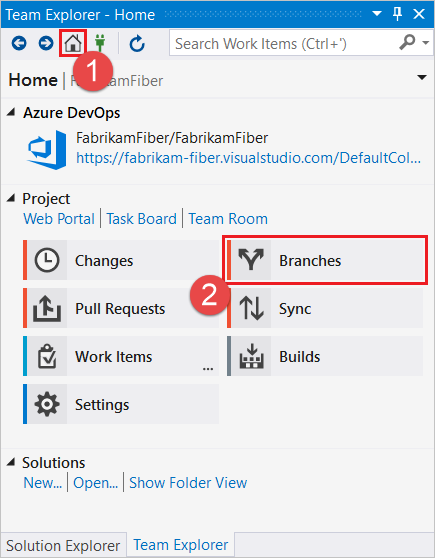
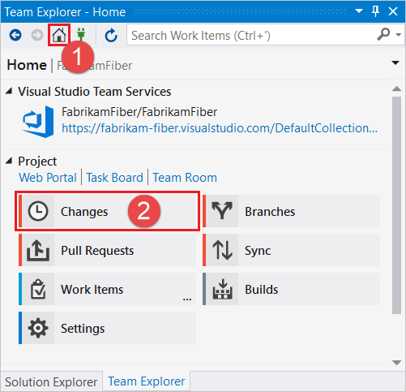
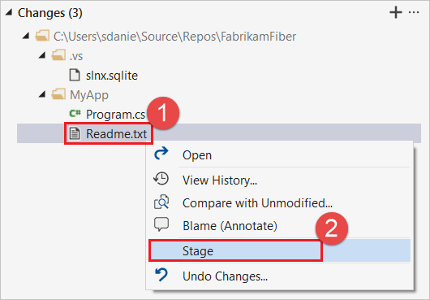
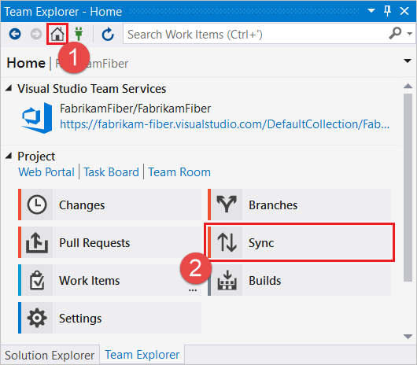

#  Get Started with Azure Repos and Visual Studio

> [!div class="op_single_selector"]
> - [Visual Studio 2017](gitquickstart.md)
> - [Visual Studio 2015 Update 2](gitquickstart-vs2015.md)
> - [Visual Studio 2013 and Visual Studio 2015 RTM/Update 1](get-started-vs2013.md)   
   
#### Azure Repos | TFS 2018 | TFS 2017 | TFS 2015 | VS 2017  

This guide covers the basics so you can get up and running using Git with code already in Azure DevOps Services or Team Foundation Server (TFS). 
Explore our [full tutorial](gitworkflow.md) for more information on how to use Git from Visual Studio or the command line. 

If you don't have your code in an Azure DevOps Services or TFS Git repo, visit our [Visual Studio](share-your-code-in-git-vs.md) or [command line](share-your-code-in-git-cmdline.md) getting started articles to learn how to create a local repo for your code and push it to Azure Repos.

<a name="clone"></a>

## Get your code

To get a copy of the source code, you [clone](clone.md) a Git repository. Cloning creates both a copy of the source code for you to work with and all the version control information so Git can manage the source code.

If you don't have a Git repository yet, you can create one [using your own code](creatingrepo.md) and continue with the steps in this article to commit and share your work.

# [Visual Studio](#tab/visual-studio)

0. In Team Explorer, open up the **Connect** page by selecting the **Connect** icon, and then choose **Manage Connections**, **Connect to Project**.

   
  
0. On the **Connect to a Project** dialog, select the repo you want to clone from the list and select **Clone**. If you don't see your repo listed, you can filter the list 
to find it or add a Team Foundation Server where the repo is hosted by selecting the **Add TFS Server** link.
   
      

  [!INCLUDE [project-urls](../../_shared/project-urls.md)]


1. Verify the location of the cloned repo on your PC and select **Clone**.


# [Command Line](#tab/command-line)

0. [Download and install Git](http://git-scm.com/download) and the [Git Credential Manager](set-up-credential-managers.md) for your platform.   
0. Open the Azure DevOps Services web portal in your browser by navigating to `https://<your account name>.visualstudio.com` and find your Git repository. Copy the clone URL from the **Clone** pop-up.   

  

  [!INCLUDE [project-urls](../../_shared/project-urls.md)]

0. Navigate to the folder where you want the code stored on your local computer using the command line.
0. From the command line, run `git clone` followed by the clone URL, as shown in the following example.

    ```cmd
    git clone https://dev.azure.com/fabrikam-fiber/_git/FabrikamFiber
    ```

Git downloads and creates your own copy of the code in a new folder for you to work with. 

---


<a name="commit"></a>

## Commit your work

Git [branches](branches.md) isolate your changes from other work being done in the project. The recommended [Git workflow](gitworkflow.md) 
uses a new branch for every feature or fix you work on. You make [commits](commits.md) in your local Git repository to save your changes on that branch.

# [Visual Studio](#tab/visual-studio)

0. In Team Explorer, select the **Home** icon and choose **Branches**. 

  

0. Right click the master branch and choose **New Local Branch From...**    

    

0.  Choose a descriptive branch name for your work to remind you and others what kind of work is in the branch, and select **Create Branch**.

   

0. Make changes to your files in the cloned repo. From the Team Explorer **Home** view, you can open up Visual Studio solutions in the repo or browse the repo contents using the  **Show Folder View** link. Git keeps track of changes made to your code both inside and outside of Visual Studio.

0. When you are satisfied with the changes, save them in Git using a commit. Open up the 
**Changes** view from Team Explorer by selecting the **Home** icon and choosing **Changes**.

  

0. Enter a message describing the commit, and select **Commit All**.

  

  >[!NOTE]
  >If you have multiple files and you don't want to commit them all, you can right-click each desired file and choose **Stage**. When you have staged all the files you would like to commit, click **Commit Staged**. (The **Commit All** button is replaced by **Commit Staged** when you manually stage your changes before the commit.)
  >
  >


# [Command Line](#tab/command-line)

0. Create a branch where you will work with the code and make your changes. If you are collaborating with someone using a branch they've created, you can skip to the following `git checkout` step.

    ```cmd
    git branch ReadMeFix
    ```

  Choose a descriptive branch name for your work to remind you and others what kind of work is in the branch. 

0. Checkout your branch so you can start working in it. 

    ```cmd
    git checkout ReadMeFix
    ```

  You can also use the `checkout` command to start working on a branch that other team members are already working in.

0. Make changes using your favorite tools on the code. 
0. When you're satisfied with the changes, even if you aren't ready to share the work, save them in Git using a commit. Your changes won't be shared until you push them, as described in the following section.

    ```cmd
    git commit -a -m "Descriptive message"
    ```

  This will save your changes locally to a new [commit](commits.md) in Git. Make sure to give the commit a short message describing your changes after the `-m` flag.   

---


<a name="push"></a>

## Share your changes
When you are ready to share your changes with the team, you can [push](pushing.md) those changes so that others can reach them. You can only
push changes after you add commits to a branch. 

Once you push the changes, you can create a [pull request](pullrequest.md) to let others know you'd like to have the changes reviewed and added to the master 
branch of the code.   

# [Visual Studio](#tab/visual-studio)

0. Open up the **Synchronization** view in Team Explorer by selecting the **Home** icon and choosing **Sync**. 

  

  You can also navigate to the **Synchronization** view from the **Changes** view by choosing **Sync** immediately after making a commit.

  

0. Select **Push** to share your commit with the remote repository.

  

  If this is your first push to the repository you'll see the following message in place of the outgoing commits list: `The current branch does not track a remote branch. Push your changes to a new branch on the origin remote and set the upstream branch.` Select **Push** to push your changes to a new branch on the remote repository and set the upstream branch. The next time you push changes you'll see the list of commits.
 
0. Create a pull request so that others can review your changes. Open **Pull Requests** in Team Explorer by selecting the **Home** icon and choosing **Pull Requests**.

  

0. From the **Pull Requests** view you can view pull requests opened by you, assigned to you, and you can create new pull requests. Select **New Pull Request** to open up a web browser where you can create the new pull request in the Azure DevOps Services web portal.

  

0. Verify your branches (in this example we want to merge the commits from the `ReadMeFix` branch into the `master` branch), enter a title and optional description, specify any reviewers, optionally associate any work items, and select **Create**.

  

  For more information on pull requests, see the [pull request](pullrequest.md) tutorial.

# [Command Line](#tab/command-line)

0. Push your branch so that others can see the changes you've saved.

    ```cmd
    git push -u origin ReadMeFix
    ```

1. Open up the project in the web portal and browse to your repository under the **Code** tab. Select the **Create a pull request** link to create a pull request for the branch that you pushed.   

     

0. Verify your branches (in this example we want to merge the commits from the `ReadMeFix` branch into the `master` branch), enter a title and optional description, specify any reviewers, optionally associate any work items, and select **Create**.

  

0. Once the changes are approved, complete the pull request. 
This will pull your changes from the branch into the master branch of the code.

  For more information on pull requests, see the [pull request](pullrequest.md) tutorial.

---


<a name="pull"></a>

## Sync with others

To get changes from others and keep your code up to date, you can [pull](pulling.md) commits made by others and merge them into your branch. Git is very good
about merging multiple changes even in the same file, but sometimes you might have to [resolve a merge conflict](merging.md).  It's a good idea to 
pull your branches regularly to keep them up to date with the changes from others. This makes sure that your feature branches from your main branch are using the latest version of the code.   

# [Visual Studio](#tab/visual-studio)

0. Open up the **Synchronization** view in Team Explorer by selecting the **Home** icon and choosing **Sync**. 

  


0. You can download the latest changes to the branch you are on using the **Pull** link. (There are two **Pull** links, one near the top and one in the **Incoming Commits** section. You can use either one as they both do the same thing.) 

  

# [Command Line](#tab/command-line)

0. Switch to the branch where you want to download the changes others have made. In this example changes made by others on your team to the `ReadMeFix` branch are pulled down to your local copy of the branch.

    ```cmd
    git checkout ReadMeFix
    ```

0. Pull in the changes made by others to your local branch.

    ```cmd
    git pull
    ```

Git downloads the changes and merges them with your own changes into your local branch. 

---

