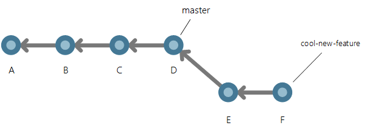

# Understand Git history

Git stores history as a graph of snapshots &mdash; called commits &mdash; of the entire repository.
Each commit also contains a pointer to one or more previous commits.
Commits can have multiple parents, creating a history that looks like a graph instead of a straight line.
This difference in history is incredibly important and is the main reason users find Git confusing.

>[!NOTE]
>If you can't find a change in your Git history that you know you made, learn more about how Git history simplification works at [Git lost my changes: Taking a look at Git's history simplification](/azure/devops/articles/git-log-history-simplification?view=azure-devops).

## Commit history basics

Start with a simple history example: a repo with 3 linear commits.

Commit A is the parent of commit B, and commit B is the parent of commit C.
This history looks very similar to a CVCS.
The arrow pointing to commit C is a branch.
It's named `master` because that's the default name for the mainline branch in a Git repo.
Branches are pointers to specific commits, which is why branching is so lightweight and easy in Git.

A key difference in Git compared to CVCS is that I have my own full copy of the repo.
I need to keep my local repository in sync with the remote repository by getting the latest commits from the remote repository.
To do this, I'll pull the master branch with the following command:

`git pull origin master`

This copies ("pulls") all commits from the `master` branch of the remote repo (called `origin` by default) to the `master` branch of the local repo. The pull operation copied one new commit, and the `master` branch in the local repo is now pointing to this new commit.

## Understand branch history

Now I want to make a change to my code.
It's common to have multiple active branches where you're working on different features in parallel.
This is in stark contrast to CVCS where new branches are heavy and rarely created.
The first step is to checkout to a new branch using the following command:

`git checkout -b cool-new-feature`

This is a shortcut combining two commands: `git branch cool-new-feature` to create the branch followed by `git checkout cool-new-feature` to begin working in the branch.

Two branches now point to the same commit.
I'll make a few changes on the `cool-new-feature` branch in two new commits, E and F.

My commits are reachable by the `cool-new-feature` branch since I made them in that branch.
I'm done with my feature and want to merge it into `master`.
To do that I'll use the following command:

`git merge cool-feature master`

The graph structure of history becomes visible when there's a merge.
Git creates a new commit when I merged my branch into another branch.
This is a merge commit.
There aren't any changes included this merge commit since I didn't have conflicts.
If I had conflicts, the merge commit would include the changes needed to resolve those conflicts.

## History in the real world

Here is an example of Git history that more closely resembles code in active development on a team.
There are three people who merge commits from their own branches into the master branch around the same time.

Now that you understand how branches and merges create the shape of the graph, this shouldn't be too scary!

