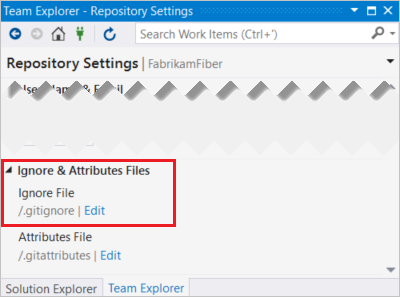

# Ignore file changes with Git

**Azure Repos | Azure DevOps Server 2020 | Azure DevOps Server 2019 | TFS 2018 | TFS 2017 | TFS 2015 | VS 2017 | VS 2015**

Not every file created or updated in your code should be committed to Git.
Temporary files from your development environment, test outputs, and logs are all examples of files that you create but aren't part of your codebase.
Customize which files Git tracks through the *gitignore* feature.

In this tutorial you learn how to:

> [!div class="checklist"]
> * Use gitignore to prevent tracking of files
> * Ignore files only on your system
> * Ignore files across all repos on your system
> * Ignore changes to committed files

## Use gitignore to prevent tracking of files

Create a *.gitignore* file in your Git repo to prevent Git from staging unwanted files.
Share *.gitignore* in the default branch in your repo. You and your team can update the file to change which types of files to ignore.

### Create a .gitignore

# [Visual Studio](#tab/visual-studio)

[!INCLUDE [temp](includes/note-new-git-tool.md)]

Visual Studio automatically creates a *.gitignore* file in your repo when you [create new repo for your project](creatingrepo.md).

# [Command Line](#tab/command-line)

Download a [template](https://github.com/github/gitignore) *.gitignore* file for your project type and customize it to meet your needs.
If your project doesn't fit a template, you can create an empty *.gitignore* from the command line.
Go to your Git repo and run one of the following commands, using your repository information:

### Windows

```bash
fsutil file createnew C:\Users\frank\myrepo\.gitignore 0
```

### Linux and macOS

```bash
touch /home/frank/myrepo/.gitignore
```

---

Git applies *.gitignore* to the folder and any child folders where it's located. We recommend you place your *.gitignore* in the root folder of your repo to prevent confusion.

### Customize your .gitignore

Modify your *.gitignore* to include files types, paths, and file patterns in your repo.
Git starts ignoring these files as soon as you update *.gitignore*. If others on your team need the same set of ignored files, be sure to commit your changes.

# [Visual Studio](#tab/visual-studio)

[!INCLUDE [temp](includes/note-new-git-tool.md)]

You can edit your *.gitignore* file for your repo by going to the **Settings** view in Team Explorer, then selecting **Repository Settings**. Select **Edit** for your *.gitignore*.



# [Command Line](#tab/command-line)

Use a text editor, such as the following example that uses Vim:

```bash
vim /home/frank/myrepo/.gitignore
```

---

Each line in the *.gitignore* excludes a file or set of files that match a pattern.
The [full gitignore syntax](https://git-scm.com/docs/gitignore) is very flexible.
Here are some examples of the most common entries:

```bash
# ignore a single file
mycode.class

# ignore an entire directory
/mydebugdir/

# ignore a file type
*.json

# add an exception (using !) to the preceding rule to track a specific file
!package.json
```

> [!NOTE]
> Windows users: All file paths in the *.gitignore* file use a forward slash separator, not a backslash.

## Ignore files only on your system

Your *.gitignore* is shared across team members as a file committed and pushed to the Git repo.
To exclude files only on your system, edit the *.git/info/exclude* file in your local repo.
Changes to this file aren't shared with others.
They apply only to the files in that repo.
The [syntax](https://git-scm.com/docs/gitignore) for this file is the same as the one used in .gitignore.

## Ignore files across all repos on your system

Set up a global *.gitignore* for use across all repos on your system using the command line `git config` tool, as in the following example:

```bash
git config core.excludesfile C:\Users\frank\.gitignore_global
```

This approach is useful for ignoring entire file types you don't want to ever commit, such as compiled binaries.

## Ignore changes to committed files

#### Temporarily ignore changes

During development, it's convenient to stop tracking file changes to a file committed into your git repo.
This approach is useful when you customize settings or configuration files that are part of your project source for your own work environment.

```bash
git update-index --skip-worktree <file>
```

Resume tracking files with the following command:

```bash
git update-index --no-skip-worktree <file>
```

Instead, you can use the following parameters. These parameters are primarily for marking files that should not be changed by developers.

To disable change tracking:

```bash
git update-index --assume-unchanged <file>
```

To resume change tracking:

```bash
git update-index --no-assume-unchanged <file>
```

#### Permanently stop tracking a file

If a file is already tracked by Git, `.gitignore` doesn't apply.
Git will continue to track changes to that file.

If you want to stop tracking a file, you need to explicitly tell Git you want it removed from tracking.
By following these directions, the file will remain in your local working directory but will no longer be tracked in Git.

1. Add the file in your `.gitignore`.

1. Run the following command:

   ```bash
   git rm --cached  <file>
   ```

1. Commit the removal of the file and the updated *.gitignore* to your repo.

## Next steps

> [!div class="nextstepaction"]
> [Review history](review-history.md)
