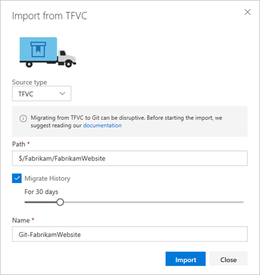
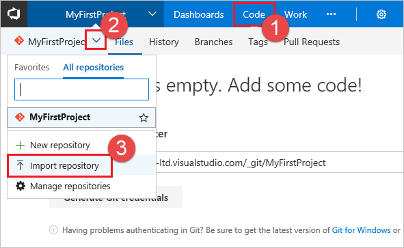

# Import repositories from TFVC to Git

[!INCLUDE [version-lt-eq-azure-devops](../../includes/version-lt-eq-azure-devops.md)]

You can migrate code from an existing TFVC repository to a new Git repository within the same organization. Migrating to Git is an involved process for large TFVC repositories and teams. Centralized version control systems, like TFVC, behave differently from Git in fundamental ways. The switch involves a lot more than learning new commands. It is a disruptive change that requires careful planning. You need to think about:

* Revising tools and processes
* Removing binaries and executables
* Training your team

We strongly recommend reading [Centralized version control to Git](/devops/develop/git/centralized-to-git) and the following [Migrate from TFVC to Git](#migrate-from-tfvc-to-git) section before starting the migration.

The import experience is great for small simple TFVC repositories. It's also good for repositories that have already been "cleaned up" as outlined in the previous whitepapers. Those whitepapers also recommend other tools for more advanced TFVC repository configurations.

> [!IMPORTANT] 
> Due to the differences in how TFVC and Git store version control history, we [recommend](/devops/develop/git/migrate-from-tfvc-to-git) that you don't migrate your history. This is the approach that Microsoft took when it migrated Windows and other products from centralized version control to Git.

## Importing the repository

::: moniker range=">= azure-devops-2019"

1. Select **Repos**, **Files**.

   

2. From the repo drop-down, select **Import repository**.

   

3. Select TFVC from the **Source type** dropdown

4. Type the path to the repository / branch / folder that you want to import to the Git repository. For example, `$/Fabrikam/FabrikamWebsite`

5. If you want to migrate history from the TFVC repository, click **Migrate history** and select the number of days. You can migrate up to 180 days of history starting from the most recent changeset. 
   A link to the TFVC repository is added in the commit message of the 1st changeset that is migrated to Git. This makes it easy to find older history when needed.

6. Give a name to the new Git repository and click **Import**. Depending on the size of the import, your Git repository would be ready in a few minutes. 

   

::: moniker-end

::: moniker range="tfs-2018"

1. From the repo drop-down, select **Import repository**.



1. Select TFVC from the **Source type** dropdown

2. Type the path to the repository / branch / folder that you want to import to the Git repository. For example, `$/Fabrikam/FabrikamWebsite`

3. If you want to migrate history from the TFVC repository, click **Migrate history** and select the number of days. You can migrate up to 180 days of history starting from the most recent changeset. 
A link to the TFVC repository is added in the commit message of the 1st changeset that is migrated to Git. This makes it easy to find older history when needed.

4. Give a name to the new Git repository and click **Import**. Depending on the size of the import, your Git repository would be ready in a few minutes. 


> [!IMPORTANT] 
> Due to the differences in how TFVC and Git store version control history, we [recommend](/devops/develop/git/migrate-from-tfvc-to-git) that you don't migrate your history. This is the approach that Microsoft took when it migrated Windows and other products from centralized version control to Git.

::: moniker-end

### Troubleshooting

This experience is optimized for small, simple TFVC repositories or repositories that have been prepared for a migration. This means it has a few limitations.

1. It only migrates the contents of root or a branch. For example, if you have a TFVC project at `$/Fabrikam` which has 1 branch and 1 folder under it, a path to import `$/Fabrikam` would import the folder 
while `$/Fabrikam/<branch>` would only import the branch.  
2. The imported repository and associated history (if imported) cannot exceed 1GB in size.
3. You can import up to 180 days of history.

If any of the above is a blocker for your import, we recommend you try external tools like [Git-TFS](https://github.com/git-tfs/git-tfs) for importing and reading our whitepapers - [Centralized version control to Git](/devops/develop/git/centralized-to-git) and [TFVC to Git](/devops/develop/git/migrate-from-tfvc-to-git)


> [!NOTE]
> The usage of external tools like [Git-TFS](https://github.com/git-tfs/git-tfs) with Microsoft products, services, or platforms is entirely the responsibility of the user. Microsoft does not endorse, support, or guarantee the functionality, reliability, or security of such third-party extensions.

## Migrate from TFVC to Git

Before migrating source code from a centralized version control system to Git, understand the
differences between the two and [prepare for the migration](/devops/develop/git/centralized-to-git).

* [Requirements](#requirements)
* [Steps to migrate](#steps-to-migrate)
  * [Check out the latest version](#check-out-the-latest-version)
  * [Remove binaries and build tools](#remove-binaries-and-build-tools)
  * [Convert version control-specific configuration](#convert-version-control-specific-configuration)
  * [Check in changes and perform the migration](#check-in-changes-and-perform-the-migration)
  * [Advanced migrations](#advanced-migrations)
* [Update the workflow](#update-the-workflow)

### Requirements

In order to make migrations easier, there are a number of requirements on the
[TFVC Import tool](/azure/devops/git/import-from-tfvc):

* Migrate only a single branch. When [planning the migration](/devops/develop/git/centralized-to-git), choose a new
   branching strategy for Git. Migrating only the main branch supports a topic-branch based workflow like
   [GitFlow](http://nvie.com/posts/a-successful-git-branching-model/)
   or [GitHub Flow](https://guides.github.com/introduction/flow/index.html).
* Do a tip migration, as in, import only the latest version of the source code. If TFVC history is simple,
   there's an option to migrate some history, up to 180 days, so that the team can work only out of Git.
   For more information, see [Plan your migration to Git](/devops/develop/git/centralized-to-git).
* Exclude binary assets like images, scientific data sets, or game models from the repository. These assets 
   should use the Git LFS (Large File Support) extension, which the import tool doesn't configure.
* Keep the imported repository below 1GB in size.

If the repository doesn't meet these requirements, use the [Git-TFS tool](https://github.com/git-tfs/git-tfs) 
to do your migration instead.

### Steps to migrate

The process to migrate from TFVC is generally straightforward:

1. Check out the latest version of the branch from TFVC on your local disk.
2. Remove the binaries and build tools from the repository and set up a package management system like NuGet.
3. Convert version control system-specific directives. For example, convert `.tfignore` files to
    [`.gitignore`](https://git-scm.com/docs/gitignore), and convert `.tpattributes` files to
    [`.gitattributes`](https://git-scm.com/docs/gitattributes).
4. Check in the final changes to Team Foundation Version Control and perform the migration to Git.

Steps 1-3 are optional. If there aren't binaries in the repository and there's no need to set up a
`.gitignore` or a `.gitattributes`, skip to [perform the migration](/azure/devops/git/import-from-tfvc).

#### Check out the latest version

Create a new TFS workspace and map a working folder for the server directory being migrated to Git. This
doesn't require a full working folder mapping. Only map folders that contain binaries to be removed
from the repository and folders that contain version control system-specific configuration files like
`.tfignore`.

Once mappings are set up, get the folder locally:

```prettyprint
tf get /version:T /recursive
```

#### Remove binaries and build tools

Due to the way Git stores the history of changed files by providing a copy of every file in history to
every developer, checking in binary files directly to the repository causes the repo to grow quickly and
can cause performance issues.

For build tools and dependencies like libraries, adopt a [packaging solution](/azure/devops/package/overview) 
with versioning support, such as NuGet. Many open source tools and libraries are already available on the 
[NuGet Gallery](https://www.nuget.org/), but for proprietary dependencies, create new NuGet packages.

Once dependencies are moved into NuGet, be sure that they aren't included in the Git repository
by adding them to [`.gitignore`](/azure/devops/git/tutorial/ignore-files).

#### Convert version control-specific configuration

Team Foundation Version Control provides a `.tfignore` file, which ensures that certain files aren't
added to the TFVC repository. You can use the `.tfignore` file for automatically generated files like build 
output so that they aren't accidentally checked in.

If the project relies on this behavior, convert the `.tfignore` file to a 
[`.gitignore`](/azure/devops/git/tutorial/ignore-files) file.

Cross-platform TFVC clients also provide support for a `.tpattributes` file that controls how files
are placed on the local disk or checked into the repository. If a `.tpattributes` file is in use,
convert it to a [`.gitattributes`](https://git-scm.com/docs/gitattributes) file.

#### Check in changes and perform the migration

Check in any changes that remove binaries, migrate to package management, or convert version
control-specific configuration. Once you make this final change in TFVC, you can do the import.

Follow the [Import repositories](/azure/devops/git/import-from-tfvc) documentation to do
the input.

#### Advanced migrations

The [Git-TFS tool](https://github.com/git-tfs/git-tfs) is a two-way bridge between Team Foundation
Version Control and Git, and you can use it to perform a migration. Git-TFS is appropriate for a
migration with full history, more than the 180 days that the Import tool supports. Or you can use 
Git-TFS to attempt a migration that includes multiple branches and merge relationships.

Before attempting a migration with Git-TFS, note that there are fundamental differences between
the way TFVC and Git store history:

- Git stores history as a snapshot of the repository in time, while TFVC records the discrete
  operations that occurred on a file. Change types in TFVC like rename, undelete, and rollback can't
  be expressed in Git. Instead of seeing that file `A` was renamed to file `B`, it only tracks
  that file `A` was deleted and file `B` was added in the same commit.
- Git doesn't have a direct analog of a TFVC label. Labels can contain any number of files at any
  specific version and can reflect files at different versions. Although conceptually similar, the Git tags
  point to a snapshot of the whole repository at a point in time. If the project relies on TFVC labels
  to know what was delivered, Git tags might not provide this information.
- Merges in TFVC occur at the file level, not at the entire repository. Only a subset of changed files
  can be merged from one branch to another. Remaining changed files might then be merged in a subsequent
  changeset. In Git, a merge affects the entire repository, and both sets of individual changes
  can't be seen as a merge.

Because of these differences, it's recommended that you do a tip migration and keep your TFVC
repository online, but read-only, in order to view history.

To attempt an advanced migration with Git-TFS, see
[clone a single branch with history](https://github.com/git-tfs/git-tfs/blob/master/doc/usecases/manage_tfs_branches.md#clone-just-the-trunk)
or [clone all branches with merge history](https://github.com/git-tfs/git-tfs/blob/master/doc/usecases/manage_tfs_branches.md#clone-all-history).

### Update the workflow

Moving from a centralized version control system to Git is more than just migrating code. The team needs
training to understand how Git is different from the existing version control system and how these
differences affect day-to-day work.

Learn more about how to [migrate from centralized version control to Git](/devops/develop/git/centralized-to-git).
