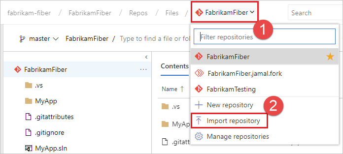

# Import repositories from TFVC to Git
#### Azure Repos | TFS 2018 | TFS 2017 Update 2

You can migrate code from an existing TFVC repository to a new Git repository within the same organization. While migrating to Git has many benefits, it is an involved process for large TFVC repositories and teams. Centralized version control systems, like TFVC, behave different than Git in fundamental ways. The switch involves a lot more than learning new commands. It is a disruptive change that requires careful planning. You need to think about:

* Revising tools and processes
* Removing binaries and executables
* Training your team

We strongly recommend reading our whitepapers - [Centralized version control to Git](/azure/devops/learn/git/centralized-to-git) and [TFVC to Git](/azure/devops/learn/git/migrate-from-tfvc-to-git) before starting the migration.

The import experience is great for small simple TFVC repositories. It's also good for repositories that have already been "cleaned up" as outlined in the previous whitepapers. Those whitepapers also recommend other tools for more advanced TFVC repository configurations.

## Importing the repository

::: moniker range=">= azure-devops-2019"

1. Select **Repos**, **Files**.

  

1. From the repo drop-down, select **Import repository**.

  

1. Select TFVC from the **Source type** dropdown

1. Type the path to the repository / branch / folder that you want to import to the Git repository. For example, `$/Fabrikam/FabrikamWebsite`

1. If you want to migrate history from the TFVC repository, click **Migrate history** and select the number of days. You can migrate up to 180 days of history starting from the most recent changeset. 
A link to the TFVC repository is added in the commit message of the 1st changeset that is migrated to Git. This makes it easy to find older history when needed.

1. Give a name to the new Git repository and click **Import**. Depending on the size of the import, your Git repository would be ready in a few minutes. 

  

> [!IMPORTANT] 
> Due to the differences in how TFVC and Git store version control history, we [recommend](/azure/devops/learn/git/migrate-from-tfvc-to-git) that you don't migrate your history. This is the approach that Microsoft took when it migrated Windows and other products from centralized version control to Git.

::: moniker-end

::: moniker range="<= tfs-2018"

1. From the repo drop-down, select **Import repository**.

1. Select TFVC from the **Source type** dropdown

2. Type the path to the repository / branch / folder that you want to import to the Git repository. For example, `$/Fabrikam/FabrikamWebsite`

3. If you want to migrate history from the TFVC repository, click **Migrate history** and select the number of days. You can migrate up to 180 days of history starting from the most recent changeset. 
A link to the TFVC repository is added in the commit message of the 1st changeset that is migrated to Git. This makes it easy to find older history when needed.

4. Give a name to the new Git repository and click **Import**. Depending on the size of the import, your Git repository would be ready in a few minutes. 

> [!IMPORTANT] 
> Due to the differences in how TFVC and Git store version control history, we [recommend](/azure/devops/learn/git/migrate-from-tfvc-to-git) that you don't migrate your history. This is the approach that Microsoft took when it migrated Windows and other products from centralized version control to Git.

::: moniker-end

### Troubleshooting

This experience is optimized for small, simple TFVC repositories or repositories that have been prepared for a migration. This means it has a few limitations.

1. It only migrates the contents of root or a branch. For example, if you have a TFVC project at `$/Fabrikam` which has 1 branch and 1 folder under it, a path to import `$/Fabrikam` would import the folder 
while `$/Fabrikam/<branch>` would only import the branch.  
2. The imported repository and associated history (if imported) cannot exceed 1GB in size.
3. You can import up to 180 days of history.

If any of the above is a blocker for your import, we recommend you try external tools like [Git-TFS](https://github.com/git-tfs/git-tfs) for importing and reading our whitepapers - [Centralized version control to Git](/azure/devops/learn/git/centralized-to-git) and [TFVC to Git](/azure/devops/learn/git/migrate-from-tfvc-to-git)
