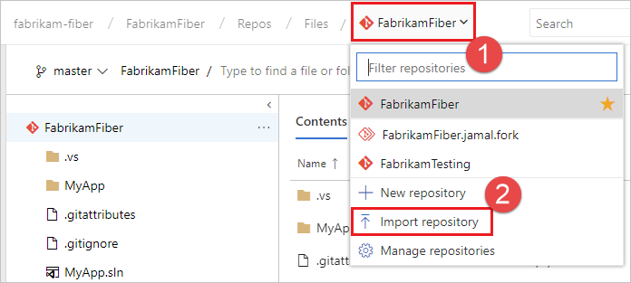
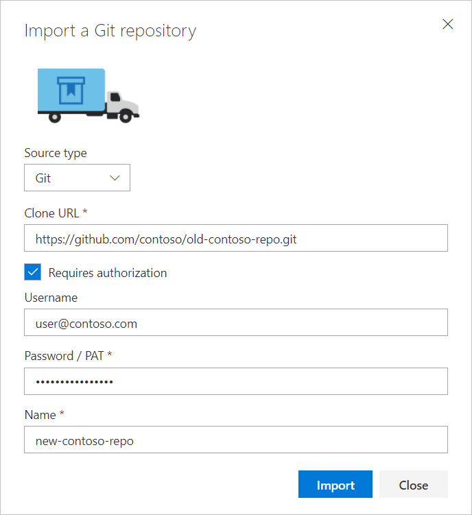
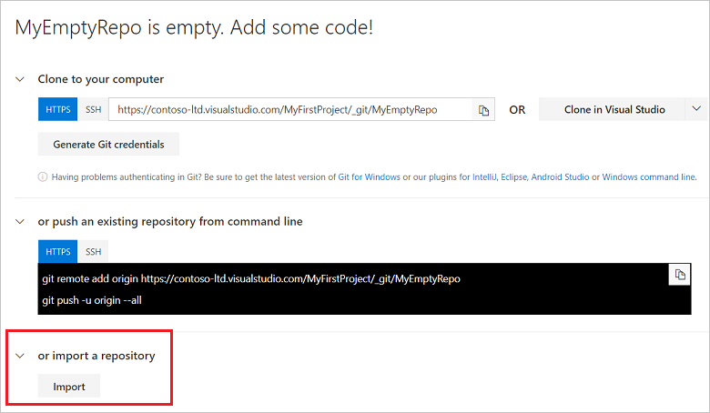

# Import a Git repo

[!INCLUDE [version-lt-eq-azure-devops](../../includes/version-lt-eq-azure-devops.md)]

This article shows you how to import an existing Git repo from GitHub, Bitbucket, GitLab, or other location into a new or empty existing repo in your Azure DevOps project.

::: moniker range="tfs-2018"

>[!IMPORTANT]
>The **Import repository** feature is currently not working if you are importing a GitHub repo using TFS 2017.1 to TFS 2018.1. For more information about this issue, see [Weak cryptographic standards removal notice](https://githubengineering.com/crypto-removal-notice/) and [Unable to connect to GitHub due to TLS 1.2 only change](https://developercommunity.visualstudio.com/content/problem/201457/unable-to-connect-to-github-due-to-tls-12-only-cha.html)

There are several workarounds to this issue:
* You can import a GitHub repo into Azure Devops using the steps provided later in this article, [Manually import a repo using git CLI](#manual-import-git-cli).
* You can set a machine-wide .NET registry key on your Application Tier servers to enable them to use all available TLS protocol versions. After setting these registry keys, you will need to recycle the TFS application pools (or restart the servers) for the settings to be activated. Open an elevated command prompt and run the following commands to set the registry keys.
 
     ```
      reg add HKLM\SOFTWARE\Microsoft\.NETFramework\v4.0.30319 /v SystemDefaultTlsVersions /t REG_DWORD /d 1 /f /reg:64
      reg add HKLM\SOFTWARE\Microsoft\.NETFramework\v4.0.30319 /v SystemDefaultTlsVersions /t REG_DWORD /d 1 /f /reg:32
     ```

* On your Application Tier servers, you can modify the web.config file to change the targetFramework from `<httpRuntime targetFramework="4.5"` to `<httpRuntime targetFramework="4.6"`.

This issue is resolved starting with [Team Foundation Server 2018 Update 2 RC1 and higher](/visualstudio/releasenotes/tfs2018-update2).

::: moniker-end

## Prerequisites

::: moniker range="azure-devops"
- An organization in Azure DevOps. If you don't have one, you can [sign up](../../organizations/accounts/create-organization.md) for one for free. Each organization includes free, unlimited private Git repositories.
- To create or import a repository, you must be a member of the Project Administrators security group, or have the Git project-level **Create repository** permission set to **Allow**. To learn more, see [Set Git repository permissions](set-git-repository-permissions.md).
- To use the Azure DevOps **Import repository** feature, you must have TFS 2017 Update 1 or higher. 
- To import a repository using TFS 2017 RTM or earlier, see [Manually import a repo using git CLI](#manual-import-git-cli).
- If you want to use **az repos** commands, be sure to follow the steps in [Get started with Azure DevOps CLI](../../cli/index.md).
::: moniker-end

::: moniker range="< azure-devops"
- An organization in Azure DevOps. If you don't have one, you can [sign up](../../organizations/accounts/create-organization.md) for one for free. Each organization includes free, unlimited private Git repositories.
- To create or import a repository, you must be a member of the Project Administrators security group, or have the Git project-level **Create repository** permission set to **Allow**. To learn more, see [Set Git repository permissions](set-git-repository-permissions.md).
- To use the Azure DevOps **Import repository** feature, you must have TFS 2017 Update 1 or higher. 
- To import a repository using TFS 2017 RTM or earlier, see [Manually import a repo using git CLI](#manual-import-git-cli).
::: moniker-end

## Import into a new repo  
 

::: moniker range=">= azure-devops-2019"

1. Select **Repos**, **Files**.

   

2. From the repo drop-down, select **Import repository**.

   

3. If the source repo is publicly available, just [enter the clone URL](clone.md#clone_url) of the source repository and a name for your new Git repository.

   If the source repository is private but can be accessed using basic authentication (username-password, personal access token, etc.),  select **Requires authorization** and enter your credentials. SSH authentication is not supported, but you can manually import a repository that uses SSH authentication by following the steps in [Manually import a repo using git CLI](#manual-import-git-cli).

   

::: moniker-end

::: moniker range="tfs-2018"

From the repo drop-down, select **Import repository**.


If the source repo is publicly available, just [enter the clone URL](clone.md#clone_url) of the source repository and a name for your new Git repository.

If the source repository is private but can be accessed using basic authentication (username-password, personal access token, etc.),  select **Requires authorization** and enter your credentials. SSH authentication is not supported, but you can manually import a repository that uses SSH authentication by following the steps in [Manually import a repo using git CLI](#manual-import-git-cli).


::: moniker-end


## Import into an existing empty repo 

On the **Files** page of the empty Git repository, select **Import** and [enter the clone URL](clone.md#clone_url). You will need to provide credentials if the source repository requires authentication. 



> [!NOTE]
> The import feature disables automated linking for work items mentioned in a commit comment since the work item IDs in the destination project might not be the same as ones in the source project. Automatic linking for work items mentioned in a commit can be re-enabled by navigating to **Settings**, **Version Control**,  selecting your repository, and choosing **Options**. For more information on linking commits with work items, see [Link work items to commits](share-your-code-in-git-vs.md#link-work-items)
 

::: moniker range="azure-devops"

## Manually import a repo using az repos CLI

You can use [az repos import](/cli/azure/repos/import#az-repos-import-create) to import a repository to your Azure DevOps project.  

> [!NOTE]
> You must first create the repository in Azure DevOps before you can import a Git repository. Also, the repository you create must be empty. To create a repo, see [Create your Git repo in Azure Repos](share-your-code-in-git-cmdline.md#create-your-git-repo-in-azure-repos).

```azurecli
az repos import create --git-source-url
                       [--detect {false, true}]
                       [--git-service-endpoint-id]
                       [--org]
                       [--project]
                       [--repository]
                       [--requires-authorization]
                       [--subscription]
                       [--user-name]
```

**Parameters**

|Parameter|Description|
|---------|-----------|
|`git-source-url`| Required. URL of the source git repository to import.  |
|`detect`| Optional. Automatically detect organization. Accepted values: `false`, `true`.|
|`git-service-endpoint-id`| Optional.  Service Endpoint for connection to external endpoint.  |
|`org`, `organization`| Azure DevOps organization URL. You can configure the default organization by using `az devops configure -d organization=<ORG_URL>`. **Required** if not configured as default or picked up via git config. Example: `https://dev.azure.com/MyOrganizationName/`.|
|`project`, `p`|Name or ID of the project. You can configure the default project using `az devops configure -d project=<NAME_OR_ID>`. **Required** if not configured as default or picked up via git config. 
|`repository`| Name or ID of the repository to create the import request in.  |
|`requires-authorization`| Flag to indicate if the source git repository is private. If you require authentication, then generate an authentication token on the source repo and set the environment variable `AZURE_DEVOPS_EXT_GIT_SOURCE_PASSWORD_OR_PAT` to the value of the token. Then the import request will include authentication. |
|`subscription`| Name or ID of subscription. You can configure the default subscription using `az account set -s <NAME_OR_ID>`.|
|`user-name`| User name to specify when the git repository is private.|
  


**Example**

The following command imports the public repo *fabrikam-open-source* to the empty Git repo *fabrikam-open-source* for the default configuration `az devops configure --defaults organization=https://dev.azure.com/fabrikamprime project="Fabrikam Fiber"`.


```azurecli
az repos import create --git-source-url https://github.com/fabrikamprime/fabrikam-open-source --repository fabrikam-open-source
{
  "detailedStatus": {
    "allSteps": [
      "Processing request",
      "Analyzing repository objects",
      "Storing objects",
      "Storing index file",
      "Updating references",
      "Import completed successfully"
    ],
    "currentStep": 6,
    "errorMessage": null
  },
  "importRequestId": 8,
  "parameters": {
    "deleteServiceEndpointAfterImportIsDone": null,
    "gitSource": {
      "overwrite": false,
      "url": "https://github.com/fabrikamprime/fabrikam-open-source"
    },
    "serviceEndpointId": null,
    "tfvcSource": null
  },
  "repository": {
    "defaultBranch": null,
    "id": "0f6919cd-a4db-4f34-a73f-2354114a66c4",
    "isDisabled": false,
    "isFork": null,
    "name": "new-empty-repo",
    "parentRepository": null,
    "project": {
      "abbreviation": null,
      "defaultTeamImageUrl": null,
      "description": "Guidance and source control to foster a vibrant ecosystem for Fabrikam Fiber applications and extensions.",
      "id": "56af920d-393b-4236-9a07-24439ccaa85c",
      "lastUpdateTime": "2021-05-24T21:52:14.95Z",
      "name": "Fabrikam Fiber",
      "revision": 438023732,
      "state": "wellFormed",
      "url": "https://dev.azure.com/fabrikamprime/_apis/projects/56af920d-393b-4236-9a07-24439ccaa85c",
      "visibility": "private"
    },
    "remoteUrl": "https://fabrikamprime@dev.azure.com/fabrikamprime/Fabrikam%20Fiber/_git/fabrikam-open-source",
    "size": 12477,
    "sshUrl": "git@ssh.dev.azure.com:v3/kelliott/Fabrikam%20Fiber/new-empty-repo",
    "url": "https://dev.azure.com/fabrikamprime/56af920d-393b-4236-9a07-24439ccaa85c/_apis/git/repositories/0f6919cd-a4db-4f34-a73f-2354114a66c4",
    "validRemoteUrls": null,
    "webUrl": "https://dev.azure.com/fabrikamprime/Fabrikam%20Fiber/_git/fabrikam-open-source"
  },
  "status": "completed",
  "url": "https://dev.azure.com/fabrikamprime/Fabrikam%20Fiber/_apis/git/repositories/0f6919cd-a4db-4f34-a73f-2354114a66c4/importRequests/8"
}
```

::: moniker-end

<a id="manual-import-git-cli" /> 

## Manually import a repo using git CLI

The import repo feature was introduced in TFS 2017 Update 1. If you are using TFS 2017 RTM or earlier, you can use the following steps to manually import a repo into TFS. You can also follow these steps to manually import a repo into an Azure DevOps Services repo by replacing TFS with Azure Repos in the following steps.

1. Clone the source repo to a temporary folder on your computer using the `bare` option, as shown in the following command line example, and then navigate to the repo's folder. When cloning using the `bare` option, the folder name includes the `.git` suffix. In this example, `https://github.com/contoso/old-contoso-repo.git` is the source repo to be manually imported.

    ```
    git clone --bare https://github.com/contoso/old-contoso-repo.git
    cd old-contoso-repo.git
    ```

2. [Create a target repo](create-new-repo.md#create-a-repo-using-the-web-portal) using TFS 2017 RTM, and make a note of the clone URL. In this example, `https://dev.azure.com/contoso-ltd/MyFirstProject/_git/new-contoso-repo` is the URL for the new target repo.

3. Run the following command to copy the source repo to the target repo.

    ```
    git push --mirror https://dev.azure.com/contoso-ltd/MyFirstProject/_git/new-contoso-repo
    ```
    
   > [!WARNING]
   > Using `--mirror` will overwrite all branches in the target repo which includes deleting any branches not in the source repo.

4. If the source repository has LFS objects then fetch them, and copy them from the source repo to the target repo.

    ```
    git lfs fetch origin --all
    git lfs push --all https://dev.azure.com/contoso-ltd/MyFirstProject/_git/new-contoso-repo
    ```
5. Delete the temporary folder by running the following commands.

    ```
    cd ..
    rm -rf old-contoso-repo.git
    ```
 

## Frequently asked questions


Although most of the time the import is successful, the following conditions can cause problems.

* [What if my Source repository is behind two-factor authentication?](#what-if-my-source-repository-is-behind-two-factor-authentication)
* [What if my source repository does not support multi_ack?](#multiack)
* [Can I import from previous versions of Team Foundation Server?](#can-i-import-from-previous-versions-of-team-foundation-server)
* [Can I use MSA-based credentials?](#can-i-use-msa-based-credentials)
* [Can I import from TFVC?](#can-i-import-from-tfvc)
* [What if my source repository contains Git LFS objects?](#what-if-my-source-repository-contains-git-lfs-objects)

### What if my source repository is behind two-factor authentication?

The import service uses REST APIs to validate and trigger import and cannot work directly with repositories that require two-factor authentication.
Most Git hosting providers like [GitHub](https://help.github.com/articles/creating-an-access-token-for-command-line-use/) and [Azure DevOps Services](../../organizations/accounts/use-personal-access-tokens-to-authenticate.md) support personal tokens which can be supplied to the import service. 

<a id="multiack" />

### What if my source repository does not support multi_ack?

The import service uses the [multi_ack](https://git-scm.com/book/en/v2/Git-Internals-Transfer-Protocols) capability of the Git protocol during the import.
If the source repository does not provide this capability, the import service can fail to import from the given source.
This failure can happen when creating import request or while import is in progress.


### Can I import from previous versions of Team Foundation Server?

If the source Git repository is in a TFS version earlier than TFS 2017 RTM, then import will fail.
This happens because of a contract mismatch between the latest Azure DevOps Services/TFS and pre-2017 RTM versions of TFS.
 


### Can I use MSA-based credentials?

Unfortunately, MSA (Microsoft Account, formerly Live ID) based credentials will not work. Import service relies on basic authentication to communicate with the source repository. If the username / password you are using are not basic auth then authentication will fail and import will fail.
One way to check if the username / password you are using are basic auth or not is to try using Git to clone your repository using the below format

```
git clone https://<<username>>:<<password>>@<<remaining clone Url>>
```

### Can I import from TFVC?

You can migrate code from an existing TFVC repository to a new Git repository within the same account. While migrating to Git has many benefits, it is an involved process for large TFVC repositories and teams. Centralized version control systems, like TFVC, behave different than Git in fundamental ways. The switch involves a lot more than learning new commands. It is a disruptive change that requires careful planning. For more information, see [Import from TFVC to Git](import-from-tfvc.md).

### What if my source repository contains Git LFS objects?

Git import will not import Git LFS objects.

LFS objects can be moved using the following steps:
- Import the repository using import repository feature into Azure DevOps.
	This will copy over all the Git objects from source to Azure DevOps (this will also import the LFS pointers which are Git objects but not the LFS files)

To move over the LFS files (you will need both Git.exe and LFS client in the same box and access to both source repository and destination repository)
- Clone the imported repository from Azure DevOps to local system, clone will work but it will fail while performing checkout of LFS files
- Add the source repository as remote (say ‘source’)
- Perform `git lfs fetch source --all`  (this will bring over all LFS files from source to your local repository)
- Assuming the destination VSTS repository is your ‘target’ remote 
- Perform `git lfs push target --all`

### Can I import updates if the source changes later?

The import service is for initially importing a entire repository.
To mirror later changes, you'll need a local clone of the repository with remotes set to both source and destination.

You can sync changes using the following commands.
We'll treat the Azure Repos import as `origin` and the original repo as `upstream`.

```shell
git clone --bare <Azure-Repos-clone-URL>
cd <name-of-repo>
git remote add --mirror=fetch upstream <original-repo-URL>
git fetch upstream --tags
git push origin --all
```


## Next steps

> [!div class="nextstepaction"]
> [New to Git repos? Learn more](/devops/develop/git/set-up-a-git-repository)

## Related articles
- [Learn more about Git in the Git tutorial](gitworkflow.md)


