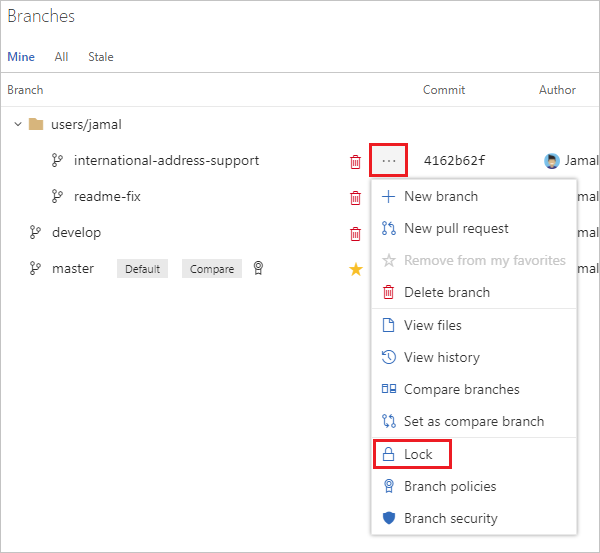

# Lock a branch
#### Azure Repos | TFS 2018 | TFS 2017 | TFS 2015

Prevent updates to a Git [branch](branches.md) by locking the branch. 
Locking a branch prevents other users from changing the existing commit history. 
Locking also blocks any new commits from being added to the branch by others. 

## Locking limitations

Locking is ideal for preventing new changes that might conflict with an important merge or to place a branch into a read-only state. 
Use [branch policies](branch-policies.md) and [pull requests](pull-requests.md) instead of locking if you just want to ensure that changes in a branch are reviewed before they are merged.

Locking does not prevent cloning of a repo or fetching updates made in the branch into your local repo.
Share with your team the reason for the locking of the branch and make sure your team knows what to do to work with the branch after it is unlocked. 

> Only the user who locked the branch or a user with [Remove Others' Locks permissions](../../organizations/security/set-git-tfvc-repository-permissions.md#git-repository) for the branch can remove the lock.

## Lock a branch using the Branches view

0. Open your repo on the web and [select the **Branches** view](manage-your-branches.md).

0. Locate your branch on the **Branches** view. You can search for your branch using the **Search all branches** box in the upper right.

0. Lock the branch by selecting the **...** icon next to the branch name and then selecting **Lock** from the menu. A lock icon will appear next to the branch name.
Unlock a locked branch by selecting **Unlock** from the same menu.

   

