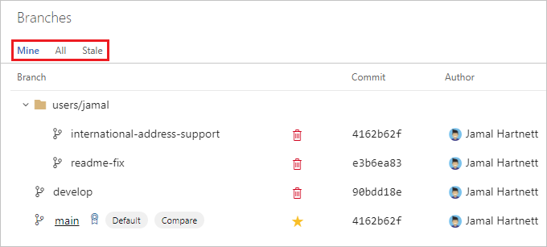
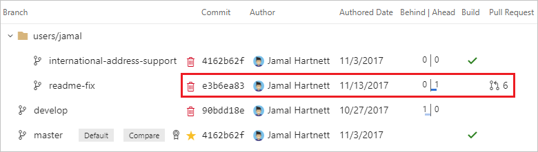

# Manage branches

**Azure Repos | Azure DevOps Server 2020 | Azure DevOps Server 2019 | TFS 2018 | TFS 2017**

Manage the work in your team's Git repo from the **Branches** view on the web. 
Customize the view to track the branches you care most about so you can stay on top of changes made by your team.

::: moniker range=">= azure-devops-2019"

View your repo's branches by selecting **Repos**, **Branches** while viewing your repo on the web.

::: moniker-end

::: moniker range="<= tfs-2018"

View your repo's branches by selecting **Branches** while viewing your repo on the web.

::: moniker-end

## Organize your branches

The default **Mine** tab on the branches page shows branches you've created, pushed changes to, or set as a favorite, along with the default branch for the repo, such as `master`. The **All** tab lists all branches in the repo, and the **Stale** tab lists branches in the repo that haven't had any commits in three months or longer.

If you don't see the branch you're looking for and you think it might have been deleted, see [Restore a deleted branch](restore-deleted-branch.md).

Filter the listed branches in any of the branch views by entering a specific name or pattern in the **Search all branches** box in the upper right.

  
If your team uses a forward slash separator in your branch names, you'll see a collapsible tree view for those branches.

>[!TIP]   
> Using a naming convention for your branches is highly recommended. For suggestions on how to name your branches, see [Adopt a Git branching strategy](git-branching-guidance.md).   

### Add favorite branches

Add branches from the **All** view to the **Mine** view by selecting the star icon to favorite the branch. 
Mark multiple branches as favorites by selecting the star icon on the tree view next to a folder on the tree.
Remove favorites by toggling the star off or by selecting the **...** to the right of the star to open the branch context menu, then selecting **Remove from my favorites**.

## Review updates to your branches

Each branch name has the name of the last contributor to the branch and a link to the latest commit on the branch. Select the date or time of the last commit to review the updates to the branch.
The branch view also shows the number of commits the branch is ahead of and behind the branch labeled **Compare**. Use this information to quickly check how far a branch has diverged from another.

If the branch has a pull request open, you can see its pull request ID. Select the pull request to open it up so you can review the details.

### Change the compare branch

The ahead and behind numbers listed for each branch are in comparison with the branch currently labeled **Compare** on the Branches page. Update your compare branch to see how far ahead or behind
your branches shown on the page are to another branch in your repo:

1. Select the **...** next to the branch you want to set as the baseline for comparison.   
2. Select **Set as compare branch**.

The **Compare** label will move to this branch and the other branches on the page will have the number of commits ahead/behind updated to reflect the new comparison.

## View branch history

Review the files in a branch or history by selecting the **...** icon next to the branch name and choosing **View files** or **View history**. **View files** opens up the **Files** view on the web so you can 
browse the files based on the most recent commit on the branch. **View history** shows each commit in the branch history. Select a commit from this history to see the file changes made in that commit.

## Change your default branch

[!INCLUDE ]

There are other aspects you should consider before making this change.
Learn about them in the topic on [changing your default branch](change-default-branch.md).
