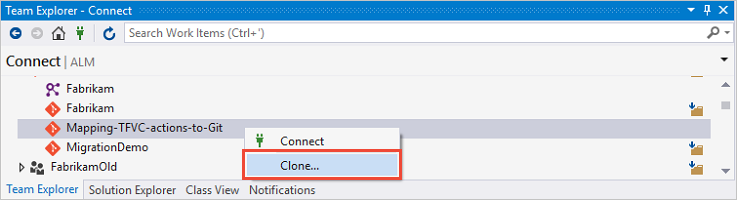
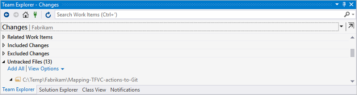
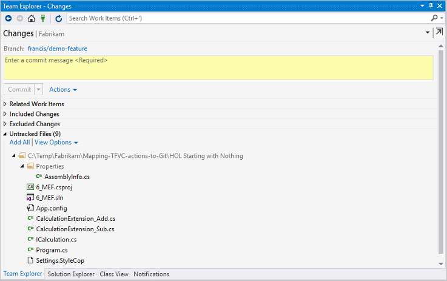

# Learn to map your familiar Team Foundation Version Control (TFVC) commands and workflows to Git 

Do you plan to adopt Git, are familiar with [TFVC](../tfvc/index.md) actions, and wondering how they map to [Git](index.md)? Both are powerful and mature source control systems. However, mapping common actions you have grown accustomed to in the one to the other can be a confusing experience.

This article will not delve deep into the [Git commands](http://git-scm.com/book/commands), as they are well documented in the product documentation, but show examples to help you make the right decisions, while moving through a typical create -> clone -> branch -> change -> commit -> push [workflow](http://www.git-scm.com/book/en/v2/Git-Branching-Branching-Workflows).

## Start at the beginning by creating a new repo

Each Project can host [TFVC and Git repositories in the same project](http://blogs.msdn.com/b/visualstudioalm/archive/2015/12/03/tfvc-and-git-repositories-in-the-same-team-project.aspx), creating one TFVC, and one or more Git repositories.


Once the repo is created, you are presented with step-by-step instructions to quickly get started. 


Click on the `Create a ReadMe file' at the end of the instruction page, to give the repo context and to create some history.


## Create a workspace and get latest

When connecting to a TFVC repo for the first time, you typically create a workspace and get the latest code. so, how do you get started in Git?

Similar to a workspace in TFVC you `clone` the Git repository to a folder on your machine. Cloning will download all of the contents and history of the repository, to your local machine. Once you have the cloned repo, nearly all operations are performed locally. You are able to work offline with a full backup of the centralized repository.

# [Command Line](#tab/command-line)

```
git clone https://dev.azure.com/demo-fabrikam/Fabrikam/_git/Mapping-TFVC-actions-to-Git
```

# [Visual Studio](#tab/visual-studio)



---

You only need to clone once per repo, but like TFVC workspaces, you can have multiple clones to isolate in-progress work.  However, branching is typically a better way to isolate changes.

## Create a branch

With Git, you are always working in a branch and by default in the "master" branch. You are recommended to create multiple local branches. It's a process that takes seconds and allows you to seamlessly context switch between branches and work in isolation. Unlike TFVC branches, which are paths scoped, Git branches are repository scoped. They are lightweight, can be local only, or shared with others when you are ready to share your changes.

Consider branching if you need to work in isolation, need to suspend your work, focus on new features, or if you are planning to conduct a Git [pull request](pull-requests.md).

As a TFVC user, repeat a few times:

* Branching is recommended!
* Git branching is **inexpensive**, **fast**, and **powerful**!
* Git encourages you to use **local** branches.
* Publish local branches to your centralized repository as needed.
* Always verify your branch context before making changes.
* Name the branch using a common convention such as users/alias/branchname for example: users/doris/newfeature

Create and switch to a local topic branch, named *francis/demo-feature*. It is good practice to run a `git status` first, to verify that you are on the right branch to start with.

# [Command Line](#tab/command-line)

```
git checkout -b francis/demo-feature
```


# [Visual Studio](#tab/visual-studio)

In Visual Studio, choose **Team Explorer > Branches > right-click on branch > New Local Branch From...**


---

## Make a change by adding files

Similar to the TFVC experience, new files in the working folder are not automatically part of the repository. You stage your new files with the `git add` command, which is synonymous to performing an `add Items to Folder` operation in TFVC.

Here's a [sample](http://vsarguidance.codeplex.com/downloads/get/739947) project to try adding files to your repo.

# [Command Line](#tab/command-line)

```
git add <file>
``` 

or  

```
git add --all
```


# [Visual Studio](#tab/visual-studio)

In Visual Studio, choose **Team Explorer > Changes > Untracked Files > add individual files or add all**



---


Using the pre-baked sample, you will have 13 new files that have been included and staged in the local repository.

## View pending changes

Wondering what changes are now sitting in your working environment? As before, the Git `status` command or the `Changes` view in the Visual Studio IDE will show changes in your working tree. 

# [Command Line](#tab/command-line)

```
git status
```


# [Visual Studio](#tab/visual-studio)

In Visual Studio, choose **Team Explorer > Changes > Included Changes**



---

## Checkin changes and commit locally

In TFVC, you share your changes with a Check In, which sends your pending changes to the server.  The Git process is a bit different.  First, you commit to the local repository, creating a commit object (like a changeset), then you push to send those changes with the server.

You commit the changes to your local repository using `git commit`, which feels like doing a `Checkin Pending Changes` in TFVC. A key difference is that the `git commit` commits your changes to the **local**, not the **remote** repository. 

# [Command Line](#tab/command-line)

```
git commit
```


# [Visual Studio](#tab/visual-studio)

In Visual Studio, choose **Team Explorer > Changes > Commit**
 


---

## Check in changes with the server/remote repo

First you need to publish your local francis/demo-feature branch to the remote server, which includes all committed changes.

# [Command Line](#tab/command-line)

```
git push --set-upstream origin francis/demo-feature
```


# [Visual Studio](#tab/visual-studio)

In Visual Studio, choose **Team Explorer > Branches > right-click on local branch > Publish Branch**


---

To synchronize further updates in your local with the remote repository, you need to push your changes using `git push`. The recommended practice using the git command or the Visual Studio IDE is to:

* `fetch` to download content and preview incoming changes from others.
* `pull` to download and then merge changes from others.
* `push` to share your local changes.

## View history

To see the commit, you just created you can review the local history.

# [Command Line](#tab/command-line)

For a compact history, use:

```
git log --oneline
```

For a detailed, view, use:

```
git log
```


As shown above, `git log` lists the author, email, date written, and the commit SHA-1 checksum. As a TFVC user you may want to use the `--stat` option to include more information, such as file name and change statistics. 

# [Visual Studio](#tab/visual-studio)

You can retrieve a history view of the **local** repository in the Visual Studio IDE.

In Visual Studio, choose **Team Explorer > Branches | Changes | Sync > Actions > View History**


---

You can also view the history of the **centralized** repository using the Azure DevOps Services web portal.

In the Azure DevOps Services web portal, choose **CODE > History** or **CODE > Explorer > History**


At this point, you have successfully explored the create -> clone -> branch -> change -> commit -> push [workflow](http://www.git-scm.com/book/en/v2/Git-Branching-Branching-Workflows), based on common TFVC actions. 

You also have the option of issuing a [pull request](pull-requests.md), to publish and stage your changes on the server/remote repo at this point.

## Other actions

### Switch branches

When working with Git, you do not change branches by switching to separate folders and locations on your machine. You change the context by doing a `checkout`, making the entire working directory match the selected branch or commit. **Fast** and **simple**!

### Command line

```
git checkout <branch>
```

If you forgot what branches you have in your local repository, use `git branch` to list the default and known branches.

Keep in mind which branch you are working on! When you work with multiple branches in Git, you switch branches in place in the same working directory. Switching between branches is a fast operation, and making sure you are on the right branch at all times is good practice.

### Get latest version

There are lots of reasons to want to get updates. For example, when you need to switch context to another project, refresh your development machine with the latest version of the codebase.

### Command line

```
git pull
```

or 

```
git fetch
``` 

followed by 

```
git merge FETCH_HEAD
```

Always get the latest version and resolve merge conflicts locally.

### Undo local changes

There may be a valid reason to revert all revisions you made in your local repository and reset your working environment to the latest version from the remote repository. 

### Command line

```
git reset --hard HEAD
```

followed by 
```
git pull origin
``` 

followed by 
```
git clean -xdf
```


The scenario is synonymous to doing a `Get > Latest Version` with the `Overwrite writable files that are not checked out` and `Overwrite all files if the local version matches the specified version` options in TFVC.

Alternatively you can manually delete your local repo - after making a validated copy off course - and then `clone` the repository again.

There are a lot more actions and options available to Git users. Here are some useful reference sites for further reading:

* Git commands covered herein, refer to [git documentation](http://git-scm.com/documentation)
* [Think like (a) Git](http://think-like-a-git.net), a Guide for the Perplexed.
* [How to undo (almost) anything with Git](https://github.com/blog/2019-how-to-undo-almost-anything-with-git), by Joshua Wehner

## Q&A

### What about sync?

"*Does the Visual Studio IDE `Commit and Sync` not magically do all this?*", you may be asking yourself.


With magic comes responsibility! Many users dislike the `sync` as it can sometimes mess up your local history and add a merge commit on top of your current commit. Once you are in a bad state, you have to revert to the command line as there is currently no reset support in the IDE.

Authors: Jesse Houwing, Martin Hinshelwood, Mike Fourie, and Willy Schaub from the ALM | DevOps Rangers. Connect with them [here](https://github.com/ALM-Rangers/Guidance/blob/master/README.md).

*(c) 2015 Microsoft Corporation. All rights reserved. This document is
provided "as-is." Information and views expressed in this document,
including URL and other Internet Web site references, may change without
notice. You bear the risk of using it.*

*This document does not provide you with any legal rights to any
intellectual property in any Microsoft product. You may copy and use
this document for your internal, reference purposes.*
