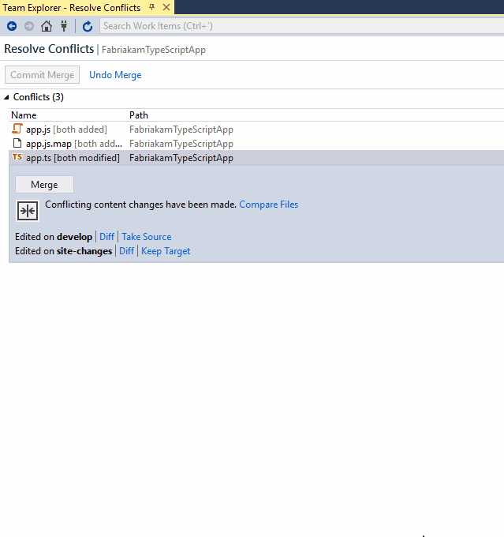

# Resolve merge conflicts

#### Azure Repos | TFS 2018 | TFS 2017 | TFS 2015 | VS 2017 | VS 2015 | VS 2013

When you [merge](pulling.md) one branch into another, file changes from commits in one branch can conflict with the changes the other.
Git attempts to resolve these changes by using the [history](review-history.md) in your repo to determine what the merged files should look like.
When it isn't clear how to merge changes, Git halts the merge and tells you which files conflict. 

In this tutorial you learn how to:

> [!div class="checklist"]
> * Understand merge conflicts
> * Resolve merge conflicts

## Understand merge conflicts

The following image shows a very basic example of how changes conflict in Git. Both the master and bugfix branch make updates to the same lines of source code.

    

If you try to merge the bugfix branch into master, Git can't determine which changes to use in the merged version. You may want to keep the changes
in the master branch, the bugfix branch, or some combination of the two. Resolve this conflict with a merge commit on the master branch
that reconciles the conflicting changes between the two branches.


The most common merge conflict situation is when you pull updates from a remote branch to your local branch, for example from `origin/bugfix` into your local `bugfix` branch.
Resolve these conflicts in the same way - create a merge commit on your local branch reconciling the changes and complete the merge.

### What does Git do to prevent merge conflicts?

Git keeps an entire history of all changes made in your repo. Git uses this history as well as the relationships between commits to see if it can order the changes and resolve the merge automatically. 
 Conflicts only occur when it's not clear from your history how changes to the same lines in the same files should merge.

### Preventing merge conflicts

Git is very good at automatically merging file changes in most circumstances, provided that the file contents don't change dramatically between commits.
Consider [rebasing](rebase.md) branches before you open up a [pull request](pullrequest.md) if your branch is far behind your main branch.
Rebased branches will merge into your main branch without conflicts.

## Resolve merge conflicts 

# [Visual Studio](#tab/visual-studio)

0. You'll be informed of the merge conflict(s) when you pull changes or attempt to merge two branches.   
0. The conflict notification appears. Click the **Conflicts** link to start resolve file conflicts.   
   
      

0. This will bring up a list of files with conflicts. Selecting a file lets you accept the changes in the source branch you are merging from with the **Take Source** button or accept the changes in the branch you are merging into using **Keep Target**. 
You can manually merge changes by selecting **Merge**, then entering the changes directly into the merge tool specified in your [Git settings](git-config.md#diff--merge-tools).
0. Use the checkboxes next to the lines modified to select between remote and local changes entirely, or edit the results directly in the **Result** editor under the **Source** and **Target** editor in the diff view.   
0. When done making changes, click **Accept Merge** . Repeat this for all conflicting files.
0. Open the **Changes** view in Team Explorer and commit the changes to create the merge commit and resolve the conflict.

     

    Compare the conflicting commits as well as the differences between the common history with the options in Visual Studio's merge tool.   

    

# [Command Line](#tab/command-line)

Resolve merge conflicts on the command line:   

0. (Optional) Before performing any `pull` or `merge`, make sure that your repo is clean with `git status`. 

    <pre style="color:white;background-color:black;font-family:Consolas,Courier,monospace;padding:10px">
    &gt; git status
    <font color="#b5bd68">On branch myfeature
    nothing to commit, working directory clean</font>
    </pre>

0. Perform your `pull` or `merge`. Use `git status` to see exactly which files did not merge properly.

    <pre style="color:white;background-color:black;font-family:Consolas,Courier,monospace;padding:10px">
    &gt; git pull origin <font color="#b5bd68">myfeature </font>   
    
    <font color="#b5bd68">Auto-merging serverboot.js
    CONFLICT (content): Merge conflict in serverboot.js
    Automatic merge failed; fix conflicts and then commit the result</font>
    </pre>

0. (Optional) Check the commit logs to find the commits that conflict with your own using `git log --merge`. 

    <pre style="color:white;background-color:black;font-family:Consolas,Courier,monospace;padding:10px">
    &gt; git log --merge
    <font color="#b5bd68">commit fac422e78f105ccb44b50a00fc82d6ea89b15513
    Merge: 9b28b1e 1dd2603
    Author: Francis Totten frank@fabrikam.com
    
        merging new api endpoint</font>
    </pre>   

0. Update the conflicted files listed in `git status`. Git adds markers to files that have conflicts. These markers look like:   
   
    ```
    <<<<<<< HEAD
    console.log("Writing changes to dev console");
    =======
    debug("Writing changes to debug module);
    >>>>>>> dev-updates
    ```

    The `<<<<<<<` section are the changes from one commit, the `=======` separates the changes, and `>>>>>>>` for the other conflicting commit.   

0. Edit the files so that they look exactly how they should, removing the markers. Use `git add` to stage the resolved changes.
0. Resolve file deleting conflicts with `git add` (keep the file) or `git rm` (remove the file).
0. If performing a merge (such as in a `pull`), commit the changes. If performing a rebase, use `git rebase --continue` to proceed.

    <pre style="color:white;background-color:black;font-family:Consolas,Courier,monospace;padding:10px">
    &gt; git add <font color="#b5bd68">serverboot.js</font>
    &gt; git commit -m <font color="#b5bd68">"Resolved both new api endpoints"</font>
    </pre>

---

## Next steps

> [!div class="nextstepaction"]
> [Undo changes](undo.md)

