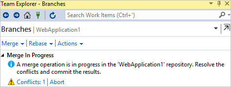

# Resolve merge conflicts

[!INCLUDE [version-lt-eq-azure-devops](../../includes/version-lt-eq-azure-devops.md)]
[!INCLUDE [version-vs-gt-2015](../../includes/version-vs-gt-2015.md)]

When you [merge or rebase](pulling.md#update-branches-with-merge-or-rebase), you're telling Git to integrate changes made on one branch with changes made on another. Often, Git completes a merge or rebase automatically without your assistance. However, if Git discovers that a change made on one branch conflicts with a change made on another, it prompts you to resolve the conflict. A merge conflict can occur when the merged branches edit the same file line differently, or when one branch modifies a file and another branch deletes it. The process for resolving merge conflicts is applicable to both Git `merge` and a Git `rebase`.

You can resolve merge conflicts in Visual Studio, or by using the command line and any text editor.

For an overview of the Git workflow, see [Azure Repos Git tutorial](gitworkflow.md).

This article provides procedures for the following tasks:

> [!div class="checklist"]
> * Understand merge conflicts
> * Resolve merge conflicts


## Understand merge conflicts

The Git `merge` command integrates commits from a source branch into your current local branch (the target branch). Git [merge](https://git-scm.com/docs/git-merge) performs either a [fast-forward](https://git-scm.com/docs/git-merge#_fast_forward_merge) or a [no-fast-forward](https://git-scm.com/docs/git-merge#_true_merge) merge. The no-fast-forward merge is also known as a _three-way_ merge or _true_ merge. By default, Git automatically selects the merge type unless you explicitly specify the type. Git [rebase](https://git-scm.com/docs/git-rebase) is another type of merge. These merge types are shown in the following diagram.

:::image type="content" source="media/pulling/merge-types.png" border="true" alt-text="Diagram showing the before and after commits when using Git merge and Git rebase.":::

For Git `merge`, if the tip of the target branch exists within the source branch, the default merge type will be a fast-forward merge. Otherwise, the default merge type will be a no-fast-forward merge.

A [fast-forward](https://git-scm.com/docs/git-merge#_fast_forward_merge) Git `merge` can never have a merge conflict because Git won't apply a fast-forward merge if the tip of the target branch has diverged from the source branch. By default, Git uses a fast-forward merge whenever possible. For example, Git routinely uses a fast-forward merge if you don't work in a local branch and only update it from a remote branch.

A [no-fast-forward](https://git-scm.com/docs/git-merge#_true_merge) Git `merge` generates a new target branch "merge commit" that integrates source branch changes with target branch changes. The applicable changes are those made after the last commit that's common to both branches. In the preceding diagram, commit C is the last common commit in both branches. If any source branch change conflicts with any target branch change, then Git will prompt you to resolve the [merge conflict](merging.md). The merge commit (X) contains the integrated source branch and target branch changes. The source and target branch tips (M and E) are the parents of the merge commit. In your branch's [commit history](/azure/devops/repos/git/review-history), a merge commit is a useful marker for a merge operation, and clearly shows which branches were merged.

The Git [rebase](https://git-scm.com/docs/git-rebase) command resequences the commit history of the target branch so that it contains all source branch commits, followed by the target branch commits that occur after the last common commit in both branches. In the preceding diagram, commit C is the last common commit in both branches. If any source branch change conflicts with any target branch change, then Git will prompt you to resolve the [merge conflict](merging.md). Similarly to a fast-forward Git `merge`, Git `rebase` doesn't create a merge commit.

The Git `merge` or Git `rebase` command only modifies the target branch&mdash;the source branch remains unchanged. When you encounter one or more [merge conflicts](merging.md), you must resolve them to complete the merge or rebase. Or, you can cancel the merge/rebase operation and return the target branch to its prior state.

For more information on Git `merge` options and strategies, see the [Git reference manual](https://git-scm.com/docs/git-merge#_options) and [Git merge strategies](https://git-scm.com/docs/merge-strategies).


### When to resolve merge conflicts

Git [merge](https://git-scm.com/docs/git-merge) and Git [rebase](https://git-scm.com/docs/git-rebase) are extensively used in the [Git workflow](gitworkflow.md). When working on a local feature or bugfix branch, it's common practice to:

1. Keep your local `main` branch updated by periodically [pulling](pulling.md#download-changes-and-update-branches-with-pull) to fetch and merge/rebase new remote commits into it.
1. Merge/rebase to integrate updates on your local `main` branch into your local feature branch.
1. Frequently back up your work on the local feature branch by [pushing](pushing.md) it to the corresponding remote branch.
1. On feature completion, create a [pull request](pull-requests.md) to merge your remote feature branch into the remote `main` branch.

By frequently integrating remote changes into your local repo, you can stay aware of the recent work by others and promptly resolve any merge conflicts that arise.


## Resolve merge conflicts

The process for resolving merge conflicts is applicable to both Git `merge` and a Git `rebase`. Although the following steps describe how to resolve merge conflicts during a Git `merge`, you can similarly resolve merge conflicts during a Git `rebase`.

> [!TIP]
> If the source branch is a [remote-tracking](https://git-scm.com/book/en/v2/Git-Branching-Remote-Branches) branch, ensure that branch is up-to-date by running a Git [fetch](pulling.md#download-changes-with-fetch) before a merge. Or, run the Git [pull](pulling.md#pull) command, which combines a Git `fetch` with a Git `merge`.


#### [Visual Studio 2019](#tab/visual-studio-2019)

Visual Studio 2019 version 16.8 and later versions provides a Git version control experience while maintaining the **Team Explorer** Git user interface. To use **Team Explorer**, uncheck **Tools** > **Options** > **Preview Features** > **New Git user experience** from the menu bar. You can use Git features from either interface interchangeably. Below, we provide a side-by-side comparison of how to resolve merge conflicts during a Git `merge`.

:::row:::
  :::column span="":::

    **Visual Studio Git** <br><br>

    1. In the **Branches** pane of the **Git Repository** window, checkout the target branch. Then right-click the source branch and choose **Merge \<source-branch\> into \<target-branch\>**.

       :::image type="content" source="media/merging/visual-studio-2019/git-experience/branch-merge-git-repository-window.png" border="true" alt-text="Screenshot of the Merge option in the branch context menu in the Git Repository window of Visual Studio 2019." lightbox="media/merging/visual-studio-2019/git-experience/branch-merge-git-repository-window-lrg.png":::

    2. Visual Studio will notify you if Git halted the merge due to conflicts. In that event, you can either resolve the conflicts, or cancel the merge and return to the pre-merge state. The **Unmerged Changes section** of the **Git Changes** window lists the files with merge conflicts. For a file with merge conflicts in its content, double-click the file to open it in the merge editor.

       :::image type="content" source="media/merging/visual-studio-2019/git-experience/unmerged-changes.png" border="true" alt-text="Screenshot of the files with merge conflicts in the Git Changes window of Visual Studio 2019." lightbox="media/merging/visual-studio-2019/git-experience/unmerged-changes-lrg.png":::

    3. In the merge editor, the **Incoming** pane shows the source branch file version, the **Current** pane shows the target branch file version, and the **Result** pane shows the resultant merge file. To apply specific source or target branch changes, select the checkbox next to the conflicting line(s) that you want to keep. You can also directly edit the merge file in the **Result** pane. Choose **Accept Merge** after you've resolved all merge conflicts in the current file. Repeat this step for each file with content conflicts.

       :::image type="content" source="media/merging/visual-studio-2019/git-experience/merge-editor-selections.png" border="true" alt-text="Screenshot of the merge editor in Visual Studio 2019." lightbox="media/merging/visual-studio-2019/git-experience/merge-editor-selections-lrg.png":::

    4. For a file that was edited in one branch and deleted in the other, right-click the file and select which branch action you want.

       :::image type="content" source="media/merging/visual-studio-2019/git-experience/merge-context-menu.png" border="true" alt-text="Screenshot of the context menu for a conflicting file in the Git Changes window of Visual Studio 2019." lightbox="media/merging/visual-studio-2019/git-experience/merge-context-menu-lrg.png":::

    5. In the Git Changes window, enter a commit message and choose **Commit Staged** to complete the merge&mdash;after you've resolved all merge conflicts for all files.

       :::image type="content" source="media/merging/visual-studio-2019/git-experience/merge-commit-staged.png" border="true" alt-text="Screenshot of the commit message and Commit Staged button in the Git Changes window of Visual Studio 2019." lightbox="media/merging/visual-studio-2019/git-experience/merge-commit-staged-lrg.png":::

  :::column-end:::
  :::column span="":::

    **Visual Studio Team Explorer** <br><br>

    1. In the **Branches** view of **Team Explorer**, checkout the target branch. Then right-click the source branch and choose **Merge From**.

       :::image type="content" source="media/pulling/visual-studio-2019/team-explorer/branch-merge.png" border="true" alt-text="Screenshot of the branch Merge From option in the Branches view of Team Explorer in Visual Studio 2019." lightbox="media/pulling/visual-studio-2019/team-explorer/branch-merge-lrg.png":::

    2. Verify the merge options and then click **Merge**.

       :::image type="content" source="media/pulling/visual-studio-2019/team-explorer/branch-merge-details.png" border="true" alt-text="Screenshot of the merge details in the Branches view of Team Explorer in Visual Studio 2019." lightbox="media/pulling/visual-studio-2019/team-explorer/branch-merge-details-lrg.png":::

    3. Visual Studio will notify you if Git halted the merge due to conflicts. In that event, you can either resolve the conflicts, or cancel the merge and return to the pre-merge state. To resolve conflicts, choose **Conflicts** to open the **Resolve Conflicts** view.

       :::image type="content" source="media/pulling/visual-studio-2019/team-explorer/branch-merge-conflict.png" border="true" alt-text="Screenshot of the merge conflict message in the Branches view of Team Explorer in Visual Studio 2019." lightbox="media/pulling/visual-studio-2019/team-explorer/branch-merge-conflict-lrg.png":::

    4. The **Resolve Conflicts** view lists the files with merge conflicts. Select a file from the list to view the resolution options for that file.

       :::image type="content" source="media/merging/visual-studio-2019/team-explorer/resolve-conflicts-view.png" border="true" alt-text="Screenshot of the Conflicts list in the Resolve Conflicts view of Team Explorer in Visual Studio 2019." lightbox="media/merging/visual-studio-2019/team-explorer/resolve-conflicts-view-lrg.png":::

    5. For a file with merge conflicts in its content, select **Merge** to open it in the merge editor.

       :::image type="content" source="media/merging/visual-studio-2019/team-explorer/resolve-conflicts-options.png" border="true" alt-text="Screenshot of the Merge button in the Resolve Conflicts view of Team Explorer in Visual Studio 2019." lightbox="media/merging/visual-studio-2019/team-explorer/resolve-conflicts-options-lrg.png":::

    6. In the merge editor, the **Source** pane shows the source branch file version, the **Target** pane shows the target branch file version, and the **Result** pane shows the resultant merge file. To apply specific source or target branch changes, select the checkbox next to the conflicting line(s) that you want to keep. You can also directly edit the merge file in the **Result** pane. Choose **Accept Merge** after you've resolved all merge conflicts in the current file. Repeat this step for each file with content conflicts.
  
      :::image type="content" source="media/merging/visual-studio-2019/team-explorer/merge-editor-selections.png" border="true" alt-text="Screenshot of the merge editor for Team Explorer in Visual Studio 2019." lightbox="media/merging/visual-studio-2019/team-explorer/merge-editor-selections-lrg.png":::
  
    7. For a file that was edited in one branch and deleted in the other, select which branch action you want.
    
        :::image type="content" source="media/merging/visual-studio-2019/team-explorer/merge-options-delete-keep.png" border="true" alt-text="Screenshot of the merge options for a conflicting file in the Resolve Conflicts view of Team Explorer in Visual Studio 2019." lightbox="media/merging/visual-studio-2019/team-explorer/merge-options-delete-keep-lrg.png":::
    
    8. In the **Resolve Conflicts** view, choose **Commit Merge** after you've resolved all merge conflicts for all files.
    
        :::image type="content" source="media/merging/visual-studio-2019/team-explorer/commit-merge.png" border="true" alt-text="Screenshot of the Commit Merge button in the Resolve Conflicts view of Team Explorer in Visual Studio 2019." lightbox="media/merging/visual-studio-2019/team-explorer/commit-merge-lrg.png":::
    
    9. In the **Changes** view of **Team Explorer**, enter a commit message and choose **Commit Staged** to complete the merge.
    
        :::image type="content" source="media/merging/visual-studio-2019/team-explorer/merge-commit-staged.png" border="true" alt-text="Screenshot of the Commit Staged button in the Changes view of Team Explorer in Visual Studio 2019." lightbox="media/merging/visual-studio-2019/team-explorer/merge-commit-staged-lrg.png":::
  
  :::column-end:::
:::row-end:::


#### [Visual Studio 2017](#tab/visual-studio-2017)

1. You'll be informed of the merge conflict(s) when you pull changes or attempt to merge two branches.   
1. The conflict notification appears. Select the **Conflicts** link to start resolve file conflicts.   

      

1. This will bring up a list of files with conflicts. Selecting a file lets you accept the changes in the source branch you're merging from with the **Take Source** button or accept the changes in the branch you're merging into using **Keep Target**. 
   You can manually merge changes by selecting **Merge**, then entering the changes directly into the merge tool specified in your [Git settings](git-config.md#diff--merge-tools).
1. Use the checkboxes next to the lines modified to select between remote and local changes entirely, or edit the results directly in the **Result** editor under the **Source** and **Target** editor in the diff view.   
1. When done making changes, select **Accept Merge**. Repeat this for all conflicting files.
1. Open the **Changes** view in Team Explorer and commit the changes to create the merge commit and resolve the conflict.

     

   Compare the conflicting commits and the differences between the common history with the options in Visual Studio's merge tool.   

   


#### [Git Command Line](#tab/git-command-line)

Before merging a source branch into a target branch, switch to the target branch. Then use the Git `merge` command to merge the source branch into the current local branch, which is the target branch. To merge multiple source branches into a target branch, separate the source branch names with spaces.

  ```cmd
  git checkout <target branch>
  git merge <source branch>
  ```

> [!TIP]
> You can also use `git switch <branch name>` to switch to a branch.

Some scenarios will cause the Git `merge` command to generate an error, or halt before completion.

| Git message | Description | Resolution |
|-|-|-|
| Your local changes to the following files would be overwritten by merge... | This error indicates that your current local branch has one or more files with uncommitted changes, and those files are affected by the merge. Git won't generate an error for uncommitted changes in files that aren't affected by the merge. | [Commit](/azure/devops/repos/git/commits), stash, or discard your uncommitted changes, then retry the merge. |
| Automatic merge failed; fix conflicts and then commit the result. | At least one source branch change conflicts with a target branch change. Git halts the merge and waits for you to resolve the merge conflicts. | Cancel the merge by running `git merge --abort`, or resolve all merge conflicts then run `git merge --continue`. |

> [!TIP]
> For the current merge operation, you can:
> - Run `git status` to list the files with merge conflicts.
> - Run `git log --merge` to list the conflicting commits in the source and target branches.

#### Resolve file content conflicts

1. Open a file in any editor to view and resolve the conflicting text. Git added a set of markers to indicate instances of conflicting text. For example:

    ```
    <<<<<<< HEAD
    - Network controller
    - Fiber optic transmitter
    - Fiber optic transceiver
    - Network switches
    =======
    - Network control
    - Fiber optic transmitter
    - Fiber optic transceiver
    - Network switch
    >>>>>>> origin/main
    ```

    The text between `<<<<<<<` and `=======` is the target branch version of the conflicting text.<br>
    The text between `=======` and `>>>>>>>` is the source branch version of the conflicting text.

1. Edit the file to resolve the conflicting text. By removing the merge conflict markers, you're letting Git know that you've resolved the conflict. For example, you can change the prior text (including the conflict markers) to:

    ```
    - Network controller
    - Fiber optic transmitter
    - Fiber optic transceiver
    - Network switch
    ```

1. Run `git add <filename>` to stage the file once you've resolved all conflicting text.

1. Repeat the preceding steps for all files with content conflicts.

#### Resolve deleted-modified file conflicts

A deleted-modified file conflict occurs when the same file is edited in one branch but deleted in another. For each deleted-modified file, decide which branch action you want to go with. Then use `git add <filename>` to keep the modified file, or `git rm <filename>` to delete it.


* * *


## Next steps

> [!div class="nextstepaction"]
> [Share code with push](pushing.md)
> [Undo changes](undo.md)


## Related articles

- [New to Git repos? Learn more](/devops/develop/git/set-up-a-git-repository)
- [Update code with fetch, merge, and pull](pulling.md)

