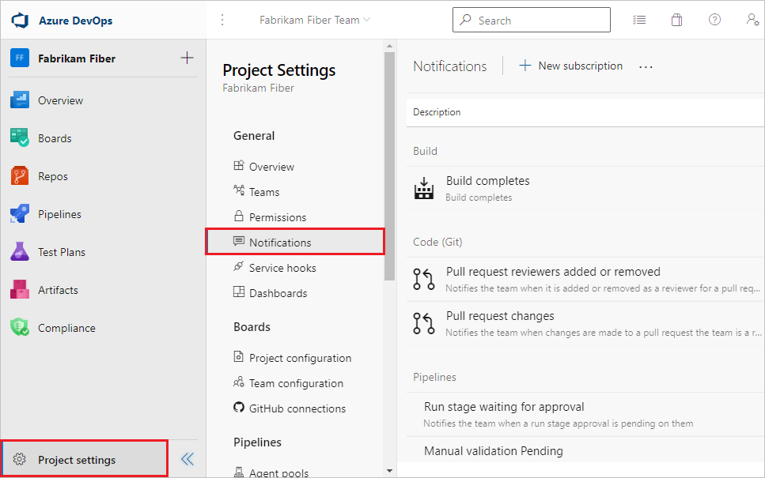
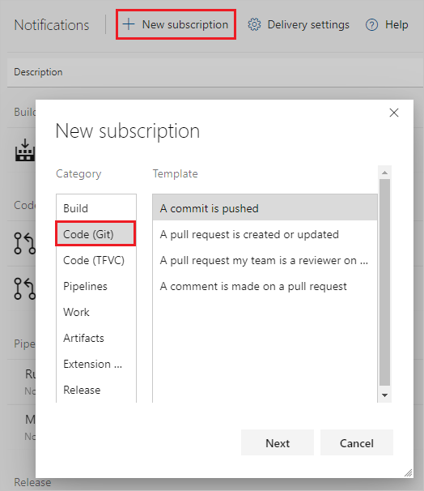
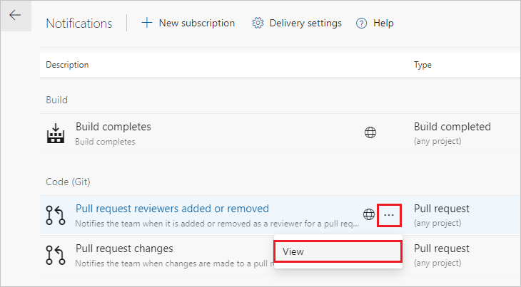

# Pull request update notifications

[!INCLUDE [version-lt-eq-azure-devops](../../includes/version-lt-eq-azure-devops.md)]

You can subscribe to email alerts to be notified of changes in pull requests (PRs). By default, you're subscribed to several common PR notifications. For a complete list of default subscription notifications, see [Out-of-the-box (OOB) or default subscriptions](../../organizations/notifications/oob-built-in-notifications.md#out-of-the-box-oob-or-default-subscriptions).

To view or set your personal notifications, see [Manage your personal notifications](../../organizations/notifications/manage-your-personal-notifications.md).

::: moniker range=">= azure-devops-2019"

- To view project notification settings, [go to the project](../../project/navigation/go-to-project-repo.md) and select **Project settings** > **Notifications**.

  

- To subscribe to more notifications, select **New subscription**.

  

- To edit a notification, select **...** next to the notification and select **View**, then edit the subscription.

  

- To opt out of a notification, set the **State** to **Off**.

  

::: moniker-end

::: moniker range="tfs-2018"

Select the settings button while you have your project open to bring up the project administration page.

 

- Select the **Notifications** tab to view your notification settings, and choose **New subscription** to subscribe to more notifications.

  

- To edit a notification, select **...** for the notification and choose **View** to edit the subscription. 

  

- To opt-out of a notification, set the **State** to **Off**.

   

::: moniker-end

