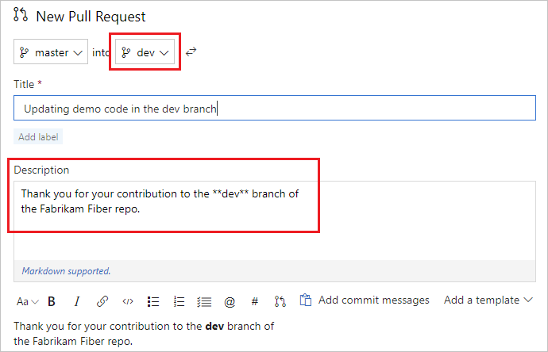
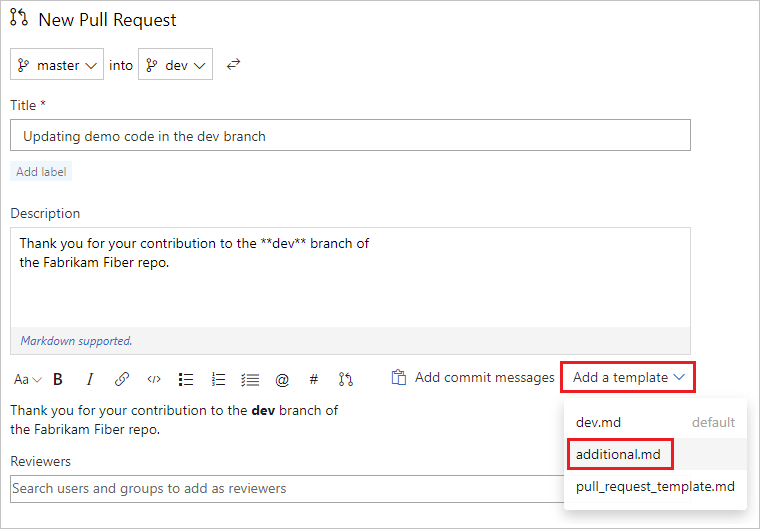

# Improve pull request descriptions using templates

#### Azure Repos 

Writing good pull request descriptions is a great way to help reviewers know what to expect when reviewing code. They're also a great way to help track things that should be done for every change, such as testing, adding unit tests, and updating documentation. Pull request templates can help your developers create great pull request descriptions that meet your organization's standards.

This article shows you how to get started with pull request templates.

>[!NOTE]
>Pull request templates can provide guidance, but are advisory only. Use branch policies to enforce best practices such as requiring pull requests for key branches like master, requiring a successful build, and enforcing required reviewers. For more information, see [branch policies](branch-policies-overview.md).

## What is a pull request template?

A pull request template is a file containing [markdown](../../project/wiki/markdown-guidance.md) text that is added to your pull request description when the pull request is created. 

```markdown
Thank you for your contribution to the Fabrikam Fiber repo. 
Before submitting this PR, please make sure:

- [ ] Your code builds clean without any errors or warnings
- [ ] You are using approved terminology
- [ ] You have added unit tests
```

Azure Repos allows you to create the following type of pull request templates:

- A **default** pull request template that is automatically applied for all new pull requests in the repository, unless overridden by a branch specific pull request template
- **Branch specific** pull request templates that are automatically applied to pull requests targeting a specific branch
- **Additional** pull request templates that can be optionally added by the pull request creator

The type of pull request template is determined by its filename and folder location, as covered in the following sections. The filenames and folder locations are not case sensitive, but they must be in the default branch of your repository.

>[!NOTE]
>All pull request template files must be located in the default branch (typically master) of your repository. Only pull request template files from the default branch are used.

## Default pull request templates

Default pull request templates are automatically applied to the description field when a new pull request is created. To configure your repository with a default pull request template, create a file named `pull_request_template.md` or `pull_request_template.txt` and save it in the default branch of your repository in one of the following folders.

- A folder named `.azuredevops` that is contained in the root folder of the repository
- A folder named `.vsts` that is contained in the root folder of the repository
- A folder named `docs` that is contained in the root folder of the repository
- The root folder of the repository

Multiple locations are provided to give you flexibility in where you store your pull request templates. When a pull request is created, Azure Repos searches the designated folders in the order given, and uses the first default pull request template it finds.

When a new pull request is created in the repository, unless a [branch specific pull request template](#branch-specific-pull-request-templates) applies, the contents of the default pull request template are used to pre-populate the description field in the pull request.


You can edit or add to this description and append [additional pull request templates](#additional-pull-request-templates) if desired by selecting them from the **Add a template** drop-down.

>[!NOTE]
>When a default or branch specific pull request template is automatically applied, it replaces the standard commit messages that are usually used for the default description. You can add them back by selecting **Add commit messages**.

## Branch specific pull request templates

Branch specific pull request templates can be configured for pull requests that target a specific branch. To configure your repository with a branch specific pull request template, create a `.txt` or `.md` file named after your branch. The name must match the first level of the branch name, such as `master`, `dev`, `release`, or `feature`. Each branch specific pull request template is applied any time a pull request targets that branch or any branches contained under it. For example the pull request template named `feature.md` would be applied if a pull request targeted the `feature` branch or any `feature/*` branches.

Branch specific pull request templates must be saved in the default branch of your repository using the following folder hierarchy: `pull_request_template/branches/`. These folders must be based in one of the following folders in your repository.

- A folder named `.azuredevops` that is contained in the root folder of the repository
- A folder named `.vsts` that is contained in the root folder of the repository
- A folder named `docs` that is contained in the root folder of the repository
- The root folder of the repository

For example, a branch specific pull request template that should apply to all pull requests into the `dev` branch would be named `dev.md` or `dev.txt` and located in one of the following locations.

- `<repository root>/.azuredevops/pull_request_template/branches/`
- `<repository root>/.vsts/pull_request_template/branches/`
- `<repository root>/docs/pull_request_template/branches/`
- `<repository root>/pull_request_template/branches/`

Just like default pull request templates, multiple locations are provided to give you flexibility in where you store branch specific pull request templates. When a pull request is created, Azure Repos searches the designated folders in the order given for a branch specific pull request template, and uses the first one it finds that matches the branch name. If no branch specific pull request template is found, Azure Repos then searches for a default pull request template as described in the previous [Default pull request templates](#default-pull-request-templates) section.



## Additional pull request templates

In addition to the default and branch specific pull request templates, you can configure additional pull request templates. These can be `.md` or `.txt` files, located in one of the following folders in your default branch.

- `<repository root>/.azuredevops/pull_request_template/`
- `<repository root>/.vsts/pull_request_template/`
- `<repository root>/docs/pull_request_template/`
- `<repository root>/pull_request_template/`

When a pull request is created, you can append any of the available pull request templates by choosing them from the **Add a template** drop-down. The names in the drop-down are based on the file names of the templates.

In the following example three templates are listed.

- `dev.md` - This is the branch specific template that was applied by default to this pull request into the dev branch, as indicated by the **default** message listed after the filename.
- `additional.md` - This is an additional template.
- `pull_request_template.md` - This is normally the default template but it was overridden by the `dev.md` branch specific template in this pull request. Even though it was not added by default, it can still be applied by selecting it from the list.



Select the name of the desired additional template to append its contents to the current pull request description.


>[!NOTE]
>You can specify a pull request template to override any matching default or branch specific pull request by appending `?template=name.md` to the querystring.