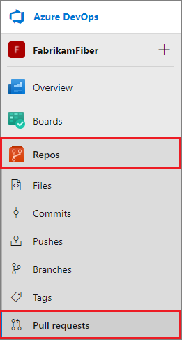
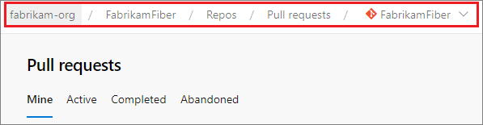
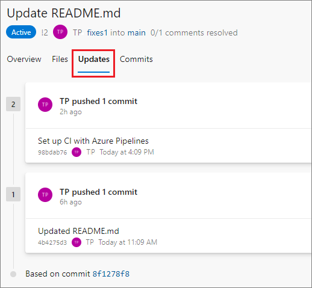
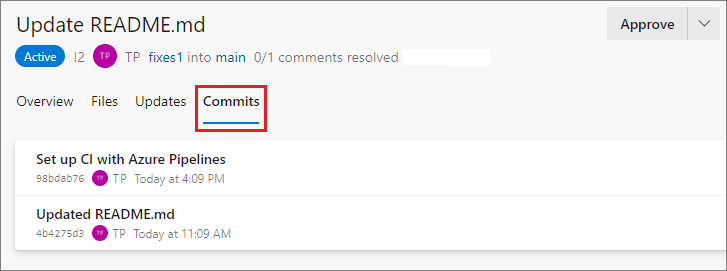
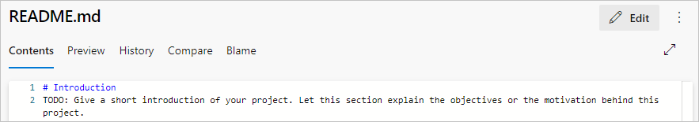
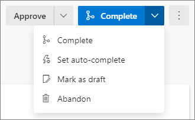
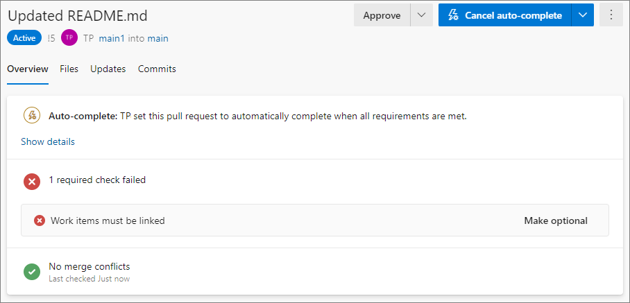

# Create, review, and manage pull requests

**Azure Repos | Azure DevOps Server 2020 | Azure DevOps Server 2019 | TFS 2018 | TFS 2017 | TFS 2015 | VS 2017 | VS 2015**

Create pull requests (PRs) to change, review, and merge code in a [Git project](../../organizations/projects/create-project.md). You can create PRs from branches in the same repository or from branches in your [fork](forks.md) of the repository.

Your team can review the PRs and give feedback on changes before they merge into the main branch. Reviewers can step through the proposed changes, leave comments, and vote to approve or reject the PRs.

For PR guidelines and management considerations, see [About pull requests](about-pull-requests.md).

## Prerequisites

::: moniker range="azure-devops"
- You must be a member of an Azure DevOps project with **Basic** access or higher.
  - If you don't have a project, create one or [sign up for free](../../user-guide/sign-up-invite-teammates.md).
  - If you aren't a project member, [get added](../../organizations/accounts/add-organization-users.md).
- To contribute to a PR, you must be a member of the **Readers** security group or have the corresponding permissions.
- To create and complete a PR, you must be a member of the **Contributors** security group or have the corresponding permissions.
- **Repos** must be enabled on your project. If the **Repos** hub and associated pages don't display, see [Turn an Azure DevOps service on or off](../../organizations/settings/set-services.md) to reenable Repos.
 
> [!NOTE]
> For public projects, users granted **Stakeholder** access have full access to Azure Repos. 
::: moniker-end

::: moniker range=">= azure-devops-2019 < azure-devops"
- You must be a member of an Azure DevOps project with **Basic** access or higher. If you aren't a project member, [get added](../../organizations/security/add-users-team-project.md).
- To contribute to a PR, you must be a member of the **Readers** security group or have the corresponding permissions.
- To create and complete a PR, you must be a member of the **Contributors** security group or have the corresponding permissions.
- **Repos** must be enabled on your project. If the **Repos** hub and associated pages don't display, see [Turn an Azure DevOps service on or off](../../organizations/settings/set-services.md) to reenable Repos.

::: moniker-end

::: moniker range="< azure-devops-2019"
- You must be a member of an Azure DevOps project with **Basic** access or higher. If you aren't a project member, [get added](../../organizations/security/add-users-team-project.md).
- To contribute to a PR, you must be a member of the **Readers** security group or have the corresponding permissions.
- To create and complete a PR, you must be a member of the **Contributors** security group or have the corresponding permissions.
::: moniker-end

To learn more about permissions and access, see [Default Git repository and branch permissions](../../organizations/security/default-git-permissions.md) and [About access levels](../../organizations/security/access-levels.md).

## View pull requests

# [Browser](#tab/browser)

::: moniker range=">= azure-devops-2019"

1. To view PRs in a specific repository in a project, [go to that project](../../project/navigation/go-to-project-repo.md) in the web portal and select **Repos** > **Pull requests**.

   

1. Verify that you selected the correct repository.

   

1. The default view shows your PRs under the **Mine** tab. Select **Active** to show all active PRs for the current repository. Select **Completed** or **Abandoned** to bring up lists of closed PRs.

   Select any PR in the list to go to that PR's **Overview** page.

   

1. You can view all of your PRs across different projects in your organization by choosing **Pull requests** in the **My Work** view.

   

::: moniker-end

::: moniker range="<= tfs-2018"

Manage PRs you own or are assigned to with the **Pull Requests** tab in the **Code** page on the web.

::: moniker-end 

::: moniker range="<= tfs-2017" 

Select **Active** to show all active PRs for the current repo.

Select **Completed** or **Abandoned** to bring up a history of closed PRs.

::: moniker-end 

::: moniker range="<= tfs-2018"

You can view all of your PRs in your organization, across all projects, by choosing **My pull requests** from the **Projects** page.

::: moniker-end 

### Filter PRs

Filtering helps you find and organize PRs to prioritize the most important files in your workflow.

::: moniker range=">= azure-devops-2019"

- To filter PRs by target branch, on the **Pull requests** page, select the **Filter** icon at upper right, and then select **Target branch**. Select the branch you want from the dropdown list.

::: moniker-end

::: moniker range=">= azure-devops-2020"

On the PR **Files** page, you can select **Filter** to use several filters for faster reviews:

- Keyword
- Reviewed/Unreviewed: **All** (default), **Pending**, **Reviewed**
- Commented files: **All files** (default), **Files with comments**
- Comments: **Show** (default), **What's new**, **Hide**
- Comment status: **Active** (default), **Pending**, **Resolved**, **As designed**, **Won't fix**, **Closed**
- Commented by: **All comments** (default), or a specific person

You can create queries on the **Pull requests** page with more filters, such as draft state. These queries create separate and collapsible sections to enable better PR actionability. The queries work across repositories on the **My pull requests** tab of the organization home page.

::: moniker-end

# [Visual Studio](#tab/visual-studio)

In Visual Studio 2015, 2017, and 2019, you can view PRs from Visual Studio Team Explorer.

1. [Connect to your project from Visual Studio](../../organizations/projects/connect-to-projects.md).

1. Select **View** > **Team Explorer** to open Team Explorer. You can also press **Ctrl**+**\\**, **Ctrl**+**M**.

1. From **Home**, select **Pull Requests** to view lists of PRs opened by you or assigned to you.
   - Under **Actions**, select **Open in browser** to view the PR list in the Azure DevOps web portal.
   - Right-click a listed PR and select **Open in browser** to open the PR in the web portal.

### Filter PRs

Filtering helps you find and organize PRs to prioritize the most important files in your workflow.

From the Team Explorer **Pull Requests** view:
- Select **Active** or **Assigned to me or my team** to filter the PR lists by PR status or assignment.
- Type in the **Type here to filter the list** fields to filter the PR lists by date, author, branch, or other attributes.

### Check out a branch

Starting with Visual Studio 2017 Update 6, you can check out a PR's source branch directly from **Pull Requests**. Right-click a PR, and choose **Checkout Source Branch**.

[!INCLUDE [temp](includes/note-new-git-tool.md)]

# [Azure Command Line](#tab/azure-command-line)

In Azure DevOps Server 2020 and Azure DevOps Services, you can manage PRs and other resources from the [Azure command-line interface (CLI)](/cli/azure/?view=azure-cli-latest&preserve-view=true). For more information about working with the Azure DevOps Services CLI, see [Get started with Azure DevOps CLI](../../cli/index.md).

az repos pr list
az repos pr show

### Check out a branch

az repos pr checkout

---

## Create a pull request

You can create a new PR from:

- [A feature branch pushed to your repo](#from-a-pushed-branch).
- [The Development section in a linked Azure Boards work item](#from-a-linked-work-item).
- [The Pull requests page on the project's Azure DevOps website](#from-the-pull-requests-page-on-the-project-website).
- [Team Explorer in Visual Studio](#from-visual-studio).
- [The Azure DevOps CLI](#from-azure-cli).

# [Browser](#tab/browser)

### From a pushed branch

::: moniker range=">= azure-devops-2019"

After you push or update a feature branch, Azure Repos displays a prompt to create a PR.

- On the **Pull requests** page:

  

- On the **Files** page:

  

Select **Create a pull request** to go to a page where you can [enter your PR details](pull-requests.md#finish) and create the PR.

::: moniker-end

::: moniker range="<= tfs-2018"

After you push or update a feature branch, Azure Repos prompts you to create a PR in the **Code** view on the web. This prompt is displayed on **Pull Requests** and **Files**.

Select **Create a pull request** to go to a page where you can [enter your PR details](pull-requests.md#finish) and create the PR.

::: moniker-end

### From a linked work item

You can create a PR directly from an Azure Boards work item linked to the branch.

1. In Azure Boards, from **Backlogs** or **Queries** in the **Work** view, open a work item that's linked to the branch.
2. In the **Development** area of the work item, select **Create a pull request**.

   

The link takes you to a page where you can [enter your PR details](pull-requests.md#finish) and create the PR.

### From the Pull requests page on the project website

You can create PRs for any branch from your project's **Pull requests** page on the web.

1. On the **Repos** > **Pull requests** page, select **New pull request** at upper right.

   

1. Select the branch with the changes and the branch you want to merge the changes into, such as the main branch.

   

1. [Enter your PR details](pull-requests.md#finish) and create the PR.

# [Visual Studio](#tab/visual-studio)

### From Visual Studio

You can create PRs directly from Visual Studio.

1. From the **Pull Requests** view in Team Explorer, select **New Pull Request**.

   

1. Select the source and target branches, enter a title and optional description, and select **Create**. 

1. After the PR is created, select **Open in browser** to open the new PR in the Azure DevOps web portal.

You can also create PRs from the **Branches** view in Team Explorer by right-clicking the branch name and selecting **Create Pull Request**.

# [Azure Command Line](#tab/azure-command-line)

### From Azure CLI

az repos pr create

---

## Add details to PRs

# [Browser](#tab/browser)

On the **New pull request** page, describe your changes so others can see what problems the changes solve. As in an existing PR, you can see the **Files** and **Commits** in your PR on separate tabs. You can change the PR title, add reviewers, link work items, and add tags and a detailed description of your changes.

When you're ready to have your changes reviewed, select **Create** to create the PR.

:::moniker range="azure-devops"

:::image type="content" source="media/pull-requests/create-new-pull-request-2020.png" alt-text="Screenshot that shows creating a new PR.":::

:::moniker-end

:::moniker range="<= azure-devops-2020"

:::image type="content" source="media/pull-requests/add-detail-to-pr.png" alt-text="Adding details to a new PR.":::

:::moniker-end

Don't worry if you don't have all of the work items, reviewers, or details ready when you create your PR. You can add or update these items after you create the PR.

::: moniker range="azure-devops"

### Use tags

Use tags to show important details and help organize PRs. Tags can communicate extra information to reviewers, such as that the PR is still a work in progress, or is a hotfix for an upcoming release. 

To add a tag when creating a PR, type a tag name in the **Tags** section. After you create the PR, you can manage tags in the **Tags** section.

:::image type="content" source="media/pull-requests/pull-request-tags-section.png" alt-text="Screenshot that shows the PR Tags section highlighted.":::

::: moniker-end

::: moniker range="<= azure-devops-2020"

### Help reviewers by using PR labels

You can communicate extra information about a PR to the reviewers by using labels. Maybe the PR is still a work in progress, or it's a hotfix for an upcoming release. Use labels to communicate important details and help organize PRs.

To add a label when creating a PR, choose **Add label**. After you create a PR, you can manage its labels in the **Labels** section.

::: moniker-end

# [Visual Studio](#tab/visual-studio)

To add details to a PR, from the **Pull Requests** view in Team Explorer, right-click the PR and select **Open in browser**. Add the details on the PR's **Overview** webpage.

# [Azure Command Line](#tab/azure-command-line)

az repos pr update
                   [--description]
                   [--org]
                   [--subscription]
                   [--title]
---

### Add reviewers

# [Browser](#tab/browser)
::: moniker range="azure-devops"

You can add reviewers in the **Reviewers** section of a new or existing PR. You can also make existing optional reviewers required, or change required reviewers to optional or remove them, unless they're required by policy.

If the user or group you want to review the PR isn't a member of your project, you'll need to [add them to the project](../../organizations/security/add-users-team-project.md) before you can add them as reviewers.

To add reviewers to your PR:

- In a new PR:

  1. On the **New pull request** page, under **Reviewers**, select **Search users and groups to add as reviewers**.
  1. As you enter a name or email address, a dropdown list shows a list of matching users and groups. Select names from the list to add as optional reviewers.
  1. To add required reviewers, select **Add required reviewers**, and then select **Search to add required reviewers** to search for and select the names.
  
  

- In an existing PR:

  1. In the **Reviewers** section of the **Overview** page, select **Add**, and then select **Required reviewer** or **Optional reviewer**.

     :::image type="content" source="media/pull-requests/pull-request-add-reviewer-v2.png" alt-text="Pull request overview":::

  1. As you enter a name or email address, a list of matching users or groups appears. Select the names to add as reviewers.

     :::image type="content" source="media/pull-requests/pull-request-add-reviewer.png" alt-text="Add PR reviewer.":::

  To change a reviewer between required and optional, or remove a reviewer, select **More options** to the right of the reviewer name. To see the membership of a group or team designated as a reviewer, select the group's icon.

::: moniker-end

:::moniker range="<= azure-devops-2020"

To add reviewers to your PR:

1. Select **Overview** in the PR.

   :::image type="content" source="media/pull-requests/pull-request-overview-reviewers-new-nav.png" alt-text="Screenshot that shows the PR Overview tab":::    

1. Select the **Add** button in the **Reviewers** area.

1. Enter the name of the user or group to add to the reviewer list for the PR. If the user isn't a member of your project, you'll need to [add them](../../organizations/security/add-users-team-project.md).

1. As you enter a name or email address, a list of matching users or groups appears. Select the user or group from the list to add them as a reviewer.

   :::image type="content" source="media/pull-requests/add-pr-reviewer.png" alt-text="Add PR reviewer.":::

:::moniker-end

::: moniker range="<= tfs-2018"

To add reviewers to your PR:

1. Select the **Overview** tab in the PR.

   

1. Select the add button in the **Reviewers** area. :::image type="icon" source="media/pull-requests/pull-request-add-button.png":::

1. Enter the name of the user or group to add to the reviewer list for the PR. If the user isn't a member of your project, you'll need to [add them](../../organizations/security/add-users-team-project.md).

1. As you enter a name or email address, a list of matching users or groups appears. Select the user or group from the list to add them as a reviewer.

   

::: moniker-end

# [Visual Studio](#tab/visual-studio)

To add reviewers to a PR, from the **Pull Requests** view in Team Explorer, right-click the PR and select **Open in browser**. Add the reviewers on the PR's **Overview** webpage.

# [Azure Command Line](#tab/azure-command-line)

az repos pr reviewer add

---

### Link work items

# [Browser](#tab/browser)
::: moniker range="azure-devops"

To link work items to your PR:

- In a new PR:

  1. On the **New pull request** page, under **Work items to link**, select **Search work items by ID or title**.
  1. Start to enter a work item ID or title, and select the work item to link from the dropdown list that appears.

- In an existing PR:

  1. On the PR **Overview** tab, in the **Work items** area, select **+**.

     :::image type="content" source="media/pull-requests/pull-request-link-work-items-2020.png" alt-text="Screenshot that shows selecting the Overview tab and the work items section.":::

  1. Enter the ID of the work item or search for the work item title. Select the work item from the list that appears.

Remove a work item link by selecting the **x** icon next to the work item. Removing a link only removes the link between the work item and the PR. Links created in the branch or from commits remain in the work item.

::: moniker-end

:::moniker range="<= azure-devops-2020"

To link work items to your PR:

1. Select the **Overview** tab in the PR.

   :::image type="content" source="media/pull-requests/pull-request-overview-work-items-new-nav.png" alt-text="Screenshot that shows selecting the Overview tab and the link items button.":::

2. Select the add button in the **Work Items** area. 

3. Enter the ID of the work item or search for work items with titles that match your text. Select the work item from the list that appears.

Remove work item links by selecting the remove button that appears when you hover over the work item. 
Removing a link only removes the link between a work item to a PR. Links created in the branch or from commits stay in the work item.

:::moniker-end

::: moniker range="<= tfs-2018"

To link work items to your PR:

1. Select **Overview** in the PR.

   

2. Select the add button in the **Work Items** area. :::image type="icon" source="media/pull-requests/pull-request-add-button.png":::

3. Enter the ID of the work item or search for work items with titles that match your text. Select the work item from the list that appears.

Remove work item links by selecting the remove button that appears when you hover over the work item. 
Removing a link only removes the link between a work item to a PR. Links created in the branch or from commits stay in the work item.

::: moniker-end

# [Visual Studio](#tab/visual-studio)

To link work items to a PR, from the **Pull Requests** view in Team Explorer, right-click the PR and select **Open in browser**. Add the work items on the PR's **Overview** webpage.

# [Azure Command Line](#tab/azure-command-line)

az repos pr work-item add
az repos pr work-item list

---

### Edit PR title and description

# [Browser](#tab/browser)
You can update the title of an existing PR by selecting the current title and updating the text. Select the **Save** icon to save changes, or select the **Undo** icon to discard the changes.

Edit the PR description by selecting the **Edit** icon in the **Description** section.

:::image type="content" source="media/pull-requests/pull-request-edit-title-description-2020.png" alt-text="Screenshot that shows editing the PR title and selecting the description Edit button.":::

# [Visual Studio](#tab/visual-studio)

To update the title or description of a PR, from the **Pull Requests** view in Team Explorer, right-click the PR and select **Open in browser**. Edit the title and description on the PR's **Overview** webpage.

# [Azure Command Line](#tab/azure-command-line)

az repos pr update title
az repos pr update description

---

Keep these fields up to date so reviewers can understand the changes in the PR.

::: moniker range=">=azure-devops-2019"

### Change the target branch of a PR

For most teams, nearly all PRs target a default branch, such as `main` or `develop`. If you need to target a different branch, it's easy to forget to change the target branch when creating the PR. To change the target branch of an active PR, see [Change the target branch of a PR](/azure/devops/release-notes/2018/sprint-141-update#azure-repos).

::: moniker-end

::: moniker range=">=azure-devops-2019"

## Create draft PRs

::: moniker-end

:::moniker range="azure-devops-2019"

> [!NOTE]
> Draft PRs were added in the Azure DevOps Server 2019.1 update.

:::moniker-end

# [Browser](#tab/browser)
::: moniker range=">=azure-devops-2019"

If your PR isn't ready for review, you can create a draft PR to indicate work in progress. When the PR is ready for review, you can publish it, and begin or resume the full review process.

Draft PRs have the following differences from published PRs:

- Build validation policies don't run automatically. You can queue build validations manually by selecting the more options menu in the PR.
- Voting is disabled while in draft mode.
- Required reviewers aren't automatically added. Notifications are sent only to reviewers that you explicitly add to the draft PR.
- Draft PRs display in the PR list with a **Draft** badge.

  

To create a draft PR, select the arrow next to **Create** and select **Create as draft** when creating the PR. You don't have to use title prefixes such as WIP or DO NOT MERGE.

::: moniker-end

::: moniker range="< azure-devops"

- If you start your PR title with WIP, **Create as draft** is selected as the default.

  

::: moniker-end

::: moniker range=">=azure-devops-2019"

When you're ready to have the PR reviewed and completed, select **Publish** at upper right in the PR. Publishing a PR assigns required reviewers, evaluates policies, and kicks off voting.

To change an existing published PR to a draft, choose **Mark as draft**. Marking a PR as draft removes all existing votes.

::: moniker-end

# [Visual Studio](#tab/visual-studio)

To set a PR to draft, from the **Pull Requests** view in Team Explorer, right-click the PR and select **Open in browser**. On the PR's **Overview** webpage, select **Mark as draft**.

# [Azure Command Line](#tab/azure-command-line)

To create a PR as a draft: az repos pr create --draft
To set an existing PR to draft: az repos pr update --draft {false, true}

---

## Review pull requests

The PR **Overview** tab shows the current state of the PR at a glance. You can review the title, description, and comments to understand proposed changes and see issues raised by other reviewers.

To help get a quick picture of PR status, the **Overview** tab summarizes branch policies that are passing or failing. If available, the summary shows a snippet of the failure message from the check's log. The overview lists only failed policies, but you can see all the passed and failed policy checks by selecting **View \<n> checks**.

:::image type="content" source="media/pull-requests/pull-request-overview-2020.png" alt-text="Screenshot that shows the PR overview tab.":::

### Browse changes

::: moniker range="azure-devops"
- Select the **Files** tab of a PR to view the changes made in the source branch **Inline** or **Side-by-side** with the target branch.
  
  You can see how a file will look published by selecting the **View** button on a file, and then selecting **Preview**.
  
  :::image type="content" source="media/pull-requests/pull-request-browse-changes-2020.png" alt-text="Screenshot that shows a side-by-side diff view of file changes in a PR.":::
  
  >[!NOTE]
  >When viewing the difference for a *single selected file*, there's a file size limit of 5 MB. To view and diff files larger than 5 MB, you can download the file and view it using a local diff tool. When viewing the difference for a *collection of files*, the size limit for each file is 0.5 MB, for performance reasons.
::: moniker-end

::: moniker range="<= azure-devops-2020"
- Select **Files** to view the changes made to the source branch next to the target branch of the pull request.
  
  
  
  >[!NOTE]
  >When viewing the difference for a *single selected file*, there's a file size limit of 5 MB. To view and diff files larger than 5 MB, you can download the file and view it using a local diff tool. When viewing the difference for a *collection of files*, the size limit for each file is 0.5 MB, for performance reasons.
::: moniker-end

::: moniker range="azure-devops"
- You can review previous versions of the code from the **All Changes** drop-down list.
  
  Every update to the branch adds a new version to the list and on the **Updates** tab of the PR. As you select different updates, the diff view updates to show the differences between the files in each version of the PR.

  You can catch up with PR updates after being away from the PR by stepping through changes made since your last review. You can view multiple updates at once by pressing **Shift** while selecting the updates you want to see. 
  
  :::image type="content" source="media/pull-requests/pull-request-all-changes-dropdown.png" alt-text="Screenshot that shows the All changes drop-down.":::

::: moniker-end

::: moniker range="<= azure-devops-2020"

- Review previous versions of the code from the **All updates** drop-down list.
  
  

  Every update to the branch adds a new version to the list and on the **Updates** tab of the PR. As you select different updates, the diff view updates to show the differences between the files in each version of the PR.

  Catch up with PR updates after being away from the PR by stepping through changes made since your last review.

::: moniker-end

::: moniker range=">= azure-devops-2019"

- View code coverage metrics for changes to ensure that you've adequately tested your changes through automated tests. Coverage status appears as a comment in the PR overview. You can view details of coverage information for every code line changed in the file diff view.

:::moniker-end

::: moniker range="azure-devops"
- Browse a list of changes from the author on the **Updates** tab.
  
  

- View and select changes made in commits to the branch on the **Commits** tab.
  
  
::: moniker-end

::: moniker range="<= azure-devops-2020"
- Browse a list of changes from the author on the **Updates** tab.
  
  

- View and select changes made in commits to the branch on the **Commits** tab.
  
  
::: moniker-end

### Make comments

Add comments to a PR to make suggestions, reply to previous comments, and point out problems with proposed changes.

::: moniker range="azure-devops"
- Comment inline in the **Files** tab of a PR by selecting the comment button :::image type="icon" source="./media/pull-requests/new-comment-icon.png"::: next to the line you want to comment on.

  
::: moniker-end

::: moniker range="<= azure-devops-2020"
- Comment inline in the **Files** tab of a PR by hovering over the line you want to comment on and selecting the comment button. .

  
::: moniker-end

- To suggest changes directly, select the lightbulb icon in the comment interface, make your suggested changes in the code, and then select **Comment**.

  

- Leave feedback not tied to a specific code line by commenting on the **Overview** tab.

- Address the author or other reviewers directly in your comments by using `@username`, and reference work items by using `#workitemID`. You can also reference other PRs by using `!pullrequestID`.

### Vote on changes

# [Browser](#tab/browser)
Use the button at upper right in the PR to vote on the PR changes. The default option is **Approve**, but you can select other options from the dropdown list:

- **Approve**: Approve the proposed changes in the PR.
- **Approve with suggestions**: Approve the PR, but provide optional suggestions for improvement.
- **Wait for author**: Don't approve the changes, and ask the author to review your comments. The author should let you know to review the code again after they address your concerns.
- **Reject**: The changes aren't acceptable. Leave a comment in the PR to explain why.
- **Reset feedback**: Remove your vote.

# [Visual Studio](#tab/visual-studio)

To vote on a PR, from the **Pull Requests** view in Team Explorer, right-click the PR and select **Open in browser**. On the PR's **Overview** webpage, use the button at upper right to vote on the changes.

# [Azure Command Line](#tab/azure-command-line)

az repos pr set-vote

---

## Respond to reviews

::: moniker range="azure-devops"
After updating your code in response to comments or to fix issues, [commit](commits.md) the changes and [push](pushing.md) the updates to the branch in your Git repo.

To make quick updates to your branch, select **Edit** on the **Files** page in your branch on the web.

::: moniker-end

::: moniker range="<= azure-devops-2020"
You can make quick updates to your branch directly from the **Files** tab in **Code** on the web.

::: moniker-end

### Address comments

Reply directly to reviewers by using `@username` in the reply, and reference work items by using `#workitemID`. You can also reference other PRs by using `!pullrequestID`.

Update the comment status to let reviewers know how you're addressing their review comments and suggestions. New comments start in **Active** status. Select **Resolve** or **Reply & resolve** to update comment status.

More options are available in the comment resolution dropdown list:

- **Active**: The comment is still under review.
- **Pending**: The issue in this comment will be addressed, but isn't fixed yet.
- **Resolved**: The issue brought up in this comment is fixed.
- **Won't fix**: The suggestion in the comment is noted, but this PR won't address it.
- **Closed**: Discussion for this comment is closed.

:::moniker range=">= azure-devops-2019"

To keep track of files that have already been reviewed, select **More options** next to a file in your PR, and then select **Mark as reviewed**.

:::moniker-end

## Complete a pull request

After the PR gets all required approvals and meets all required policies, you can complete the PR.

# [Browser](#tab/browser)
::: moniker range="azure-devops"

1. Select **Complete** at upper right to complete the PR. Or select the dropdown arrow next to the **Complete** button, and select one of the following options:

   - **Complete**: Complete the PR now, and merge the changes to the target branch.
   - **Set auto-complete**: Configure the PR to complete and merge once it meets all required branch policies.
   - **Mark as draft**: Return the PR to draft status and remove all votes.
   - **Abandon**: Close the PR without merging the changes.

   

1. On the **Complete pull request** screen:

   1. Under **Merge type**, select one of the following options:
      - **Merge (no fast forward)**: Merge with a non-linear history that preserves all commits.
      - **Squash commit**: Merge with a linear history that combines all source commits into a single commit on the target, or [squash merges](merging-with-squash.md) the PR.
      - **Rebase and fast-forward**: Rebase the source commits onto the target and fast-forward.
      - **Semi-linear merge**: Rebase source commits onto the target and create a two-parent merge.
   
      > [!NOTE]
      > Existing policies are still enforced. For example, if your branch currently has a "squash merge only" policy, you have to change that policy if you want to use the other merge types.
   
   1. Select any of the following post-completion options. Some options aren't available for some merge types.
      - **Complete associated work items after merging**: Complete any linked work items.
      - **Delete \<branch name> after merging**: Delete the PR's source branch after merging.
      - **Customize merge commit message**: Add a custom merge commit message. If you select this option, update the [merge commit](merging.md) message.
      - **Override branch policies and enable merge**. Force the merge even if the PR doesn't satisfy all branch policies. This option is only available if you have [Exempt from policy enforcement](branch-policies.md#bypass-branch-policies) permission.
   
   1. Select **Complete merge**.
     
   :::image type="content" source="media/pull-requests/pull-request-complete-merge-2020.png" alt-text="Screenshot that shows the complete PR dialog.":::

::: moniker-end

::: moniker range=">= azure-devops-2019 <= azure-devops-2020"

1. Select **Complete** at upper right to complete the PR. Or, select the dropdown arrow next to the **Complete** button, and select one of the following options:

   

   - **Complete**: Complete the PR now, and merge the changes to the target branch.
   - **Set auto-complete**: If you have branch policies, configure the PR to complete and merge once it meets all required branch policies.
   - **Abandon**: Close the PR without merging the changes.

1. On the **Complete pull request** screen, enter the message for the [merge commit](merging.md) and update the PR description.

   

1. Select any of the following options:
   - **Complete linked work items after merging** to complete any linked work items.
   - **Delete `<branch name>` after merging** to delete the source branch from the PR.
   - **Squash changes when merging** to [squash merge](merging-with-squash.md) your PR.
   - **Override branch policies and enable merge** to force a branch to merge even if it doesn't satisfy all branch policies. This option is only available if you have [Exempt from policy enforcement](branch-policies.md#bypass-branch-policies) permissions.
     
     
     > [!NOTE]
     > Existing policies are still enforced. For example, if your branch currently has a "squash merge only" policy in place, you have to edit that policy in order to use the other merge types.  

5. Select **Complete merge**.

::: moniker-end

::: moniker range=">= azure-devops-2019"
When you complete the merge, any linked work items automatically update to show the PR completion.

### Rebase during PR completion

There are a few situations when rebasing during PR completion isn't possible:

- If a policy on the target branch prohibits using rebase strategies, you need **Override branch policies** permission to rebase.
- If the PR source branch has policies, you can't rebase it. Rebasing would modify the source branch without going through the policy approval process.
- If you used the Merge Conflict Extension to resolve merge conflicts, you can't rebase. Conflict resolutions applied to a three-way merge are seldom successful or valid when rebasing all the PR commits individually.

In all these cases, you can still rebase your branch locally and then push upstream, or squash-merge your changes when you complete the PR.

::: moniker-end

::: moniker range="<= tfs-2018"

1. Select **Complete** in the upper right of the PR view to complete your PR after the reviewers approve of the changes.

   

   - **Complete**: Complete the PR now and merge the changes to the target branch.
   - **Set auto-complete**: If you have branch policies, you can choose **Set auto-complete** to configure the PR to close once it meets all branch policies.
   - **Abandon**: Close the PR without merging the changes.

2. In **Complete pull request**, enter the message for the [merge commit](merging.md) and update the PR description.

   

3. Select any of the following post-completion options:

   - **Complete linked work items after merging** to complete any linked work items.
   - **Delete `<branch name>` after merging** to delete the source branch from the PR.
   - **Squash changes when merging** to [squash merge](merging-with-squash.md) your PR.
   - **Override branch policies and enable merge** to force a branch to merge even if it doesn't satisfy all branch policies. This option is only available if you have [Exempt from policy enforcement](branch-policies.md#bypass-branch-policies) permissions.

4. Select **Complete merge**.

Linked work items are also updated showing the PR completion.

::: moniker-end

### Resolve merge conflicts

When you complete a PR, Git adds a new *merge commit* to the end of the main branch. This merge commit links the earlier histories of the main branch and the PR source branch. You must resolve any [merge conflicts](merging.md) between the PR branch and the target branch before you can merge the PR.

::: moniker range=">= tfs-2017"

### Complete automatically

Select **Set auto-complete** from the **Complete** dropdown list to complete and merge the PR changes as soon as conditions satisfy all [branch policies](branch-policies.md). When the PR is completed, you receive an email notification. If a conflict or error prevents PR completion, email notifies you of the issue.

>[!NOTE]
>The **Set auto-complete** option is available in Azure Repos and TFS 2017 and higher when you have branch policies. If you don't see **Set auto-complete**, you don't have any branch policies. For more information, see [Branch policies](branch-policies.md).

By default, a PR that's set to autocomplete waits only on required policies. In the **Enable automatic completion** panel, you can choose to wait on optional policies as well.

Starting with TFS 2018 Update 2, the PR **Overview** page [displays the list of outstanding policy criteria](/azure/devops/release-notes/2018/jan-24-vsts#view-remaining-policy-criteria-for-pull-request-auto-complete) the PR is waiting for. If you set a policy to be required in the **Enable automatic completion** panel, you can set it back to optional here.

Select **Cancel auto-complete** to turn off autocomplete. 

::: moniker-end 

::: moniker range="azure-devops"

::: moniker-end 

::: moniker range=">= tfs-2017 <= azure-devops-2020"

::: moniker-end 

A PR set to autocomplete displays an **Auto-complete** badge on the **Pull requests** page.

### Abandon your changes

To abandon your changes, select **Abandon** from the dropdown list on the **Complete** button. You can still view the abandoned PR, and it stays linked to work items.

To reactivate an abandoned PR at any time, open the PR from the **Abandoned** tab in the **Pull Request** view, and select **Reactivate** at upper right.

::: moniker range=">= tfs-2017" 

# [Visual Studio](#tab/visual-studio)

To complete a PR, from the **Pull Requests** view in Team Explorer, right-click the PR and select **Open in browser**. On the PR's **Overview** webpage, select **Complete** or set other options.

# [Azure Command Line](#tab/azure-command-line)

az repos pr update 
                   [--auto-complete {false, true}]
                   [--bypass-policy {false, true}]
                   [--bypass-policy-reason]
                   [--delete-source-branch {false, true}]
                   [--merge-commit-message]
                   [--squash {false, true}]
                   [--status {abandoned, active, completed}]
                   [--transition-work-items {false, true}]
az repos pr update –-status abandoned

                   [--detect {false, true}]
---

## Revert a PR

To undo the changes from a PR, follow these steps:

1. Open the completed PR and select **Revert**. This action creates a new branch with changes that undo the PR in an existing target branch in your repo.

1. In the **Revert pull request** pane:

   1. Under **Target branch**, select the branch where you want to undo the PR changes.
   1. Under **Topic branch name required**, change the revert PR branch name if you want.
   1. Select **Revert**.

1. On the **New pull request** screen, select **Create**.

1. Merge the new PR to complete the revert.

> [!NOTE]
> The branch created during this revert has a single commit that reverts all the file changes from the original PR. The branch doesn't contain a reverted commit for each of the commits in the original PR.
::: moniker-end

## Next steps
- [About pull requests](about-pull-requests.md)
- [Change the default branch](change-default-branch.md)
- [Copy changes with cherry-pick](cherry-pick.md)
- [Pull request update notifications](notifications.md)

