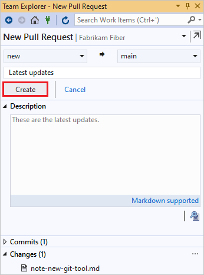
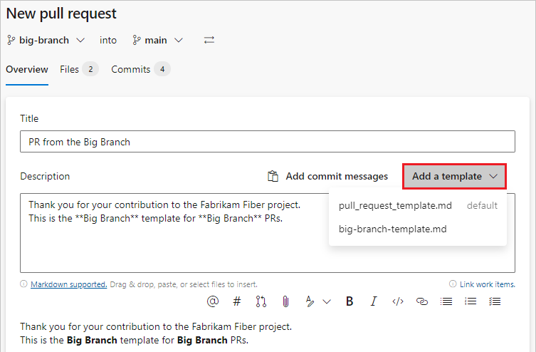
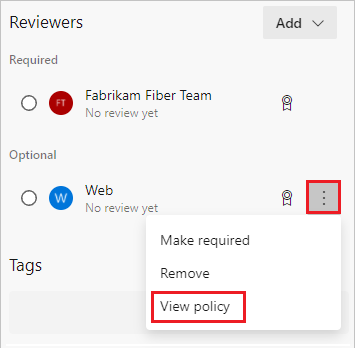
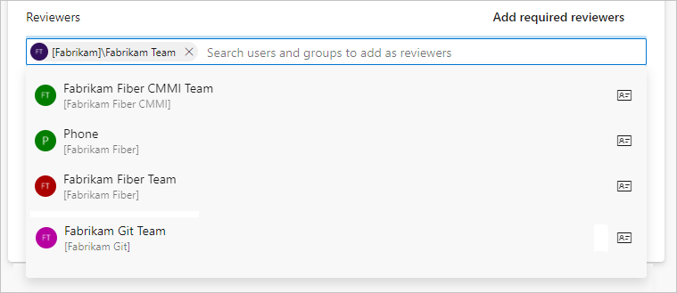
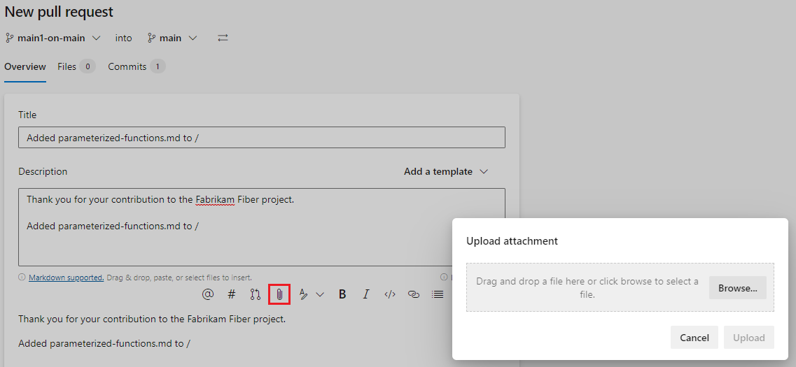

# Create pull requests

[!INCLUDE [temp](../includes/version-tfs-2015-cloud.md)]
[!INCLUDE [temp](../includes/version-vs-2015-vs-2019.md)]

Create pull requests (PRs) to change, review, and merge code in a [Git repository](creatingrepo.md). You can create PRs from branches in the upstream repository or from branches in your [fork](forks.md) of the repository. Your team can [review the PRs](review-pull-requests.md) and give feedback on changes. Reviewers can step through the proposed changes, leave comments, and vote to approve or reject the PRs. Depending on [branch policies](branch-policies.md) and other requirements, your PR might need to meet various criteria before you can [complete the PR](complete-pull-requests.md) and merge the changes into the target branch.

For PR guidelines and management considerations, see [About pull requests](about-pull-requests.md).

## Prerequisites

::: moniker range="azure-devops"
- **Repos** must be enabled on your project. If the **Repos** hub and associated pages don't display, see [Turn an Azure DevOps service on or off](../../organizations/settings/set-services.md) to reenable Repos.
- To view or review PRs, you must be a member of an Azure DevOps project with **Basic** access or higher.
  - If you don't have a project, create one or [sign up for free](../../user-guide/sign-up-invite-teammates.md).
  - If you aren't a project member, [get added](../../organizations/accounts/add-organization-users.md).
- To contribute to a PR, you must be a member of the **Readers** security group or have the corresponding permissions.
- To create and complete a PR, you must be a member of the **Contributors** security group or have the corresponding permissions.

  > [!NOTE]
  > For public projects, users granted **Stakeholder** access have full access to Azure Repos.
::: moniker-end

::: moniker range=">= azure-devops-2019 < azure-devops"
- **Repos** must be enabled on your project. If the **Repos** hub and associated pages don't display, see [Turn an Azure DevOps service on or off](../../organizations/settings/set-services.md) to reenable Repos.
- To view or review PRs, you must be a member of the Azure DevOps project with **Basic** access or higher. If you aren't a project member, [get added](../../organizations/security/add-users-team-project.md).
- To create and complete a PR, you must be a member of the **Contributors** security group, or have the corresponding permissions, in the project you want to change.
- To contribute to a PR, you must be a member of the **Readers** security group or have the corresponding permissions.
::: moniker-end

::: moniker range="< azure-devops-2019"
- To create and complete a PR, you must be a member of the **Contributors** security group or have the corresponding permissions.
- To view or review PRs, you must be a member of an Azure DevOps project with **Basic** access or higher. If you aren't a project member, [get added](../../organizations/security/add-users-team-project.md).
- To contribute to a PR, you must be a member of the **Readers** security group or have the corresponding permissions.

::: moniker-end

- To learn more about permissions and access, see [Default Git repository and branch permissions](../../organizations/security/default-git-permissions.md) and [About access levels](../../organizations/security/access-levels.md).

::: moniker range=">= azure-devops-2020"
- You can create and manage PRs from the [Azure command-line interface (CLI)](/cli/azure/?view=azure-cli-latest&preserve-view=true) with the `azure-devops` extension. To learn how to work with the Azure DevOps Services CLI, see [Get started with Azure DevOps CLI](../../cli/index.md). Azure Repos CLI commands for PRs use [az repos pr](/cli/azure/repos/pr).

::: moniker-end

<a name="create-a-new-pull-request"></a>

## Create a pull request

You can create a new PR from the Azure DevOps project website, from Visual Studio, or from the Azure DevOps CLI.

# [Browser](#tab/browser)

From the Azure DevOps project website, you can create a new PR from:

- [The Pull requests page](#from-the-pull-requests-page).
- [A feature branch pushed to your repo](#from-a-pushed-branch).
- [An existing PR, by using cherry-pick](#add-updates-with-cherry-pick).
- [The Development control in a linked Azure Boards work item](#from-a-linked-work-item).

<a name="from-the-pull-requests-page"></a>
### Create a PR from the Pull requests page

You can create PRs for any branch from your project's **Pull requests** page on the web.

1. On the **Repos** > **Pull requests** page, select **New pull request** at upper right.

   

1. Select the branch with the changes and the branch you want to merge the changes into, such as the main branch.

   

1. [Enter your PR details](pull-requests.md#finish) and create the PR.

<a name="from-a-pushed-branch"></a>
### Create a PR from a pushed branch

::: moniker range=">= azure-devops-2019"

After you push or update a feature branch, Azure Repos displays a prompt to create a PR.

- On the **Pull requests** page:

  

- On the **Files** page:

  

Select **Create a pull request** to go to a page where you can [enter your PR details](pull-requests.md#finish) and create the PR.

::: moniker-end

::: moniker range="<= tfs-2018"

After you push or update a feature branch, Azure Repos prompts you to create a PR in the **Code** view on the web. This prompt is displayed on **Pull Requests** and **Files**.


Select **Create a pull request** to go to a page where you can [enter your PR details](pull-requests.md#finish) and create the PR.

::: moniker-end

<a name="from-a-linked-work-item"></a>
### Create a PR from a linked work item

You can create a PR directly from an Azure Boards work item linked to the branch.

1. In Azure Boards, from **Backlogs** or **Queries** in the **Work** view, open a work item that's linked to the branch.
1. In the **Development** area of the work item, select **Create a pull request**.

   

The link takes you to a page where you can [enter your PR details](pull-requests.md#finish) and create the PR.

# [Visual Studio](#tab/visual-studio)

In Visual Studio 2015, 2017, and 2019, you can create PRs from Visual Studio Team Explorer:

1. [Connect to your project from Visual Studio](../../organizations/projects/connect-to-projects.md).

1. Select **View** > **Team Explorer** to open Team Explorer. You can also press **Ctrl**+**\\**, **Ctrl**+**M**.

1. From **Home**, select **Pull Requests** to view lists of PRs opened by you or assigned to you.

1. From the **Pull Requests** view, select **New Pull Request**.

   

1. Select the source and target branches, enter a title and optional description, and select **Create**. 

   

1. After the PR is created, select **Open in browser** to open the new PR in the Azure DevOps web portal.

You can also create PRs from the **Branches** view in Team Explorer by right-clicking the branch name and selecting **Create Pull Request**.


# [Azure DevOps CLI](#tab/azure-devops-cli)

<a id="create-pr" />

::: moniker range=">= azure-devops-2020"
To create a new PR in your project, use [az repos pr create](/cli/azure/repos/pr#az_repos_pr_create). To open the PR in your browser after creation, use the `--open` parameter.

```azurecli
az repos pr create [--auto-complete {false, true}]
                   [--bypass-policy {false, true}]
                   [--bypass-policy-reason]
                   [--delete-source-branch {false, true}]
                   [--description]
                   [--detect {false, true}]
                   [--draft {false, true}]
                   [--merge-commit-message]
                   [--open]
                   [--org]
                   [--project]
                   [--repository]
                   [--reviewers]
                   [--source-branch]
                   [--squash {false, true}]
                   [--subscription]
                   [--target-branch]
                   [--title]
                   [--transition-work-items {false, true}]
                   [--work-items]
```

### Parameters

|Parameter|Description|
|---------|-----------|
|`--auto-complete`|Set the pull request to complete automatically and merge into the target branch when all policies pass. Accepted values: `false`, `true`.|
|`--bypass-policy`|Bypass any required policies and complete the pull request once it's mergeable. Accepted values: `false`, `true`.|
|`--bypass-policy-reason`|Reason for bypassing required policies.|
|`--delete-source-branch`|Delete the source branch after the pull request is completed and merged into the target branch. Accepted values: `false`, `true`.|
|`--description` <br>`-d`|Description for the new pull request, which can include Markdown. Each value is a new line. For example: `--description "First Line" "Second Line"`.|
|`--detect`|Automatically detect organization. Accepted values: `false`, `true`.|
|`--draft`|Create the pull request in draft mode as work in progress. Accepted values: `false`, `true`.|
|`--merge-commit-message`|Message that shows when you merge commits.|
|`--open`|Open the pull request in your web browser.|
|`--org --organization`|Azure DevOps organization URL. You can configure the default organization using `az devops configure -d organization=ORG_URL`. Required if not configured as default or picked up via git config. Example: `https://dev.azure.com/MyOrganizationName/`.|
|`--project -p`|Name or ID of the project. You can configure the default project using `az devops configure -d project=NAME_OR_ID`. Required if not configured as default or picked up via git config.|
|`--repository -r`|Name or ID of the repository to create the pull request in. Required parameter.|
|`--reviewers`|Additional users or groups to include as reviewers on the new pull request. Space separated.|
|`--source-branch -s`|Name of the source branch. Example: `"dev"`.|
|`--squash`|Squash the commits in the source branch when merging into the target branch. Accepted values: `false`, `true`.|
|`--subscription`|Name or ID of the Azure subscription. You can configure the default subscription by using `az account set -s NAME_OR_ID`.|
|`--target-branch -t`|Name of the target branch. If not specified, defaults to the default branch of the target repository.|
|`--title`|Title for the new pull request.|
|`--transition-work-items`|Transition any work items linked to the PR into the next logical state when the PR changes status. For example change, Active work items to Resolved. Accepted values: `false`, `true`.|
|`--work-items`|IDs of work items to link to the new pull request. Space separated.|

### Example

The following command creates a PR from the `new` branch to the default `main` branch of the Fabrikam repository, opens the PR in the browser, and shows the command output in a table. The example uses the default configuration: `az devops configure --defaults organization=https://dev.azure.com/fabrikamprime project="Fabrikam Fiber"`.

```azurecli
az repos pr create --repository Fabrikam --source-branch new --open --output table

ID    Created     Creator              Title                         Status    IsDraft    Repository
----  ----------  -------------------  ----------------------------  --------  ---------  ------------
30    2021-10-31  jamalh@fabrikam.com  Updated note-new-git-tool.md  Active    False      Fabrikam
```

You can add many other PR details at or after PR creation. To add details, reviewers, work items, and completion options to the PR, see [Add details or edit PRs](#add-details-to-prs).

::: moniker-end

::: moniker range="<=azure-devops-2019"
[!INCLUDE [temp](../../includes/note-cli-not-supported.md)]
::: moniker-end


***


## Add updates with cherry-pick

You can copy commits from one branch to another by using cherry-pick. Unlike a merge or rebase, cherry-pick only brings the changes from the commits you select, instead of all the changes in a branch.

To cherry-pick changes from a completed PR, select **Cherry-pick** on the PR's **Overview** page. To copy changes from an active PR, select **Cherry-pick** from the PR's **More options** menu. This action creates a new branch with the copied changes. You can then create a new PR from the new branch. For detailed instructions, see [Copy changes with cherry-pick](cherry-pick.md).

## Switch source and target branches of your pull request

Before the first time you save a PR, you can switch the source and target branches of the PR by selecting the **Switch source and target branches** icon next to the branch names. Once the PR is active, this icon goes away, but you can still [change the target branch](#change-the-target-branch-of-a-pull-request) of the PR.


::: moniker range=">= azure-devops-2019"

## Use pull request templates

A pull request template is a file containing Markdown text that populates the PR description when you create a PR. Good PR descriptions tell PR reviewers what to expect, and can help track tasks like adding unit tests and updating documentation. Your team can create a default PR template that adds text to all new PR descriptions in the repo. Also, you can select from branch-specific templates or other templates your team defines. For more information about creating and using PR templates, see [Improve pull request descriptions using templates](pull-request-templates.md).

If your repo has a default template, all PRs in the repo have the default template's description text at creation. To add other templates, select **Add a template** and then choose a template from the dropdown list. You can edit the template text in your description, remove it, or add other text.



::: moniker-end

<a name="draft-pull-requests"></a>

::: moniker range=">=azure-devops-2019"

## Create draft PRs

If your PR isn't ready for review, you can create a draft PR to indicate work in progress. When the PR is ready for review, you can publish it, and begin or resume the full review process.

Draft PRs have the following differences from published PRs:

- Build validation policies don't run automatically. You can queue build validations manually by selecting the more options menu in the PR.
- Voting is disabled while in draft mode.
- Required reviewers aren't automatically added. Notifications are sent only to reviewers that you explicitly add to the draft PR.
- Draft PRs display in the PR list with a **Draft** badge.

  

::: moniker-end

::: moniker range="azure-devops-2019"
> [!NOTE]
> Creating draft PRs requires Azure DevOps Server 2019.1 update or later version.
::: moniker-end

::: moniker range=">=azure-devops-2019"

# [Browser](#tab/browser)

To create a draft PR, select the arrow next to **Create** and select **Create as draft** when creating the PR. You don't have to use title prefixes such as WIP or DO NOT MERGE.


When you're ready to have the PR reviewed and completed, select **Publish** at upper right in the PR. Publishing a PR assigns required reviewers, evaluates policies, and kicks off voting.


To change an existing published PR to a draft, choose **Mark as draft**. Marking a PR as draft removes all existing votes.


# [Visual Studio](#tab/visual-studio)

To set a PR to draft, from the **Pull Requests** view in Team Explorer, right-click the PR and select **Open in browser**. On the PR's **Overview** page, select **Mark as draft**.

# [Azure DevOps CLI](#tab/azure-devops-cli)

To create a PR as a draft, set the `--draft` parameter to `true` when you create the PR. (Requires Azure DevOps Server 2020 or later version.)

For example:

```azurecli
az repos pr create --repository Fabrikam --source-branch new --draft true
```

To set an existing PR to draft, use `az repos pr update --id <PR Id> --draft true`.

To remove draft status from a PR, set `--draft` to `false`.

***

::: moniker-end


<a name="finish"></a>
<a name="add-details-to-prs"></a>

## Add or edit pull request title and description

# [Browser](#tab/browser)

On the **New pull request** page, enter a **Title** and detailed **Description** of your changes, so others can see what problems the changes solve. On a new PR as in existing PRs, you can see the **Files** and **Commits** in your PR on separate tabs. You can add reviewers, link work items, and add tags to the PR.

When you're ready to have your changes reviewed, select **Create** to create the PR.

:::moniker range="azure-devops"

:::image type="content" source="media/pull-requests/create-new-pull-request-2020.png" alt-text="Screenshot that shows creating a new P R.":::

:::moniker-end

:::moniker range="<= azure-devops-2020"

:::image type="content" source="media/pull-requests/add-detail-to-pr.png" alt-text="Adding details to a new P R.":::

:::moniker-end

Don't worry if you don't have all of the work items, reviewers, or details ready when you create your PR. You can add or update these items after you create the PR.

### Edit PR title and description

Keep the PR title and description up to date so reviewers can understand the changes in the PR.

You can update the title of an existing PR by selecting the current title and updating the text. Select the **Save** icon to save changes, or select the **Undo** icon to discard the changes.

Edit the PR description by selecting the **Edit** icon in the **Description** section.

:::image type="content" source="media/pull-requests/pull-request-edit-title-description-2020.png" alt-text="Screenshot that shows editing the P R title and selecting the description Edit button.":::


# [Visual Studio](#tab/visual-studio)

When you create a PR in Visual Studio, enter a title and detailed description of your changes so others can see what problems the changes solve. Keep these fields up to date so reviewers can understand the changes in the PR.

To edit the title, description, or any other details in an existing PR, open the PR in your browser. Right-click the PR from the **Pull Requests** view in Team Explorer, select **Open in browser**, and then make your updates on the PR's **Overview** page.


# [Azure DevOps CLI](#tab/azure-devops-cli)

::: moniker range=">= azure-devops-2020"
<a id="add-details-pr" /> 

You can add details during PR creation with [az repos pr create](/cli/azure/repos/pr#az_repos_pr_create), or update details in existing PRs with [az repos pr update](/cli/azure/repos/pr#az_repos_pr_update).

When you create a PR with `az repos pr create`, add a `--title` and a detailed `--description` of your changes so others can see what problems the changes solve. The `--description` parameter accepts Markdown entry, and each value in the argument is a new line of the PR description.

For example:

```azurecli
az repos pr create --repository Fabrikam --source-branch new --title "Update the readme" --description "This PR updates the readme." "These are *new* changes."
```

Keep these fields up to date so reviewers can understand the changes in the PR. To update details of a PR, use `az repos pr update` with the required PR `--id` parameter.

For example, to update the title and description for PR #21, use:

```azurecli
az repos pr update --id 21 --description "These updates are *no longer new*." --title "Old updates"
```

::: moniker-end

::: moniker range="<=azure-devops-2019"
[!INCLUDE [temp](../../includes/note-cli-not-supported.md)]
::: moniker-end


***


<a name="add-and-remove-reviewers"></a>

## Add reviewers to a pull request

# [Browser](#tab/browser)

::: moniker range=">= azure-devops-2019"

You can add reviewers in the **Reviewers** section of a new or existing PR. You can also make existing optional reviewers required, or change required reviewers to optional or remove them, unless they're required by policy.

Branch policies can [require a minimum number of reviewers](branch-policies.md#require-a-minimum-number-of-reviewers), or automatically include certain optional or required reviewers in PRs. You can't remove reviewers that are required by branch policy. You can change branch policy optional reviewers to be required, or remove them.

To see the branch policy that automatically added a reviewer, in the **Reviewers** section of the PR **Overview** page, right-click **More options** next to the reviewer.



If the user or group you want to review your PR isn't a member of your project, you need to [add them to the project](../../organizations/security/add-users-team-project.md) before you can add them as reviewers.

To add reviewers to a new PR:

1. On the **New pull request** page, under **Reviewers**, select **Search users and groups to add as reviewers**.
1. As you enter a name or email address, a dropdown list shows a list of matching users and groups. Select names from the list to add as optional reviewers.
1. To add required reviewers, select **Add required reviewers**, and then select **Search to add required reviewers** to search for and select the names.



To add reviewers to an existing PR:

1. In the **Reviewers** section of the **Overview** page, select **Add**, and then select **Required reviewer** or **Optional reviewer**.

   :::image type="content" source="media/pull-requests/pull-request-add-reviewer-v2.png" alt-text="Pull request overview":::

1. As you enter a name or email address, a list of matching users or groups appears. Select the names to add as reviewers.

   :::image type="content" source="media/pull-requests/pull-request-add-reviewer.png" alt-text="Add P R reviewer.":::

To change a reviewer between required and optional, or remove a reviewer, select **More options** to the right of the reviewer name. To see the membership of a group or team designated as a reviewer, select the group's icon.

::: moniker-end

<!---

To add reviewers to your PR:

1. Select **Overview** in the PR.

   :::image type="content" source="media/pull-requests/pull-request-overview-reviewers-new-nav.png" alt-text="Screenshot that shows the PR Overview tab":::    

1. Select the **Add** button in the **Reviewers** area.

1. Enter the name of the user or group to add to the reviewer list for the PR. If the user isn't a member of your project, you'll need to [add them](../../organizations/security/add-users-team-project.md).

1. As you enter a name or email address, a list of matching users or groups appears. Select the user or group from the list to add them as a reviewer.

   :::image type="content" source="media/pull-requests/add-pr-reviewer.png" alt-text="Add P R reviewer.":::

-->

::: moniker range="<= tfs-2018"

To add reviewers to your PR:

1. Select the **Overview** tab in the PR.

   

1. Select the add button in the **Reviewers** area. :::image type="icon" source="media/pull-requests/pull-request-add-button.png":::

1. Enter the name of the user or group to add to the reviewer list for the PR. If the user isn't a member of your project, you'll need to [add them](../../organizations/security/add-users-team-project.md).

1. As you enter a name or email address, a list of matching users or groups appears. Select the user or group from the list to add them as a reviewer.

   

::: moniker-end
# [Visual Studio](#tab/visual-studio)

To add reviewers, open the PR in your browser, and then make your updates on the PR's **Overview** page.

# [Azure DevOps CLI](#tab/azure-devops-cli)

::: moniker range=">= azure-devops-2020"
You can add optional reviewers to a PR at creation with<br>`az repos pr create --reviewer "<Reviewer Name>" "<Another Reviewer>"`.

For example:

```azurecli
az repos pr create --repository Fabrikam --source-branch new --reviewer "[Fabrikam]\Fabrikam Team" "[Fabrikam Fiber]\Web"
```

To add required reviewers, or change reviewers between optional and required, open and update the PR in the browser.

To manage reviewers for an existing PR, use [az repos pr reviewer](/cli/azure/repos/pr/reviewer).

- To add reviewers to an existing PR, use<br>`az repos pr reviewer add --id <PR Id> --reviewer "<Reviewer Name>" "<Another Reviewer>"`.
- To list the reviewers for a PR, use `az repos pr reviewer list --id <PR Id>`.
- To remove reviewers from a PR, use `az repos pr reviewer remove --id <PR Id> --reviewer "<Reviewer Name>"`.

```azurecli
az repos pr reviewer add --id
                         --reviewers
                         [--detect {false, true}]
                         [--org]
                         [--subscription]
```

### Parameters

|Parameter|Description|
|---------|-----------|
|`--id`|ID of the pull request. **Required**.|
|`--reviewers`|Users or groups to include as reviewers on a pull request. Space separated. **Required**.|
|`--detect`|Automatically detect organization. Accepted values: `false`, `true`.|
|`--org` `--organization`|Azure DevOps organization URL. You can configure the default organization by using `az devops configure -d organization=<ORG_URL>`. **Required** if not configured as default or picked up via git config. Example: `https://dev.azure.com/MyOrganizationName/`.|
|`--subscription`|Name or ID of Azure subscription. You can configure the default subscription by using `az account set -s <NAME_OR_ID>`.|

::: moniker-end

::: moniker range="<=azure-devops-2019"
[!INCLUDE [temp](../../includes/note-cli-not-supported.md)]
::: moniker-end


***


<a name="prlinkeditems"></a>
<a name="addworkitemstopr"></a>
<a name="link-work-items"></a>

## Link work items to a pull request

# [Browser](#tab/browser)

::: moniker range=">= azure-devops-2020"

To link work items to a new PR:

  1. On the **New pull request** page, under **Work items to link**, select **Search work items by ID or title**.
  1. Start to enter a work item ID or title, and select the work item to link from the dropdown list that appears. Search by title returns work items filtered by state; all work items with states having state categories **Completed** and **Removed** are excluded. These work items are also filtered by date and user, with only items created or updated in the last 30 days shown, and they should be created by, assigned to, or authorized as the current user.

To link work items to an existing PR:

  1. On the PR **Overview** tab, in the **Work items** area, select **+**.

     :::image type="content" source="media/pull-requests/pull-request-link-work-items-2020.png" alt-text="Screenshot that shows selecting the Overview tab and the work items section.":::

  1. Enter the ID of the work item or search for the work item title. Select the work item from the list that appears.

Remove a work item link by selecting the **x** icon next to the work item. Removing a link only removes the link between the work item and the PR. Links created in the branch or from commits remain in the work item.

::: moniker-end

:::moniker range="azure-devops-2019"

To link work items to your PR:

1. Select the **Overview** tab in the PR.

   :::image type="content" source="media/pull-requests/pull-request-overview-work-items-new-nav.png" alt-text="Screenshot that shows selecting the Overview tab and the link items button.":::

2. Select the add button in the **Work Items** area. 

3. Enter the ID of the work item or search for work items with titles that match your text. Select the work item from the list that appears. Search by title returns work items filtered by state; all work items with states having state categories **Completed** and **Removed** are excluded. These work items are also filtered by date and user, with only items created or updated in the last 30 days shown, and they should be created by, assigned to, or authorized as the current user.

Remove work item links by selecting the remove button that appears when you hover over the work item. 
Removing a link only removes the link between a work item to a PR. Links created in the branch or from commits stay in the work item.

:::moniker-end

::: moniker range="<= tfs-2018"

To link work items to your PR:

1. Select **Overview** in the PR.

   

2. Select the add button in the **Work Items** area. :::image type="icon" source="media/pull-requests/pull-request-add-button.png":::

3. Enter the ID of the work item or search for work items with titles that match your text. Select the work item from the list that appears. Search by title returns work items filtered by state; all work items with states having state categories **Completed** and **Removed** are excluded. These work items are also filtered by date and user, with only items created or updated in the last 30 days shown, and they should be created by, assigned to, or authorized as the current user.

Remove work item links by selecting the remove button that appears when you hover over the work item. 
Removing a link only removes the link between the work item and the PR. Links created in the branch or from commits stay in the work item.

::: moniker-end

# [Visual Studio](#tab/visual-studio)

To link work items, open the PR in your browser, and then make your updates on the PR's **Overview** page.

# [Azure DevOps CLI](#tab/azure-devops-cli)

::: moniker range=">= azure-devops-2020"
<a id="link-work-items-pr" /> 

You can link Azure Boards work items to PRs at PR creation with `az repos pr create --work-items <Id1> <Id2>`, where \<Id> is the work item's ID.

For example, the following command links work items #63 and #64 to a new PR in the `new` branch:

```azurecli
az repos pr create --repository Fabrikam --source-branch new --work-items 63 64
```

To manage work items for an existing PR, use [az repos pr work-item](/cli/azure/repos/pr/work-item).

- To link work items to an existing PR, use `az repos pr work-item add --id <PR Id> --work-items <Id1> <Id2>`.
- To list the work items linked to a PR, use `az repos pr work-item list --id <PR Id>`.
- To unlink a work item from a PR, use `az repos pr work-item remove --id <PR Id> --work-items <Id1>`.
  Unlinking only removes the link between the work item and the PR. Links created in the branch or from commits stay in the work item.

```azurecli
az repos pr work-item add --id
                          --work-items
                          [--detect {false, true}]
                          [--org]
                          [--subscription]
```

### Parameters

|Parameter|Description|
|---------|-----------|
|`--id`|ID of the pull request. **Required**.|
|`--work-items`|IDs of the work items to link. Space separated. **Required**.|
|`--detect`|Automatically detect organization. Accepted values: `false`, `true`.|
|`--org` `--organization`|Azure DevOps organization URL. You can configure the default organization by using `az devops configure -d organization=<ORG_URL>`. **Required** if not configured as default or picked up via git config. Example: `https://dev.azure.com/MyOrganizationName/`.|
|`--subscription`|Name or ID of Azure subscription. You can configure the default subscription by using `az account set -s <NAME_OR_ID>`.|

::: moniker-end

::: moniker range="<=azure-devops-2019"
[!INCLUDE [temp](../../includes/note-cli-not-supported.md)]
::: moniker-end


***


::: moniker range="> tfs-2018"
## Add tags to a pull request

Use tags to show important details and help organize PRs. Tags can communicate extra information to reviewers, such as that the PR is still a work in progress, or is a hotfix for an upcoming release. 


To add a tag when creating a PR, type a tag name in the **Tags** section. After you create the PR, you can manage tags in the **Tags** section.

:::image type="content" source="media/pull-requests/pull-request-tags-section.png" alt-text="Screenshot that shows the P R Tags section highlighted.":::

::: moniker-end

::: moniker range="<= tfs-2018"

## Add labels to a pull request

You can communicate extra information about a PR to the reviewers by using labels. Maybe the PR is still a work in progress, or it's a hotfix for an upcoming release. Use labels to communicate important details and help organize PRs.
::: moniker-end
::: moniker range="tfs-2018"

> [!NOTE]
> Using PR labels requires TFS 2018.2 or later version.  
::: moniker-end

::: moniker range="<= tfs-2018"


To add a label when creating a PR, choose **Add label**. After you create a PR, you can manage its labels in the **Labels** section.


::: moniker-end

::: moniker range=">= azure-devops-2020"

## Add attachments to pull requests

You can attach files, including images, to your PR during or after creation. Select the paper clip icon below the **Description** field, or drag and drop files directly into the **Description** field of the PR.



::: moniker-end

::: moniker range=">=azure-devops-2019"

<a name="change-the-target-branch-of-a-pull-request"></a>

## Change the target branch of an active pull request

For most teams, nearly all PRs target a default branch, such as `main` or `develop`. If you sometimes need to target a different branch, it's easy to forget to change the target branch when you create the PR. If that happens, you can change the target branch of an active PR:

1. Select **More actions** at upper-right on the PR **Overview** page, and then select **Change target branch** from the dropdown menu.
1. In the **Change target branch** pane, select **Choose a target branch**, select the new branch, and then select **Change**.

::: moniker-end


::: moniker range=">= tfs-2018"
## Email pull request notifications to stakeholders

You can share a pull request by email to notify reviewers and communicate with team members. To share a PR:

1. Select **More options** on the PR **Overview** page, and then select **Share pull request**.

   

1. On the **Share pull request** screen, add recipients by typing their names in the **To:** field and selecting from the user names that appear. You can also remove recipients.

1. Add an optional message in the **Note (Optional)** field, and then select **Send**. Recipients receive an email requesting their attention and linking to the PR.

>[!NOTE]
>If you use the built-in email feature, you can only send the email to project members' individual addresses. Adding a team group or security group to the **To:** line isn't supported. If you add an email account that the system doesn't recognize, you receive a message that one or more recipients of your email don't have permissions to read the mailed pull request.

::: moniker-end
::: moniker range="< azure-devops"
For the email feature to work, your administrator for Azure DevOps Server must [configure an SMTP server](/azure/devops/server/admin/setup-customize-alerts?view=azure-devops-2020&preserve-view=true).

::: moniker-end

## Next steps

> [!div class="nextstepaction"]
> [Review pull requests](review-pull-requests.md)
 
## Related articles 

- [View pull requests](view-pull-requests.md)
- [Review pull requests](review-pull-requests.md)
- [Complete pull requests](complete-pull-requests.md)
- [Change the default branch](change-default-branch.md)
- [Copy changes with cherry-pick](cherry-pick.md)
- [About pull requests and permissions](about-pull-requests.md)
<a name="multiple-merge-bases"></a>
- [Multiple merge bases](merging-with-squash.md#multiple-merge-bases)
