# Create, view, and manage pull requests

**Azure Repos | Azure DevOps Server 2020 | Azure DevOps Server 2019 | TFS 2018 | TFS 2017 | TFS 2015 | VS 2017 | VS 2015**

Create pull requests to review and merge code in a [Git project](../../organizations/projects/create-project.md).
Pull requests let your team review code and give feedback on changes before merging it into the main branch.
Pull requests can come from either topic branches within the same repository or from a branch in a [fork](forks.md) of the original repository.
Reviewers can step through the proposed changes, leave comments, and vote to approve or reject the code.

New to pull requests? Learn more about how to [get feedback with Git pull requests](https://docs.microsoft.com/en-us/azure/devops/repos/git/branch-policies?view=azure-devops).

## Pull request guidelines

### Give great feedback

High quality reviews start with high quality feedback.
The keys to great feedback in a pull request are:

- Have the right people review the pull request
- Make sure that reviewers know what the code does
- Give actionable, constructive feedback
- Reply to comments in a timely manner

When assigning reviewers to your pull request, make sure you select the right set of reviewers.
You want reviewers that know how your code works, but try to also include developers working in other areas so they can share their ideas.
Provide a clear description of your changes and provide a build of your code that has your fix or feature running in it.

Reviewers should make an effort to provide feedback on changes they don't agree with.
Identify the issue and give a specific suggestions on what you would do differently.
This feedback has clear intent and is easy for the owner of the pull request to understand.
The pull request owner should reply to the comments, accepting the suggestion or explaining why the suggested change isn't ideal.
Sometimes a suggestion is good, but the changes are outside the scope of the pull request.
Take these suggestions and create new work items and feature branches separate from the pull request to make those changes.

- [Provide reviewer guidance with pull request templates](pull-request-templates.md)
- [Leave comments](#leave-comments)
- [Vote on the changes](#vote-on-the-changes)

### Protect branches with policies

There are a few critical branches in your repo that the team relies on always being in good shape, such as your `master` branch.
[Require pull requests](branch-policies.md) to make any changes on these branches.
Developers pushing changes directly to the protected branches will have their pushes rejected.

Add additional conditions to your pull requests to enforce a higher level of code quality in your key branches.
A clean build of the merged code and approval from multiple reviewers are some extra requirements you can set to protect your key branches.

- [Branch policies overview](branch-policies-overview.md)
- [How to configure branch policies](branch-policies.md)
- [Branch permissions](branch-permissions.md)

### Extend pull request workflows with pull request status

Pull requests and branch policies enable teams to enforce many best practices related to reviewing code and running automated builds, but many teams have additional requirements and validations to perform on code. To cover these individual and custom needs, Azure Repos offers pull request statuses. Pull request statuses integrate into the PR workflow and allow external services to programmatically sign off on a code change by associating simple success/failure type information with a pull request. 

- [Pull request status overview](pull-request-status.md)
- [Create a PR status server with Node.js](create-pr-status-server.md)
- [Use Azure Functions to create custom branch policies](create-pr-status-server-with-azure-functions.md)
- [Configure a branch policy for an external service](pr-status-policy.md)

> [!VIDEO https://www.youtube.com/embed/J_DHkUKxI0E?start=0]

## View your pull requests

::: moniker range=">= azure-devops-2019"

1. To view pull requests in a specific repository in a project, [go to that project](../../project/navigation/go-to-project-repo.md) in the web portal and select **Repos** > **Pull requests**.

   

2. Verify that you selected the correct repository.

   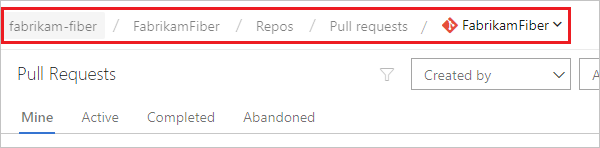

3. Select **Active** to show all active pull requests for the current repository. Select **Completed** or **Abandoned** to bring up a history of closed pull requests.

   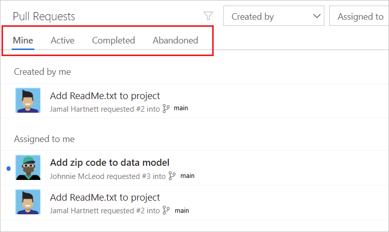

4. You can view all of your pull requests across different projects in your organization by choosing **Pull requests** in the **My Work** view.

   

::: moniker-end

::: moniker range="<= tfs-2018"

Manage pull requests you own or are assigned to with the **Pull Requests** tab in the **Code** page on the web.

::: moniker-end 

::: moniker range=">= tfs-2017" 

Select **Active** to show all active pull requests for the current repo.

Select **Completed** or **Abandoned** to bring up a history of closed pull requests.

You can view all of your pull requests in your organization, across all projects, by choosing **My pull requests** from the **Projects** page.

::: moniker-end 

## Create a new pull request

Create a new pull request from:

- [Pushed feature branches to your Git repo](#after-pushing-a-branch)
- [The **Development** section in a linked work item](#from-a-linked-work-item)
- [From the Pull Requests page on the web](#from-the-pull-requests-page-on-the-web)
- [Team Explorer in Visual Studio](#from-visual-studio) 
- [Using the Azure DevOps Services CLI](#from-the-azure-devops-services-cli)

### After pushing a branch

::: moniker range=">= azure-devops-2019"

When you publish or update a feature branch, Azure Repos prompts you to create a pull request. This prompt is displayed on **Pull Requests** and **Files**.

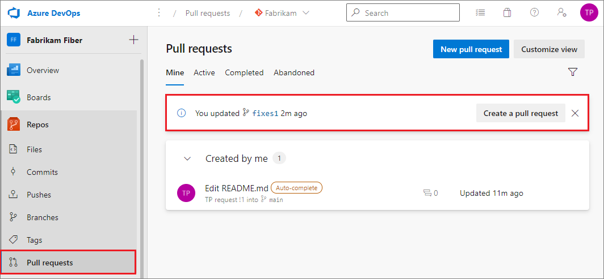

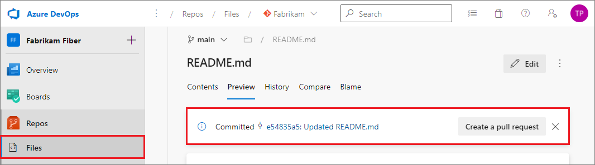

Select **Create a pull request** to go to a page where you can [enter your pull request details](pull-requests.md#finish) and create the pull request.

::: moniker-end

::: moniker range="<= tfs-2018"

When you publish or update a feature branch, Azure Repos prompts you to create a pull request in the **Code** view on the web. This prompt is displayed on **Pull Requests** and **Files**.

Select **Create a pull request** to go to a page where you can [enter your pull request details](pull-requests.md#finish) and create the pull request.

::: moniker-end

### From a linked work item

Create a pull request directly from a work item linked to the branch.

1. From **Backlogs** or **Queries** in the **Work** view, open the work item with the linked branch.
2. In the **Development** area of the work item, select **Create a pull request**.

   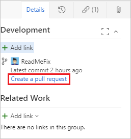

The link takes you to a page where you can [enter your pull request details](pull-requests.md#finish) and create the pull request.

### From the Pull Requests page on the web

Create pull requests from any branch from the **Pull Request** page on the web.

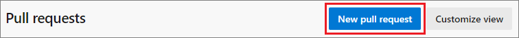

Select **New pull request** in the upper right. You can [enter your pull request details](pull-requests.md#finish) and create the pull request.
Pick the branch you want to have reviewed and the branch you want to merge the changes into, such as the main branch.  

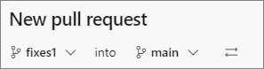

### From Visual Studio

[!INCLUDE [temp](includes/note-new-git-tool.md)]  

Initiate pull requests directly from Visual Studio.

1. [Connect to your Project from Visual Studio](../../organizations/projects/connect-to-projects.md).

2. Select **View** > **Team Explorer** to open Team Explorer. You can also select Ctrl+\ then Ctrl+m.

3. Select **Home**, then choose **Pull Requests**.

   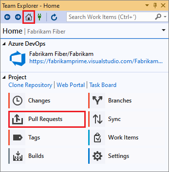

4. Select **New Pull Request** to open up a web browser where you can create the new pull request in the Azure DevOps Services web portal.

   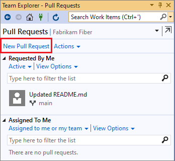

   In **Pull Requests**, you can also view pull requests opened by you or assigned to you.

   You can also initiate pull requests from Visual Studio from the **Branches** view in Team Explorer by right-clicking the branch name and selecting **Create pull request** while connected to your project.

   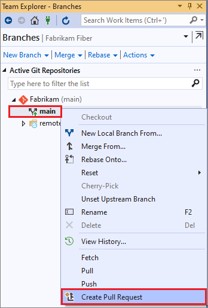

### From the Azure DevOps Services CLI

You can now manage your pull requests and other resources from the command line with [azure-devops](/cli/azure/?view=azure-cli-latest&preserve-view=true). Azure Repos and Azure DevOps Server, formerly Team Foundation Server 2017 Update 2 or later, support pull requests by using the command line.

For a list of commands to create and manage pull requests, see [Manage pull requests](/cli/vsts/code/pr).

For more information about working with the Azure DevOps Services CLI, see [Get started with CLI](/cli/vsts/get-started).

::: moniker range=">=azure-devops-2019"

## Draft pull requests

::: moniker-end

:::moniker range="azure-devops-2019"

> [!NOTE]
> Draft pull requests were added in the Azure DevOps Server 2019.1 update.

:::moniker-end

::: moniker range=">=azure-devops-2019"

Sometimes you might want to create a pull request but you aren't ready to send it to the entire team for review. A draft pull request indicates that a pull request is a work in progress. You don't have to resort to title prefixes such as WIP or DO NOT MERGE. When the pull request is ready for review, you can publish it, and begin or resume the full review process.

- [Draft pull request differences](#draft-pull-request-differences)
- [Create a draft pull request](#create-a-draft-pull-request)
- [Publish a draft pull request](#publish-a-draft-pull-request)
- [Mark as draft](#mark-as-draft)

### Draft pull request differences

Draft pull requests have the following differences from published pull requests:

- Build validation policies are enabled but not run automatically. They can be manually queued by selecting the **...** menu beside the build in the pull request.
- Voting is disabled while in draft mode.
- Required reviewers aren't automatically added.
- Notifications are sent while in draft mode, but only to reviewers that you explicitly add to the draft pull request.
- Draft pull requests are displayed in the pull requests list with a special badge.

  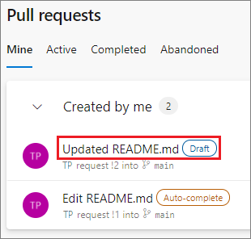

### Create a draft pull request

To create a draft pull request, choose **Create as draft** when creating the pull request.

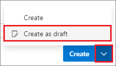

If you start your pull request title with WIP, **Create as draft** is selected as the default.

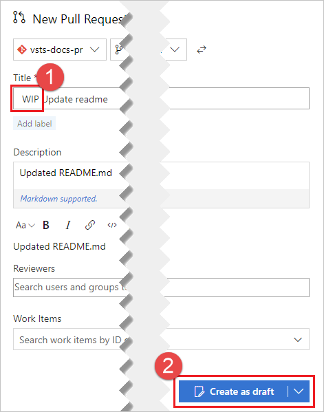

### Publish a draft pull request

When you're ready to have the pull request reviewed and completed, you can publish it.

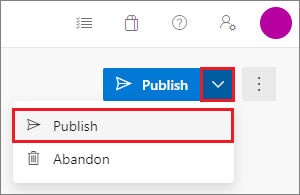

When you publish a pull request, required reviewers are assigned and notified, policies are evaluated, and voting begins.

### Mark as draft

To mark an active pull request as a draft, choose **Mark as draft**. Marking a pull request as draft resets all votes. If your pull request has any votes, you'll be asked to confirm.

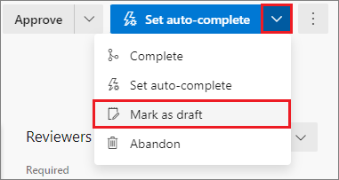

::: moniker-end

## Add detail to your pull request

Link work items and describe the changes in the branch to make it easier for others to see what problem your changes solve.
Change the pull request title, add a detailed description, add reviewers, add attachments, link work items, and make comments to explain your changes. When you're ready to create the pull request and have your changes reviewed, select **Create**.

:::moniker range="azure-devops"

:::image type="content" source="media/pull-requests/create-new-pull-request-2020.png" alt-text="Screenshot that shows creating a new pull request.":::

:::moniker-end

:::moniker range="<= azure-devops-2020"

:::image type="content" source="media/pull-requests/add-detail-to-pr.png" alt-text="Adding details to a new pull request.":::

:::moniker-end

Don't worry if you don't have all of the work items, reviewers, or details ready when you create your pull request.
You can add them now when you create the pull request.
You can also add or update all of these items after you create the pull request.

::: moniker range="azure-devops"

### Help reviewers using pull request tags

Sometimes it's important to communicate extra information about a pull request to the reviewers. Maybe the pull request is still a work in progress, or it's a hotfix for an upcoming release. You can append some extra text in the title, perhaps a "[WIP]" prefix or "DO NOT MERGE". Tags provide a way to give pull requests extra information. Use tags to communicate important details and help organize pull requests.

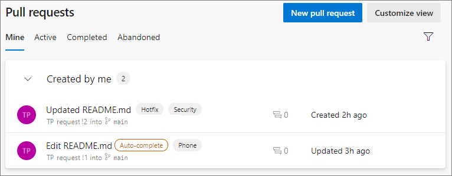

To add a tag when creating a pull request, type a tag name in the **Tags** section. After you create a pull request, you can manage its tags in the **Tags** section.

:::image type="content" source="media/pull-requests/pull-request-tags-section.png" alt-text="Screenshot that shows the pull request Tags section highlighted.":::

::: moniker-end

::: moniker range="<= azure-devops-2020"

### Help reviewers using pull request labels

Sometimes it's important to communicate extra information about a pull request to the reviewers. Maybe the pull request is still a work in progress, or it's a hotfix for an upcoming release. You can append some extra text in the title, perhaps a "[WIP]" prefix or "DO NOT MERGE". Labels now provide a way to tag pull requests with extra information. Use tags to communicate important details and help organize pull requests.

To add a label when creating a pull request, choose **Add label**. After you create a pull request, you can manage its labels in the **Labels** section.

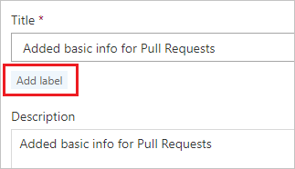

::: moniker-end

### Add and remove reviewers

::: moniker range="azure-devops"

Add reviewers to your pull request:

1. Select **Overview** in the pull request.

   :::image type="content" source="media/pull-requests/pull-request-add-reviewer-v2.png" alt-text="Pull request overview":::    

2. Select the **Add** button in the **Reviewers** area, and then select **Required** or **Optional**.

3. Enter the name of the user or group to add to the reviewer list for the pull request. If the user isn't a member of your project, you'll need to [add them](../../organizations/security/add-users-team-project.md).

4. As you enter a name or email address, a list of matching users or groups appears. Select the user or group from the list to add them as a reviewer.

   :::image type="content" source="media/pull-requests/pull-request-add-reviewer.png" alt-text="Add pull request reviewer.":::

::: moniker-end

:::moniker range="<= azure-devops-2020"

Add reviewers to your pull request:

1. Select **Overview** in the pull request.

   :::image type="content" source="media/pull-requests/pull-request-overview-reviewers-new-nav.png" alt-text="Screenshot that shows the pull request Overview tab":::    

2. Select the **Add** button in the **Reviewers** area.

3. Enter the name of the user or group to add to the reviewer list for the pull request. If the user isn't a member of your project, you'll need to [add them](../../organizations/security/add-users-team-project.md).

4. As you enter a name or email address, a list of matching users or groups appears. Select the user or group from the list to add them as a reviewer.

   :::image type="content" source="media/pull-requests/add-pr-reviewer.png" alt-text="Add pull request reviewer.":::

:::moniker-end

::: moniker range="<= tfs-2018"

Add reviewers to your pull request:

1. Select the **Overview** tab in the pull request.

   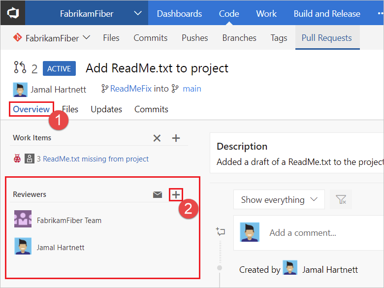

2. Select the add button in the **Reviewers** area. :::image type="icon" source="media/pull-requests/pull-request-add-button.png":::

3. Enter the name of the user or group to add to the reviewer list for the pull request. If the user isn't a member of your project, you'll need to [add them](../../organizations/security/add-users-team-project.md).

4. As you enter a name or email address, a list of matching users or groups appears. Select the user or group from the list to add them as a reviewer.

   

::: moniker-end

### Link work items

::: moniker range="azure-devops"

Link work items to your pull request:

1. Select the **Overview** tab in the pull request.

   :::image type="content" source="media/pull-requests/pull-request-link-work-items-2020.png" alt-text="Screenshot that shows selecting the Overview tab and the work items section.":::

2. Select the add button in the **Work Items** area. :::image type="icon" source="media/pull-requests/pull-request-add-button.png":::

3. Enter the ID of the work item or search for work items with titles that match your text. Select the work item from the list that appears.

Remove work item links by selecting the remove button that appears when you hover over the work item. 
Removing a link only removes the link between a work item to a pull request. Links created in the branch or from commits stay in the work item.

::: moniker-end

:::moniker range="<= azure-devops-2020"

Link work items to your pull request:

1. Select the **Overview** tab in the pull request.

   :::image type="content" source="media/pull-requests/pull-request-overview-work-items-new-nav.png" alt-text="Screenshot that shows selecting the Overview tab and the link items button.":::

2. Select the add button in the **Work Items** area. 

3. Enter the ID of the work item or search for work items with titles that match your text. Select the work item from the list that appears.

Remove work item links by selecting the remove button that appears when you hover over the work item. 
Removing a link only removes the link between a work item to a pull request. Links created in the branch or from commits stay in the work item.

:::moniker-end

::: moniker range="<= tfs-2018"

Link work items to your pull request:

1. Select **Overview** in the pull request.

   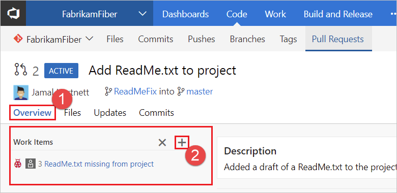

2. Select the add button in the **Work Items** area. :::image type="icon" source="media/pull-requests/pull-request-add-button.png":::

3. Enter the ID of the work item or search for work items with titles that match your text. Select the work item from the list that appears.

Remove work item links by selecting the remove button that appears when you hover over the work item. 
Removing a link only removes the link between a work item to a pull request. Links created in the branch or from commits stay in the work item.

::: moniker-end

### Edit pull request title and description

Update the title of a pull request by clicking the current title and updating the text. Choose the save button to save changes or select undo to discard your changes.

:::image type="content" source="media/pull-requests/pull-request-edit-title-description-2020.png" alt-text="Screenshot that shows editing the pull request title and selecting the description Edit button.":::

Edit the pull request description by selecting the edit icon in the description section.

Keep these fields up to date so that reviewers know what the changes in the pull request are trying to accomplish.

## Review a pull request

The **Overview** tab shows the current state of the pull request at a glance.
Review the title, description, and discussion to understand proposed changes and see issues brought up by other reviewers.  

:::image type="content" source="media/pull-requests/pull-request-overview-2020.png" alt-text="Screenshot that shows the pull request overview tab.":::

Starting with Visual Studio 2017 Update 6, you can check out the source branch from a pull request directly from **Pull Requests** in **Team Explorer**. Right-click the pull request and choose **Checkout Source Branch**.

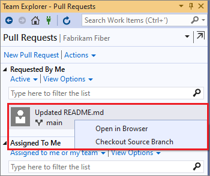

### Filter pull requests

Filtering allows you to find and organize your pull requests, enabling you to prioritize the most important files in your workflow.

::: moniker range=">= azure-devops-2020"

#### Create custom queries

You can create multiple custom queries on the pull request page with additional filters, such as draft state. These queries create separate and collapsible sections to enable better pull request actionability. The queries work across repositories on the **My pull requests** tab of the organization home page.

#### Filter by comments

Use comment-related filters on the pull request details page for faster reviews:

- Comment status: **Active** (default), **All**, **Pending**, **Resolved**, **As designed**, **Won't fix**, and **Closed**.
- Commented by: Filter for comments left by a specific person.
- File types: **Show all files** (default), and **Show only the files that have been commented on**.

::: moniker-end

::: moniker range=">= azure-devops-2019"

#### Filter by target branch

On the **Pull requests** page, click the **Filter** icon, and then select **Target branch**. Select the branch you want from the drop-down.

::: moniker-end

### Browse code changes

Select **Files** to view the changes made to the source branch next to the target branch of the pull request.

>[!NOTE]
>When viewing the difference for a _single selected file_, there is a size limit of 5 MB for the file. To view and diff files larger than 5 MB, you can download the file and view it using a local diff tool. When viewing the difference for a _collection of files_ in the Files view, the size limit for each file is 0.5 MB for performance reasons.

::: moniker range="azure-devops"

:::image type="content" source="media/pull-requests/pull-request-browse-changes-2020.png" alt-text="Screenshot that shows a side-by-side diff view of file changes in a pull request.":::

Review previous versions of the code from the **All changes** drop-down list.

::: moniker-end

::: moniker range="<= azure-devops-2020"

Review previous versions of the code from the **All updates** drop-down list.

::: moniker-end

Every time Azure Repos updates the branch, it adds a new version to the list and on the **Updates** tab.

The diff view updates as you select different changes.
It shows the differences between the files in the selected and previous version in the pull request.

::: moniker range=">= azure-devops-2019"

View code coverage metrics for changes within the pull request view. This ensures that you have adequately tested your changes through automated tests. Coverage status appears as a comment in the pull request overview. You can view details of coverage information for every code line that is changed in the file diff view.

::: moniker-end

Catch up with a pull request after being away from it by stepping through changes made since your last review.

:::moniker range="= azure-devops"

:::image type="content" source="media/pull-requests/pull-request-all-changes-dropdown.png" alt-text="Screenshot that shows the All changes drop-down.":::

:::moniker-end

::: moniker range="<= azure-devops-2020"

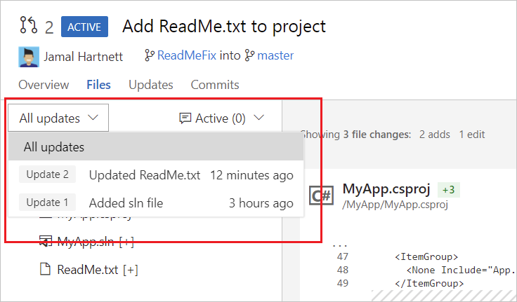

::: moniker-end

Browse a list of changes from the author using **Updates**.

You can select and view changes made in commits on the branch in **Commits**.

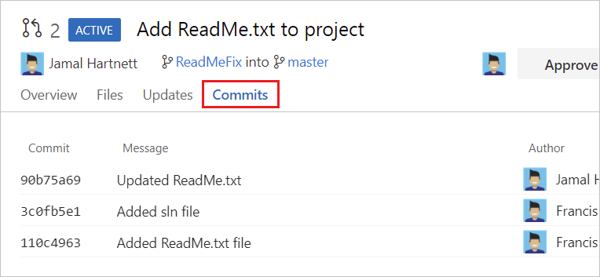

You can see a preview of how a markdown file will look by selecting the **View** button on the file, and then selecting **Preview** from the drop-down.

### Leave comments

Add comments to the pull request to make suggestions, reply to previous comments, and point out problems with the proposed changes.
Comment inline in the **Files** tab in your pull request by selecting the comment button. 
Leave feedback not tied to a specific code change by commenting in **Overview**.
Reply directly to the author or other reviewers by using `@username` and reference work items using `#workitemID` in your comments. You can also reference other pull requests using `!pullrequestID`.

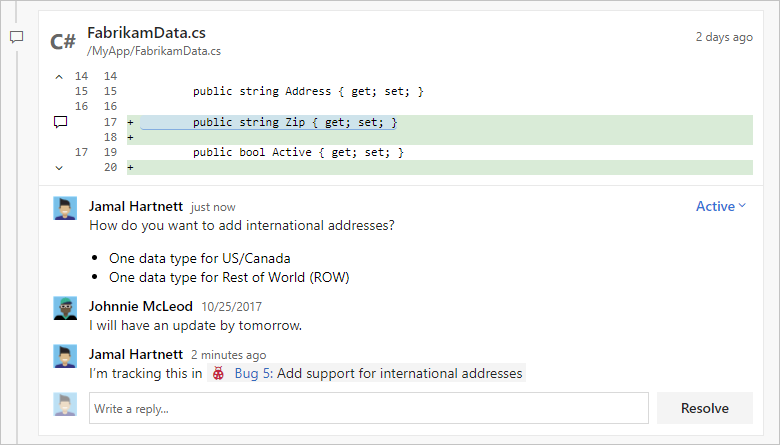

Update comment status to let reviewers know what you are doing to address the concerns brought up in their review. New comments start in **Active** status. Select **Resolve** or **Reply &amp; resolve** to update comments in the conversation.

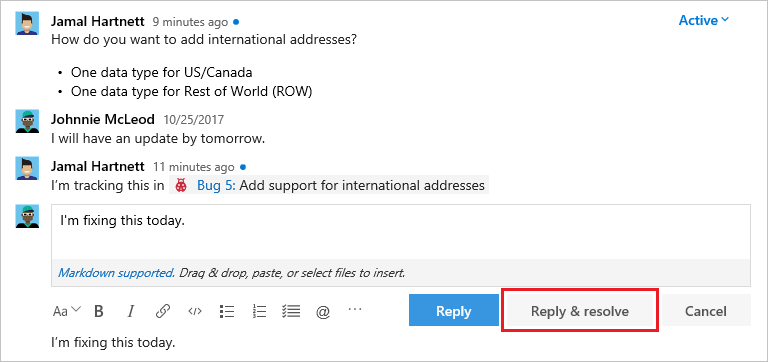

Additional options are available in the comment resolution drop-down list.

- **Active**: Comment is still under review.
- **Pending**: The issue in this comment will be addressed, but isn't fixed yet.
- **Resolved**: The issue brought up in this comment has been fixed.
- **Won't Fix**: The suggestion in the comment is noted, but won't make changes in this pull request to address it.
- **Closed**: Discussion for this comment is closed.

:::moniker range=">= azure-devops-2019"

### Mark files as reviewed

To keep track of files that have already been reviewed, select the ellipsis icon next to a file in your pull request, and then select **Mark as reviewed** from the drop-down.

:::moniker-end

### Vote on the changes

Use the button at the upper right to vote on the changes in a pull request.
The default option is **Approve**, but you can select other options from the drop-down list:

- **Approve**: Agree with the proposed changes in the pull request as-is.
- **Approve with suggestions**: Agree with the pull request, but provide optional suggestions to improve the code.
- **Wait for author**: Don't approve the changes, and ask the author to review your comments. The author should let you know to review the code again after they address your concerns.
- **Reject**: The changes aren't acceptable. If you vote this way, leave a comment in the pull request to explain why.
- **Reset feedback**: Choose **Reset feedback** to remove your vote.

The number of required approvals in a pull request can be set from the [branch policy](branch-policies.md) for the branch. A pull request that meets the required number of approvals can be completed. Even if other reviewers reject the changes, the pull request is completed.

When you configure the [Require a minimum number of reviewers](branch-policies.md#require-a-minimum-number-of-reviewers) branch policy, select **Reset code reviewer votes when there are new changes** to reset votes when you push new changes.

Best practice: At least two reviewers should review and approve the changes in a significant pull request.  

## Update code in response to feedback

Update your code in response to comments. Then create a new [commit](commits.md) with the changes and [push](pushing.md) the updates to the branch in your Git repo.
You can make quick updates to your branch directly from the **Files** tab in **Code** on the web.

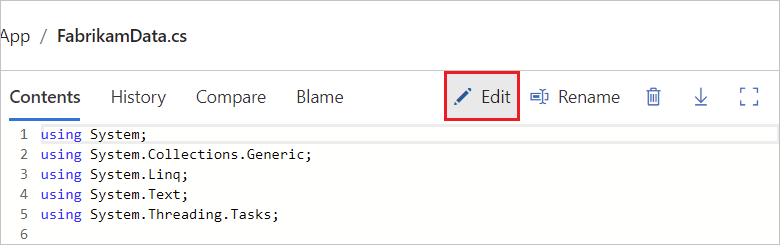

::: moniker range=">=azure-devops-2019"

## Change the target branch of a pull request

For most teams, nearly all pull requests target the same branch, such as `main` or `develop`. You may need to target a different branch, but it's easy to forget to change the target branch from the default. To change the target branch of an active pull request, see [Change the target branch of a pull request](/azure/devops/release-notes/2018/sprint-141-update#azure-repos).

::: moniker-end

## Complete the pull request

::: moniker range="azure-devops"

1. Select **Complete** in the upper right of the pull request view to complete your pull request after the reviewers approve of the changes.

   

   - **Complete**: Complete the pull request now and merge the changes to the target branch.
   - **Set auto-complete**: If you have branch policies, you can choose **Set auto-complete** to configure the pull request to close once it meets all branch policies.
   - **Abandon**: Close the pull request without merging the changes.

2. In **Complete pull request**, enter the message for the [merge commit](merging.md) and update the pull request description.

   :::image type="content" source="media/pull-requests/pull-request-complete-merge-2020.png" alt-text="Screenshot that shows the complete pull request dialog.":::

3. Select your **Merge type**:
    - **Merge (no fast forward)**: Non-linear history preserving all commits.
    - **Squash commit**: Linear history with only a single commit on the target ([squash merge](merging-with-squash.md) your pull request).
    - **Rebase and fast-forward**: Rebase source commits onto target and fast-forward.
    - **Semi-linear merge**: Rebase source commits onto target and create a two-parent merge.
   
   > [!NOTE]
   > Existing policies are still enforced. For example, if your branch currently has a “squash merge only” policy in place, you will have to edit that policy in order to use the new merge types.  
    
4. Select any of the following post-completion options (some options are not available depending on the merge type):

   - **Complete associated work items after merging** to complete any linked work items.
   - **Delete `<branch name>` after merging** to delete the source branch from the pull request.
   - **Customize merge commit message** to add a custom merge commit message.
   - **Override branch policies and enable merge** to force a branch to merge even if it doesn't satisfy all branch policies. This option is only available if you have [Exempt from policy enforcement](branch-policies.md#bypass-branch-policies) permissions.

5. Select **Complete merge**.

Linked work items are also updated showing the pull request completion.

There are a few situations when rebasing during pull request completion is not possible:

- If a policy on the target branch prohibits using rebase strategies, you will need “Override branch policies” permission.
- If the source branch of the pull request has policies, you won’t be able to rebase it. Rebasing will modify the source branch without going through the policy approval process.
- If you’ve used the Merge Conflict Extension to resolve merge conflicts. Conflict resolutions applied to a three-way merge are seldom successful (or even valid) when rebasing all the commits in a pull request one at a time.

In all these cases, you still have the option of rebasing your branch locally and pushing to the server, or squash-merging your changes when completing the pull request.

::: moniker-end

::: moniker range=">= azure-devops-2019 <= azure-devops-2020"

1. Select **Complete** in the upper right of the pull request view to complete your pull request after the reviewers approve of the changes.

   

   - **Complete**: Complete the pull request now and merge the changes to the target branch.
   - **Set auto-complete**: If you have branch policies, you can choose **Set auto-complete** to configure the pull request to close once it meets all branch policies.
   - **Abandon**: Close the pull request without merging the changes.

2. In **Complete pull request**, enter the message for the [merge commit](merging.md) and update the pull request description.

   

3. Select any of the following options:
    - **Complete linked work items after merging** to complete any linked work items.
    - **Delete `<branch name>` after merging** to delete the source branch from the pull request.
    - **Squash changes when merging** to [squash merge](merging-with-squash.md) your pull request.
    - **Override branch policies and enable merge** to force a branch to merge even if it doesn't satisfy all branch policies. This option is only available if you have [Exempt from policy enforcement](branch-policies.md#bypass-branch-policies) permissions.
    
   
   > [!NOTE]
   > Existing policies are still enforced. For example, if your branch currently has a “squash merge only” policy in place, you will have to edit that policy in order to use the new merge types.  

5. Select **Complete merge**.

Linked work items are also updated showing the pull request completion.

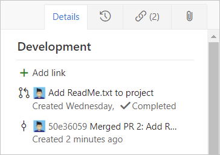

There are a few situations when rebasing during pull request completion is not possible:

- If a policy on the target branch prohibits using rebase strategies, you will need “Override branch policies” permission.
- If the source branch of the pull request has policies, you won’t be able to rebase it. Rebasing will modify the source branch without going through the policy approval process.
- If you’ve used the Merge Conflict Extension to resolve merge conflicts. Conflict resolutions applied to a three-way merge are seldom successful (or even valid) when rebasing all the commits in a pull request one at a time.

In all these cases, you still have the option of rebasing your branch locally and pushing to the server, or squash-merging your changes when completing the pull request.

::: moniker-end

::: moniker range="<= tfs-2018"

1. Select **Complete** in the upper right of the pull request view to complete your pull request after the reviewers approve of the changes.

   

   - **Complete**: Complete the pull request now and merge the changes to the target branch.
   - **Set auto-complete**: If you have branch policies, you can choose **Set auto-complete** to configure the pull request to close once it meets all branch policies.
   - **Abandon**: Close the pull request without merging the changes.

2. In **Complete pull request**, enter the message for the [merge commit](merging.md) and update the pull request description.

   

3. Select any of the following post-completion options:

   - **Complete linked work items after merging** to complete any linked work items.
   - **Delete `<branch name>` after merging** to delete the source branch from the pull request.
   - **Squash changes when merging** to [squash merge](merging-with-squash.md) your pull request.
   - **Override branch policies and enable merge** to force a branch to merge even if it doesn't satisfy all branch policies. This option is only available if you have [Exempt from policy enforcement](branch-policies.md#bypass-branch-policies) permissions.

4. Select **Complete merge**.

Linked work items are also updated showing the pull request completion.

::: moniker-end

### Resolve merge conflicts

You must resolve any [merge conflicts](merging.md) between the pull request branch and the target branch. Git adds
a new commit (the *merge commit*) to the end of the main branch. This merge commit links the earlier history of both the main branch and the commits for the branch
that was merged as part of the pull request.

::: moniker range=">= tfs-2017" 

### Complete automatically

Select **Set auto-complete** from the **Complete** drop-down list to complete the pull request and merge the changes as soon as it meets all [branch policies](branch-policies.md).
When the conditions satisfy branch policies, the pull request is completed. You receive an email notification. If there's a conflict or an error completing the pull request, email notifies you of the issue.

Once you set auto-complete, the pull request displays a banner.
Select **Cancel auto-complete** to turn off auto-complete and return the pull request to an active state. Starting with TFS 2018 Update 2, the banner [displays the outstanding list of policy criteria](/azure/devops/release-notes/2018/jan-24-vsts#view-remaining-policy-criteria-for-pull-request-auto-complete).

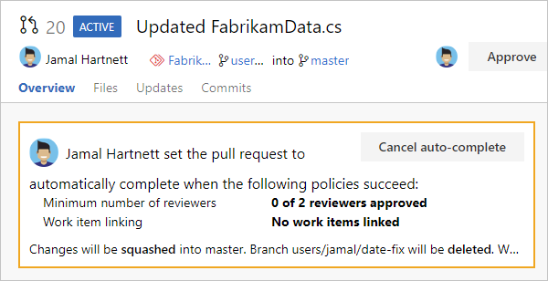

>[!NOTE]
>The **Auto-complete** option is available in Azure Repos and TFS 2017 and higher. It is only present when you have branch policies that must be satisfied. If you don't see **Auto-complete**, you don't have any branch policies. For more information, see [Branch policies](branch-policies.md).

::: moniker-end 

### Abandon your changes

Select **Abandon** from the drop-down on the **Complete** button to abandon your changes.
You can still view the abandoned pull request.
It stays linked to work items.

Reactivate an abandoned pull request at any time. Select the pull request from the **Abandoned** tab in the **Pull Request** view.

## Receiving notification of pull request updates

Subscribe to email alerts to get notified for changes to your pull requests.

>[!NOTE]
>By default, you are subscribed to several common pull request notifications. For a complete list of default notification subscriptions, see [Out-of-the-box (OOB) or default subscriptions](../../notifications/oob-built-in-notifications.md#out-of-the-box-oob-or-default-subscriptions)

::: moniker range=">= azure-devops-2019"

[Go to your project](../../project/navigation/go-to-project-repo.md) and select **Project settings** > **Notifications** to view your notification settings.

   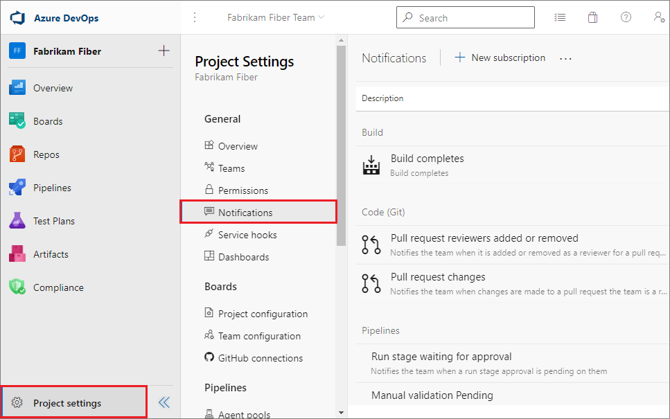

- Choose **New subscription** to subscribe to additional notifications.

  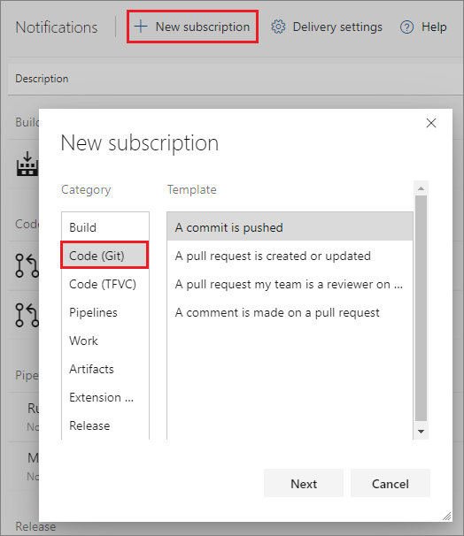

- To edit a notification, select **...** for the notification and choose **View** to edit the subscription.

  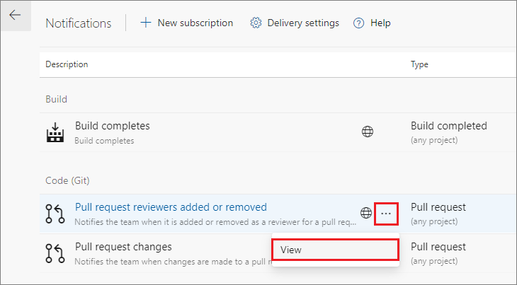

- To opt-out of a notification, set the **State** to **Off**.

  

::: moniker-end

::: moniker range="<= tfs-2018"

Select the settings button while you have your project open to bring up the project administration page.

 

- Select the **Notifications** tab to view your notification settings, and choose **New subscription** to subscribe to additional notifications.

  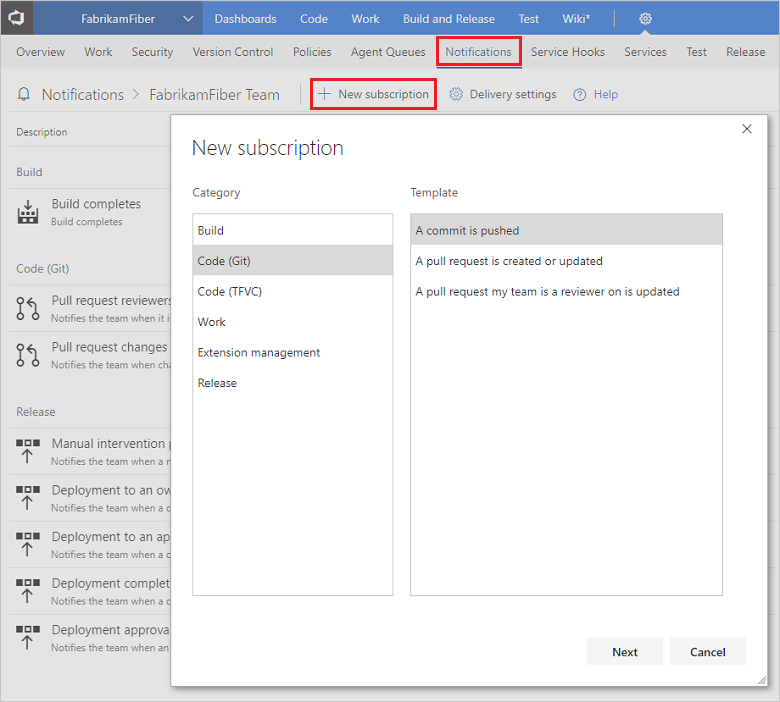

- To edit a notification, select **...** for the notification and choose **View** to edit the subscription. 

  

- To opt-out of a notification, set the **State** to **Off**.

   

::: moniker-end

::: moniker range=">= tfs-2017" 

## Revert a pull request

To undo the changes in a pull request, follow these steps:

1. Open the completed pull request and select **Revert**.
   When you revert a pull request in this way, you create a new branch with changes that undo the pull request for an existing target branch in your repo.

1. In **Target branch**, select the branch where you want to undo the pull request changes.

1. In **Topic branch name**, select a new branch where the reverted changes are created, then select **Revert**.

1. Select **Create pull request** to merge the newly created branch in a second pull request to complete the revert.

> [!NOTE]
> The branch created during this revert has a single commit that reverts the file changes in the pull request. The branch doesn't contain a reverted commit for each of the commits merged in the original pull request.

## Cherry-pick a pull request

To copy changes made in a pull request to another branch in your repo, follow these steps:

1. In a completed pull request, select **Cherry-pick**, or for an active pull request, select **Cherry-pick** from the **...** menu.
   Cherry-picking a pull request in this way creates a new branch with the copied changes.
   Merge into a target branch in a second pull request.

1. In **Target branch**, enter the branch you want to merge the copied changes.

1. In **Topic branch name**, enter a new branch to contain the copied changes, then select **Cherry-pick**.

1. Select **Create pull request** to merge the topic branch into the target branch to complete the cherry-pick.

::: moniker-end 

## Set a new default branch

[!INCLUDE ]

There are other aspects you should consider before making this change.
Learn about them in the topic on [changing your default branch](change-default-branch.md).
