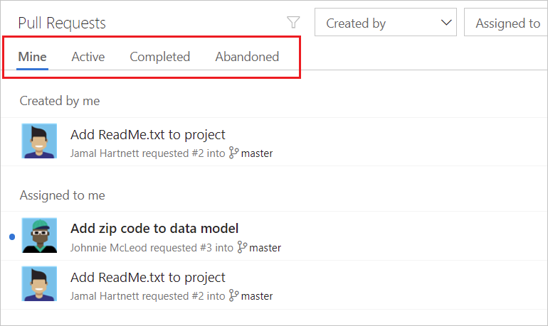
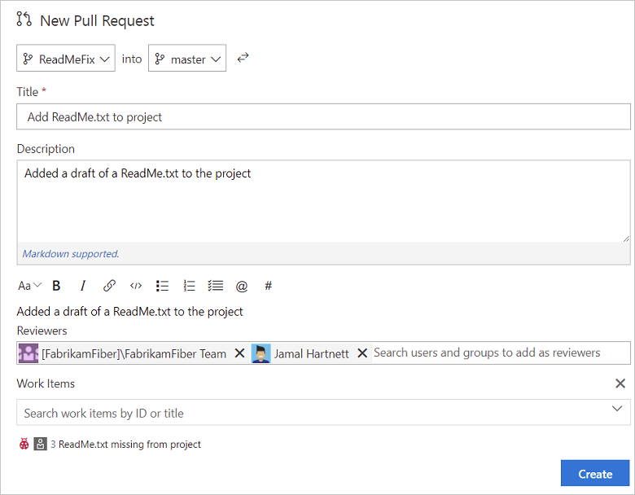
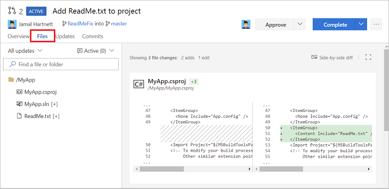
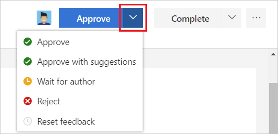
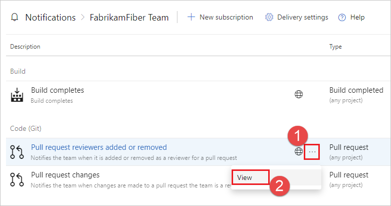

# Review code with pull requests

#### Azure Repos | TFS 2018 | TFS 2017 | TFS 2015 | VS 2017 | VS 2015

Create pull requests to review and merge code in a [Git project](../../organizations/projects/create-project.md).
Pull requests let your team review code and give feedback on changes before
merging it into the master branch. Pull requests can come from either
topic branches within the same repository or from a branch in a
[fork](forks.md) of the original repository.
Reviewers can step through the proposed changes, leave comments, and vote to approve or reject the code.

New to pull requests? [Learn more](/azure/devops/learn/git/git-pull-requests) about how to get feedback with Git pull requests.

## View and manage your pull requests

::: moniker range=">= azure-devops-2019"

1. To view pull requests in a specific repository in a project, [navigate](../../project/navigation/go-to-project-repo.md) to that project in the web portal and select **Repos**, **Pull requests**.

  

1. Verify that the correct repository is selected.

  

1. Select **Active** to show all active pull requests for the current repository. Select **Completed** or **Abandoned** to bring up a history of closed pull requests.

  

You can view all of your pull requests across different projects in your organization by choosing **Pull requests** in the **My Work** view.

::: moniker-end

::: moniker range="<= tfs-2018"

Manage to pull requests you own or are assigned to with the **Pull Requests** tab in the **Code** page on the web.

::: moniker-end 

::: moniker range=">= tfs-2017" 

Select **Active** to show all active pull requests for the current repo. 

Select **Completed** or **Abandoned** to bring up a history of closed pull requests. 

You can view all of your pull requests in your organization, across all projects, by choosing **My pull requests** from the **Projects** page.

::: moniker-end 

## Create a new pull request

Create a new pull request from:

- [Pushed feature branches to your Git repo](#after-pushing-a-branch)
- [The **Development** section in a linked work item](#from-a-linked-work-item)
- [From the Pull requests page on the web](#from-the-pull-requests-page-on-the-web)
- [Team Explorer in Visual Studio](#from-visual-studio) 
- [Using the Azure DevOps Services CLI](#from-the-azure-devops-services-cli)

### After pushing a branch

::: moniker range=">= azure-devops-2019"

When you publish or update a feature branch in Azure Repos, you get a prompt asking if you would like to create a pull request. This prompt is displayed on the **Pull Requests** page and the **Files** page.

Select the **Create a pull request** link to go to a page where you can [enter your pull request details](pull-requests.md#finish) and create the pull request.

::: moniker-end

::: moniker range="<= tfs-2018"

When you publish or update a feature branch in Azure Repos, you get a prompt asking if you would like to create a pull request in the **Code** view on the web. This prompt is displayed on the **Pull Requests** tab and the **Files** tab.

Select the **Create a pull request** link to go to a page where you can [enter your pull request details](pull-requests.md#finish) and create the pull request.

::: moniker-end

### From a linked work item

Create a pull request directly from a work item linked to the branch. 

1. From the **Backlogs** or **Queries** tab in the **Work** view , open the work item with the linked branch. 
1. In the **Development** area of the work item, there's a link to create a pull request under the branch name.  

Select the link to go to a page where you can [enter your pull request details](pull-requests.md#finish) and create the pull request.

### From the Pull requests page on the web

Create pull requests from any branch from the **Pull Request** page on the web.

Select **New pull request** in the upper right to go to a page where you can [enter your pull request details](pull-requests.md#finish) and create the pull request.
Pick the branch you wish to have reviewed and the branch you want to merge the changes into, such as the master branch.  

### From Visual Studio

Initiate pull requests directly from Visual Studio. 

1. [Connect to your Project from Visual Studio](../../organizations/projects/connect-to-projects.md).

1. Open Team Explorer (select **View**, then **Team Explorer** or use the `Ctrl+\`, `Ctrl+M` hotkey)

1. Open **Pull Requests** in Team Explorer by selecting the **Home** icon and choosing **Pull Requests**.

   

1. From the **Pull Requests** view you can view pull requests opened by you, assigned to you, and you can create new pull requests. Select **New Pull Request** to open up a web browser where you can create the new pull request in the Azure DevOps Services web portal.

   

   You can also initiate pull requests from Visual Studio from the **Branches** view in Team Explorer by right-clicking the branch name and selecting **Create pull request** while connected to your project.

   

### From the Azure DevOps Services CLI

You can now manage pull requests and other resources in Azure DevOps Services and Team Foundation Server 2017 Update 2 or later from the command line with the **[Azure DevOps Services CLI](/cli/azure/ext/azure-devops/?view=azure-cli-latest)**.

For a list of commands to create and manage pull requests, see [Manage pull requests](/cli/vsts/code/pr).

For more information about working with the Azure DevOps Services CLI, see [Get started with the Azure DevOps Services CLI](/cli/vsts/get-started).

::: moniker range="azure-devops"

## Draft pull requests

Sometimes you may want to create a pull request but you aren't ready to send it to the entire team for review. Draft pull requests allow you to indicate that a pull request is a work in progress, without resorting to title prefixes such as WIP or DO NOT MERGE. When the pull request is ready for review, you can publish it, and begin (or resume) the full review process.

- [Draft pull request differences](#draft-pull-request-differences)
- [Create a draft pull request](#create-a-draft-pull-request)
- [Publish a draft pull request](#publish-a-draft-pull-request)
- [Mark as draft](#mark-as-draft)

### Draft pull request differences

Draft pull requests have the following differences from published pull requests.

- Build validation policies are enabled but not run automatically, but they can be manually queued by selecting the **...** menu beside the build in the pull request.
- Voting is disabled while in draft mode.
- Required reviewers are not automatically added.
- Notifications are sent while in draft mode, but only to reviewers that you explicitly add to the draft pull request.
- Draft pull requests are displayed in the pull requests list with a special badge.

  

### Create a draft pull request

To create a draft pull request, choose **Create as draft** when creating the pull request.

If you start your pull request title with WIP, **Create as draft** is selected as the default option.

### Publish a draft pull request

When you're ready to have the pull request reviewed and completed, you can publish it.

When a pull request is published, required reviewers are assigned and notified, policies are evaluated, and voting is enabled.

### Mark as draft

To mark an active pull request as a draft, choose **Mark as draft**. Marking a pull request as draft resets all votes, and if your pull request has any votes you'll be asked to confirm.

::: moniker-end

## Add detail to your pull request

Link work items and describe the changes in the branch to make it easier for others to see what problem you are trying to solve. 
Change the pull request title, add a detailed description, add reviewers, link work items, and make comments to explain your changes. When you're ready to create the pull request and have your changes reviewed, select **Create**.

Don't worry if you don't have all of the work items, reviewers, or details ready when you create your pull request - you can add them now when you create the pull request, and you can also add or update all of these items later after you create the pull request.

### Help reviewers using pull request labels

Sometimes it's important to communicate extra information about a pull request to the reviewers. Maybe the pull request is still a work in progress, or it's a hotfix for an upcoming release - so you append some extra text in the title, perhaps a "[WIP]" prefix or "DO NOT MERGE". Labels now provide a way to tag pull requests with extra information that can be used to communicate important details and help organize pull requests.

To add a label when creating a pull request, choose **Add label**. After a pull request is created you can manage labels in the **Labels** section.

In a future release, we'll make labels even more useful by making it easier to filter pull requests using labels.

### Add and remove reviewers

::: moniker range=">= azure-devops-2019"

Add reviewers to your pull request. 

1. Select the **Overview** tab in the pull request.

  

1. Select the add icon  in the **Reviewers** area.

1. Enter the name of the user or group to add to the reviewer list for the pull request. If the user isn't a member of your Project, you'll need to [add them](../../organizations/accounts/add-team-members.md).

1. As you enter a name or email address, a list of matching users or groups appears. Select the user or group from the list to add them as a reviewer.

  

::: moniker-end

::: moniker range="<= tfs-2018"

Add reviewers to your pull request. 

1. Select the **Overview** tab in the pull request.

  

1. Select the add icon  in the **Reviewers** area.

1. Enter the name of the user or group to add to the reviewer list for the pull request. If the user isn't a member of your Project, you'll need to [add them](../../organizations/accounts/add-team-members.md).

1. As you enter a name or email address, a list of matching users or groups appears. Select the user or group from the list to add them as a reviewer.

  

::: moniker-end

### Link work items

::: moniker range=">= azure-devops-2019"

Link work items to your pull request:

1. Select the **Overview** tab in the pull request.

  

1. Select the add icon  in the **Work Items** area.

1. Enter the ID of the work item or search for work items with titles that match your text. Select the work item from the list that appears.

Remove work item links by selecting the  that appears when you hover over the work item. 
This only removes the link between a work item to a pull request; links created in the branch or from commits stay in the work item.

::: moniker-end

::: moniker range="<= tfs-2018"

Link work items to your pull request:

1. Select the **Overview** tab in the pull request.

  

1. Select the add icon  in the **Work Items** area.

1. Enter the ID of the work item or search for work items with titles that match your text. Select the work item from the list that appears.

Remove work item links by selecting the  that appears when you hover over the work item. 
This only removes the link between a work item to a pull request; links created in the branch or from commits stay in the work item.

::: moniker-end

### Edit pull request title and description

Update the title of a pull request by clicking the current title and updating the text. Choose the save icon to save changes or select undo to discard your changes.

Edit the pull request description by selecting the edit link that appears when you hover over the existing description.

Keep these fields up to date so reviewers know what the changes in the pull request are trying to accomplish.   

## Review a pull request 

The **Overview** tab shows the current state of the pull request at a glance. 
Review the title, description, and discussion to get an understanding of the proposed changes and see issues brought up by other reviewers.  

If you need to make a change to the code as part of your review, starting with Visual Studio 2017 Update 6 you can checkout the source branch from a pull request directly from the **Pull Requests** view in **Team Explorer**. Right-click the desired pull request and choose **Checkout Source Branch**.

### Browse code changes

Select the **Files** tab to view the changes made to the source branch relative to the target branch of the pull request.

>[!NOTE]
>The size limit for files in the files view and the diff view is 5 MB. To view and diff files larger than 5 MB, you can download the file and view it using a local diff tool on your machine.

Review previous versions of the code pushed to the source branch of the pull request from the **All updates** drop-down. 
A new version is added to the list in the drop-down and on the **Updates** tab every time the branch is updated in Azure Repos. 

The diff view updates as you select different changes, showing the differences between the files in the currently selected and previous version in the pull request. 
Catch up with a pull request after being away from it for awhile by stepping through changes made since your last review.

Browse a list of changes by push from the author using the **Updates** tab. 

You can select and view changes made in commits on the branch in the **Commits** tab.

### Leave comments

Add comments to the pull request to make suggestions, reply to previous comments, and point out problems with the proposed changes. 
Comment inline in the **Files** tab in your pull request by selecting the comment icon ().
Leave feedback not tied to a specific code change by commenting in the **Overview** tab. 
Reply directly to the author or other reviewers by using `@username` and reference work items using `#workitemID` in your comments. You can also reference other pull requests using `!pullrequestID`.

Update comment status to let reviewers know what you are doing to address the concerns brought up in their review. New comments start in **Active** status and can be updated in the conversation using the **Resolve** and **Reply &amp; resolve** buttons.

Additional options are available in the comment resolution drop-down.

- **Active**: Comment is still under review.
- **Pending**: The issue in this comment will be addressed, but isn't fixed yet.
- **Resolved**: The issue brought up in this comment has been fixed.
- **Won't Fix**: The suggestion in the comment is noted, but won't make changes in this pull request to address it.
- **Closed**: Discussion for this comment is closed.   
    
### Vote on the changes   

Vote on the changes in a pull request by choosing an option from the button on the upper right. The default option is **Approve**, but you can select other options from the drop-down:

- **Approve**: Agree with the proposed changes in the pull request as-is.
- **Approve with suggestions**: Agree with the pull request, but provide optional suggestions to improve the code.
- **Wait for author**: Do not approve the changes, and ask the author to review your comments. The author should let you know when you should re-review the code after they have addressed your concerns.
- **Reject**: The changes aren't acceptable. If you are voting this way, you should leave a comment in the pull request detailing why the changes were rejected.    
- **Reset feedback**: Choose **Reset feedback** to remove your vote.

The number of required approvals in a pull request can be set from the [branch policy](branch-policies.md) for the branch. Pull requests can be completed if the number of required approvals is met, even if other reviewers have rejected the changes. Votes in a pull request can optionally be reset when new code is pushed to the branch by checking **Reset code reviewer votes when there are new changes** when configuring the [Require a minimum number of reviewers](branch-policies.md#require-a-minimum-number-of-reviewers) branch policy.

Best practice: At least two reviewers should review and approve the changes in a significant pull request.  

## Update code in response to feedback

Update your code in response to comments by creating a new [commit](commits.md) with the changes and [pushing](pushing.md) the updates to the branch in your Git repo. 
You can make quick updates to your branch directly from the **Files** tab in the **Code** view on the web.

::: moniker range="azure-devops"

## Change the target branch of a pull request

For most teams, nearly all pull requests target the same branch, such as `master` or `develop`. However, in the case where you do need to target a different branch, it's easy to forget to change the target branch from the default. With the new feature to change the target branch of an active pull request, this is now a simple action. To learn how, see [Change the target branch of a pull request](/azure/devops/release-notes/2018/sprint-141-update#azure-repos).

::: moniker-end

## Complete the pull request

Complete your pull request after the reviewers approve of the changes by selecting **Complete** in the upper right of the pull request view.

- **Complete**: Complete the pull request now and merge the changes to the target branch.
- **Set auto-complete**: If you have branch policies, you can choose **Set auto-complete** to configure the pull request to close once all branch policies are met.
- **Abandon**: Choose **Abandon** to close the pull request without merging the changes. 

Enter the message used for the [merge commit](merging.md) and update the pull request description as needed in the dialog that follows. 

- Check **Complete linked work items after merging** to complete any linked work items.
- Check **Delete `<branch name>` after merging** to delete the source branch from the pull request.
- Check **Squash changes when merging** to [squash merge](merging-with-squash.md) your pull request.
- Check **Override branch policies and enable merge** to force merge even if all branch policies haven't been satisfied. This option is only available if you have [Exempt from policy enforcement](branch-policies.md#bypass-branch-policies) permissions.

Linked work items are also updated showing the pull request completion.

::: moniker range=">= tfs-2017" 

### Complete automatically

Select **Auto-complete** from the **Complete** button drop-down to complete the pull request and merge the changes as soon as all [branch policies](branch-policies.md) are met.
Auto-completion lets you skip having to come back to the pull request to complete it after the build finishes successfully and the reviewers approve the changes.
When the conditions are satisfied for auto-complete, the pull request is completed and you are notified via email. If there is a conflict or an error completing the pull request, you will get an email notifying you of the issue so you can resolve it.

Once auto-complete has been set, the pull request displays a banner confirming that the changes will be merged as soon as the policies are satisfied.
Select **Cancel auto-complete** to turn off auto-complete and return the pull request to an active state. Starting with TFS 2018 Update 2, the banner [displays the outstanding list of policy criteria](/azure/devops/release-notes/2018/jan-24-vsts#view-remaining-policy-criteria-for-pull-request-auto-complete).

>[!NOTE]
>The **Auto-complete** option is available in Azure Repos and TFS 2017 and higher, and is only present when you have branch policies that must be satisfied before the pull request can be completed. If you don't see **Auto-complete**, it is because you don't have any branch policies. For more information, see [Branch policies](branch-policies.md).

::: moniker-end 

### Abandon your changes

Abandon pull requests when you decide the work in the feature branch should not be merged by selecting **Abandon** from the drop-down on the **Complete** button.
The abandoned pull request will still be viewable on the web and stays linked to work items.

Reactivate an abandoned pull request at any time by selecting the pull request from the **Abandoned** tab in the **Pull Request** view and selecting  **Reactivate**.

## Receiving notification of pull request updates

Subscribe to email alerts to get notified when changes are made to your pull requests. 

>[!NOTE]
>By default you are subscribed to several common pull request notifications. For a complete list of default notification subscriptions, see [Out-of-the-box (OOB) or default subscriptions](../../notifications/oob-built-in-notifications.md#out-of-the-box-oob-or-default-subscriptions)

::: moniker range=">= azure-devops-2019"

1. [Navigate](../../project/navigation/go-to-project-repo.md) to your project and select **Project settings**, **Notifications** to view your notification settings

   

1. Choose **New subscription** to subscribe to additional notifications.

   

1. To edit a notification, select **...** for the notification and choose **View** to edit the subscription. 

   

1. To opt-out of a notification, set the **State** to **Off**.

   

::: moniker-end

::: moniker range="<= tfs-2018"

1. Select the settings icon while you have your project open to bring up the project administration page.

    

1. Select the **Notifications** tab to view your notification settings, and choose **New subscription** to subscribe to additional notifications.

  

1. To edit a notification, select **...** for the notification and choose **View** to edit the subscription. 

  

1. To opt-out of a notification, set the **State** to **Off**.

  

::: moniker-end

::: moniker range=">= tfs-2017" 

## Revert a pull request

Undo the changes made in a pull request by opening the completed pull request and selecting **Revert**. When you revert a pull request in this way, you create a new branch with changes that will
undo the pull request for an existing target branch in your repo.

In the dialog that appears, pick the branch where you want to undo the pull request changes in the **Target branch** selector and the name of a new branch where the reverted changes will be created in the **Topic branch name** field, then select **Revert**. 
Select **Create pull request** to merge the newly created branch in a second pull request to complete the revert.

> [!NOTE]
> The branch created during this revert has a single commit that reverts the file changes in the pull request. The branch does not contain a reverted commit for each of the commits merged in the original pull request.

## Cherry-pick a pull request

Copy changes made in a pull request to another branch in your repo by selecting **Cherry-pick** while viewing the completed pull request or selecting **Cherry-pick** from the **...** menu while viewing an active pull request.
Cherry-picking a pull request in this way creates a new branch with the copied changes that you then merge into a target branch in a second pull request.

In the dialog that appears, enter the branch you want to merge the copied changes into in the **Target branch** field and a new branch that will contain the copied changes in the **Topic branch name** field, then select **Cherry-pick**.
If there are no conflicts between the target branch and the newly created topic branch, you can then select **Create pull request** to merge the topic branch into the target branch to complete the cherry-pick.

::: moniker-end 

## Set a new default branch

>[!NOTE]
>This step requires [Edit Policies permissions](../../organizations/security/set-git-tfvc-repository-permissions.md#git-repository) on your Git repo. 

Configure your Git repo to use a different default branch to merge code into when your team creates new pull requests.
This is useful when you want to use a branch other than `master` for new changes or need to change your main line of development in your repo.

::: moniker range=">= azure-devops-2019"

1. [Navigate](../../project/navigation/go-to-project-repo.md) to your project and select **Project settings**.

2. Scroll down and select **Repositories** from the **Code** section.

3. Select the desired repository and expand the branches.

4. Select the **...** beside the desired branch and choose **Set as default branch**.

   

::: moniker-end

::: moniker range="<= tfs-2018"

1. Select the settings icon while you have your project open to bring up the project administration page.

   
   
1. Select **Version Control**.

1. Select your Git repository. Your branches are displayed under your repo.

1. Select the **...** next to the branch you want to set as default, then select **Set as default branch**.

   

::: moniker-end
