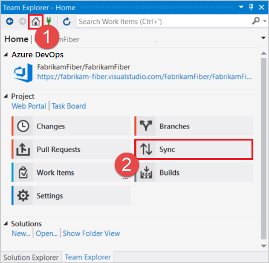
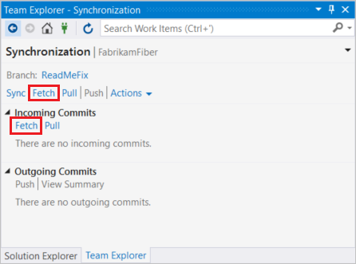
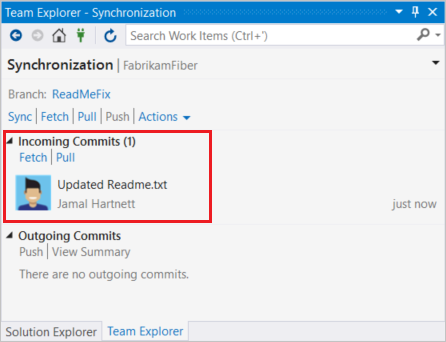
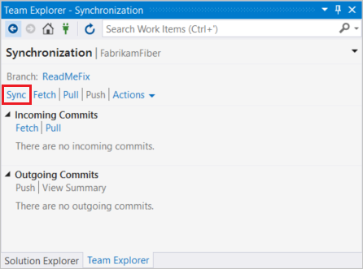
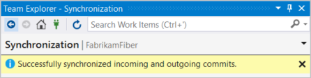
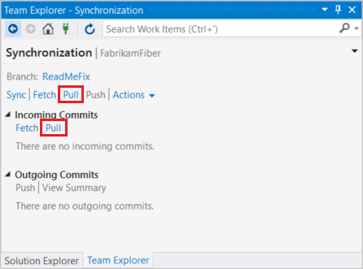
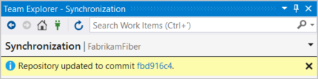
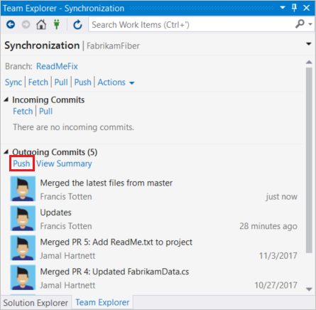

# Update code with fetch and pull

**Azure Repos | Azure DevOps Server 2020 | Azure DevOps Server 2019 | TFS 2018 | TFS 2017 | TFS 2015 | VS 2017 | VS 2015**

Update the code in your local repo with the changes from other members of your team using the following commands:

- `fetch` , which downloads the changes from your remote repo but doesn't apply them to your code.
- `merge` , which applies changes taken from `fetch` to a branch on your local repo.
- `pull` , which is a combined command that does a `fetch` and then a `merge`.

In this tutorial you learn how to:

> [!div class="checklist"]
> * Download changes with fetch
> * Update branches with merge
> * Fetch and merge with pull
> * Update your local branch with the latest changes from main

## Video Overview

<iframe src="https://channel9.msdn.com/series/Team-Services-Git-Tutorial/Git-Tutorial-Pull/player" width="640" height="360" allowFullScreen frameBorder="0"></iframe>

If there's a merge conflict between a commit you haven't [pushed](pushing.md) yet and a commit you're merging or pulling, [resolve those conflicts](merging.md) before you finish updating your code.

## Download changes with fetch

You download changes to your local branch from the remote through `fetch`. `Fetch` asks the remote repo for all commits and new branches that others have pushed but you don't have and downloads them into your repo, creating local branches as needed.

`Fetch` doesn't merge any changes into your local branches. It only downloads the new commits for your review.

>[!TIP]
>To help keep your branches list clean and up to date, configure Git to prune remote branches during fetch. You can configure this setting from the [command line](git-config.md?tabs=command-line#prune-remote-branches-during-fetch) or from within [Visual Studio](git-config.md?tabs=visual-studio#prune-remote-branches-during-fetch).

#### [Visual Studio](#tab/visual-studio/)

[!INCLUDE [temp](includes/note-new-git-tool.md)]  

Visual Studio uses the **Sync** view in Team Explorer to `fetch` changes.
Changes downloaded by `fetch` aren't applied until you **Pull** or **Sync** the changes.

1. In Team Explorer, select the **Home** button and choose **Sync**.

   

1. In **Synchronization**, select **Fetch** to update the incoming commits list.

   

   There are two **Fetch** links, one near the top and one in the **Incoming Commits** section. You can use either one.

1. Review the results of the fetch operation in under **Incoming Commits**.

   

#### [Command Line](#tab/command-line/)

Run the `git fetch` command from the command line to download changes to your local branch.

```cmd
git fetch
```

After you run `git fetch`, you'll see results similar to the following example:

```cmd
remote: Found 3 objects to send. (9 ms)
Unpacking objects: 100% (3/3), done.
   e2ccee6..55b26a5  feature1   -> origin/feature1
```

* * *

## Update branches with merge

Apply changes downloaded through `fetch` using the `merge` command. `Merge` takes the commits retrieved from `fetch` and tries to add them to your local branch.
The merge keeps the commit history of your local changes. When you share your branch with [push](pushing.md), Git knows how others should merge your changes.

The challenge with `merge` is when a commit taken from `fetch` conflicts with an existing unpushed commit on your branch.
Git is generally very smart about resolving merge conflicts automatically, but sometimes you must [resolve merge conflicts manually](merging.md) and complete the merge with a new `merge` commit.

#### [Visual Studio](#tab/visual-studio/)

[!INCLUDE [temp](includes/note-new-git-tool.md)]

Team Explorer merges when you do a **Pull** or a **Sync** from the **Changes** view.

**Sync** is a combined operation of pulling remote changes and then pushing local ones. This operation synchronizes the commits on the local and remote branch.

1. In Team Explorer, select the **Home** button and choose **Sync**.

   

1. In **Synchronization**, select **Sync**.

   

1. Review the confirmation message when the sync operation completes.

   

#### [Command Line](#tab/command-line/)

Running `merge` without any flags or parameters adds the commits downloaded from `fetch` into the local branch.
Git adds a merge commit if you have any conflicts. This merge commit has two parent commits, one for each branch, and contains the changes committed to resolve the conflicts between branches.

```cmd
git merge
```

<pre>
<font color="#b5bd68">Updating e2ccee6..55b26a5
 1 file changed, 1 insertion(+)</font>
</pre>

Specify the `--no-commit` parameter to merge without committing. The command attempts to merge but not commit the final changes. This parameter gives you a chance to inspect the changed files before finalizing the merge with a commit.

* * *
<a name="pull"></a>  

## Fetch and merge with pull

`Pull` does a `fetch` and then a `merge` to download the commits and update your local branch in one command instead of two.
Use `pull` to make your branch current with the remote when you aren't worried about reviewing the changes before merging them into your own branch.

#### [Visual Studio](#tab/visual-studio/)

[!INCLUDE [temp](includes/note-new-git-tool.md)]

Open the Team Explorer and open the Sync view. Then click the **Pull** link under **Incoming Commits** to `pull` remote changes and merge them into your local branch. Pulling
updates files in your open project, so make sure to [commit your changes](commits.md) before pulling.

1. In Team Explorer, select the **Home** button and choose **Sync**.

   

1. In **Synchronization**, choose **Pull** to fetch remote changes and merge them into your local branch.

   

   There are two **Pull** links, one near the top and one in the **Incoming Commits** section. You can use either one.

1. Review the confirmation message when the pull operation completes.

   

#### [Command Line](#tab/command-line/)

`git pull` without any options does a `fetch` of the changes you don't have from `origin` and will `merge` the changes for your current branch.

```cmd
git pull
```

<pre style="color:white;background-color:black;font-family:Consolas,Courier,monospace;padding:10px">
<font color="#b5bd68">Updating 55b26a5..e7926cd
 1 file changed, 2 insertions(+), 1 deletion(-)</font>
</pre>

Pull a remote branch into a local one by passing remote branch information into `pull`:

```cmd
git pull origin users/frank/bugfix
```

A `pull` command is a useful way to directly merge the work from remote branch into your local branch.

* * *

## Update your branch with the latest changes from main

When working in a branch, you may want to incorporate the latest changes from the main branch into your branch. There are two approaches you can use: rebase or merge.

- **Rebase** takes the changes made in the commits in your current branch and replays them on the history of another branch. Rebasing rewrites the commit history of your current branch. The history starts from the most recent commit in the target branch of the rebase.
- **Merge** merges the changes from the source branch to the target branch using a merge commit, which becomes part of the commit history.

>[!NOTE]
>This article demonstrates the `merge` approach. For more information on `rebase` and guidance on which method is right for your scenario, see [Apply changes with Rebase - When to rebase vs. merge](rebase.md#when-to-rebase-vs-merge) and [Rebase vs merge](https://git-scm.com/book/en/v2/Git-Branching-Rebasing#_rebase_vs_merge) from the Pro Git book.

#### [Visual Studio](#tab/visual-studio/)

[!INCLUDE [temp](includes/note-new-git-tool.md)]

> [!NOTE]
> The `git pull origin main` command combines `git fetch` and `git merge` commands. To do this properly in Visual Studio integration, you will need to **Sync** in **Team Explorer** to do the `fetch` part. This ensures your local git repository is up to date with its remote origin. 

To merge the latest changes from the main branch to your branch:

1. In Team Explorer, select the **Home** button and choose **Branches**.

1. Check out your target branch. Right-click the target branch, and choose **Merge From**.

   

1. Specify a **Merge from branch**, which is `main` in this example, and then select **Merge**.

   

   If there are any merge conflicts, Team Explorer tells you now. [Resolve the merge commits](merging.md?tabs=visual-studio) before the next step.

1. Enter a commit message and select **Commit Staged**.

   

1. When you're ready to push your local commits, including your new merge commit, to the remote server, choose **Push** from the **Synchronization** view.

   

#### [Command Line](#tab/command-line/)

To merge the latest changes from main into your branch, in this example named `users/jamal/readme-fix`, you can use the following commands:

```cmd
git checkout users/jamal/readme-fix
git pull origin main
git push
```

`git pull origin main` fetches and merges the contents of the main branch with your branch and creates a merge commit. If there are any merge conflicts, git shows you after the `pull`. [Resolve the merge commits](merging.md?tabs=command-line) before you continue. When you're ready to push your local commits, including your new merge commit, to the remote server, run `git push`.

* * *

## Next steps

> [!div class="nextstepaction"]
> [Share code with push](pushing.md)

> [!div class="nextstepaction"]
> [Resolve merge conflicts](merging.md)
