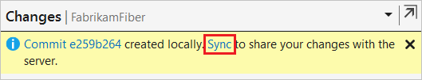

# Share code with push

[!INCLUDE [version-lt-eq-azure-devops](../../includes/version-lt-eq-azure-devops.md)]
[!INCLUDE [version-vs-gt-2015](../../includes/version-vs-gt-2015.md)]


You can share your work on a local Git repo [branch](create-branch.md) by uploading your changes to a remote repo that others can access. The Git `push` command uploads new [commits](commits.md) from your local branch to the corresponding branch of a remote repo. Visual Studio uses the Git `push` command when you choose to [sync](/visualstudio/version-control/git-fetch-pull-sync#sync) your work with a remote repo.

For an overview of the Git workflow, see [Azure Repos Git tutorial](gitworkflow.md).


<a name="push-your-code"></a>

## Push your code

After you've added one or more commits to a local [branch](create-branch.md), you can "push" the commits to a remote branch to share or back up your work. When you use the Git `push` command, Git checks whether your local branch is up to date with the remote branch. If not, Git will prevent you from pushing new commits until you've updated your local branch. To resolve this issue, you can [pull](pulling.md) to get the remote branch commits that aren't present in your local branch. If the pulled remote commits [conflict](merging.md) with your local commits, try resolving those conflicts before pushing your changes.

For the Git `push` command to work, your local repo must be connected to a remote Git repo. If you cloned your local repo from a remote repo then they're already connected. But if you created your local repo without cloning, you'll need to connect it to a hosted Git repo. For more information, see [Connect to an Azure Repos Git repo](creatingrepo.md#connect-a-local-git-repo-to-an-azure-repos-git-repo) and [Connect to a GitHub repo](creatingrepo.md#connect-a-local-git-repo-to-a-github-repo).

> [!TIP]
> To support a [pull request](pull-requests.md) review of your work, avoid working directly in the `main` branch of your local repo. Instead, save your commits to a local feature branch or bugfix branch, and push that branch on completion of your work. For an overview of the Git workflow, see [Azure Repos Git tutorial](gitworkflow.md).

#### [Visual Studio 2019](#tab/visual-studio-2019)

Visual Studio 2019 version 16.8 and later versions provides a Git version control experience while maintaining the **Team Explorer** Git user interface. To use **Team Explorer**, uncheck **Tools** > **Options** > **Preview Features** > **New Git user experience** from the menu bar. You can use Git features from either interface interchangeably. Below, we provide a side-by-side comparison of how to push your code.

:::row:::
  :::column span="":::

    **Visual Studio Git** <br><br>

    1. In the **Git Changes** window, select the up-arrow push button to push your commit.

       :::image type="content" source="media/gitquickstart/visual-studio-2019/git-experience/push-commit-git-changes-window.png" border="true" alt-text="Screenshot of the up-arrow push button in the 'Git Changes' window of Visual Studio 2019." lightbox="media/gitquickstart/visual-studio-2019/git-experience/push-commit-git-changes-window-lrg.png":::

       Or, you can push your changes from the **Git Repository** window. To open the **Git Repository** window, select the outgoing / incoming link in the **Git Changes** window.

       :::image type="content" source="media/gitquickstart/visual-studio-2019/git-experience/push-commit-git-repositories-window.png" border="true" alt-text="Screenshot of the 'outgoing / incoming' link in the 'Git Changes' window, and the Push link in the 'Git Repository' window of Visual Studio 2019." lightbox="media/gitquickstart/visual-studio-2019/git-experience/push-commit-git-repositories-window-lrg.png":::

       Or, you can push your changes from the **Git** menu on the menu bar.

       :::image type="content" source="media/gitquickstart/visual-studio-2019/git-experience/push-commit-git-menu.png" border="true" alt-text="Screenshot of the Push option from the Git menu in Visual Studio 2019." lightbox="media/gitquickstart/visual-studio-2019/git-experience/push-commit-git-menu-lrg.png":::

  :::column-end:::
  :::column span="":::

    **Visual Studio Team Explorer** <br><br>

    1. In **Team Explorer**, select **Home** and then choose **Sync** to open **Synchronization**.
    
       :::image type="content" source="media/gitquickstart/visual-studio-2019/team-explorer/sync.png" border="true" alt-text="Screenshot of the Sync option in Team Explorer in Visual Studio 2019." lightbox="media/gitquickstart/visual-studio-2019/team-explorer/sync-lrg.png":::
    
       You can also go to the **Synchronization** view from **Changes** by choosing **Sync** immediately after making a commit.
    
       :::image type="content" source="media/gitquickstart/visual-studio-2019/team-explorer/commit-created-locally.png" border="true" alt-text="Screenshot of the Sync link that appears after making a commit in Visual Studio 2019." lightbox="media/gitquickstart/visual-studio-2019/team-explorer/commit-created-locally-lrg.png":::
    
    2. In the **Synchronization** view, choose **Push** to upload your commit to the remote repo. If this is your first push to the repo, you'll see the message: `The current branch does not track a remote branch...`, which lets you know that your commit was pushed to a new branch on the remote repo and that future commits pushed from the current branch will be uploaded to that remote branch.
    
       :::image type="content" source="media/gitquickstart/visual-studio-2019/team-explorer/push-to-origin.png" border="true" alt-text="Screenshot of the Push link in the Synchronization view of Team Explorer in Visual Studio 2019." lightbox="media/gitquickstart/visual-studio-2019/team-explorer/push-to-origin-lrg.png":::

  :::column-end:::
:::row-end:::


#### [Visual Studio 2017](#tab/visual-studio-2017)

1. In Team Explorer, select **Home** and then choose **Sync** to open **Synchronization**.

   

   You can also go to **Synchronization** from the **Changes** view by choosing **Sync** immediately after making a commit.

   

1. Select **Push** to share your commit with the remote repository.

   

   During your first push to the repository, you'll see the following message in place of the outgoing commits list: `The current branch does not track a remote branch. Push your changes to a new branch on the origin remote and set the upstream branch.` Select **Push** to push your changes to a new branch on the remote repository and set the upstream branch. The next time you push changes you'll see the list of commits.

   > [!NOTE]
   > Go to **Team Explorer** > **Settings** > **Repository Settings**. Make sure that you've entered the correct **User**, **Email**, **Remotes**, and other settings.


#### [Git Command Line](#tab/git-command-line)

Although you should rarely need to push a local branch to a differently named remote branch, you can do so using the unabbreviated Git `push` command:

```cmd
git push <remote repo> <local branch name>:<remote branch name>
```

To push new commits from your local branch to a same-named remote branch, run the following simplified `push` command. If the remote repo doesn't have a same-named branch, this command will create a new remote branch with the same name and commits as your local branch.

```cmd
git push <remote repo> <local branch name>
```

When you clone a remote repo, Git assigns the alias `origin` as shorthand for the URL of the remote repo that you cloned. Run `git remote -v` to check the `origin` alias value. To add the `origin` alias manually, run `git remote add origin <remote repo url>`. With the `origin` alias, you can further simplify the `push` command:

```cmd
git push origin <local branch name>
```

If your current local branch tracks a remote branch on `origin`, you can fully abbreviate the `push` command as follows. However, the fully abbreviated `push` command will fail if your local branch doesn't track a remote branch. Run `git remote show origin` to check the tracked status of your branches. To push _and_ set your current local branch to track the same-named remote branch on `origin`, run `git push --set-upstream origin <local branch name>` once. The `--set-upstream` flag will create a same-named remote branch if it doesn't exist.

```cmd
git push
```

It's common practice when working on a local feature or bugfix branch, to periodically [update your branch with the latest changes from the main branch](pulling.md#update-your-branch-with-the-latest-changes-from-main). Depending on how you do that, your local and remote commit histories might diverge such that the Git `push` command returns an error. If you're the only person pushing to the remote feature branch, and you're sure that your local branch contains all the work you need, you can use the Git `push` command with the `--force` flag to replace all commits on the remote feature branch with the commits from your local feature branch. For more information on the Git `push` command, including other `force` options, see the [Git reference manual](https://git-scm.com/docs/git-push#_options).


* * *


Once you've pushed your commits, you can create a [pull request](pull-requests.md) to let others know you'd like to have your changes reviewed. If approved, your changes will be merged into a target branch of the remote repo.


## Next steps

> [!div class="nextstepaction"]
> [Review code with pull requests](pull-requests.md)
> [Update code with fetch and pull](pulling.md)


## Related articles

- [New to Git repos? Learn more](/devops/develop/git/set-up-a-git-repository)
