# Learn how to remove a large binary from your Git history to manage the size of cloned repositories

Git has gained much popularity in recent years as a distributed source code repository that lets users work with the full repository while in a disconnected state. The benefits of git are well-documented, but what happens if you need to "roll back the clock" on the primary repository? Doing so is not so intuitive and requires elevated permissions, as you might expect for something that affects every single user of the repository.

So how can you roll back the central repository safely?

## Problem Scenario

Imagine that you commit a large file, such as a video, to your git server. In a traditional source code system, it is convenient to store everything in one place and then pull down what you need.  However, with git, the entire repository is cloned down to each user's local computer.  With a large file, every single user on the project will need to download the large file(s), too. With each subsequent large file committed to the server, the problem only grows, until the repository is too large to be efficient for its users.  To make matters worse, even if you remove the offender from your local repository and recommit, the file will still exist in the repository's history, which means that it will still be downloaded to everyone's local computer as part of the history.

> 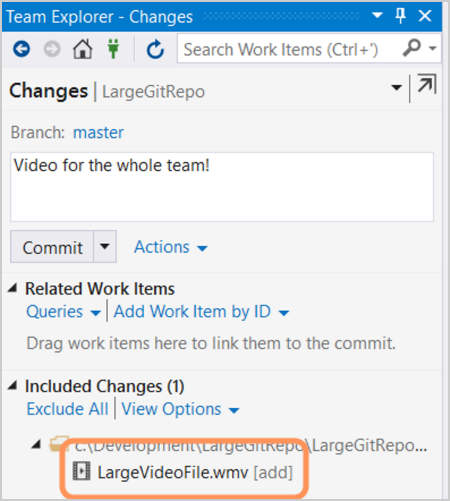

*Adding large file to the local repository*

> 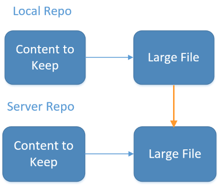

*After committing from the local repository, the server will also have the large file*

## Freeze the repo

> [!IMPORTANT]
>
> The following steps will remove the video from your branch history,
> but the file remains in your repo history when you clone your repo from Azure Repos. Removing the files from your branch history prevents the files from being updated, which will
> create another version of the large file in your repo. Learn more about [managing large files in Git](manage-large-files.md) and 
> see this [blog post](https://blogs.msdn.microsoft.com/congyiw/2015/12/14/why-does-cloning-from-vsts-return-old-unreferenced-objects/) for a detailed explanation and workaround for this behavior 
> when using Azure Repos Git repos.

To fix this, you have to start at the source, which, in this case, is the server repository. Ask the team to stop pushing to the repository, but if additional pushes happen during this process, you will have to account for them, too, so as not to lose any data.

## Rebase and force push
If no one else on the team has made any changes to the repository - usually through a push - you can take the easy route, in which you essentially make your local repository look the way that you want it to (that is, without the large file), then force your changes to the server.

__Note: You may need to clone or fix your local repo before beginning this work.  This could result in lost work or changes, so proceed with caution.__

By default, you likely only have the ability to change their local project files and repository and to push your changes to the server, so you do not have the ability to make other changes, such as deletions or rebasing, at the server level. Therefore, you will need to either acquire project Force push (preferred) or admin permissions from your administrator or find someone who has them and is willing to help.  For more information on git permissions, go [here](../../organizations/security/set-git-tfvc-repository-permissions.md).

> 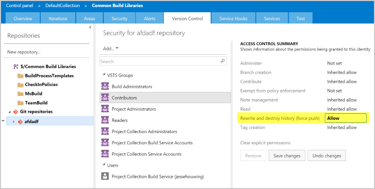

Next, you need to rebase the repository. 

1) But first, use `git log` to find the SHA hash values of the most recent commits - you will need this information in a moment. This is because we need to know the most recent good commit. You get that information by opening a git command prompt and typing:

> `git log`

Alternatively, you can get the SHA hash from viewing the branch history in the Visual Studio Team Explorer.
> 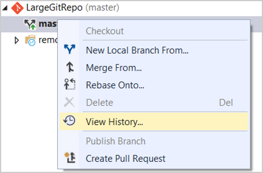

2) Now, open a Git command prompt.

> 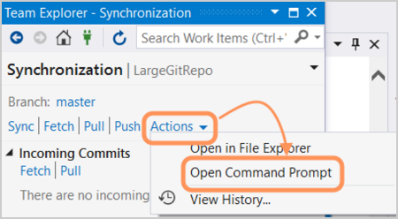

3) Find SHA hash number of interest.

> 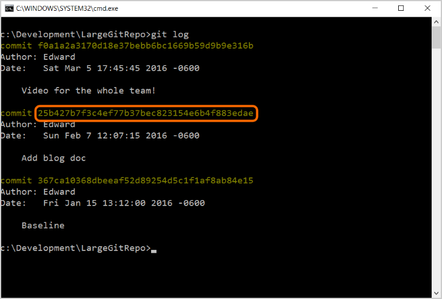

4) You will need the sha that starts "25b4"

Remember that git uses pointers to determine where in the repository the head or current branch are located. Because of this, the repository state that you are interested in will be at some point in the past. To 'go back in time' and make that prior desired state the new current state, you will need to use the git rebase command:

> `git rebase -i <SHA hash of desired new current branch>`

> 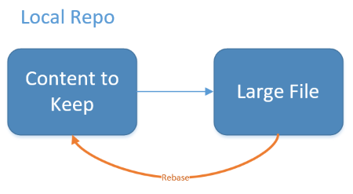

The `-i` switch provides a little extra safety, because it will bring up the history in an editor (My implementation of git on the command line in Windows brings up the classic *vi* editor, which you may remember if you've worked with a Unix-based system.)  

5) For our example, you would enter:

> `git rebase -i 25b4`

6) Once the editor comes up, remove all of the 'pick' lines except for the branch you want to keep as your new head. When everything looks as you want it, in *vi*, type ":w\<enter\>" to save or "!q\<enter\>" to exit without saving.

> 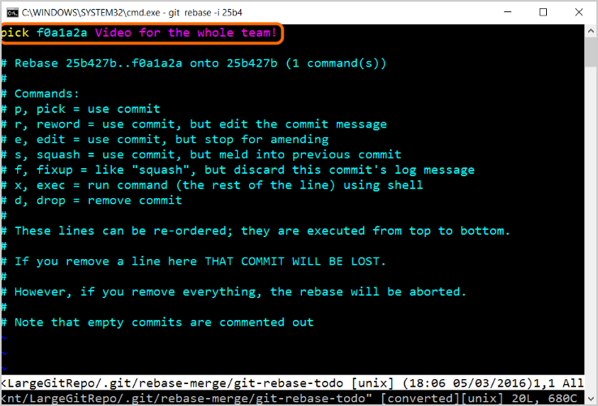

*You will be changing the line(s) that you no longer want*

> 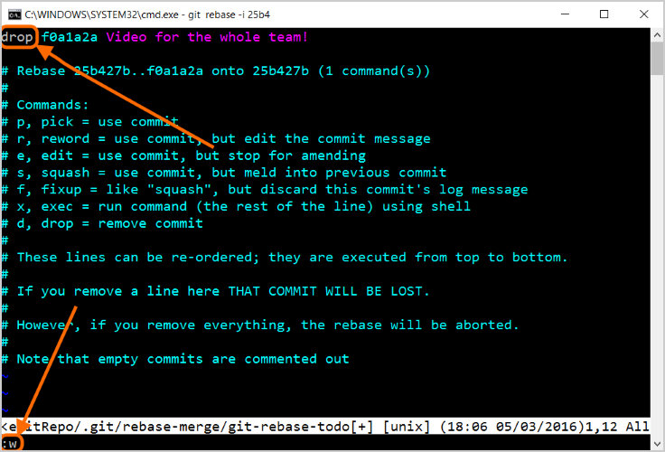

7) Change "`pick`" to "`drop`" as shown, then type "`:w`" (in vi) to save and "`:q!`" to start the rebase

Now type `git log` again - the offending branch should be absent from the log. If it is, you are ready for the final step, which requires project admin permissions.

> `git log`

> 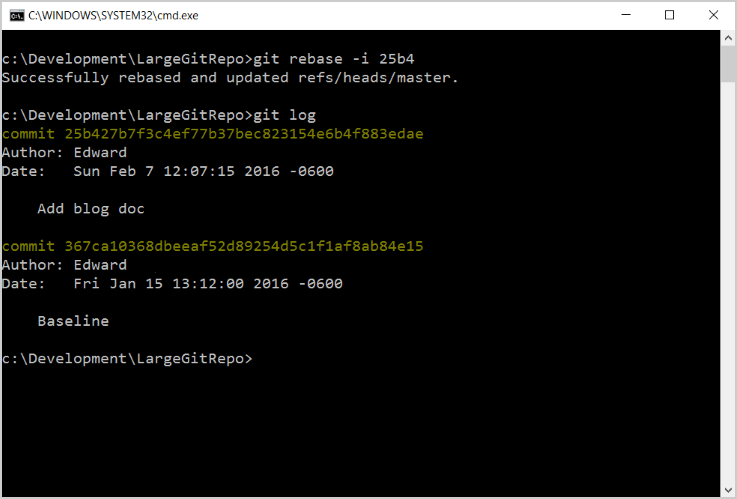

*Notice that the commit for the large video is now gone from the local repo*

8) Type:
`git push --force`

> 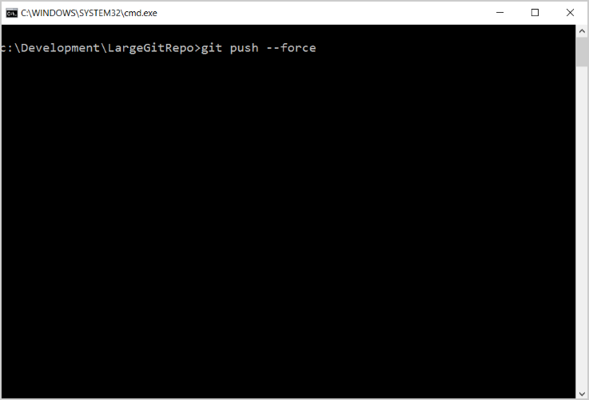

> 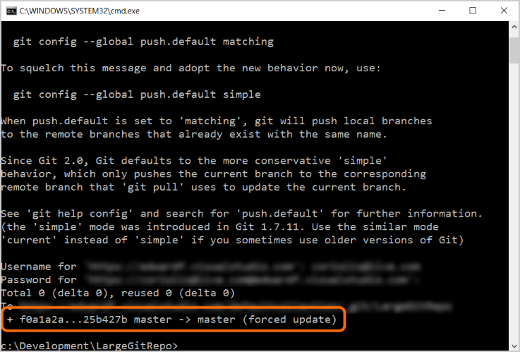

This command will force your repository to overwrite the repository on the server.

__Use with caution, as you can easily lose data on the server!!__

> 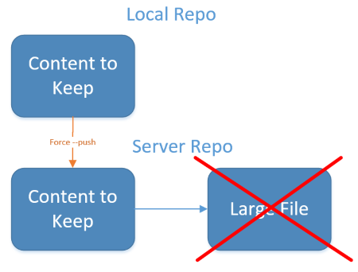

*Notice that you must authenticate to the server for this to work*

If you are using Azure Repos, you may need to set up an alternate credential that doesn't use special characters (such as the "@" in an email address). To do this, follow the instructions [here](auth-overview.md?view=azure-devops#personal-access-tokens).

Now, the branch will be permanently gone from the server, and subsequent clones and syncs by project team members will not download the large files you were trying to remove.  Users will need to pull down from the server in order to make sure that they are in sync with the new server repo state.

## If Users Have Newer Commits

If other users have already committed to the server repository, you have an additional consideration. You want to remove the branch that contains the large file(s), but you don't want to lose changes the team has made. To address this, when you open the editor as part of rebasing, look carefully at the commits. Make sure that the commits you want to retain are listed on the 'pick' lines; delete the ones you want to remove, such as where a large file was added.

Note that after rebasing, the other users on the team will also need to rebase so that everyone has a consistent copy of the server repository. This is a pain for everyone and normally should be avoided. Thus, if you do need to remove a push as noted here, it is important to coordinate with the team.  For full details on rebasing, take a look at the official rebasing documentation [here](https://www.git-scm.com/book/en/v2/Git-Branching-Rebasing).

The key is to make sure that you know which commits are desired and undesired. Study the git log or the history in your IDE (such as Visual Studio) and make a meticulous note of the SHA hashes to keep and those to toss.

In scenarios where the large file has been around for a while and there have been subsequent branches and merges, you may be able to remove the file by using the `git filter-branch` switch.  If you want to give this a try, follow the instructions [here](https://help.github.com/articles/remove-sensitive-data/).

## Best Practice Considerations

It saves a lot of work to make sure that large files stay out of the main repository in the first place. With that in mind, here are some common sense best practices for the team to keep in mind:

> Do's

* Do commit changes frequently. You can always fix them up later with a squash or rebase.
* Do use branches to isolate your changes. Branches are cheap and private, and merging is simple. You can also back up changes on a branch by pushing it to the server.
* Do use a naming convention when publishing topic branches. Name the branch "`users/<alias>/<branchname>`". This will help group your branches and make it easy for others to identify the "owner".
* Do remember to push your changes. `Commit != Checkin`. `(Commit + Push) == Checkin`.
* Do consider using `.gitignore` for large binaries so that they aren't added to the repo in the first place - more information [here](https://help.github.com/articles/ignoring-files/).
* Do consider using NuGet or TFS version control to store your large binaries.

> Don'ts

* Don't rebase after pushing. Rebasing pushed commits in git can be bad because it forces everyone else in the repo to rebase their local changes - and they won't be happy if they need to do this.  Rebasing pushed commits on your own personal branch, even if pushed, isn't a significant deal unless other people are pulling those commits.
* Don't commit binaries to your repo. Git doesn't compress binary files the way that TFVC does, and because all repos have all of the history, committing binary files means permanent bloat.

## Summary

Sometimes, undesirable elements, such as large files, are added to a repository and need to be removed in order to keep the repository clean and lightweight. You can do this by getting your local repository in order using the `git rebase` command, then using the `git push --force` command to overwrite the server repository with your local repository.

> Authors: Edward Fry and Jesse Houwing | Connect with the authors and ALM | DevOps Rangers [here](https://github.com/ALM-Rangers/Guidance/blob/master/README.md)

*(c) 2015 Microsoft Corporation. All rights reserved.ÿThis document is
provided "as-is." Information and views expressed in this document,
including URL and other Internet Web site references, may change without
notice. You bear the risk of using it.*

*This document does not provide you with any legal rights to any
intellectual property in any Microsoft product. You may copy and use
this document for your internal, reference purposes.*