# Remove a large binary from your Git history to manage the size of cloned repositories

[!INCLUDE [version-lt-eq-azure-devops](../../includes/version-lt-eq-azure-devops.md)]

Git is a popular distributed source code repository (repo) that lets users work with the full repo while in a disconnected state. The benefits of Git are well documented, but what happens if you need to "roll back the clock" on the primary repo? Doing so isn't intuitive and requires elevated permissions. This requirement is expected for something that affects every single user of the repo.

How can you roll back the central repo safely?

## Problem scenario

Imagine that you commit a large file, such as a video, to your Git server. In a traditional source code system, it's convenient to store everything in one place and then pull down what you need. With Git, the entire repo is cloned to each user's local computer. With a large file, every single user on the project must also download the large files.

With each subsequent large file that's committed to the server, the problem only grows. The repo becomes too large to be efficient for its users. Even if you remove the large file from your local repo and recommit, the file still exists in the repo's history. As a result, the file is still downloaded to everyone's local computer as part of the history.

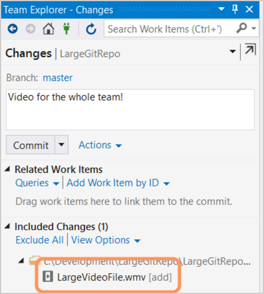

Add a large file to the local repo.

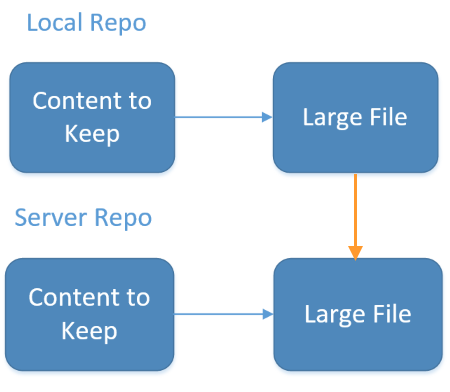

After you commit from the local repo, the server also has the large file.

## Freeze the repo

To fix the problem of a large repo, you must start at the source. In this scenario, the source is the server repo. Ask the team to stop pushing to the repo. If more pushes happen during this process, you must account for them so that you don't lose any data.

> [!IMPORTANT]
> The following steps remove the video from your branch history, but the file remains in your repo history when you clone your repo from Azure Repos. Removing the files from your branch history prevents the files from being updated, which created another version of the large file in your repo.
>
> Learn more about [managing large files in Git](manage-large-files.md). For an explanation and workaround for this behavior when you use Azure Repos Git repos, see [Why does cloning from Visual Studio Team Services return old unreferenced objects?](/archive/blogs/congyiw/why-does-cloning-from-vsts-return-old-unreferenced-objects).

## Rebase and force push

If no one else on the team made any changes to the repo, which usually occur through a push, you can take the easy route. You essentially make your local repo look the way that you want it to look (that is, without the large file). Then you force your changes to the server.

You might need to clone or fix your local repo before you begin this work. This process could result in lost work or changes, so proceed with caution.

By default, you can modify local project files and push changes to the server, but you can't perform server-level operations like deletion or rebasing. To proceed, you need Force push (preferred) or Admin permissions on the repository. Contact your project administrator to request these permissions, or ask someone who already has them to help. For more information, see [Set Git repository permissions](./set-git-repository-permissions.md).

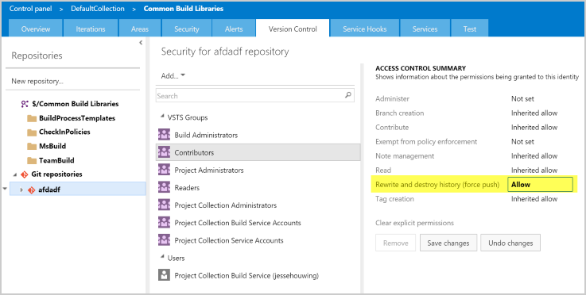

Next, you need to rebase the repo.

1. Use `git log` to find the Secure Hash Algorithm (SHA) hash values of the most recent commits. You need this information in a moment because you need to know the most recent good commit. You can get that information by opening a Git command prompt and entering:

   `git log`

   Alternatively, you can get the SHA hash from viewing the branch history in Visual Studio Team Explorer.

   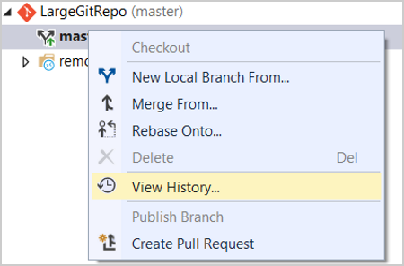

1. Open a Git command prompt.

   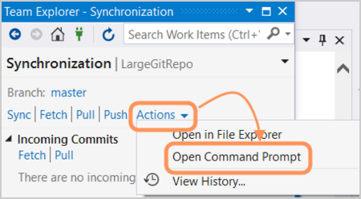

1. Find the SHA hash number of interest.

   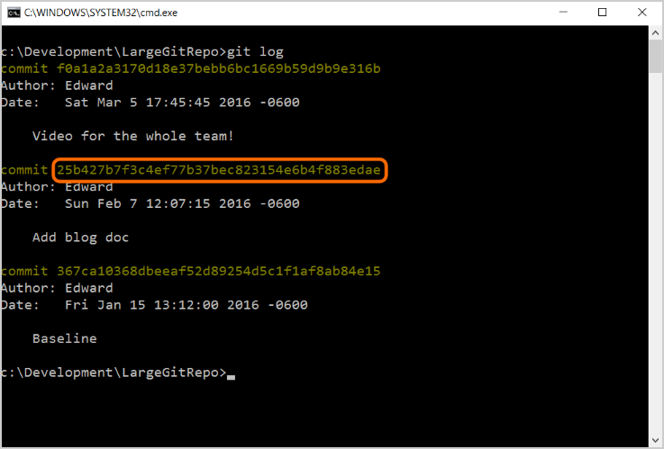

   You need the SHA that starts `25b4`.

   Remember that Git uses pointers to determine where in the repo the head or current branch is located. The repo state in which you're interested is located at some point in the past.

1. To go back in time and make the prior state the new current state, use the `git rebase` command:

   `git rebase -i <SHA hash of desired new current branch>`

   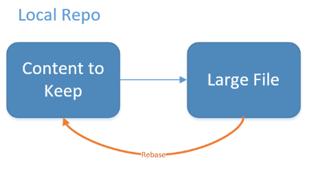

   The `-i` switch provides extra safety because it brings up the history in an editor. (This article uses an implementation of Git that brings up the classic vi editor on the command line in Windows. You might remember it if you worked with a Unix-based system.)

1. For this example, you enter:

   `git rebase -i 25b4`

1. After the editor comes up, remove all the `pick` lines except for the branch that you want to keep as your new head. When everything looks correct, in vi, enter `:w\<enter\>` to save, or enter `!q\<enter\>` to exit without saving.

   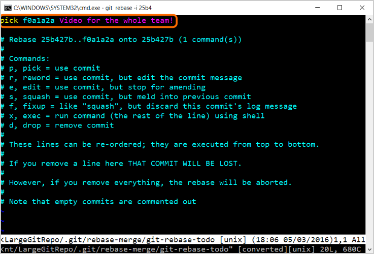

   Change the lines that you no longer want.

   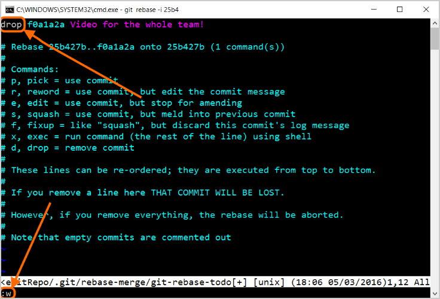

1. Change `pick` to `drop` as shown. Then enter `:w` (in vi) to save, and enter `:q!` to start the rebase.

   Now enter `git log` again. The offending branch should be absent from the log. If it is, you're ready for the final step, which requires project admin permissions:

   `git log`

   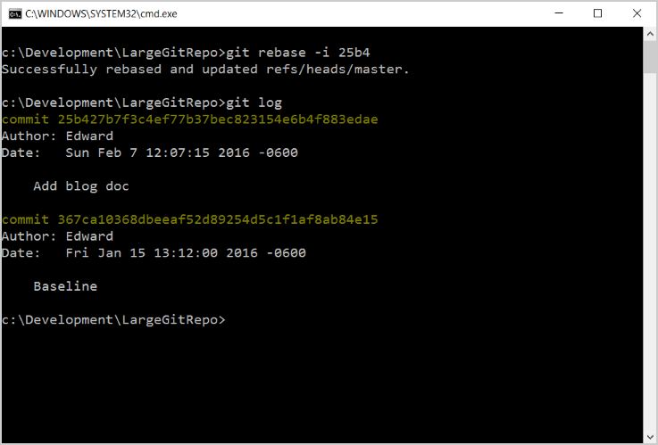

   The commit for the large video is now gone from the local repo.

1. Enter the following command:

   `git push --force`

   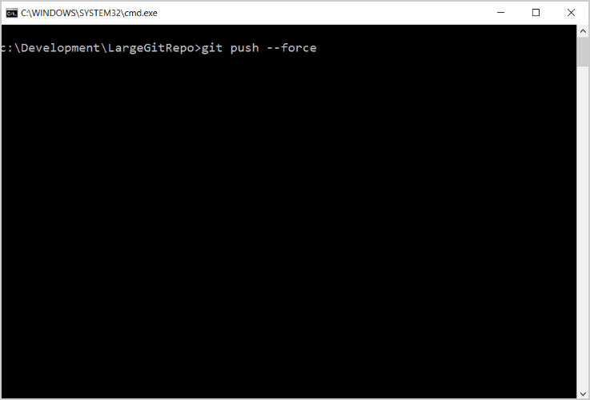

   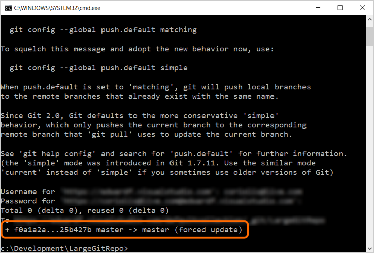

   This command forces your repo to overwrite the repo on the server.

   Use this command with caution because you can easily lose data on the server.

   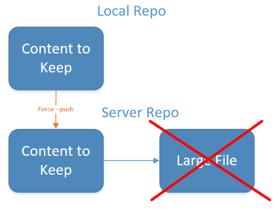

You must authenticate to the server for this action to work.

If you're using Azure Repos, you might need to set up an alternate credential that doesn't use special characters. An example is the at symbol (@) in an email address. To do this task, follow the instructions in [Authentication with Azure Repos](auth-overview.md).

Now the branch is permanently gone from the server. Subsequent clones and syncs by project team members don't download the large files that you were trying to remove. Users need to pull down from the server to make sure that they're in sync with the new server repo state.

## If users have newer commits

If other users pushed commits to the server repo, you have another consideration. You want to remove the branch that contains the large files, but you don't want to lose changes that the team made. To address this situation, when you open the editor as part of rebasing, look carefully at the commits. Make sure that the commits you want to retain are listed on the `pick` lines. Delete the ones that you want to remove, such as where a large file was added.

After rebasing, the other users on the team also need to rebase so that everyone has a consistent copy of the server repo. This work is tedious for everyone, and you want to avoid it. If you need to remove a push, you need to coordinate with the team. For more information on rebasing, see [Git branching - Rebasing](https://www.git-scm.com/book/en/v2/Git-Branching-Rebasing).

The key is to make sure that you know the commits that you want and the commits that you don't want. Study the `git log` or the history in your integrated development environment (such as Visual Studio). Make a meticulous note of the SHA hashes to keep and the hashes to remove.

In scenarios where the large file is old and there were subsequent branches and merges, you might be able to remove the file by using the `git filter-branch` switch. For more information, see [Removing sensitive data from a repository](https://help.github.com/articles/remove-sensitive-data/).

## Best practices considerations

Make sure that large files stay out of the main repo to save team members from extra work. Here are some commonsense best practices for the team to keep in mind.

### Things to do

* Commit changes frequently. You can always fix them later with a squash or rebase.
* Use branches to isolate your changes. Branches are cheap and private, and merging is simple. You can also back up changes on a branch by pushing it to the server.
* Use a naming convention when you publish topic branches. Name the branch `users/<alias>/<branchname>`. This name helps to group your branches and makes it easy for others to identify the owner.
* Remember to push your changes. Use `Commit != Checkin` and `(Commit + Push) == Checkin`.
* Consider using `.gitignore` for large binaries so that they aren't added to the repo. For more information, see [Ignoring files](https://help.github.com/articles/ignoring-files/).
* Consider using NuGet or Team Foundation Server version control to store your large binaries.

### Things to avoid

* Don't rebase after pushing. Rebasing pushed commits in Git can be bad because it forces everyone else in the repo to rebase their local changes. Team members might not be happy if they need to do this task. Rebasing pushed commits on your own personal branch, even if pushed, isn't a problem unless other people are pulling those commits.
* Don't commit binaries to your repo. Git doesn't compress binary files in the way that Team Foundation Version Control does. Because all the repos have the entire history, committing binary files means permanent bloat.

## Summary

Sometimes, undesirable elements, such as large files, are added to a repo and must be removed to keep the repo clean and lightweight. You can do this task by getting your local repo in order. Use the `git rebase` command, and then use the `git push --force` command to overwrite the server repo with your local repo.
