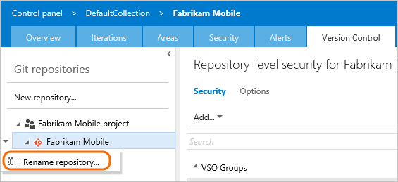
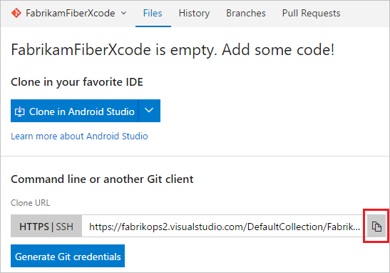

#  Rename a Git repository in TFS 2015
#### TFS 2015 | VS 2017 | VS 2015

You can rename a Git repository in a project from your web browser. After you rename the repo, each member of your team will have to take a few steps to re-enable their dev machines to connect to the repo on the server.

>[!NOTE]
>The steps in this article refer to TFS 2015. For Azure Repos and TFS 2017 and higher, see [Rename a Git repository](repo-rename.md).

## Rename the repo on the server

[!INCLUDE [temp](_shared/steps-open-control-panel-team-project.md)]

0. Rename the repo from the Version Control tab.

 

## Update the Git remotes on your dev machines

Git uses remote references to fetch and push changes between your local copy of a repository and the remote version stored on the server. After a Git repository or project has been renamed, your remote references need to updated. This is due to the fact that the remote repository URL contains the project and the repository name. 

Each member of your team must update their local Git repos to continue connecting from their dev machines to the repo in the project. The instructions below show how to update the remotes for the **Fabrikam Mobile** repo that was renamed to **Fabrikam**.

<a name="copy_remote_repo_url"></a>
### Get the new URL for the repo

Copy the repository URL to your clipboard.



### Update your remote in Visual Studio 2015 or 2017

1. Connect to the repo.

 
 
2. Open the project settings.
 
 

3. Open the repo settings.

 

4. Edit the fetch and push remote references and paste the URL that you [copied from the remote repo](#copy_remote_repo_url).

 

### Update your remote in older versions of Visual Studio from the command prompt

If you use an older version of Visual Studio or work with Git from the command prompt:

1. Open the Git command prompt.

2. Go to the local repository and update the remote to the URL you [copied from the remote repo](#copy_remote_repo_url).

    ```git remote set-url origin {URL_you_copied_from_the_remote_repo}```

### Refresh Team Explorer

1. Refresh Team Explorer.

 

2. Team Explorer now shows the updated repo name. 

 

## Q&A

<!-- BEGINSECTION class="m-qanda" -->

#### Q: Can I rename my repo again? Can I re-use an old repo name?

A: Yes

#### Q: What if I named my remote something other than the default origin?

A: If you are using:

 * Visual Studio 2015 or 2017, then edit the remote with the name you used. 

 * An older version of Visual Studio or the command prompt, then run this command: ```git remote set-url  {remote_name} {URL_you_copied_from_the_remote_repo}```


<!-- ENDSECTION -->
