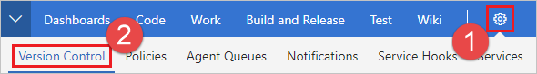
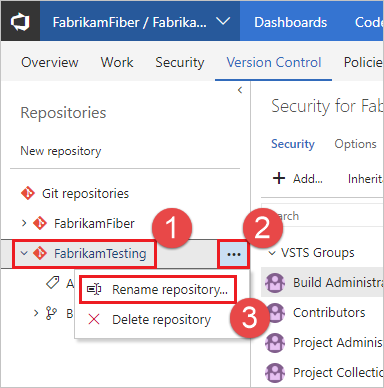
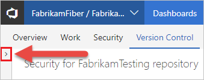
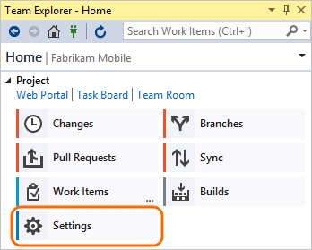
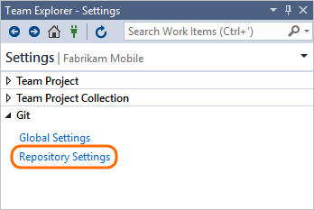
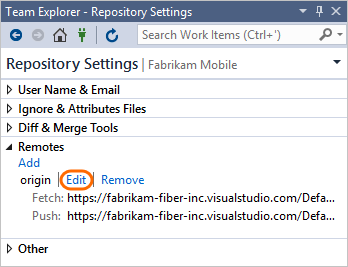
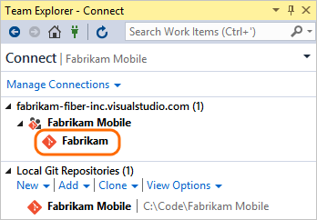

#  Rename a Git repository in your project
**Azure Repos | Azure DevOps Server 2020 | Azure DevOps Server 2019 | TFS 2018 | TFS 2017 | VS 2017 | VS 2015**

You can rename a Git repository in a project from your web browser. After you rename the repo, each member of your team should take a few steps to re-enable their dev machines to connect to the repo on the server.

> [!VIDEO https://www.microsoft.com/en-us/videoplayer/embed/RE4sVSK]

>[!NOTE]
>The steps in this article refer to Azure Repos and TFS 2017 and higher. For TFS 2015, see [Rename a Git repository in TFS 2015](repo-rename-tfs2015.md).

## Rename the repo in the web

> [!IMPORTANT]
> This step requires [Rename Repository permissions](set-git-repository-permissions.md#git-repository) on your Git repo.

::: moniker range=">= azure-devops-2019"

1. Select **Repos**, **Files**.

   

2. From the repo drop-down, select **Manage repositories**.

   

3. Select the name of the repository from the **Repositories** list, choose the **...** menu, and then choose **Rename repository**.

   

4. Rename the repository by typing the repo's new name and selecting **Rename**.

   

::: moniker-end

::: moniker range="<= tfs-2018"

1. Open the project administration page while working in your project on the web and select **Version Control**.

   

2. Select the repo you want to rename under **Git repositories** on the left and select **...**. Select **Rename repository...** from the menu.

   

   >[!NOTE]
   >If the **Repositories** pane is not expanded, select **>** to expand it and display the list of repositories.
   >
   >

3. Enter a new repo name in the **Repository name** field in the dialog, then select **Rename**.

   

::: moniker-end

## Update the Git remotes on your dev machines

Git uses remote references to fetch and push changes between your local copy of a repository and the remote version that is stored on the server. After a Git repository or project has been renamed, you should update your remote references. Update your references to that the remote repository URL contains the project and the repository name. 

Each member of your team must update their local Git repos to continue connecting from their dev machines to the repo in the project. The instructions below show how to update the remotes for the **Fabrikam Mobile** repo that was renamed to **Fabrikam**.

<a name="copy_remote_repo_url"></a>
### Get the new URL for the repo

::: moniker range=">= azure-devops-2019"

1. Select **Repos**, **Files**.

   

2. Select **Clone** in the upper-right corner of the **Files** window and copy the clone URL.

   

::: moniker-end

::: moniker range="<= tfs-2018"

1. Select **Clone** in the upper-right corner of the **Code** window and copy the **Clone URL**.

   

::: moniker-end

### Update your remote in Visual Studio 2015 or 2017

1. Connect to the repo.

   
 
2. Open the project settings.
 
   

3. Open the repo settings.

   

4. Edit the fetch and push remote references and paste the URL that you [copied from the remote repo](#copy_remote_repo_url).

   

### Update your remote in older versions of Visual Studio from the command prompt

If you use an older version of Visual Studio or work with Git from the command prompt:

1. Open the Git command prompt.

2. Go to the local repository and update the remote to the URL you [copied from the remote repo](#copy_remote_repo_url).

    ```git remote set-url origin {URL_you_copied_from_the_remote_repo}```

### Refresh Team Explorer

1. Refresh Team Explorer.

   

2. Team Explorer now shows the updated repo name. 

   

## Q&A

<!-- BEGINSECTION class="m-qanda" -->

#### Q: Can I rename my repo again? Can I reuse an old repo name?

A: Yes

#### Q: What if I named my remote something other than the default origin?

A: If you're using:

 * Visual Studio 2015, then edit the remote with the name you used. 

 * An older version of Visual Studio or the command prompt, then run this command: ```git remote set-url  {remote_name} {URL_you_copied_from_the_remote_repo}```


<!-- ENDSECTION -->
