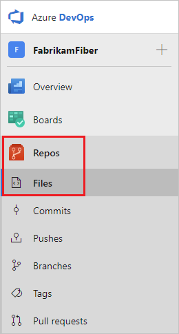
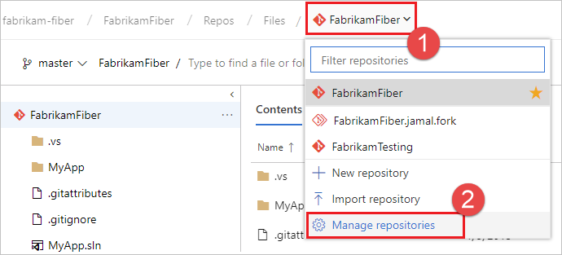
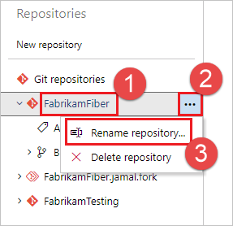
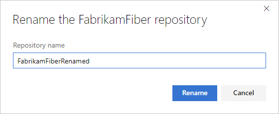
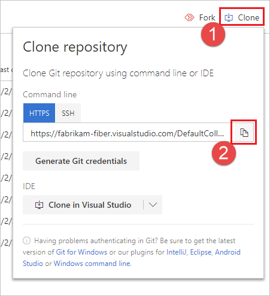
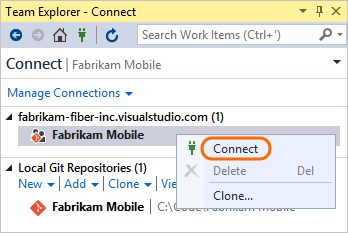
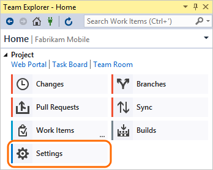
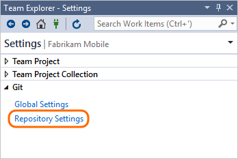
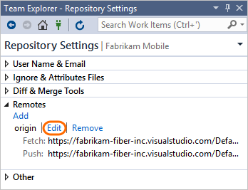

# Rename a Git repository in your project

[!INCLUDE [version-lt-eq-azure-devops](../../includes/version-lt-eq-azure-devops.md)]
[!INCLUDE [version-vs-gt-eq-2019](../../includes/version-vs-gt-eq-2019.md)]

You can rename a Git repository (repo) in a project from your web browser. After you rename the repo, each member of your team must take a few steps to reenable their dev machines to connect to the repo on the server.

## Prerequisites

[!INCLUDE [azure-repos-prerequisites](includes/azure-repos-prerequisites.md)]

## Rename the repository

#### [Browser](#tab/browser)

::: moniker range="<=azure-devops"

1. On the web portal, select **Repos** > **Files**.

   

1. From the repo dropdown list, select **Manage repositories**.

   

1. Select the name of the repo from the **Repositories** list, select the ellipsis **...** for more actions, and then select **Rename repository**.

   

1. Rename the repo by entering the new name for the repo and selecting **Rename**.

   

::: moniker-end

#### [Azure DevOps CLI](#tab/azure-devops-cli/)

::: moniker range="azure-devops" 
[!INCLUDE [az-repos-update](./includes/azure-repos-update.md)]

::: moniker-end

[!INCLUDE [temp](../../includes/note-cli-not-supported.md)]

***

## Update the Git remotes on your dev machines

Git uses remote references to fetch and push changes between your local copy of a repo and the remote version that's stored on the server. After you rename a Git repo or project, you should update your remote references. Update your references to the remote repo URL that contains the project and the repo name.

Each member of your team must update their local Git repos to continue connecting from their dev machines to the repo in the project. The following instructions show how to update the remotes for the Fabrikam Mobile repo that was renamed to Fabrikam.

### Get the new URL for the repo

::: moniker range="<=azure-devops"

1. Select **Repos** > **Files**.

   

1. In the upper-right corner of the **Files** window, select **Clone** and copy the clone URL.

   

::: moniker-end

### Update your remote in Visual Studio

To update your remote:

1. In the **Git** menu on the menu bar, select **Manage Remotes**.

1. In the **Options** dialog, select the remote to edit, and then select **Edit**.

   :::image type="content" source="media/repo-rename/options-rename-remote.png" border="true" alt-text="Screenshot that shows the Options dialog with the option to edit remotes." :::

1. Replace the fetch and push remote references with the URL that you [copied from the remote repo](#copy_remote_repo_url).

1. Select **Save**, and then select **OK**.

Visual Studio 2019 version 16.8 and later versions provide a Git version control experience while maintaining the Team Explorer Git user interface. To use Team Explorer, on the menu bar, go to **Tools** > **Options** > **Preview Features** and clear the **New Git user experience** checkbox. You can exercise Git features from either interface interchangeably.

To update your remote from Visual Studio Team Explorer:

1. To connect to the repo, select **Connect**.

   
 
1. To open the project settings, select **Settings**.
 
   

1. To open the repo settings, select **Repository Settings**.

   

1. Edit the fetch and push remote references, and paste the URL that you [copied from the remote repo](#copy_remote_repo_url).

   

## Q&A

<!-- BEGINSECTION class="m-qanda" -->

#### Can I rename my repo again? Can I reuse an old repo name?

Yes.

<!-- ENDSECTION -->

## Related content

- [Set Git repository settings and policies](repository-settings.md)
